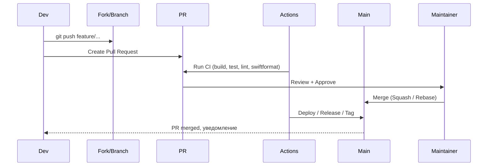
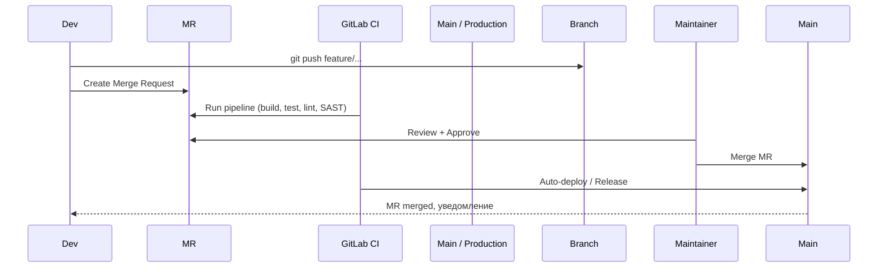

### 1. Краткое сравнение на 2026 год

| Критерий                                 | [[GitHub]] (Microsoft)                           | [[GitLab]] (GitLab Inc.)                                 | Победитель в 2026 (для [[iOS]]/[[Swift]]) |
| ---------------------------------------- | ------------------------------------------------ | -------------------------------------------------------- | ----------------------------------------- |
| Бесплатный приватный репозиторий         | Неограниченное кол-во, до 3 участников бесплатно | Неограниченное кол-во, без ограничения участников        | GitHub (если команда < 3 чел.)            |
| [[CI]]/[[CD]]                            | GitHub Actions — самый быстрый и удобный         | GitLab CI — мощный, но сложнее в настройке               | GitHub Actions                            |
| [[Xcode]] Cloud интеграция               | Отличная (GitHub + Xcode Cloud)                  | Есть, но слабее                                          | GitHub                                    |
| Swift Package Manager ([[SPM]])          | GitHub Packages + Registry — отлично работает    | Package Registry — тоже хорошо                           | Ничья                                     |
| Copilot / AI-помощник                    | GitHub Copilot Workspace + Copilot X — лидер     | GitLab Duo — хороший, но слабее                          | GitHub                                    |
| Self-hosted вариант                      | GitHub Enterprise Server (очень дорого)          | GitLab Community Edition / Enterprise — бесплатно/платно | GitLab (если нужен self-hosted)           |
| Цена для команды 10+ человек             | Team — $4/user/mo, Enterprise — дорого           | Premium — $29/user/mo, Ultimate — $99/user/mo            | GitHub (дешевле базовый план)             |
| Скорость CI (macOS runners)              | Очень высокая (GitHub-hosted macOS)              | Хорошая, но медленнее GitHub                             | GitHub                                    |
| Dependabot / автообновление зависимостей | Dependabot — отличный                            | Dependabot-подобный + Renovate                           | Ничья                                     |
| Security scanning                        | CodeQL + Dependabot + Secret Scanning            | Ultimate — полный SAST/DAST/Secret Detection             | GitLab Ultimate (если нужен deep scan)    |

### 2. Схема типичного workflow в GitHub vs GitLab (2026)

#### GitHub (GitHub Flow + Actions)

#### GitLab (GitLab Flow / Git Flow)

### 3. Сравнение по ключевым аспектам для iOS-разработки

| Аспект                         | GitHub (2026)                                 | GitLab (2026)                               | Победитель для iOS  |
| ------------------------------ | --------------------------------------------- | ------------------------------------------- | ------------------- |
| [[Xcode]] Cloud                | Полная интеграция (GitHub как источник)       | Поддерживается, но хуже                     | GitHub              |
| Swift Package Manager Registry | GitHub Packages — быстро и удобно             | GitLab Package Registry — тоже хорошо       | Ничья               |
| CI/CD для iOS (macOS runners)  | Самые быстрые macOS-раннеры в мире            | Хорошие, но медленнее GitHub                | GitHub              |
| Автоматическое форматирование  | GitHub Actions + swiftformat / swiftlint      | GitLab CI + те же инструменты               | Ничья               |
| Dependabot для SPM             | Dependabot обновляет Package.swift / resolved | Renovate / Dependabot-подобный              | GitHub              |
| Codespaces / Dev Environment   | Полноценные Codespaces с Xcode Cloud          | GitLab Web IDE + Dev Containers (без Xcode) | GitHub              |
| Copilot для Swift              | GitHub Copilot X — лучший для Swift           | GitLab Duo — слабее                         | GitHub              |
| Self-hosted / On-premise       | GitHub Enterprise Server — очень дорого       | GitLab CE / EE — можно бесплатно            | GitLab (если нужен) |
| Цена для команды 5–20 человек  | Team $4/user/mo                               | Premium $29/user/mo                         | GitHub              |

### 4. Когда выбрать GitHub, а когда GitLab (рекомендации 2026)

**Выбирайте GitHub, если:**

- Вы разрабатываете **iOS/macOS-приложения** (Xcode Cloud + GitHub Actions = идеально)
- Команда небольшая или средняя (< 20 человек)
- Хотите **максимальную скорость CI** (macOS-раннеры)
- Используете **GitHub Copilot** (лучший AI для Swift)
- Нужен простой и дешёвый старт
- Хотите **GitHub Packages** для приватных [[SPM]]-пакетов

**Выбирайте GitLab, если:**

- Нужен **self-hosted** вариант (GitLab CE бесплатно на своём сервере)
- Требуется **очень мощный встроенный CI/CD** (GitLab Runners, Auto DevOps)
- Хотите **всё в одном месте** (CI + Container Registry + Package Registry + Security)
- Команда большая и нужна **enterprise-функциональность** по разумной цене
- Уже используете GitLab в компании

### 5. Короткие выводы для iOS/Swift-разработчиков в 2026

- **95% iOS-команд** используют **GitHub** (Xcode Cloud + Actions + Copilot + Packages)
- GitLab чаще выбирают в **enterprise** и в компаниях с self-hosted политикой
- Если вы **инди-разработчик** или **маленькая команда** → GitHub бесплатный и удобный
- Если вы уже в экосистеме **GitLab** или нужен **self-hosted** → GitLab CE/EE

**Короткий девиз 2026**:
> «GitHub — для скорости, удобства и iOS-экосистемы.  
> GitLab — для полного контроля и self-hosted.  
> Для большинства Swift-разработчиков в 2026 — GitHub всё ещё побеждает.»
