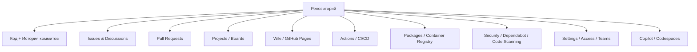
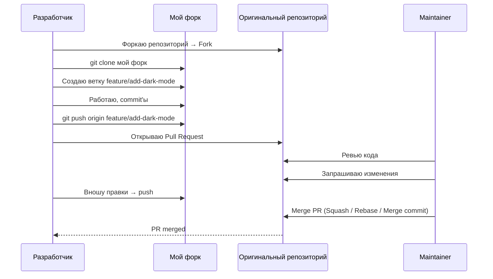

### 1. GitHub в 2026 году — краткий обзор

GitHub — это **самая популярная** платформа для хостинга Git-репозиториев, совместной разработки и DevOps-инструментов.

| Характеристика                | GitHub в 2026 году                            | Конкуренты ([[GitLab]], Bitbucket, Azure DevOps) |
| ----------------------------- | --------------------------------------------- | ------------------------------------------------ |
| Кол-во репозиториев           | > 500 млн публичных + миллиарды приватных     | GitLab ~100 млн, Bitbucket меньше                |
| [[CI]]/[[CD]] (Actions)       | GitHub Actions — лидер по скорости и удобству | GitLab CI мощный, но сложнее                     |
| Copilot                       | GitHub Copilot Workspace + Copilot X          | GitLab Duo, Amazon CodeWhisperer                 |
| Codespaces / Dev Containers   | Полноценные облачные среды разработки         | GitLab Web IDE, Bitbucket Cloud                  |
| Security (Dependabot, CodeQL) | Автоматическое сканирование и PR с фиксами    | GitLab Ultimate, Snyk                            |
| Ценообразование               | Бесплатно для open-source и личных проектов   | GitLab бесплатный tier слабее                    |

### 2. Основные компоненты GitHub (схема)



### 3. Жизненный цикл типичного вклада в проект (схема)



### 4. Основные возможности GitHub в 2026 году (с примерами)

#### 4.1 Репозитории и ветвление

- Публичные — бесплатны и индексируются поисковиками  
- Приватные — бесплатно до 3 участников (бесплатный план), дальше платно  
- Ветки защищены (branch protection rules):  
  - Требовать PR  
  - Требовать ревью минимум от 1 человека  
  - Требовать успешный CI (status checks)  
  - Запретить force push и удаление

#### 4.2 Pull Requests (PR) — сердце коллаборации

```text
Пример хорошего PR в 2026:
Title: feat: добавить поддержку тёмной темы
Body:
Closes #123

Что сделано:
- Добавлена поддержка system/dark/light appearance
- Использован @Environment(\.colorScheme)
- Добавлены unit-тесты для ThemeManager
- Обновлены скриншоты в README

Checklist:
- [x] Тесты проходят
- [x] SwiftLint чистый
- [x] swiftformat применён
```

#### 4.3 GitHub Actions — CI/CD (самый популярный инструмент 2026)

```yaml
# .github/workflows/ci.yml
name: CI

on:
  push:
    branches: [ main, develop ]
  pull_request:
    branches: [ main, develop ]

jobs:
  build-and-test:
    runs-on: macos-latest

    steps:
    - uses: actions/checkout@v4

    - name: Select Xcode 16
      uses: maxim-lobanov/setup-xcode@v1
      with:
        xcode-version: '16.0'

    - name: Install SwiftFormat & SwiftLint
      run: |
        brew install swiftformat swiftlint

    - name: Lint & Format
      run: |
        swiftformat --config .swiftformat .
        swiftlint --strict

    - name: Build & Test
      run: |
        xcodebuild test \
          -scheme MyApp \
          -destination 'platform=iOS Simulator,name=iPhone 16' \
          -skipPackagePluginValidation
```

#### 4.4 Dependabot — автоматическое обновление зависимостей

```yaml
# .github/dependabot.yml
version: 2
updates:
  - package-ecosystem: "swift"
    directory: "/"
    schedule:
      interval: "weekly"
    open-pull-requests-limit: 10
    labels: ["dependencies", "automerge"]
```

### 5. Таблица: GitHub vs GitLab vs Bitbucket (2026)

| Характеристика                     | GitHub                                | GitLab                          | Bitbucket                       |
| ---------------------------------- | ------------------------------------- | ------------------------------- | ------------------------------- |
| Бесплатный приватный репозиторий   | Неограниченное кол-во, 3 участника    | Неограниченное кол-во           | 5 участников                    |
| CI/CD                              | GitHub Actions — самый быстрый        | GitLab CI — мощный и гибкий     | Bitbucket Pipelines — медленнее |
| AI-помощник                        | Copilot Workspace + Copilot X         | GitLab Duo                      | Нет сильного аналога            |
| Codespaces / Dev Environments      | Полноценные Codespaces                | GitLab Web IDE + Dev Containers | Нет                             |
| Security                           | Dependabot + CodeQL + Secret Scanning | Ultimate — полный набор         | Слабее                          |
| Цена для команды 10+ чел.          | Team $4/user/mo                       | Premium $29/user/mo             | Standard $3/user/mo             |
| Рекомендация для [[iOS]]/[[Swift]] | ★★★★★ ([[Xcode]] + [[SPM]] + Actions) | ★★★★☆ (если нужен self-hosted)  | ★★☆☆☆                           |

### 6. Лучшие практики GitHub в iOS/Swift-разработке 2026

- **Branches**:
  - main — production
  - develop — интеграция (опционально)
  - feature/…, bugfix/…, hotfix/… — всё остальное
- **PR Template** — обязательно в .github/pull_request_template.md
- **CODEOWNERS** — автоматическое назначение ревьюеров
- **Actions** — минимум 3 workflow:
  - CI (build & test)
  - Lint & Format (swiftformat + swiftlint)
  - Dependabot auto-merge
- **Dependabot** — включить + auto-merge patch/minor
- **Branch protection**:
  - Require PR
  - Require 1 approval
  - Require status checks to pass
  - Dismiss stale reviews
- **Swift Package Manager** — хостинг пакетов через GitHub Packages
- **Copilot** — использовать Workspace для генерации PR и тестов

**Короткий девиз 2026**:
> «GitHub — это не просто хостинг репозиториев.  
> Это полноценная DevOps-платформа: код + CI/CD + ревью + безопасность + AI + документация + чат.  
> Настрой один раз — и проект живёт сам.»
