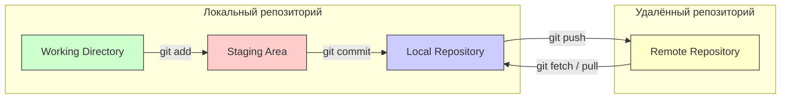

#git #version-control #terminal #cli #github #repository

---

### Определение

**Git** — распределённая система контроля версий, позволяющая отслеживать изменения в файлах, работать с локальными и удалёнными репозиториями, а также координировать работу команды. Локальный репозиторий хранится на вашем компьютере, удалённый — на сервере ([[GitHub]], [[GitLab]], Bitbucket и др.).



---

## Часть 1: Настройка и инициализация

### 1.1. Настройка пользователя

```bash
# Установить имя пользователя
git config --global user.name "Ваше Имя"

# Установить email
git config --global user.email "your-email@example.com"

# Проверить текущие настройки
git config --list

# Цветной вывод (рекомендуется)
git config --global color.ui auto
```

### 1.2. Инициализация репозитория

```bash
# Создать новый локальный репозиторий в текущей папке
git init

# Создать репозиторий в указанной папке
git init /path/to/project

# Клонировать удалённый репозиторий
git clone https://github.com/user/repo.git

# Клонировать в указанную папку
git clone https://github.com/user/repo.git my-folder

# Клонировать только определённую ветку
git clone -b develop https://github.com/user/repo.git
```

---

## Часть 2: Работа с локальным репозиторием

### 2.1. Статус и изменения

```bash
# Показать статус рабочей директории
git status

# Показать статус в коротком формате
git status -s

# Показать изменения в файлах (что изменилось, но не добавлено в staged)
git diff

# Показать изменения в staged файлах
git diff --staged
git diff --cached

# Показать изменения за последние коммиты
git diff HEAD~2..HEAD
```

### 2.2. Добавление файлов (Staging)

```bash
# Добавить конкретный файл
git add README.md

# Добавить все файлы в текущей папке
git add .

# Добавить все файлы, включая новые (рекурсивно)
git add -A

# Добавить все файлы, но не удалённые
git add --ignore-removal .

# Добавить только изменённые и удалённые (без новых)
git add -u

# Интерактивное добавление (выбор файлов)
git add -i
```

### 2.3. Удаление файлов из отслеживания

```bash
# Удалить файл и перестать отслеживать
git rm file.txt

# Удалить папку рекурсивно
git rm -rf folder/

# Перестать отслеживать файл, но оставить локально
git rm --cached file.txt
```

### 2.4. Перемещение/переименование файлов

```bash
# Переименовать файл
git mv old_name.txt new_name.txt

# Переместить файл в другую папку
git mv file.txt src/file.txt
```

### 2.5. Коммиты

```bash
# Создать коммит
git commit -m "Описание изменений"

# Добавить все изменённые файлы и создать коммит (одной командой)
git commit -a -m "Описание"

# Создать коммит с редактированием сообщения в редакторе
git commit

# Изменить последний коммит (сообщение или добавить забытые файлы)
git commit --amend -m "Новое сообщение"

# Добавить файлы в последний коммит без изменения сообщения
git add forgotten.txt
git commit --amend --no-edit
```

---

## Часть 3: Работа с ветками

### 3.1. Просмотр и переключение веток

```bash
# Показать все локальные ветки
git branch

# Показать все ветки (локальные + удалённые)
git branch -a

# Показать ветки с последним коммитом
git branch -v

# Переключиться на ветку
git checkout feature-branch

# Создать и переключиться на новую ветку
git checkout -b new-branch

# Создать новую ветку (без переключения)
git branch new-branch

# Переключиться на предыдущую ветку
git checkout -
```

### 3.2. Слияние веток (merge)

```bash
# Слить указанную ветку в текущую
git merge feature-branch

# Слить с сообщением
git merge feature-branch -m "Merge feature branch"

# Отменить слияние (если конфликты)
git merge --abort

# Слить без создания коммита слияния (fast-forward)
git merge --ff-only feature-branch

# Слить с созданием коммита слияния (даже если fast-forward возможен)
git merge --no-ff feature-branch
```

### 3.3. Удаление веток

```bash
# Удалить локальную ветку
git branch -d feature-branch

# Принудительно удалить локальную ветку (даже если не слита)
git branch -D feature-branch

# Удалить удалённую ветку
git push origin --delete feature-branch
```

---

## Часть 4: Работа с удалённым репозиторием

### 4.1. Управление удалёнными репозиториями

```bash
# Показать список удалённых репозиториев
git remote -v

# Добавить удалённый репозиторий
git remote add origin https://github.com/user/repo.git

# Добавить удалённый репозиторий с другим именем
git remote add upstream https://github.com/other/repo.git

# Изменить URL удалённого репозитория
git remote set-url origin https://github.com/user/new-repo.git

# Удалить удалённый репозиторий
git remote remove upstream

# Показать подробную информацию об удалённом репозитории
git remote show origin

# Переименовать удалённый репозиторий
git remote rename origin upstream
```

### 4.2. Отправка изменений (push)

```bash
# Отправить текущую ветку в удалённый репозиторий
git push origin HEAD

# Отправить конкретную ветку
git push origin feature-branch

# Отправить и установить upstream (связь локальной и удалённой ветки)
git push -u origin feature-branch

# Отправить все ветки
git push --all origin

# Отправить теги
git push --tags

# Удалить ветку в удалённом репозитории
git push origin --delete feature-branch

# Принудительный push (осторожно!)
git push --force origin feature-branch

# Принудительный push с защитой (не перезаписывает чужие коммиты)
git push --force-with-lease origin feature-branch
```

### 4.3. Получение изменений (fetch / pull)

```bash
# Получить изменения из удалённого репозитория (без слияния)
git fetch origin

# Получить изменения из конкретной ветки
git fetch origin feature-branch

# Получить изменения из всех удалённых репозиториев
git fetch --all

# Получить и сразу слить изменения в текущую ветку
git pull origin main

# Pull с rebase вместо merge
git pull --rebase origin main

# Pull с конкретным сообщением
git pull origin feature-branch --no-ff

# Получить теги
git fetch --tags
```

### 4.4. Синхронизация вилки (fork) с оригинальным репозиторием

```bash
# Добавить upstream (оригинальный репозиторий)
git remote add upstream https://github.com/original/repo.git

# Получить изменения из upstream
git fetch upstream

# Переключиться на свою main ветку
git checkout main

# Слить изменения из upstream
git merge upstream/main

# Отправить обновления в свой fork
git push origin main
```

---

## Часть 5: Просмотр истории и отмена изменений

### 5.1. Просмотр истории коммитов

```bash
# Показать историю коммитов
git log

# Показать историю в одну строку
git log --oneline

# Показать историю с графиком веток
git log --graph --oneline --decorate

# Показать последние N коммитов
git log -5

# Показать коммиты определённого автора
git log --author="Имя"

# Показать изменения в каждом коммите
git log -p

# Показать историю в виде списка с датами
git log --pretty=format:"%h - %an, %ar : %s"
```

### 5.2. Отмена изменений

```bash
# Отменить изменения в рабочей директории (восстановить файл)
git checkout -- file.txt

# Убрать файл из staged (но оставить изменения)
git reset HEAD file.txt

# Убрать все файлы из staged
git reset HEAD

# Отменить последний коммит (оставить изменения)
git reset --soft HEAD~1

# Отменить последний коммит и убрать изменения из staged
git reset HEAD~1

# Отменить последний коммит и удалить изменения полностью
git reset --hard HEAD~1

# Вернуться к определённому коммиту (осторожно!)
git reset --hard <commit-hash>
```

### 5.3. Stash (временное сохранение изменений)

```bash
# Сохранить незакоммиченные изменения
git stash

# Сохранить с сообщением
git stash push -m "WIP: incomplete feature"

# Сохранить только unstaged изменения
git stash push -k

# Показать список сохранённых stash'ей
git stash list

# Применить последний stash и удалить его
git stash pop

# Применить последний stash (сохранить)
git stash apply

# Применить конкретный stash
git stash apply stash@{1}

# Удалить последний stash
git stash drop

# Удалить все stash
git stash clear
```

---

## Часть 6: Разрешение конфликтов

### 6.1. Возникновение конфликта

```bash
# При попытке слияния возникает конфликт
git merge feature-branch

# Автоматическое: CONFLICT in file.txt
```

### 6.2. Ручное разрешение

1. **Открыть конфликтующий файл**
2. **Найти маркеры конфликта:**
```
<<<<<<< HEAD
ваш код
=======
код из вливаемой ветки
>>>>>>> feature-branch
```
3. **Отредактировать, убрав маркеры и оставив нужный код**
4. **Добавить файл и завершить слияние**

```bash
# После разрешения конфликтов
git add file.txt
git commit -m "Resolve merge conflict"
```

### 6.3. Инструменты для разрешения конфликтов

```bash
# Использовать инструмент для разрешения конфликтов
git mergetool

# Отменить слияние и вернуться к состоянию до конфликта
git merge --abort

# Принять все конфликты в пользу текущей ветки
git checkout --ours file.txt
git add file.txt

# Принять все конфликты в пользу вливаемой ветки
git checkout --theirs file.txt
git add file.txt
```

---

## Часть 7: Команды для отладки и диагностики

```bash
# Кто написал каждую строку файла
git blame file.txt

# Поиск по тексту в коммитах
git log -S"search text"

# Поиск по тексту в коммитах с регулярным выражением
git log -G"pattern"

# Показать изменения в конкретном коммите
git show <commit-hash>

# Показать изменения в последнем коммите
git show

# Сравнить две ветки
git diff main..feature-branch

# Показать, что содержится в ветке feature, но нет в main
git log main..feature-branch

# Показать, какие ветки слиты в текущую
git branch --merged

# Показать, какие ветки не слиты в текущую
git branch --no-merged
```

---

## Часть 8: Продвинутые команды

### 8.1. Rebase (перемещение коммитов)

```bash
# Переместить текущую ветку поверх другой
git rebase main

# Интерактивный rebase (изменение истории)
git rebase -i HEAD~3

# Продолжить rebase после разрешения конфликтов
git rebase --continue

# Пропустить проблемный коммит
git rebase --skip

# Отменить rebase
git rebase --abort
```

### 8.2. Cherry-pick (копирование коммитов)

```bash
# Скопировать конкретный коммит в текущую ветку
git cherry-pick <commit-hash>

# Скопировать несколько коммитов
git cherry-pick <hash1> <hash2> <hash3>

# Скопировать диапазон коммитов
git cherry-pick <start>..<end>

# Продолжить после конфликтов
git cherry-pick --continue
```

### 8.3. Reset и Reflog

```bash
# Показать историю всех действий (включая удалённые коммиты)
git reflog

# Восстановить удалённый коммит по reflog
git reset --hard HEAD@{1}

# Удалить untracked файлы
git clean -fd

# Удалить untracked файлы и игнорируемые
git clean -fdx
```

### 8.4. Работа с тегами

```bash
# Создать тег (легковесный)
git tag v1.0.0

# Создать аннотированный тег
git tag -a v1.0.0 -m "Release version 1.0.0"

# Показать все теги
git tag

# Показать теги по шаблону
git tag -l "v1.*"

# Отправить теги в удалённый репозиторий
git push origin --tags

# Отправить конкретный тег
git push origin v1.0.0

# Удалить локальный тег
git tag -d v1.0.0

# Удалить удалённый тег
git push origin --delete v1.0.0
```

---

## Часть 9: [[Gitignore]] и исключения

```bash
# Создать .gitignore файл
echo "node_modules/" >> .gitignore
echo ".env" >> .gitignore
echo "*.log" >> .gitignore

# Игнорировать уже отслеживаемый файл
git rm --cached .env

# Показать игнорируемые файлы
git status --ignored
```

Пример `.gitignore` для [[Swift]]/[[iOS]] проекта:

```gitignore
# Xcode
*.xcuserstate
*.xcworkspace
!default.xcworkspace
xcuserdata/
DerivedData/

# CocoaPods
Pods/
Podfile.lock

# Carthage
Carthage/Build

# Swift Package Manager
.swiftpm
Package.resolved

# Fastlane
fastlane/report.xml
fastlane/Preview.html
fastlane/screenshots/
fastlane/test_output/

# OS
.DS_Store
```

---

## Шпаргалка: самые частые команды

| Действие | Команда |
|---|---|
| **Клонировать репозиторий** | `git clone <url>` |
| **Узнать статус** | `git status` |
| **Добавить файлы** | `git add .` |
| **Сделать коммит** | `git commit -m "message"` |
| **Отправить изменения** | `git push origin main` |
| **Получить изменения** | `git pull origin main` |
| **Создать ветку** | `git checkout -b feature` |
| **Слить ветку** | `git merge feature` |
| **Удалить ветку** | `git branch -d feature` |
| **Показать историю** | `git log --oneline` |
| **Отменить изменения** | `git checkout -- file.txt` |
| **Сохранить изменения** | `git stash` |
| **Применить сохранённые** | `git stash pop` |

---

### Короткое правило

> **Локальный репозиторий:** `git init`, `git add`, `git commit`, `git branch`, `git merge`, `git stash`  
> **Удалённый репозиторий:** `git clone`, `git remote`, `git fetch`, `git pull`, `git push`  
> **Просмотр:** `git status`, `git log`, `git diff`, `git show`  
> **Отмена:** `git reset`, `git checkout --`, `git revert`, `git stash`  
> **Ветки:** `git checkout -b`, `git merge`, `git rebase`, `git cherry-pick`

---

### Итог

| Категория | Основные команды |
|---|---|
| **Настройка** | `git config`, `git init`, `git clone` |
| **Локальная работа** | `git add`, `git commit`, `git status`, `git diff`, `git reset` |
| **Ветки** | `git branch`, `git checkout`, `git merge`, `git rebase` |
| **Удалённые репозитории** | `git remote`, `git fetch`, `git pull`, `git push` |
| **Просмотр истории** | `git log`, `git show`, `git blame` |
| **Отмена/временное хранение** | `git stash`, `git reset`, `git revert` |
| **Продвинутые** | `git cherry-pick`, `git reflog`, `git tag` |

**Главное правило:**
> Перед любыми сложными операциями (`pull`, `merge`, `rebase`, `reset --hard`) убедись, что важные изменения закоммичены или сохранены в `stash`. Регулярно делай `git status` и `git log` для понимания состояния репозитория.