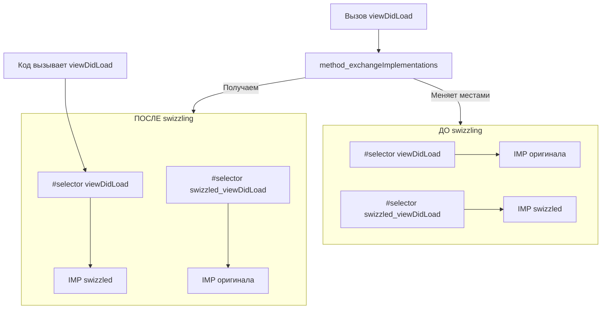

#metod_dispatch #Swift
**Method swizzling** — это техника **динамической замены реализации метода** во время выполнения программы (runtime), когда вы меняете местами (swap) указатели на имплементации двух методов одного класса или разных классов.

В [[Swift]] swizzling чаще всего применяется для:

- **отладки** (логирование вызовов, измерение времени)
- **тестирования** (замена сетевых вызовов на мок)
- **модификации поведения** сторонних библиотек без изменения их кода
- **внедрения аналитики / мониторинга** (например, отслеживание всех переходов на экранах)

**Важно**: Swizzling работает **только** с методами, доступными через **[[Objective-C]] [[runtime]]** (т.е. помеченными [[@objc]] или в классах, наследующихся от [[NSObject]]).

### Когда swizzling работает в Swift 2026

| Условие                                   | Работает ли swizzling?  | Почему                          |
| ----------------------------------------- | ----------------------- | ------------------------------- |
| Метод помечен `@objc` или `dynamic`       | Да                      | Доступен через objc runtime     |
| Класс наследуется от `NSObject`           | Да (если метод `@objc`) | Runtime доступен                |
| Метод в чистом Swift-классе (не NSObject) | Нет                     | Нет objc runtime                |
| Метод в [[struct]] / [[enum]]             | Нет                     | [[Value type]] не поддерживают  |
| Метод [[private]] / [[fileprivate]]       | Нет (если не `@objc`)   | Не виден в runtime              |
| Метод [[final]]                           | Да (если `@objc`)       | final не влияет на objc runtime |

### Как работает swizzling под капотом

1. Получаем два метода через `class_getInstanceMethod` (или `class_getClassMethod` для [[class]] методов)
2. Меняем их реализации местами с помощью `method_exchangeImplementations`
3. После этого вызов оригинального селектора приводит к выполнению swizzled-метода, и наоборот

Схема:



### Полные примеры кода

#### Пример 1 — Swizzling UIViewController.viewDidLoad (классика)

```swift
import UIKit

extension UIViewController {
    static func swizzleViewDidLoad() {
        guard let original = class_getInstanceMethod(UIViewController.self, #selector(viewDidLoad)),
              let swizzled = class_getInstanceMethod(UIViewController.self, #selector(swizzled_viewDidLoad)) else {
            return
        }
        
        method_exchangeImplementations(original, swizzled)
    }
    
    @objc func swizzled_viewDidLoad() {
        print("viewDidLoad вызван для \(self)")
        
        // Важно! Вызываем оригинальный метод
        swizzled_viewDidLoad()
    }
}

// Вызываем один раз при запуске приложения (например, в AppDelegate)
UIViewController.swizzleViewDidLoad()
```

#### Пример 2 — Swizzling метода в вашем собственном классе

```swift
class NetworkManager: NSObject {
    @objc func fetchData(url: URL, completion: @escaping (Data?) -> Void) {
        // оригинальная реализация
        URLSession.shared.dataTask(with: url) { data, _, _ in
            completion(data)
        }.resume()
    }
    
    static func swizzleFetchData() {
        guard let original = class_getInstanceMethod(NetworkManager.self, #selector(fetchData(url:completion:))),
              let swizzled = class_getInstanceMethod(NetworkManager.self, #selector(swizzled_fetchData(url:completion:))) else {
            return
        }
        
        method_exchangeImplementations(original, swizzled)
    }
    
    @objc func swizzled_fetchData(url: URL, completion: @escaping (Data?) -> Void) {
        print("Swizzled fetchData вызван для URL: \(url)")
        
        // Можно добавить мок-данные для тестов
        let mockData = "Mock response".data(using: .utf8)
        completion(mockData)
        
        // или вызвать оригинал
        swizzled_fetchData(url: url, completion: completion)
    }
}

// В тестах или дебаг-сборке
NetworkManager.swizzleFetchData()
```

#### Пример 3 — Swizzling с проверкой на повторное применение

```swift
extension NSObject {
    static func swizzle(selector originalSelector: Selector, with swizzledSelector: Selector) {
        guard let originalMethod = class_getInstanceMethod(self, originalSelector),
              let swizzledMethod = class_getInstanceMethod(self, swizzledSelector) else {
            return
        }
        
        let didAddMethod = class_addMethod(self, originalSelector, method_getImplementation(swizzledMethod), method_getTypeEncoding(swizzledMethod))
        
        if didAddMethod {
            class_replaceMethod(self, swizzledSelector, method_getImplementation(originalMethod), method_getTypeEncoding(originalMethod))
        } else {
            method_exchangeImplementations(originalMethod, swizzledMethod)
        }
    }
}

// Пример использования
UIViewController.swizzle(selector: #selector(UIViewController.viewDidLoad), 
                        with: #selector(UIViewController.swizzled_viewDidLoad))
```

### 5. Лучшие практики и рекомендации 2026

- **Swizzling только в debug-сборках** — используйте `#if DEBUG`
- **Вызывайте swizzle один раз** (обычно в `+load` или AppDelegate)
- **Всегда вызывайте оригинальный метод** в swizzled-версии (через тот же селектор)
- **Не swizzle методы в production** — это может сломать поведение сторонних библиотек
- **Для тестов** — предпочтите **моки** (Mocking frameworks: Cuckoo, Mockingbird, XCTestExpectation) вместо swizzling
- **Для аналитики / мониторинга** — используйте **NotificationCenter** или **method instrumentation** (New Relic, Firebase, Sentry) вместо ручного swizzling
- **Swift 6 strict concurrency** — swizzling усложняет проверку потокобезопасности → минимизируйте его использование

**Короткий девиз 2026**:
> «Swizzling — это мощный, но опасный инструмент runtime-магии.  
> Используйте его только для отладки, тестов и мониторинга.  
> В продакшене — лучше моки, композиция и dependency injection.»
