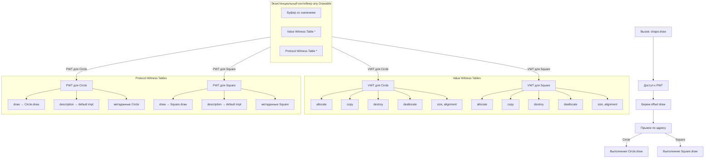

### 1. Что такое Witness Table Dispatch

**Witness Table Dispatch** — это механизм динамической диспетчеризации, который [[Swift]] использует для вызова методов **протоколов**, когда переменная имеет тип протокола ([[any Protocol]] или generics `<T: Protocol>`).

Это **аналог vtable**, но специально для протоколов.

Каждый **конкретный тип**, который реализует протокол, получает свою **таблицу свидетелей** (witness table), где хранятся:

- адреса реализаций всех требований протокола  
- метаданные типа (размер, выравнивание, [[deinit]] и т.д.)  
- информация о conformance (соответствии протоколу)

Когда вы вызываете метод через протокол — [[Swift]] смотрит в witness table и находит нужный адрес функции.

### 2. Когда используется Witness Table Dispatch

| Ситуация                           | Тип диспетчеризации                                    | Witness Table создаётся?    | Скорость | Пример                               |
| ---------------------------------- | ------------------------------------------------------ | --------------------------- | -------- | ------------------------------------ |
| Переменная типа `any Protocol`     | Dynamic (Witness Table)                                | Да                          | ★★★★☆    | `let s: any Shape = Circle()`        |
| Функция с generic `<T: Protocol>`  | [[Static Dispatch\|Static]] / Witness (оптимизировано) | Да, но для каждого T        | ★★★★★    | `func draw<T: Drawable>(_ shape: T)` |
| Возвращаемый тип [[some Protocol]] | [[Static Dispatch\|Static]] / Witness (часто)          | Да, но компилятор знает тип | ★★★★★    | `func makeShape() -> some Drawable`  |
| Протокол с [[@objc]]               | [[Message Dispatch]]                                   | Нет (objc_msgSend)          | ★★☆☆☆    | `@objc protocol Speaker`             |

**Главное правило 2026**:
> `any Protocol` → **динамическая** диспетчеризация через witness table  
> `some Protocol` и generics `<T: Protocol>` → **статическая** или очень оптимизированная witness table (почти как direct)

### 3. Как выглядит Witness Table (схема)



Witness table создаётся **однажды** для каждой пары (конкретный тип + протокол).

### 4. Полные примеры кода

#### Пример 1 — [[any Protocol]] (динамическая witness table)

```swift
protocol Drawable {
    func draw()
}

struct Circle: Drawable {
    func draw() { print("○") }
}

struct Square: Drawable {
    func draw() { print("■") }
}

let shapes: [any Drawable] = [Circle(), Square()]
shapes.forEach { $0.draw() }
// ○
// ■

// Здесь каждый вызов идёт через witness table соответствующего типа
```

#### Пример 2 — [[some Protocol]] (часто статическая / оптимизированная witness)

```swift
func renderShape(_ shape: some Drawable) {
    shape.draw()  // компилятор знает тип → очень быстро (static или witness)
}

let c = Circle()
renderShape(c)  // ○ — часто прямой вызов или witness без overhead
```

#### Пример 3 — [[Generic]] функция (максимальная скорость)

```swift
func renderAll<T: Drawable>(_ shapes: [T]) {
    for shape in shapes {
        shape.draw()  // T известен → статическая диспетчеризация
    }
}

let circles: [Circle] = [Circle(), Circle()]
renderAll(circles)  // ○ ○ — самый быстрый вариант
```

#### Пример 4 — Default implementation в протоколе

```swift
protocol Describable {
    func description() -> String
}

extension Describable {
    func description() -> String {      // default — статическая диспетчеризация
        return "Default description"
    }
}

struct User: Describable {
    // не переопределяем → используется default (статическая)
}

let u = User()
print(u.description())  // Default description
```

#### Пример 5 — Сравнение [[any]] vs [[some]] vs [[generic]]

```swift
func renderAny(_ shape: any Drawable) {     // динамическая witness table
    shape.draw()
}

func renderSome(_ shape: some Drawable) {   // статическая / witness
    shape.draw()
}

func renderGeneric<T: Drawable>(_ shape: T) {  // статическая
    shape.draw()
}
```

### 5. Производительность (примерные цифры 2026)

| Тип диспетчеризации       | Вызов метода (нс) | Разница с Direct | Где критично |
|----------------------------|-------------------|-------------------|--------------|
| Direct / Static            | ~1–2 нс           | 1×                | Горячие циклы |
| Witness Table (some / generics) | ~3–5 нс     | 2–3× медленнее    | Протоколы в обычном коде |
| Witness Table (any Protocol) | ~4–7 нс       | 3–4× медленнее    | Коллекции any |
| Message Dispatch (@objc)   | ~10–20 нс         | 5–10× медленнее   | Редко |

### 6. Лучшие практики 2026 (Swift 6 strict concurrency)

- **Возвращаемый тип** — **всегда** `some Protocol` (функции, computed properties)
- **Коллекции** — только `any Protocol` (и минимизируйте их в горячих путях)
- **Генерики** — `<T: Protocol>` — максимальная скорость и статическая диспетчеризация
- **@objc протоколы** — используйте только для совместимости с Obj-C
- **[[SwiftUI]]** — `some View`, `some ViewModel` — стандарт
- **Горячие пути** (UI, рендеринг, 60 fps) — избегайте `any`
- **Swift 6** — `any` усложняет проверку потокобезопасности → используйте `some` и generics

**Короткий девиз 2026**:
> «Witness Table Dispatch — это динамика для протоколов: гибко, но чуть медленнее.  
> some и generics — для скорости.  
> any — только когда нужно хранить разные типы в одной коллекции.»

