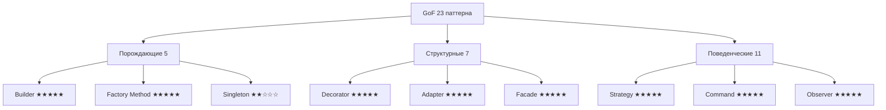

Вот **полное, подробное и максимально актуальное** (на 2026 год) руководство по **паттернам проектирования GoF** (Gang of Four) в контексте Swift.

### 1. Что такое GoF-паттерны и их статус в 2026 году

**GoF** — это 23 классических паттерна проектирования, описанных в книге  
**«Design Patterns: Elements of Reusable Object-Oriented Software»** (1994)  
Эрих Гамма, Ричард Хелм, Ральф Джонсон, Джон Влиссидес («Банда четырёх»).

В 2026 году эти паттерны **не устарели**, но их роль сильно изменилась:

- **~70–80%** из них **очень актуальны** в Swift (особенно в iOS/macOS-разработке)  
- **~15–20%** трансформировались или почти не используются (например, Singleton, Prototype)  
- **~5–10%** полностью заменены встроенными механизмами Swift (Result Builder, Property Wrapper, Actor)

**Категории GoF-паттернов** (актуальность 2026):

| Категория          | Кол-во | Актуальность в Swift 2026 | Самые живые паттерны | Почти не используются |
|---------------------|--------|----------------------------|-----------------------|------------------------|
| **Порождающие**     | 5      | ★★★★☆                      | Builder, Factory Method | Singleton, Prototype   |
| **Структурные**     | 7      | ★★★★★                      | Adapter, Decorator, Facade | Bridge, Flyweight      |
| **Поведенческие**   | 11     | ★★★★★                      | Observer, Strategy, Command, Iterator | Chain of Responsibility, Mediator |

### 2. Полный список 23 GoF-паттернов + их статус в Swift 2026

| №  | Паттерн (рус./англ.)                  | Категория       | Актуальность 2026 | Современная реализация в Swift | Рекомендация |
|----|----------------------------------------|------------------|---------------------|---------------------------------|--------------|
| 1  | Singleton / Одиночка                  | Порождающий     | ★★☆☆☆               | `@globalActor` / `actor` + shared | Почти не использовать |
| 2  | Factory Method / Фабричный метод      | Порождающий     | ★★★★★               | `init?`, `static func make()`   | Очень часто |
| 3  | Abstract Factory / Абстрактная фабрика| Порождающий     | ★★★★☆               | Протокол + фабрика              | Часто |
| 4  | Builder / Строитель                   | Порождающий     | ★★★★★               | Fluent Builder / Result Builder | Один из самых популярных |
| 5  | Prototype / Прототип                  | Порождающий     | ★★☆☆☆               | `Codable` + `copy()`            | Редко |
| 6  | Adapter / Адаптер                     | Структурный     | ★★★★★               | `extension` + протокол          | Очень часто |
| 7  | Bridge / Мост                         | Структурный     | ★★★☆☆               | Протокол + композиция           | Редко |
| 8  | Composite / Компоновщик               | Структурный     | ★★★★☆               | Рекурсивные структуры           | Часто (дерево UI) |
| 9  | Decorator / Декоратор                | Структурный     | ★★★★★               | Функциональные обёртки / extension | Очень часто |
| 10 | Facade / Фасад                        | Структурный     | ★★★★★               | Отдельный класс-обёртка         | Часто |
| 11 | Flyweight / Легковес                  | Структурный     | ★★☆☆☆               | `String` / `Symbol` / `Image`   | Почти не используется |
| 12 | Proxy / Заместитель                   | Структурный     | ★★★★☆               | Lazy loading / Virtual Proxy    | Часто |
| 13 | Chain of Responsibility / Цепочка обязанностей | Поведенческий | ★★★★☆               | Middleware / Responder Chain    | Часто |
| 14 | Command / Команда                     | Поведенческий   | ★★★★★               | `@Sendable` closure / TCA Action | Очень часто |
| 15 | Interpreter / Интерпретатор           | Поведенческий   | ★★☆☆☆               | Result Builder                  | Редко |
| 16 | Iterator / Итератор                   | Поведенческий   | ★★★★★               | `Sequence` / `AsyncSequence`    | Встроено в язык |
| 17 | Mediator / Посредник                  | Поведенческий   | ★★★★☆               | Coordinator / TCA / SwiftUI Environment | Часто |
| 18 | Memento / Хранитель                   | Поведенческий   | ★★★★☆               | `Codable` + undo manager        | Часто (Undo/Redo) |
| 19 | Observer / Наблюдатель                | Поведенческий   | ★★★★★               | `@Published` / Combine / SwiftUI | Встроено |
| 20 | State / Состояние                     | Поведенческий   | ★★★★☆               | `enum` + associated values      | Часто |
| 21 | Strategy / Стратегия                  | Поведенческий   | ★★★★★               | Протокол + разные реализации    | Очень часто |
| 22 | Template Method / Шаблонный метод     | Поведенческий   | ★★★☆☆               | `open` func + override          | Редко |
| 23 | Visitor / Посетитель                  | Поведенческий   | ★★☆☆☆               | `switch` + associated values    | Редко |

### 4. Топ-10 самых живых GoF-паттернов в Swift 2026

1. **Builder** — fluent builder + Result Builder  
2. **Strategy** — протокол + разные реализации  
3. **Decorator** — функциональные обёртки + extension  
4. **Adapter** — `extension` + протокол  
5. **Facade** — обёртка над сложным API  
6. **Command** — `@Sendable` closure / TCA Action  
7. **Observer** — `@Published` / Combine / SwiftUI  
8. **Factory Method** — `static func make()` / `init?`  
9. **Composite** — рекурсивные структуры (UI-дерево)  
10. **Proxy** — lazy loading / virtual proxy

### 5. Визуальная схема GoF-паттернов в 2026 году

### 6. Лучшие практики использования GoF в Swift 2026

- **Builder** — используй fluent chainable методы или Result Builder  
- **Strategy** — протокол + разные реализации (самый живой паттерн)  
- **Decorator** — функциональные обёртки (closures) или extension на протокол  
- **Adapter** — `extension` + протокол (самый частый способ адаптации)  
- **Facade** — создавай тонкие обёртки над сложными API  
- **Singleton** — почти всегда заменяй на `actor` + `static let shared`  
- **Observer** — `@Published` / Combine / SwiftUI вместо NotificationCenter  
- **Command** — `@Sendable` closure / TCA Action / SwiftUI Button action  
- **Не используй** — Prototype, Flyweight, Visitor (в 95% случаев есть лучше)  
- **Swift 6 strict concurrency** — почти все GoF-паттерны легко адаптировать под actor и Sendable  
- **Тестирование** — маленькие протоколы + моки = идеально для unit-тестов

**Короткий девиз 2026**:
> «GoF-паттерны в 2026 году — это как классические сказки: основа основ, но в современном Swift они выглядят иначе.  
> Builder, Strategy, Decorator, Adapter, Facade — живут и процветают.  
> Singleton, Prototype, Visitor — почти на пенсии.»

Удачи с чистым, современным и idiomatic использованием GoF-паттернов в Swift! 🧩