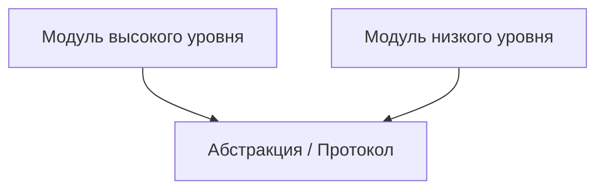

## 📘 Определение

**Dependency Inversion Principle (DIP)** — это один из **пяти принципов [[SOLID]]** (S) в объектно-ориентированном программировании.

Суть:

> **Модули высокого уровня не должны зависеть от модулей низкого уровня. Оба должны зависеть от абстракций. Абстракции не должны зависеть от деталей. Детали должны зависеть от абстракций.**

Проще говоря: **класс не должен напрямую создавать или использовать конкретные реализации зависимостей**, а должен работать через **интерфейсы (протоколы)**. Это повышает **гибкость, тестируемость и расширяемость кода**.

Относится к: **[[Swift]] → SOLID / Архитектура (Clean Swift, VIPER, MVVM)**

---

## 🔹 Проблема без DIP

```swift
class Service {
    func fetchData() -> String {
        return "Data from Service"
    }
}

class ViewController {
    let service = Service() // жесткая зависимость

    func showData() {
        print(service.fetchData())
    }
}
```

- `ViewController` **зависит от конкретного класса `Service`**.
    
- Тестировать `ViewController` без реального `Service` сложно.
    
- Любое изменение `Service` может сломать `ViewController`.
    

---

## 🔹 Применение DIP через протокол

```swift
protocol DataService {
    func fetchData() -> String
}

class Service: DataService {
    func fetchData() -> String {
        return "Data from Service"
    }
}

class MockService: DataService {
    func fetchData() -> String {
        return "Mock data"
    }
}

class ViewController {
    private let service: DataService // зависимость через абстракцию

    init(service: DataService) {
        self.service = service
    }

    func showData() {
        print(service.fetchData())
    }
}
```

- `ViewController` **не знает о конкретной реализации** (`Service` или `MockService`).
    
- Можно легко **подменять зависимости** для тестов или других реализаций.
    

---

## 🔹 Внедрение зависимостей (Dependency Injection)

DIP часто реализуется через **DI (Dependency Injection)**:

1. **Constructor Injection** — передача зависимости через инициализатор (как в примере выше).
    
2. **Property Injection** — передача зависимости через свойство после создания объекта.
    
3. **Method Injection** — передача зависимости через метод.
    

```swift
let realService = Service()
let viewController = ViewController(service: realService)

let mockService = MockService()
let testController = ViewController(service: mockService)
```

---

## 🔹 Почему это важно

|Проблема без DIP|Решение с DIP|
|---|---|
|Жесткая зависимость классов|Работа через протоколы / интерфейсы|
|Сложно тестировать|Легко подставить мок-объект|
|Изменение реализации ломает код|Класс работает с абстракцией|
|Плохая расширяемость|Легко добавлять новые реализации|

---

## 🔹 Визуальная схема



- Модуль высокого уровня зависит **только от абстракции**, а не от деталей.
    
- Модуль низкого уровня реализует **абстракцию**, а не жестко связан с высоким уровнем.
    

---

## 🔹 Пример с реальным [[iOS]] сценарием

```swift
protocol NetworkService {
    func fetchUsers() -> [String]
}

class APIService: NetworkService {
    func fetchUsers() -> [String] {
        return ["Alice", "Bob", "Charlie"]
    }
}

class MockService: NetworkService {
    func fetchUsers() -> [String] {
        return ["Test User"]
    }
}

class UsersViewModel {
    private let service: NetworkService

    init(service: NetworkService) {
        self.service = service
    }

    func loadUsers() {
        let users = service.fetchUsers()
        print(users)
    }
}

let realVM = UsersViewModel(service: APIService())
realVM.loadUsers() // ["Alice", "Bob", "Charlie"]

let testVM = UsersViewModel(service: MockService())
testVM.loadUsers() // ["Test User"]
```

- **Легко тестировать**.
    
- **Меняем реализацию**, не трогая ViewModel.
    
- **Сохраняется принцип Open/Closed** (O из SOLID).
    

---
