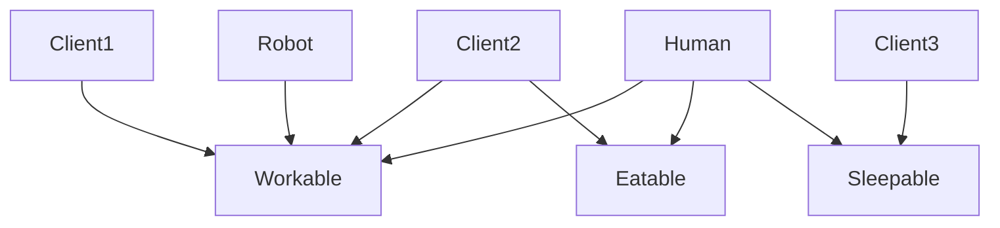

## 📘 Определение

**Interface Segregation Principle (ISP)** — один из принципов **[[SOLID]]** (I).

Суть:

> **Клиенты не должны зависеть от методов, которые они не используют.**

Иными словами: **лучше создавать несколько специализированных интерфейсов (протоколов), чем один большой с множеством методов**, чтобы классы реализовывали только то, что им действительно нужно.

Это повышает **гибкость, тестируемость и уменьшает связность кода**.

Относится к: **[[Swift]] → SOLID / Архитектура (Clean Swift, VIPER, MVVM)**

---

## 🔹 Проблема без ISP

```swift
protocol Worker {
    func work()
    func eat()
    func sleep()
}

class Human: Worker {
    func work() { print("Работаем") }
    func eat() { print("Едим") }
    func sleep() { print("Спим") }
}

class Robot: Worker {
    func work() { print("Робот работает") }
    func eat() { } // не нужен, пустая реализация
    func sleep() { } // не нужен, пустая реализация
}
```

- `Robot` вынужден **реализовывать методы, которые ему не нужны**.
    
- Пустые реализации → **плохая поддерживаемость** и потенциальные ошибки.
    

---

## 🔹 Решение через разделение интерфейсов

Разделим общий протокол на **специализированные**:

```swift
protocol Workable {
    func work()
}

protocol Eatable {
    func eat()
}

protocol Sleepable {
    func sleep()
}

class Human: Workable, Eatable, Sleepable {
    func work() { print("Работаем") }
    func eat() { print("Едим") }
    func sleep() { print("Спим") }
}

class Robot: Workable {
    func work() { print("Робот работает") }
}
```

- `Human` реализует все необходимые протоколы.
    
- `Robot` реализует только `Workable`.
    
- Нет пустых или ненужных методов → чистый и безопасный код.
    

---

## 🔹 Применение ISP с [[iOS]] примером

Допустим, у нас есть протокол для UI компонентов:

```swift
protocol UIComponent {
    func draw()
    func handleTap()
    func handleSwipe()
}
```

- Если компонент не поддерживает свайп, он будет вынужден делать пустую реализацию `handleSwipe()`.
    

Лучше разделить:

```swift
protocol Drawable {
    func draw()
}

protocol Tappable {
    func handleTap()
}

protocol Swipeable {
    func handleSwipe()
}

class Button: Drawable, Tappable {
    func draw() { print("Рисуем кнопку") }
    func handleTap() { print("Нажали кнопку") }
}

class Card: Drawable, Swipeable {
    func draw() { print("Рисуем карточку") }
    func handleSwipe() { print("Свайпнули карточку") }
}
```

- Каждый компонент реализует только нужный функционал.
    
- **Уменьшение связности**, **легче тестировать**, **легче расширять**.
    

---

## 🔹 Визуальная схема



- Клиенты зависят только от того интерфейса, который им нужен.
    
- Нет ненужных методов → чистая архитектура.
    

---

## 🔹 Принципы применения ISP

1. **Разделяйте большие интерфейсы на маленькие**, логически связанные группы методов.
    
2. **Классы реализуют только те протоколы**, которые им реально нужны.
    
3. **Композиция лучше наследования**, особенно при проектировании больших систем.
    
4. **Легче тестировать**, так как можно создавать мок-реализации для конкретных протоколов.
    
