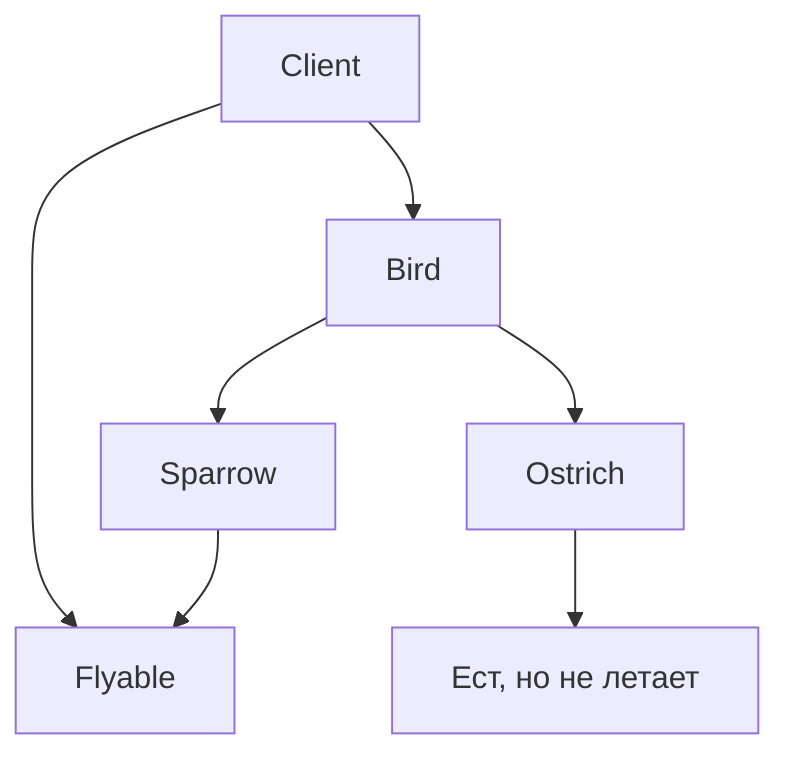

## 📘 Определение

**Liskov Substitution Principle (LSP)** — один из принципов **[[SOLID]]** (L).

Суть:

> **Объекты подклассов должны быть взаимозаменяемыми с объектами базового класса без изменения правильности работы программы.**

Иными словами, **если класс `B` наследуется от класса `A`, то объекты `B` должны работать там, где ожидаются объекты `A`, без ошибок и неожиданных результатов.**

Это повышает **надежность, расширяемость и предсказуемость кода**.

Относится к: **[[Swift]] → SOLID / Архитектура (Clean Swift, VIPER, MVVM)**

---

## 🔹 Проблема без LSP

```swift
class Bird {
    func fly() {
        print("Птица летит")
    }
}

class Ostrich: Bird { // страус не летает
    override func fly() {
        fatalError("Страус не умеет летать")
    }
}

func makeBirdFly(_ bird: Bird) {
    bird.fly()
}

let bird: Bird = Ostrich()
makeBirdFly(bird) // Ошибка во время выполнения
```

- `Ostrich` **нарушает LSP**, так как базовый класс подразумевает способность летать.
    
- Код, который ожидает `Bird`, ломается при подстановке `Ostrich`.
    

---

## 🔹 Решение через корректное проектирование

1. Разделяем интерфейсы (протоколы) по функционалу:
    

```swift
protocol Flyable {
    func fly()
}

class Sparrow: Flyable {
    func fly() { print("Воробей летит") }
}

class Ostrich { // не реализует Flyable
}
```

- Теперь код, работающий с `Flyable`, **не будет принимать страуса**, и LSP соблюдается.
    

---

### 2. Альтернатива: общие методы через абстракции

```swift
protocol Bird {
    func eat()
}

class Sparrow: Bird {
    func eat() { print("Воробей ест") }
    func fly() { print("Воробей летит") }
}

class Ostrich: Bird {
    func eat() { print("Страус ест") }
    // Нет fly() — не нарушает LSP
}
```

- Все птицы реализуют **общую функциональность**, но специализированные действия вынесены отдельно.
    

---

## 🔹 Визуальная схема



- Клиент использует **только методы, которые гарантированы базовым интерфейсом**.
    
- Подклассы не нарушают ожидания клиента.
    

---

## 🔹 Примеры с iOS

### 1. Контроллеры и LSP

```swift
protocol Refreshable {
    func refresh()
}

class TableViewController: Refreshable {
    func refresh() { print("Обновляем таблицу") }
}

class CollectionViewController: Refreshable {
    func refresh() { print("Обновляем коллекцию") }
}

func reloadContent(_ controller: Refreshable) {
    controller.refresh()
}

reloadContent(TableViewController())
reloadContent(CollectionViewController())
```

- Любой объект, реализующий `Refreshable`, можно подставить в `reloadContent`.
    
- **LSP соблюден**.
    

---

### 🔹 Основные правила LSP

1. Подклассы **не должны изменять смысл методов базового класса**.
    
2. Подклассы могут **расширять, но не ограничивать** функциональность.
    
3. Исключения и ошибки должны быть совместимы с базовым классом.
    
4. Используем **протоколы и разделение интерфейсов**, чтобы избежать нарушения LSP.
    
