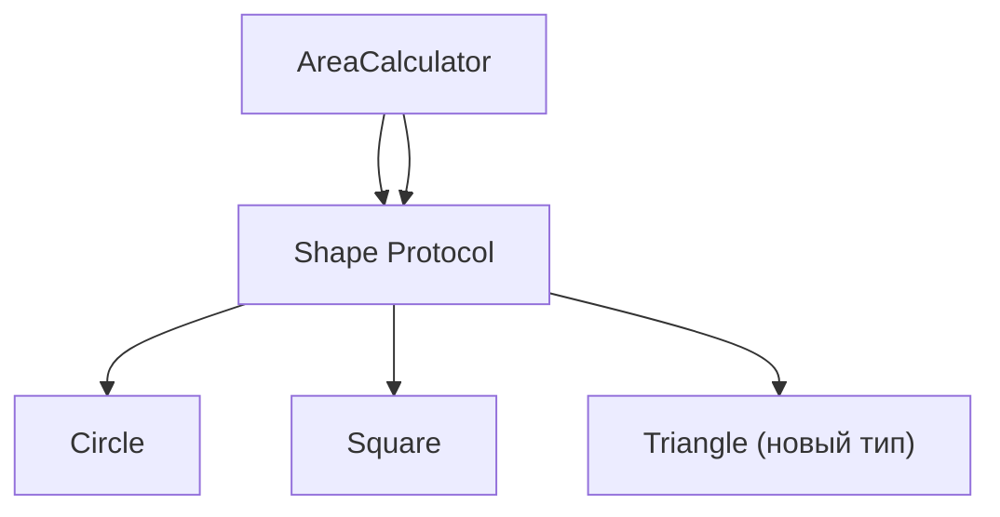

## 📘 Определение

**Open-Closed Principle (OCP)** — один из принципов **[[SOLID]]** (O).

Суть:

> **Классы должны быть открыты для расширения, но закрыты для модификации.**

Иными словами, **можно добавлять новую функциональность без изменения существующего кода**, чтобы не нарушать уже работающий функционал.

Это повышает **устойчивость, тестируемость и расширяемость кода**.

Относится к: **[[Swift]] → SOLID / Архитектура (Clean Swift, VIPER, MVVM)**

---

## 🔹 Проблема без OCP

```swift
class Shape {
    var type: String
    init(type: String) { self.type = type }
}

class AreaCalculator {
    func calculateArea(shape: Shape) -> Double {
        if shape.type == "circle" {
            return 3.14 * 5 * 5
        } else if shape.type == "square" {
            return 5 * 5
        }
        return 0
    }
}
```

- Чтобы добавить новый тип фигуры, нужно **изменять `AreaCalculator`**.
    
- Нарушает OCP → высокий риск ошибок в существующем коде.
    

---

## 🔹 Решение через OCP (полиморфизм и протоколы)

```swift
protocol Shape {
    func area() -> Double
}

class Circle: Shape {
    var radius: Double
    init(radius: Double) { self.radius = radius }
    func area() -> Double { return 3.14 * radius * radius }
}

class Square: Shape {
    var side: Double
    init(side: Double) { self.side = side }
    func area() -> Double { return side * side }
}

class AreaCalculator {
    func calculateArea(shape: Shape) -> Double {
        return shape.area() // Используем полиморфизм
    }
}
```

- Добавление нового типа фигуры **не требует изменения `AreaCalculator`**.
    
- Код **закрыт для модификации, но открыт для расширения**.
    

---

## 🔹 Применение OCP в [[iOS]]

### 1. ViewModel с расширяемыми сервисами

```swift
protocol DataService {
    func fetchData() -> [String]
}

class APIService: DataService {
    func fetchData() -> [String] { return ["Alice", "Bob"] }
}

class MockService: DataService {
    func fetchData() -> [String] { return ["Test User"] }
}

class UsersViewModel {
    private let service: DataService

    init(service: DataService) {
        self.service = service
    }

    func loadUsers() -> [String] {
        return service.fetchData()
    }
}
```

- Любую новую реализацию `DataService` можно **подставить без изменения `UsersViewModel`**.
    
- OCP соблюден.
    

---

## 🔹 Визуальная схема



- `AreaCalculator` использует **абстракцию (`Shape`)**, а не конкретные детали.
    
- Новые фигуры можно добавлять без изменения `AreaCalculator`.
    

---

### ✅ Преимущества OCP

1. Уменьшает риск поломки существующего кода.
    
2. Облегчает добавление новых функций.
    
3. Код становится более гибким и расширяемым.
    
4. Способствует **использованию полиморфизма и протоколов** в Swift.
    
