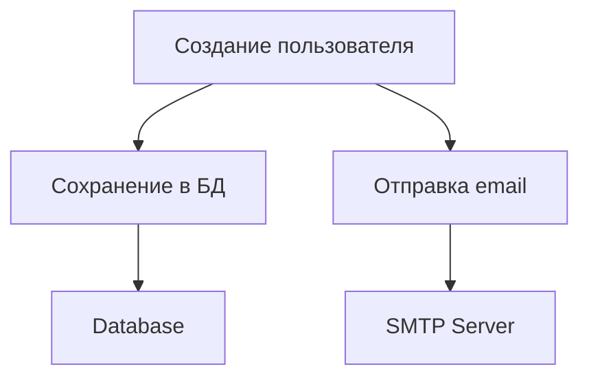

## 📘 Определение

**Single Responsibility Principle (SRP)** — один из принципов **[[SOLID]]** (S).

Суть:

> **Каждый класс или модуль должен иметь только одну причину для изменения.**

Иными словами, **класс должен выполнять только одну конкретную задачу**, не смешивая логику, интерфейс и хранение данных.

Это повышает **читаемость, тестируемость и поддержку кода**.

Относится к: **Swift → SOLID / Архитектура (Clean Swift, VIPER, MVVM)**

---

## 🔹 Проблема без SRP

```swift
class UserManager {
    func createUser(name: String) { /* создание пользователя */ }
    func saveUserToDatabase(user: String) { /* сохраняем в БД */ }
    func sendWelcomeEmail(user: String) { /* отправляем email */ }
}
```

- Класс делает **три разных вещи**: управление пользователем, сохранение в БД, отправка email.
    
- Любое изменение логики хранения или email → придется менять `UserManager`.
    
- Нарушает **SRP**.
    

---

## 🔹 Применение SRP через разделение ответственности

```swift
class UserCreator {
    func createUser(name: String) -> String {
        return name
    }
}

class UserRepository {
    func save(user: String) {
        print("Сохраняем \(user) в базу")
    }
}

class EmailService {
    func sendWelcome(to user: String) {
        print("Отправляем приветственное письмо \(user)")
    }
}

// Использование
let user = UserCreator().createUser(name: "Alice")
UserRepository().save(user: user)
EmailService().sendWelcome(to: user)
```

- Каждый класс **делает только одну вещь**.
    
- Легко тестировать и расширять: можно менять `EmailService`, не трогая `UserRepository`.
    

---

## 🔹 Применение SRP в [[iOS]]

### 1. ViewController и SRP

```swift
class LoginViewController: UIViewController {
    private let authService = AuthService()
    private let validator = InputValidator()

    func loginButtonTapped(username: String, password: String) {
        guard validator.validate(username: username, password: password) else { return }
        authService.login(username: username, password: password)
    }
}
```

- `LoginViewController` отвечает только за **UI и обработку событий**.
    
- Валидация и авторизация вынесены в **отдельные классы**, соблюдая SRP.
    

---

### 2. Разделение логики в MVVM

```swift
class UserViewModel {
    private let repository: UserRepository

    init(repository: UserRepository) {
        self.repository = repository
    }

    func loadUsers() -> [String] {
        return repository.fetchUsers()
    }
}
```

- ViewModel **только готовит данные для UI**, не занимается хранением или сетевыми запросами.
    

---

## 🔹 Визуальная схема SRP



- Каждый блок отвечает **только за одну задачу**.
    
- Изменение одной задачи **не ломает остальные**.
    

---

### ✅ Преимущества SRP

1. Легче тестировать и поддерживать.
    
2. Снижается связанность между компонентами.
    
3. Код становится более **гибким и расширяемым**.
    
4. Изменение одной ответственности **не влияет на другие**.
    
