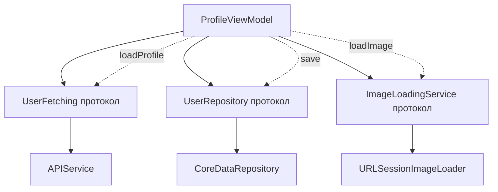

Вот **полное, подробное и максимально актуальное** (на 2026 год) руководство по **Single Responsibility Principle (SRP)** в Swift — с примерами, схемами и реальными iOS-сценариями.

### 1. Что такое Single Responsibility Principle (Принцип единственной ответственности) (SRP) — суть в 2026 году

**SRP** — первый принцип [[SOLID]], сформулированный Робертом Мартином:

> **Класс (модуль, функция) должен иметь только одну причину для изменения.**

Перевод на язык [[Swift]] 2026:

- Каждый тип ([[class]], [[struct]], [[actor]], [[protocol]], ViewModel, UseCase и т.д.) должен отвечать **ровно за одну вещь**  
- Если тебе нужно изменить класс по двум разным причинам (например, «изменилась бизнес-логика» И «изменился UI») — это **нарушение SRP**  
- Причина изменения = **одна бизнес-сущность / один уровень ответственности** (UI, сеть, хранение, валидация, бизнес-правила и т.д.)

**Самый короткий и честный девиз 2026**:
> «Один класс — одна ответственность.  
> Две причины для изменения = два класса.»

### 2. Почему SRP в 2026 году стал ещё критичнее

| Проблема без SRP (классический «God Class»)                                                                         | Последствия в Swift 6+ (2026)                  | Как SRP решает проблему                                      |
| ------------------------------------------------------------------------------------------------------------------- | ---------------------------------------------- | ------------------------------------------------------------ |
| ViewController делает UI + сеть + валидацию + бизнес-логику                                                         | 1000+ строк, [[data race]], сложно тестировать | Разделяем на View, ViewModel, Service, Repository, Validator |
| Изменение формата даты ломает весь ViewModel                                                                        | Регрессия в UI и бизнес-логике одновременно    | Дата-форматирование → отдельный Formatter                    |
| Swift 6 strict concurrency → конфликт изоляции в большом классе                                                     | Ошибки компиляции везде                        | Маленькие классы + actor = чисто                             |
| [[TCA]] / Composable Architecture / [[Clean Swift (VIP) Architecture\|Clean Swift]] / [[VIPER Architecture\|VIPER]] | Требуют SRP как основу                         | Без SRP архитектура не работает                              |
| Тесты → один большой тест на всё                                                                                    | Тесты хрупкие, долго выполняются               | Маленькие классы → маленькие, быстрые, независимые тесты     |

**Вывод 2026**:  
SRP — это уже **не рекомендация**, а **обязательное условие** для любого приложения, которое:
- живёт дольше 6 месяцев  
- имеет команду > 2 человек  
- использует Swift 6+ strict concurrency  
- следует TCA / Clean Swift / VIPER / MVVM-C

### 3. Классический антипаттерн — «God Class» / «Massive View Controller»

```swift
class ProfileViewController: UIViewController {
    @IBOutlet weak var nameLabel: UILabel!
    @IBOutlet weak var avatarImageView: UIImageView!
    
    private let api = URLSession.shared
    private let db = CoreDataStack.shared
    private let validator = Validator()
    
    func viewDidLoad() {
        super.viewDidLoad()
        
        // 1. Валидация (не место здесь)
        guard validator.validateUser() else { return }
        
        // 2. Сеть (не место здесь)
        api.dataTask(with: profileURL) { data, _, error in
            guard let data else { return }
            
            // 3. Парсинг (не место здесь)
            let user = try? JSONDecoder().decode(User.self, from: data)
            
            // 4. Сохранение в БД (не место здесь)
            db.save(user: user)
            
            // 5. Обновление UI (ок, но слишком много всего)
            DispatchQueue.main.async {
                self.nameLabel.text = user?.name
                if let url = user?.avatarURL {
                    // 6. Загрузка аватарки (не место здесь)
                    self.avatarImageView.load(from: url)
                }
            }
        }.resume()
    }
}
```

**Нарушения SRP** (6 причин для изменения):
1. Изменился API → меняем сеть  
2. Изменилась модель User → меняем парсинг  
3. Изменилась БД → меняем сохранение  
4. Изменился валидатор → меняем валидацию  
5. Изменился дизайн профиля → меняем UI  
6. Изменился способ загрузки аватарки → меняем загрузку

### 4. Правильная реализация SRP — маленькие классы + композиция

```swift
// 1. Валидация — отдельная ответственность
struct UserValidator {
    func validate(_ user: User?) -> Bool { ... }
}

// 2. Сеть — отдельная ответственность
protocol UserFetching {
    func fetchCurrentUser() async throws -> User
}

actor APIService: UserFetching {
    func fetchCurrentUser() async throws -> User { ... }
}

// 3. Хранение — отдельная ответственность
protocol UserRepository {
    func save(_ user: User) async throws
    func loadCurrentUser() async throws -> User?
}

actor CoreDataRepository: UserRepository { ... }

// 4. Форматирование и загрузка аватарки — отдельные ответственности
protocol ImageLoadingService {
    func loadImage(from url: URL) async throws -> UIImage
}

actor URLSessionImageLoader: ImageLoadingService { ... }

// 5. ViewModel — только подготовка данных для UI
@MainActor
class ProfileViewModel: ObservableObject {
    @Published var name = "Загрузка..."
    @Published var avatar: UIImage?
    
    private let userFetcher: any UserFetching
    private let repository: any UserRepository
    private let imageLoader: any ImageLoadingService
    private let validator: UserValidator
    
    init(
        userFetcher: any UserFetching,
        repository: any UserRepository,
        imageLoader: any ImageLoadingService,
        validator: UserValidator = UserValidator()
    ) {
        self.userFetcher = userFetcher
        self.repository = repository
        self.imageLoader = imageLoader
        self.validator = validator
    }
    
    func loadProfile() async {
        do {
            let user = try await userFetcher.fetchCurrentUser()
            
            if validator.validate(user) {
                try await repository.save(user)
                
                name = user.name
                
                if let url = user.avatarURL {
                    avatar = try await imageLoader.loadImage(from: url)
                }
            }
        } catch {
            // обработка
        }
    }
}
```

**Каждый класс имеет ровно одну причину для изменения**:
- Изменился API → меняем только `APIService`  
- Изменилась БД → меняем только `CoreDataRepository`  
- Изменился способ загрузки аватарки → меняем только `URLSessionImageLoader`  
- Изменился дизайн профиля → меняем только `ProfileViewModel` (и то частично)

### 5. Визуальная схема SRP (2026 стиль)



- ViewModel зависит **только** от абстракций  
- Каждая абстракция имеет **одну реализацию** (или несколько — для тестов / feature flag)  
- Изменение одной реализации **не трогает** остальные

### 6. Лучшие практики SRP в Swift 2026

- **Один класс — одна ответственность** (ищи «и» в описании класса)  
- **Протоколы** — точка расширения и тестирования  
- **View** → только UI и жесты  
- **ViewModel** → подготовка данных для View  
- **Repository** → работа с данными (сеть, БД, кэш)  
- **Service / UseCase** → бизнес-логика  
- **Formatter / Validator** → форматирование и проверки  
- **Swift 6 strict concurrency** — SRP + actor + маленькие классы = почти 100% отсутствие data race  
- **Не бойтесь** создавать 50–100 маленьких классов — Xcode справится  
- **Документируйте** — пишите в документации класса «отвечает только за X»

**Короткий девиз 2026**:
> «SRP в 2026 году — это когда ты говоришь: «этот класс делает ровно одну вещь и только её».  
> Без SRP в Swift 6+ писать долгоживущее, тестируемое и масштабируемое приложение уже считается плохим тоном.»
