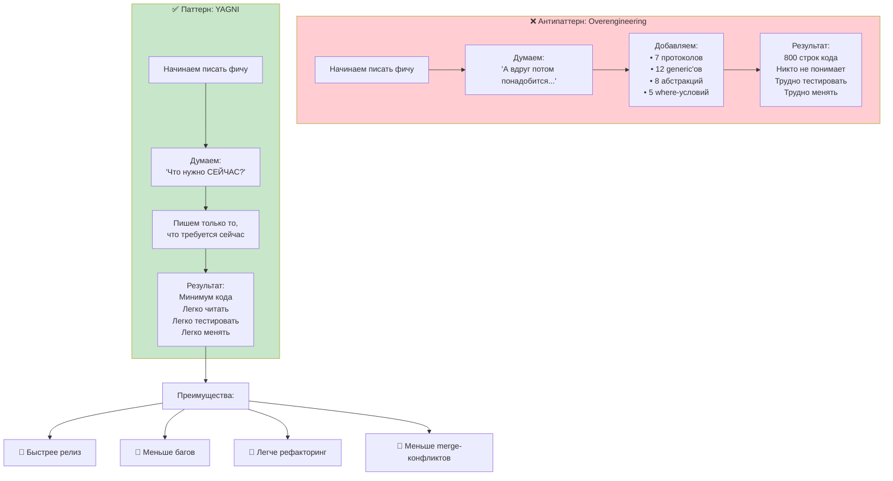

### 1. Что такое YAGNI и почему он стал ещё важнее в 2026 году

**YAGNI** — один из самых старых и одновременно самых недооценённых принципов Extreme Programming (XP), сформулированный Кентом Беком и Мартином Фаулером в конце 1990-х.

Классическая формулировка:

> «Не добавляй функциональность, пока в ней нет реальной необходимости.»  
> «You aren’t gonna need it» — буквально: «Тебе это всё равно не понадобится».

Перевод на язык [[Swift]] 2026:

- Не пиши код «на будущее», «про запас», «а вдруг понадобится»  
- Реализуй **только то**, что **прямо требуется текущими бизнес-требованиями** и **пользовательскими сценариями**  
- Любая строка кода, которую ты написал «на всякий случай», — это потенциальная **техническая задолженность**

**Почему YAGNI в 2026 году стал критичнее**:

- **Swift 6 strict concurrency** → лишний код = больше шансов на data race и ошибки изоляции  
- **AI-генерация кода** (Copilot, Cursor, [[Xcode]] AI) → генерирует «на всякий случай» очень много лишнего → без YAGNI проект разрастается в 2–3 раза быстрее  
- **Команды 5–30+ человек** → лишний код = больше споров, дольше ревью, больше багов  
- **[[TCA]] / Composable Architecture** → YAGNI лежит в основе «минимального reducer’а»  
- **Долгоживущие проекты** (5–15 лет) → без YAGNI код становится неподдерживаемым «кладбищем» ненужных фич

**Самый честный девиз 2026**:
> «YAGNI — это когда ты пишешь код так, чтобы завтрашний ты не проклинал сегодняшнего за лишнюю сложность.»

### 2. Самые частые нарушения YAGNI в [[iOS]]-приложениях 2026 года

| Нарушение YAGNI                                                      | Почему это плохо в 2026 году                             | Как исправить (YAGNI-подход)                          |
| -------------------------------------------------------------------- | -------------------------------------------------------- | ----------------------------------------------------- |
| «А вдруг понадобится» — добавление 10 опциональных полей в модель    | Модель разрастается, Codable ломается, тесты усложняются | Добавлять поле только когда оно реально используется  |
| Абстрактный `BaseViewController` на 300 строк «на будущее»           | Каждый VC наследуется → дубли + сложность                | Композиция + протоколы + extension                    |
| [[Generic]] Repository с 8 [[associatedtype]] «для масштабируемости» | Компилятор 30 сек думает, разработчик — 30 мин           | Конкретный репозиторий на каждую сущность             |
| Поддержка 5 разных форматов даты «на всякий случай»                  | Лишний код, сложные тесты                                | Один формат → один Formatter                          |
| Реализация offline-режима до того, как бизнес попросил               | Огромный объём кода, который никто не использует         | Делать только после явного требования                 |
| Создание 7-уровневой абстракции «для гибкости»                       | Невозможно читать, отлаживать, тестировать               | Писать ровно столько абстракций, сколько нужно сейчас |

### 3. Самые популярные и рекомендуемые реализации YAGNI в Swift 2026

#### Паттерн 1 — «YAGNI + минимальный протокол»

```swift
// Нарушение YAGNI — сразу сделали «на будущее»
protocol FullUserService {
    func fetchUser(id: UUID) async throws -> User
    func saveUser(_ user: User) async throws
    func deleteUser(id: UUID) async throws
    func fetchFriends(id: UUID) async throws -> [User]
    func updateAvatar(_ image: UIImage) async throws
    // ещё 10 методов
}

// YAGNI — делаем только то, что нужно сейчас
protocol UserFetching {
    func fetchCurrentUser() async throws -> User
}

@MainActor
class ProfileViewModel {
    private let service: any UserFetching
    
    init(service: any UserFetching) {
        self.service = service
    }
    
    func load() async {
        do {
            let user = try await service.fetchCurrentUser()
            // ...
        } catch {
            // ...
        }
    }
}
```

Когда бизнес попросит «fetchFriends» — добавим **новый** протокол и новую реализацию — старый код **не трогаем**.

#### Паттерн 2 — YAGNI + минимальный [[struct]] вместо большого класса

```swift
// Нарушение — сразу сделали «на будущее»
class UserProfile {
    var id: UUID?
    var name: String?
    var email: String?
    var phone: String?
    var birthDate: Date?
    var avatarURL: URL?
    var isPremium: Bool?
    var preferences: [String: Any]?
    // ещё 15 полей
}

// YAGNI — только то, что нужно сейчас
struct MinimalProfile {
    let id: UUID
    let name: String
    let avatarURL: URL?
}
```

Когда понадобится email → добавим новое поле в новую структуру или расширим существующую — без риска сломать старый код.

#### Паттерн 3 — YAGNI + «правило трёх»

```swift
// 1-й раз — пишем прямо в месте использования
nameLabel.text = user.name.uppercased()

// 2-й раз — всё ещё пишем вручную
titleLabel.text = user.name.uppercased()

// 3-й раз — выносим (YAGNI сработал)
extension String {
    var uppercasedDisplay: String {
        uppercased()
    }
}

// Теперь везде используем один способ
nameLabel.text = user.name.uppercasedDisplay
```

### 4. Визуальная схема YAGNI (2026 стиль)



### 5. Лучшие практики YAGNI в Swift 2026

- **Правило трёх** — увидел повторяющийся код 3 раза → выноси  
- **Минимальный интерфейс** — протоколы по 2–5 методов, структуры с 3–7 полями  
- **actor** — для всего изменяемого состояния (заменяет 90% lock’ов и синглтонов)  
- **Не предугадывай** — не пиши «на будущее» без явного требования бизнеса  
- **Swift 6 strict concurrency** — YAGNI + actor + маленькие функции = почти 100% отсутствие data race  
- **Тестирование** — простой код = быстрые, независимые тесты  
- **Документируйте** — пишите в комментариях «YAGNI — сделано минимально, только то, что нужно сейчас»

**Короткий девиз 2026**:
> «YAGNI в 2026 году — это когда ты пишешь ровно столько кода, сколько нужно прямо сейчас, и ни строчкой больше.  
> Лишний код — это техническая задолженность, которую ты берёшь на себя добровольно.»
