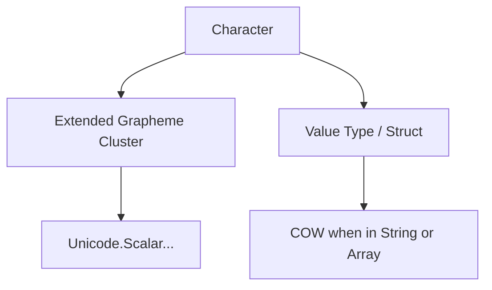

# 📘 Character в [[Swift]] — полное руководство

**`Character`** — это тип, который представляет **один графический символ** в Swift. Он может быть **одним Unicode скаляром**, но также может состоять из **нескольких скаляров**, образующих один видимый символ (например, эмодзи или буквы с диакритикой).

> Проще говоря: `Character` = «видимый символ», который может состоять из одного или нескольких юникод-скаляров.

---

## 🔹 1. Основные термины

| Термин                        | Описание                                                                                 |
| ----------------------------- | ---------------------------------------------------------------------------------------- |
| **Character**                 | Один графический символ в Swift                                                          |
| **Unicode Scalar**            | Базовая единица Unicode (`Unicode.Scalar`)                                               |
| **Extended Grapheme Cluster** | Один `Character` может быть составлен из нескольких скаляров (например, "é" = "e" + "́") |
| **[[String]]**                | Последовательность `Character`                                                           |
| **Literal**                   | Можно писать как `'a'` или `"🙂"` (внутри String)                                        |
| **Comparison**                | `Character` поддерживает `Equatable` и `Comparable`                                      |
| **Unicode**                   | Все символы хранятся в кодировке Unicode (UTF-8, UTF-16 в памяти)                        |

---

## 🔹 2. Основной синтаксис

```swift
let letter: Character = "A"
let emoji: Character = "🙂"
let accented: Character = "é"
```

- `Character` может быть буквенным, числовым, спецсимволом или эмодзи
    
- Для строки из одного символа можно явно указать тип `Character`
    

---

## 🔹 3. Примеры использования

### Пример 1. Создание и вывод

```swift
let ch: Character = "Z"
print(ch) // Z

let heart: Character = "❤️"
print(heart) // ❤️
```

- Даже эмодзи с несколькими скалярами воспринимается как **один Character**
    

---

### Пример 2. String из Character

```swift
let letters: [Character] = ["H", "e", "l", "l", "o"]
let word = String(letters)
print(word) // Hello
```

- Массив `Character` можно превратить в `String` через инициализатор `String(_)`
    

---

### Пример 3. Iterating Characters в String

```swift
let greeting = "Hello, Swift!"
for ch in greeting {
    print(ch)
}
```

- `String` в Swift — это коллекция [[Collection]] из `Character`
    
- Цикл [[for-in]] безопасно итерирует **графические символы**, даже если один `Character` состоит из нескольких скаляров
    

---

### Пример 4. Unicode Scalars

```swift
let eAcute: Character = "é"
for scalar in eAcute.unicodeScalars {
    print(scalar.value)
}
// Выведет два скаляра: 101 (e) и 769 (´)
```

- `Character` может содержать несколько `Unicode.Scalar` → Extended Grapheme Cluster
    
- Это важно для корректной обработки текста с диакритикой, флагов и эмодзи
    

---

### Пример 5. Сравнение и Equatable

```swift
let a: Character = "a"
let b: Character = "a"
let c: Character = "b"

print(a == b) // true
print(a != c) // true
```

- `Character` поддерживает `Equatable` и `Comparable` для сравнения
    
- Сравнение учитывает **графические символы**, а не просто байты
    

---

## 🔹 4. Под капотом

- `Character` — это **[[Value Type]] ([[struct]])**
    
- Хранит **Extended Grapheme Cluster**: один или несколько `Unicode.Scalar`
    
- Использует **UTF-16 буфер** под капотом для работы со строками
    
- Поддерживает **[[Copy-On-Write]] (COW)**, если хранится в `String` или коллекции
    



- Благодаря Extended Grapheme Cluster, один `Character` может выглядеть как один символ, но занимать несколько кодовых точек
    

---

## 🔹 5. Особенности Character

1. Представляет **один видимый символ**, а не один байт или скаляр
    
2. Поддерживает **Unicode** и все символы мира, включая эмодзи
    
3. Может содержать **несколько Unicode.Scalar** (диакритика, составные символы)
    
4. Поддерживает **Equatable**, `Comparable`, `Hashable`
    
5. Можно использовать как элемент `Collection` в `String`, массиве `[Character]` и других коллекциях
    

---

## 🔹 6. Итог

- **Character** = один графический символ
    
- Обрабатывает **Unicode и Extended Grapheme Clusters**
    
- Может быть частью `String` или `[Character]`
    
- Позволяет безопасно итерировать текст, сравнивать символы и работать с эмодзи
    
- Под капотом — struct с копируемым буфером, поддерживающий COW в строках
    

---
