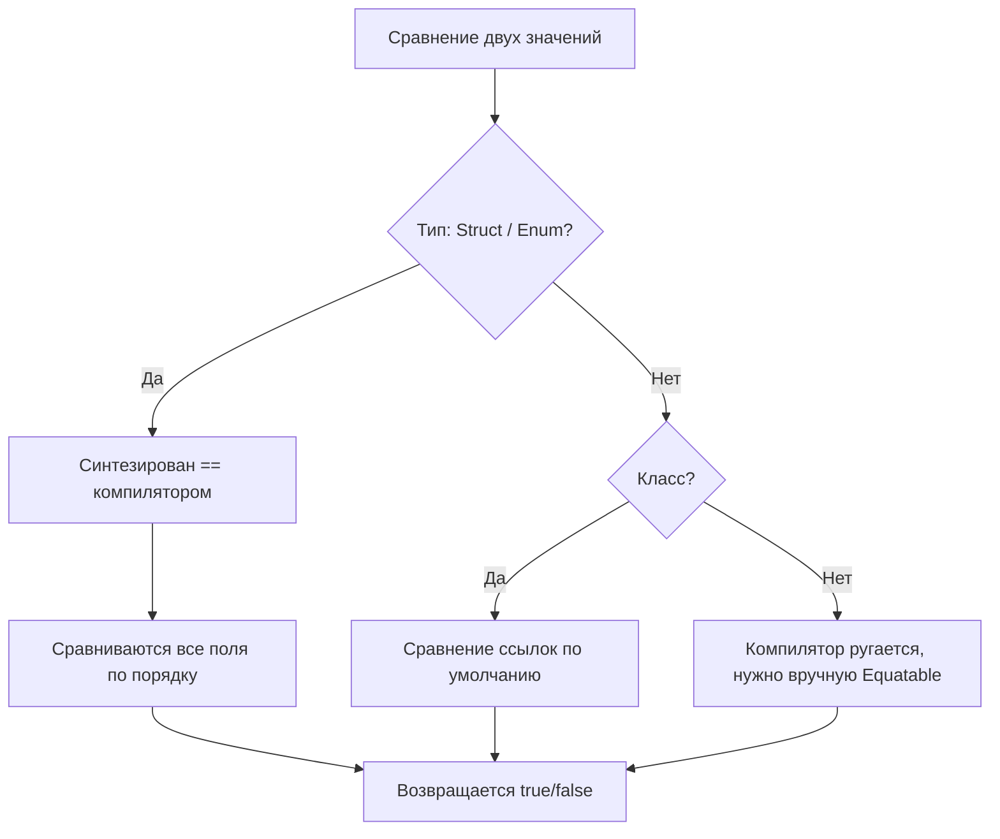

# 📘 Equatable и операции сравнения в Swift

**Equatable** — это протокол в [[Swift]], который позволяет объектам и структурам **сравниваться на равенство** с помощью оператора `==`.

Если тип соответствует Equatable, мы можем:

- Сравнивать два значения через `==`
    
- Использовать `!=` для проверки неравенства
    
- Использовать коллекции, которые требуют Equatable (например, [[Set]])
    

---

## 🔹 Определение протокола

```swift
protocol Equatable {
    static func == (lhs: Self, rhs: Self) -> Bool
}
```

- Любой тип, соответствующий Equatable, должен реализовать оператор `==`
    
- Swift автоматически синтезирует реализацию для **структур и enum**, если все поля Equatable
    

---

## 🔹 Примеры использования

### 1. Структура с автоматическим Equatable

```swift
struct Point: Equatable {
    var x: Int
    var y: Int
}

let p1 = Point(x: 1, y: 2)
let p2 = Point(x: 1, y: 2)
let p3 = Point(x: 3, y: 4)

print(p1 == p2) // true
print(p1 == p3) // false
print(p1 != p3) // true
```

- Swift автоматически создаёт `==`, сравнивая **все поля по очереди**
    

---

### 2. Enum с ассоциированными значениями

```swift
enum Result: Equatable {
    case success(Int)
    case failure(String)
}

let r1 = Result.success(200)
let r2 = Result.success(200)
let r3 = Result.failure("error")

print(r1 == r2) // true
print(r1 == r3) // false
```

- Сравнение учитывает **ассоциированные значения**
    

---

### 3. Пользовательская реализация Equatable

```swift
struct Person: Equatable {
    var name: String
    var age: Int
    
    static func == (lhs: Person, rhs: Person) -> Bool {
        return lhs.name == rhs.name // сравниваем только имя
    }
}

let alice1 = Person(name: "Alice", age: 20)
let alice2 = Person(name: "Alice", age: 30)

print(alice1 == alice2) // true, age не учитывается
```

- Можно **переопределить поведение** сравнения по нужным полям
    

---

### 4. Equatable для массивов и коллекций

```swift
let arr1 = [1, 2, 3]
let arr2 = [1, 2, 3]
let arr3 = [3, 2, 1]

print(arr1 == arr2) // true
print(arr1 == arr3) // false
```

- Для коллекций сравниваются **все элементы по индексу**
    

---

## 🔹 Под капотом

Swift использует Equatable для **оператора `==`** следующим образом:

```swift
func ==<T: Equatable>(lhs: T, rhs: T) -> Bool {
    return lhs.isEqual(to: rhs)
}
```

- Для структур и enum, если Equatable синтезирован, компилятор **сравнивает все поля по порядку**
    
- Для классов без Equatable сравнение через `==` работает как **сравнение ссылок**, а не содержимого
    

### [[Optional]] Equatable

- Если `T: Equatable`, то `T?` также автоматически Equatable
    

```swift
let a: Int? = 3
let b: Int? = 3
print(a == b) // true
```

- [[Nil]] сравнивается корректно
    

---

## 🔹 Сравнение с классами

- **Классы:**
    
    - Сравнение по умолчанию сравнивает **ссылки**, а не содержимое
        
    - Чтобы сравнивать содержимое → нужно реализовать Equatable вручную
        
- **Структуры и enum:**
    
    - Синтезируется автоматически, сравнивает все поля
        

---

## 🔹 Использование в стандартных коллекциях

- `Set<T>` требует `T: Hashable`, а Hashable наследует Equatable
    
- [[Dictionary]] ключи должны быть [[Hashable]] → автоматически Equatable
    

```swift
let set1: Set<Int> = [1,2,3]
let set2: Set<Int> = [1,2,3]
print(set1 == set2) // true
```

---

## 🔹 Итог

- **Equatable** — протокол для сравнения на равенство
    
- `==` и `!=`
    
- Автоматически синтезируется для структур и enum, если все поля Equatable
    
- Для классов требует ручной реализации, иначе сравниваются ссылки
    
- Обязательно для коллекций типа `Set`, `Dictionary keys`
    

---

## 🔹 Mermaid-схема под капотом



- Показано, как Swift определяет поведение `==`
    
- Для структур и [[enum]] → синтезированное сравнение всех полей
    
- Для классов → по ссылке, unless реализовать Equatable вручную
    

---
