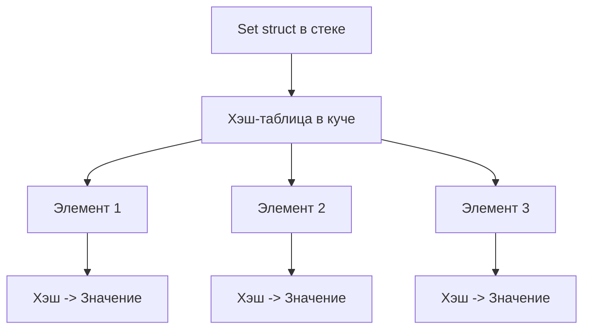

# 📘 полное руководство

**`Set`** — это коллекция, которая хранит **только уникальные значения**.

- Порядок элементов **не гарантирован**
    
- Элементы должны быть **[[Hashable]]** (иметь уникальный хэш)
    
- Поддерживает **операции множеств**: объединение, пересечение, разность, симметрическую разность
    

> Проще говоря: Set = «коллекция без дубликатов, для быстрой проверки принадлежности».

---

## 🔹 1. Основные термины

| Термин                     | Описание                                                                                 |
| -------------------------- | ---------------------------------------------------------------------------------------- |
| **Hashable**               | Элемент Set должен поддерживать хэширование ([[String]], [[Int]], [[struct]] с Hashable) |
| **Unique values**          | Set хранит только уникальные элементы                                                    |
| **Operations**             | union, intersection, subtracting, symmetricDifference                                    |
| **Mutable / Immutable**    | [[var]] → можно добавлять/удалять; [[let]] → immutable                                   |
| **Contains**               | Быстрая проверка наличия элемента в множестве                                            |
| **Higher-order functions** | [[map]], [[filter]], [[reduce]], [[compactMap]], [[sort]], [[forEach]]                   |

---

## 🔹 2. Основной синтаксис

```swift
var numbers: Set<Int> = [1, 2, 3, 3, 2]
print(numbers) // [2, 3, 1] порядок не гарантирован
```

- Дубликаты **удаляются автоматически**
    
- Используем **`var` для mutable**, `let` для immutable
    

---

## 🔹 3. Примеры использования

### Пример 1. Создание и добавление

```swift
var fruits: Set<String> = ["Apple", "Banana"]
fruits.insert("Orange")
fruits.insert("Apple") // не добавится, уже есть
print(fruits) // ["Banana", "Apple", "Orange"]
```

- `insert` добавляет элемент только если его ещё нет
    

---

### Пример 2. Удаление и проверка наличия

```swift
fruits.remove("Banana")
print(fruits) // ["Apple", "Orange"]

if fruits.contains("Apple") {
    print("Apple is in the set")
}
```

- `remove` удаляет элемент
    
- `contains` проверяет наличие элемента **очень быстро**
    

---

### Пример 3. Операции множеств

```swift
let a: Set = [1, 2, 3, 4]
let b: Set = [3, 4, 5, 6]

let union = a.union(b)                 // [1, 2, 3, 4, 5, 6]
let intersection = a.intersection(b)   // [3, 4]
let difference = a.subtracting(b)      // [1, 2]
let symmetric = a.symmetricDifference(b) // [1, 2, 5, 6]

print(union, intersection, difference, symmetric)
```

- Полезно для **математических операций над множествами**
    

---

### Пример 4. Итерация

```swift
for fruit in fruits {
    print(fruit)
}
```

- Порядок **не гарантирован**
    

---

### Пример 5. Set с кастомной структурой

```swift
struct Point: Hashable {
    var x: Int
    var y: Int
}

var points: Set<Point> = [Point(x:1, y:2), Point(x:2, y:3)]
points.insert(Point(x:1, y:2)) // не добавится, дубликат
print(points) // [Point(x: 2, y: 3), Point(x: 1, y: 2)]
```

- Структуры должны соответствовать `Hashable`
    

---

### Пример 6. Операции высшего порядка

```swift
let numbers: Set = [1, 2, 3, 4, 5]

// map
let squared = numbers.map { $0 * $0 } // [1, 4, 9, 16, 25]

// filter
let evenNumbers = numbers.filter { $0 % 2 == 0 } // [2, 4]

// reduce
let sum = numbers.reduce(0, +) // 15

// sorted
let sortedNumbers = numbers.sorted() // [1, 2, 3, 4, 5]
```

- Set поддерживает **map, filter, reduce, sorted, compactMap, forEach**
    
- Обратите внимание: `map` и `filter` возвращают **массив**, а не Set
    

---

## 🔹 4. Под капотом

- **Set хранит элементы в виде хэш-таблицы**
    
- Каждый элемент имеет **уникальный хэш**
    
- Дубликаты не добавляются, так как проверка по хэшу происходит быстро (O(1) в среднем)
    
- Порядок элементов **не гарантирован**, так как внутреннее расположение зависит от хэш-значений
    

### Memory layout (упрощённо)



- Структура Set хранится на **[[stack]]**, а элементы и хэш-таблица — на **[[heap]]**
    
- При вставке или удалении Set **перестраивает хэш-таблицу**, если необходимо
    

---

### 5. Особенности Set

1. **Уникальные значения** — дубликаты игнорируются
    
2. **Hashable** — элементы должны поддерживать хэширование
    
3. **Порядок не гарантирован**
    
4. Поддерживает **операции множеств**: union, intersection, subtracting, symmetricDifference
    
5. Mutable через `var`, immutable через `let`
    
6. **Высшего порядка функции**: map, filter, reduce, sorted, compactMap, forEach
    
7. Быстрая проверка `contains` — O(1) в среднем
    

---

## 🔹 6. Итог

- **Set** = коллекция уникальных элементов без гарантии порядка
    
- Идеально подходит для **проверки уникальности и операций над множествами**
    
- Поддерживает **арифметику множеств и кастомные структуры через Hashable**
    
- Можно использовать **операции высшего порядка** для удобной работы с элементами
    

---
