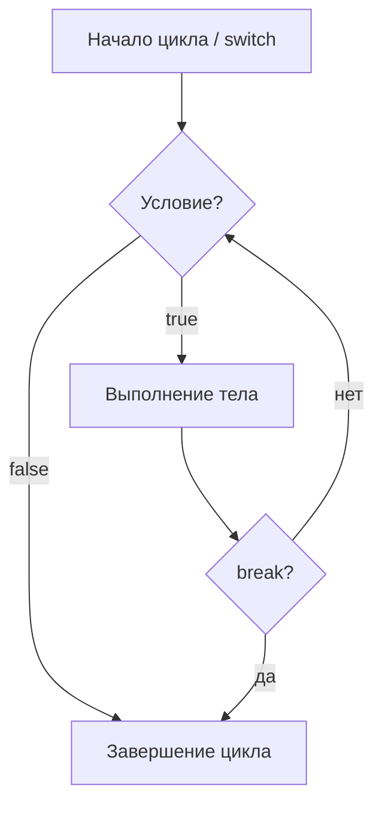

#Swift #standart_library 
## 📘 Определение

`break` — оператор управления потоком выполнения.  
Прерывает выполнение **текущего цикла** ([[for-in]], [[while]], [[repeat-while]]) или **оператора switch** и сразу передаёт управление на первую строку кода после него.

Используется, когда дальнейшее выполнение цикла/ветки не имеет смысла.

---

## 🔹 Примеры кода

### 1. Простой `for` цикл с `break`

```swift
for i in 1...5 {
    print("i = \(i)")
    if i == 3 {
        break // прерываем цикл на числе 3
    }
}
print("Цикл завершён")
```

---

### 2. Использование `break` в `while`

```swift
var count = 0

while true {
    count += 1
    if count == 5 {
        break // выходим из бесконечного цикла
    }
}
print("count = \(count)") // 5
```

---

### 3. Применение в [[switch]]

```swift
let number = 2

switch number {
case 1:
    print("Один")
case 2:
    print("Два")
    break // досрочно выходим из switch (хотя в Swift это не обязательно)
default:
    print("Другое число")
}
```

---

### 4. Использование с метками (`label`) для вложенных циклов

```swift
outerLoop: for x in 1...3 {
    for y in 1...3 {
        if x == 2 && y == 2 {
            break outerLoop // прерываем оба цикла
        }
        print("x = \(x), y = \(y)")
    }
}
```

---

### 5. Сочетание `break` и `guard` в сложной логике

```swift
let numbers = [1, 2, 3, -1, 5]

for num in numbers {
    guard num >= 0 else {
        print("Обнаружено отрицательное число: \(num), прерываем цикл")
        break
    }
    print("Обрабатываем число: \(num)")
}
```

---

## 🖼 Схема работы `break`



---

## 💡 Замечания

- В `switch` в **[[Swift]]** `break` **не обязателен** (в отличие от C/Java), так как `switch` автоматически завершается после выполнения `case`.
    
- Метки (`label`) полезны для выхода из вложенных циклов.
    
- Иногда вместо `break` лучше использовать `return` (если нужно завершить не только цикл, но и функцию).
    

---
