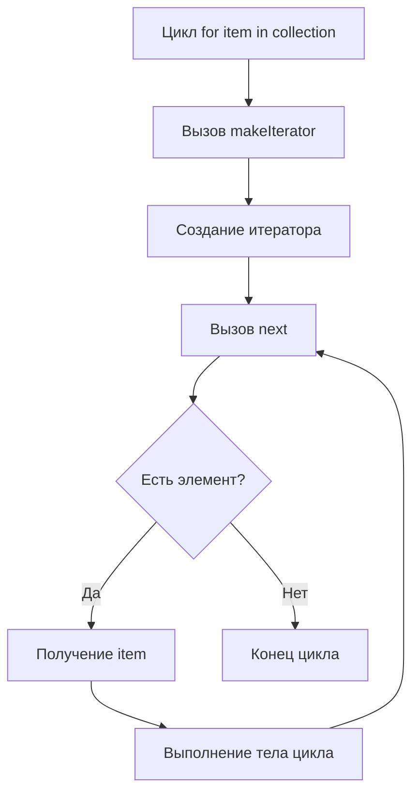

#algoritms #swift #standart_library
# 📘 Цикл `for-in` в Swift

`for-in` — это цикл в языке программирования [[Swift]], который используется для итерации по элементам коллекции или последовательности и выполнения определённых действий с каждым элементом.

### 🔹 Основной синтаксис

```swift
for item in collection {
    // выполнение действий с элементом item
}
```

Где:

- `item` — переменная, которая на каждой итерации принимает значение текущего элемента коллекции
    
- `collection` — коллекция (массив, [[Set]], [[Dictionary]], [[Range]], строка и т.д.), по которой происходит итерация
    

Цикл `for-in` выполняет указанный блок кода один раз для каждого элемента коллекции.

---

### 🔹 Примеры

#### 1. Итерация по массиву

```swift
let numbers = [1, 2, 3, 4, 5]

for number in numbers {
    print(number)
}
```

Вывод:

```
1
2
3
4
5
```

#### 2. Итерация по диапазону

```swift
for i in 1...5 {
    print(i)
}
```

Вывод:

```
1
2
3
4
5
```

#### 3. Итерация по словарю

```swift
let capitals = ["France": "Paris", "Japan": "Tokyo"]

for (country, city) in capitals {
    print("\(country): \(city)")
}
```

---

### 🔹 Под капотом: как работает `for-in`

1. **Коллекция превращается в итератор**
    
    Когда Swift выполняет `for-in`, компилятор вызывает у коллекции метод `makeIterator()`. Этот метод возвращает объект итератора, который умеет последовательно выдавать элементы через `next()`.
    
    Пример для массива:
    
    ```swift
    let numbers = [1, 2, 3]
    var iterator = numbers.makeIterator()
    while let number = iterator.next() {
        print(number)
    }
    ```
    
    Этот `while` делает то же самое, что `for-in`.
    
2. **Iterator удерживается циклом**
    
    Итератор (`ArrayIterator`, `DictionaryIterator` и т.д.) создаётся **один раз** перед началом цикла и хранится в памяти, пока цикл не завершится.
    
    - Для массива это `ArrayIterator<Element>`.
        
    - Итератор хранит **ссылку на исходную коллекцию** и текущую позицию.
        
    - Благодаря этому Swift может безопасно возвращать каждый элемент на каждой итерации, даже если коллекция большая.
        
3. **Value types и Copy-On-Write**
    
    - Если коллекция — это [[Array]], которая является [[value type]], Swift использует **[[Copy-On-Write]] (COW)**.
        
    - Итератор хранит **ссылку на внутренний буфер массива**, так что копирование данных не происходит, пока массив не изменится во время итерации.
        

---

### 🔹 Схематическое представление



- `makeIterator()` создаёт объект итератора
    
- Итератор выдаёт элементы по одному через `next()`
    
- `item` получает значение текущего элемента
    

---

### 🔹 Итог

- `for-in` — удобный и безопасный способ итерации по коллекциям и диапазонам
    
- Под капотом использует **итераторы**, которые хранят **ссылку на коллекцию** и текущую позицию
    
- Работает с **value types** через Copy-On-Write, так что большие массивы не копируются без необходимости
    
- Можно использовать с **Array, Set, Dictionary, [[String]], Range** и любыми коллекциями, поддерживающими [[Collection]]
    

---
