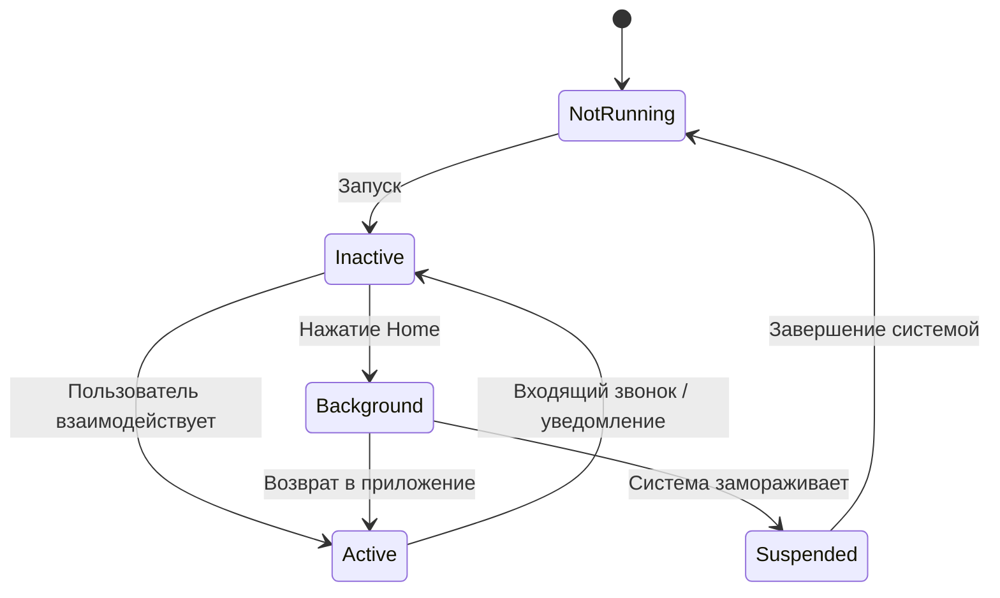

## 📘 Определение

**Application Life Cycle** — это **жизненный цикл [[iOS]]-приложения**, который описывает **последовательность состояний и событий**, через которые проходит приложение от запуска до завершения работы.  
Позволяет управлять **инициализацией, ресурсами, обработкой фоновых задач, уведомлениями и завершением работы**.  
Относится к **[[UIKit]] → Application Life Cycle**.

---

## 🔹 Основные состояния приложения

|Состояние|Описание|
|---|---|
|**Not Running**|Приложение не запущено.|
|**Inactive**|Приложение запущено, но **не принимает события**, например, при звонке.|
|**Active**|Приложение **в активном состоянии**, пользователь взаимодействует.|
|**Background**|Приложение **в фоне**, выполняет задачи, но не отображается на экране.|
|**Suspended**|Приложение **заморожено**, не выполняет код, память может быть очищена.|

---

## 🔹 Основные методы `UIApplicationDelegate`

|Метод|Когда вызывается|Цель|
|---|---|---|
|`application(_:didFinishLaunchingWithOptions:)`|При запуске|Инициализация приложения, настройка зависимостей|
|`applicationDidBecomeActive(_:)`|Приложение стало активным|Запуск анимаций, возобновление работы задач|
|`applicationWillResignActive(_:)`|Переход в неактивное состояние|Приостановка работы, сохранение состояния|
|`applicationDidEnterBackground(_:)`|Переход в фон|Сохранение данных, освобождение ресурсов|
|`applicationWillEnterForeground(_:)`|Переход из фона в активное состояние|Подготовка интерфейса, обновление данных|
|`applicationWillTerminate(_:)`|Завершение приложения|Финальные действия, сохранение данных|

---

## 🔹 Пример жизненного цикла в коде

```swift
import UIKit

@main
class AppDelegate: UIResponder, UIApplicationDelegate {

    func application(_ application: UIApplication,
                     didFinishLaunchingWithOptions launchOptions: [UIApplication.LaunchOptionsKey: Any]?) -> Bool {
        print("Приложение запущено")
        return true
    }

    func applicationDidBecomeActive(_ application: UIApplication) {
        print("Приложение активно")
    }

    func applicationWillResignActive(_ application: UIApplication) {
        print("Приложение временно неактивно")
    }

    func applicationDidEnterBackground(_ application: UIApplication) {
        print("Приложение ушло в фон")
    }

    func applicationWillEnterForeground(_ application: UIApplication) {
        print("Приложение возвращается из фона")
    }

    func applicationWillTerminate(_ application: UIApplication) {
        print("Приложение завершает работу")
    }
}
```

---

## 🔹 Схема жизненного цикла


