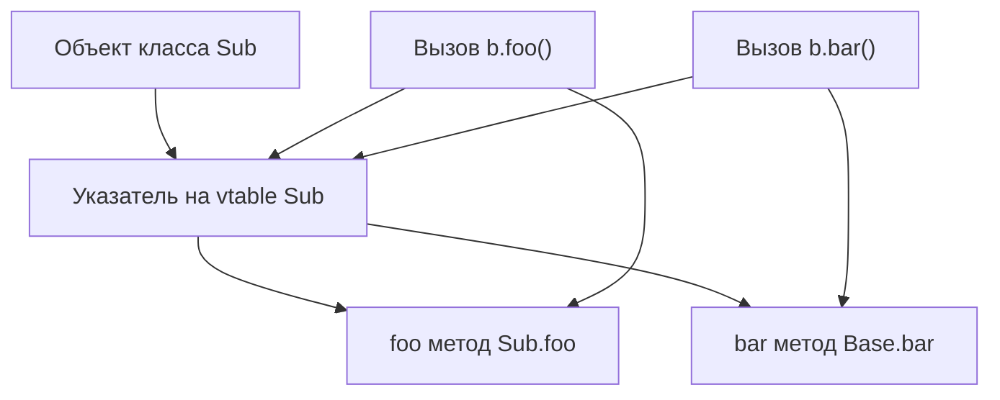

## 📘 Глубокое определение

**Vtable (виртуальная таблица)** — это структура данных, созданная **компилятором для каждого класса**, которая позволяет [[Swift]] (или другим языкам с объектной моделью) **вызывать методы во время выполнения, зная только базовый тип объекта**.

Каждый объект класса содержит **указатель на vtable своего класса**. Таблица хранит **указатели на функции**, которые соответствуют **виртуальным методам класса**.

**Главная идея:** вместо того, чтобы хранить для каждого объекта все методы, мы храним **одну таблицу на класс**, а объекты ссылаются на нее.

---

## 🔹 Внутренности vtable

1. **vtable хранится отдельно для каждого класса**, а не для объекта.
    
2. Каждый объект **содержит указатель на vtable**, который соответствует его реальному типу.
    
3. **Методы могут быть переопределены**, тогда указатель на метод в таблице меняется на переопределенный.
    
4. Методы, которые не переопределены, **указывают на реализацию базового класса**.
    
5. **Порядок методов в таблице фиксирован** и совпадает с порядком объявления методов в классе и его суперклассах.
    

---

### Пример на Swift

```swift
class Base {
    func foo() { print("Base foo") }
    func bar() { print("Base bar") }
}

class Sub: Base {
    override func foo() { print("Sub foo") }
}
```

**vtable для Sub:**

|Метод|Указатель (function pointer)|
|---|---|
|foo|Sub.foo()|
|bar|Base.bar()|

- `foo` переопределен → указатель на `Sub.foo`
    
- `bar` не переопределен → указатель на `Base.bar`
    

---

### 🔹 Схема работы vtable



---

### 🔹 Пошаговое объяснение работы

1. Мы создаем объект:
    

```swift
let b: Base = Sub()
```

2. Компилятор знает, что **тип переменной `b` — Base**, но объект реально **Sub**.
    
3. Когда мы вызываем `b.foo()`, Swift делает:
    
    - Смотрит **vtable Sub**, на которую указывает объект `b`.
        
    - Находит **указатель на метод `foo`**, который ссылается на `Sub.foo`.
        
    - Вызывает `Sub.foo()`.
        
4. Если вызвать `b.bar()`:
    
    - В vtable нет переопределения → используется **Base.bar**.
        

---

### 🔹 vtable и наследование

|Класс|Метод foo|Метод bar|Метод baz|
|---|---|---|---|
|Base|Base.foo|Base.bar|Base.baz|
|Sub|Sub.foo|Base.bar|Base.baz|
|SubSub|SubSub.foo|Base.bar|SubSub.baz|

- Каждый наследник **переопределяет указатели в таблице** только для методов, которые изменил.
    
- Методы, которые не изменены, **указывают на базовый метод**.
    

---

### 🔹 Vtable в памяти

**Объект Sub:**

|Память объекта|Содержимое|
|---|---|
|указатель на vtable|Sub vtable|
|свойства объекта|var1, var2|

**Sub vtable:**

|Метод|Указатель функции|
|---|---|
|foo|Sub.foo|
|bar|Base.bar|

- Все объекты Sub **разделяют одну vtable**, экономя память.
    
- Каждый объект хранит только **указатель на таблицу**, не копирует все методы.
    

---

### 🔹 Отличия vtable и статического диспетчинга

| Характеристика         | Статический ([[Compile-time Dispatch]]) | Динамический ([[Run-time Dispatch]] / vtable) |
| ---------------------- | --------------------------------------- | --------------------------------------------- |
| Когда выбирается метод | На этапе компиляции                     | Во время выполнения                           |
| Полиморфизм            | Нет                                     | Да                                            |
| Примеры в Swift        | final class, [[struct]], [[enum]]       | class, методы override                        |
