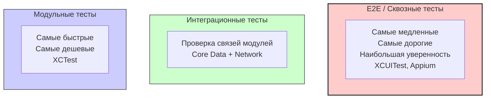
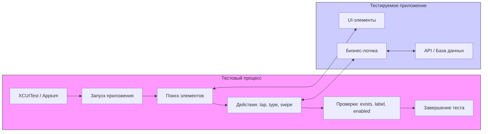

#testing #e2e #end-to-end #xcuitest #automation #quality #ios-testing #ui-testing

---
## E2E-тесты (End-to-End tests) — Сквозное тестирование

### Определение
**E2E-тесты (End-to-End testing)** — это методология тестирования программного обеспечения, которая проверяет работу приложения целиком, от начала до конца, имитируя поведение реального пользователя в среде, максимально приближенной к продакшну . В контексте [[iOS]]-разработки это означает запуск приложения на реальном устройстве или симуляторе и автоматизацию пользовательских сценариев: запуск, нажатие кнопок, ввод текста, свайпы, проверка результатов.

E2E-тесты находятся на самом верху **пирамиды тестирования**. Они самые медленные, самые дорогие в поддержке, но дают самую высокую уверенность в том, что критически важные пользовательские пути работают корректно во всем приложении, включая взаимодействие с серверной частью, базой данных и сторонними сервисами .

### Зачем это знать iOS-разработчику?
1.  **Проверка критических путей (Critical Paths):** Убедиться, что ключевые сценарии (онбординг, авторизация, покупка, выход) работают от начала до конца .
2.  **Регрессионное тестирование:** Автоматически проверять, что новый код не сломал существующий функционал .
3.  **Уверенность перед релизом:** E2E-тесты дают финальное "зеленое" окно перед выкаткой в App Store .
4.  **Тестирование интеграций:** Проверка взаимодействия с реальным [[API]], пуши-уведомлениями, платежными системами (в песочнице) .
5.  **Экономия времени:** Автоматизация рутинных проверок, которые раньше выполнялись QA-инженерами вручную .

---

### Пирамида тестирования и место E2E



**Соотношение по пирамиде Майка Кона:**
-   **Модульные тесты ([[Unit-test|Unit]]):** 70-80% — основа пирамиды, быстрые и дешевые.
-   **[[Интеграционные тесты]]:** 15-20% — проверка взаимодействия компонентов.
-   **E2E-тесты:** 5-10% — вершина пирамиды, небольшое количество самых важных тестов.

---

### E2E vs Интеграционные vs Модульные тесты

| Характеристика          | Модульные (Unit)     | Интеграционные                 | E2E                       |
| ----------------------- | -------------------- | ------------------------------ | ------------------------- |
| **Объект тестирования** | Один класс/метод     | Взаимодействие 2-3 модулей     | Все приложение целиком    |
| **Среда**               | Изолированная (моки) | Частично реальная              | Реальная (или staging)    |
| **Взаимодействие с UI** | Нет                  | Иногда                         | Да (через UI)             |
| **Зависимости**         | Все замоканы         | Реальные БД/[[API]] (тестовые) | Реальные БД/API (staging) |
| **Скорость**            | Миллисекунды         | Секунды                        | Десятки секунд / минуты   |
| **Стабильность**        | Высокая              | Средняя                        | Низкая (хрупкие)          |
| **Количество**          | Очень много          | Средне                         | Очень мало                |

---

### Архитектура E2E-тестов для iOS



### Инструменты для E2E-тестирования iOS

#### 1. [[XCUITest]] (Apple)
Встроенный во [[XCTest]] фреймворк для UI-тестирования. Тесты пишутся на Swift/Objective-C и запускаются в Xcode. Это основной и наиболее рекомендуемый инструмент для E2E-тестирования нативных iOS-приложений .

#### 2. Appium
Кроссплатформенный инструмент с открытым исходным кодом. Позволяет писать тесты на разных языках (Java, Python, JS). Использует WebDriver протокол и работает с XCUITest под капотом. Подходит для команд, которым нужны единые тесты для iOS и Android.

#### 3. Detox
Фреймворк для E2E-тестирования мобильных приложений, разработанный Wix. Написан на JavaScript и ориентирован на React Native, но может работать и с нативными приложениями. Отличается высокой стабильностью благодаря синхронизации с приложением.

#### 4. EarlGrey
Фреймворк от Google для UI-тестирования iOS. В отличие от XCUITest, работает внутри процесса приложения, что делает его очень быстрым, но менее изолированным.

---

### Примеры E2E-тестов на XCUITest

#### Уровень 0: Настройка Accessibility Identifiers

Прежде чем писать тесты, нужно подготовить приложение — добавить accessibility-идентификаторы к элементам, с которыми тесты будут взаимодействовать .

```swift
// В коде приложения
class LoginViewController: UIViewController {
    
    @IBOutlet weak var usernameTextField: UITextField!
    @IBOutlet weak var passwordTextField: UITextField!
    @IBOutlet weak var loginButton: UIButton!
    @IBOutlet weak var errorLabel: UILabel!
    
    override func viewDidLoad() {
        super.viewDidLoad()
        
        // Назначаем accessibility identifiers
        usernameTextField.accessibilityIdentifier = "usernameField"
        passwordTextField.accessibilityIdentifier = "passwordField"
        loginButton.accessibilityIdentifier = "loginButton"
        errorLabel.accessibilityIdentifier = "errorLabel"
    }
}
```

#### Уровень 1: Простейший E2E-тест (Проверка заголовка)

```swift
import XCTest

class SimpleE2ETests: XCTestCase {
    
    var app: XCUIApplication!
    
    override func setUpWithError() throws {
        continueAfterFailure = false // Останавливать тест при первом падении
        app = XCUIApplication()
        app.launch() // Запускаем приложение
    }
    
    override func tearDownWithError() throws {
        app.terminate() // Завершаем приложение после теста
    }
    
    func testWelcomeLabelExists() {
        let welcomeLabel = app.staticTexts["welcomeLabel"]
        XCTAssertTrue(welcomeLabel.exists)
        XCTAssertEqual(welcomeLabel.label, "Добро пожаловать!")
    }
}
```

#### Уровень 2: Полный E2E-сценарий авторизации

```swift
import XCTest

class LoginE2ETests: XCTestCase {
    
    var app: XCUIApplication!
    
    override func setUpWithError() throws {
        continueAfterFailure = false
        app = XCUIApplication()
        app.launch()
    }
    
    func testSuccessfulLogin() {
        // 1. Находим элементы
        let usernameField = app.textFields["usernameField"]
        let passwordField = app.secureTextFields["passwordField"]
        let loginButton = app.buttons["loginButton"]
        
        // 2. Взаимодействуем
        usernameField.tap()
        usernameField.typeText("testuser@example.com")
        
        passwordField.tap()
        passwordField.typeText("ValidPass123!")
        
        loginButton.tap()
        
        // 3. Ждем перехода на главный экран
        let welcomeMessage = app.staticTexts["welcomeMessage"]
        XCTAssertTrue(welcomeMessage.waitForExistence(timeout: 5))
        XCTAssertEqual(welcomeMessage.label, "Привет, testuser!")
        
        // 4. Проверяем наличие элементов на главном экране
        let profileButton = app.buttons["profileButton"]
        let catalogButton = app.buttons["catalogButton"]
        
        XCTAssertTrue(profileButton.exists)
        XCTAssertTrue(catalogButton.exists)
    }
    
    func testFailedLogin() {
        let usernameField = app.textFields["usernameField"]
        let passwordField = app.secureTextFields["passwordField"]
        let loginButton = app.buttons["loginButton"]
        let errorLabel = app.staticTexts["errorLabel"]
        
        usernameField.tap()
        usernameField.typeText("wrong@example.com")
        
        passwordField.tap()
        passwordField.typeText("wrong")
        
        loginButton.tap()
        
        // Ждем появления сообщения об ошибке
        XCTAssertTrue(errorLabel.waitForExistence(timeout: 3))
        XCTAssertEqual(errorLabel.label, "Неверный email или пароль")
        
        // Проверяем, что остались на экране логина
        XCTAssertTrue(loginButton.exists)
    }
}
```

#### Уровень 3: E2E-тест с таблицей и навигацией

```swift
import XCTest

class CatalogE2ETests: XCTestCase {
    
    var app: XCUIApplication!
    
    override func setUpWithError() throws {
        continueAfterFailure = false
        app = XCUIApplication()
        app.launch()
        
        // Предусловие: авторизация
        loginIfNeeded()
    }
    
    private func loginIfNeeded() {
        let loginButton = app.buttons["loginButton"]
        
        // Если мы на экране логина, выполняем вход
        if loginButton.exists {
            let usernameField = app.textFields["usernameField"]
            let passwordField = app.secureTextFields["passwordField"]
            
            usernameField.tap()
            usernameField.typeText("test@example.com")
            
            passwordField.tap()
            passwordField.typeText("password123")
            
            loginButton.tap()
            
            // Ждем завершения входа
            _ = app.staticTexts["welcomeMessage"].waitForExistence(timeout: 5)
        }
    }
    
    func testSelectItemFromCatalog() {
        // Переход в каталог
        app.buttons["catalogButton"].tap()
        
        // Ждем загрузки таблицы
        let catalogTable = app.tables["catalogTable"]
        XCTAssertTrue(catalogTable.waitForExistence(timeout: 5))
        
        // Скроллим до нужного элемента
        let targetCell = catalogTable.cells.staticTexts["Товар #10"]
        
        while !targetCell.exists {
            catalogTable.swipeUp()
        }
        
        // Тапаем на ячейку
        targetCell.tap()
        
        // Проверяем переход на детальный экран
        let detailTitle = app.staticTexts["detailTitle"]
        XCTAssertTrue(detailTitle.waitForExistence(timeout: 3))
        XCTAssertEqual(detailTitle.label, "Товар #10")
        
        // Проверяем наличие кнопки "Купить"
        let buyButton = app.buttons["buyButton"]
        XCTAssertTrue(buyButton.exists)
        XCTAssertTrue(buyButton.isEnabled)
    }
}
```

#### Уровень 4: E2E-тест с обработкой алертов и системных диалогов

```swift
import XCTest

class PermissionE2ETests: XCTestCase {
    
    var app: XCUIApplication!
    
    override func setUpWithError() throws {
        continueAfterFailure = false
        
        // Настройка обработчика системных алертов
        let springboard = XCUIApplication(bundleIdentifier: "com.apple.springboard")
        
        // Обработчик для разрешения уведомлений
        addUIInterruptionMonitor(withDescription: "System Alert") { alert -> Bool in
            if alert.buttons["Allow"].exists {
                alert.buttons["Allow"].tap()
                return true
            }
            if alert.buttons["OK"].exists {
                alert.buttons["OK"].tap()
                return true
            }
            return false
        }
        
        app = XCUIApplication()
        app.launch()
    }
    
    func testRequestNotificationPermission() {
        // Переходим на экран настроек
        app.buttons["settingsButton"].tap()
        
        // Включаем уведомления
        let notificationSwitch = app.switches["notificationSwitch"]
        notificationSwitch.tap()
        
        // Триггерим системный алерт
        app.tap() // Тап в пустое место вызывает обработчик перехвата
        
        // Проверяем, что переключатель теперь включен
        // (после разрешения или запрета)
        XCTAssertEqual(notificationSwitch.value as? String, "1")
    }
    
    func testPhotoLibraryPermission() {
        app.buttons["profileButton"].tap()
        app.buttons["changePhotoButton"].tap()
        
        // Триггерим системный пикер
        app.tap()
        
        // Взаимодействуем с системным пикером фото
        let springboard = XCUIApplication(bundleIdentifier: "com.apple.springboard")
        
        // Выбираем первое фото
        let firstPhoto = springboard.collectionViews.cells.element(boundBy: 0)
        if firstPhoto.waitForExistence(timeout: 5) {
            firstPhoto.tap()
        }
        
        // Проверяем, что фото загрузилось
        let profileImage = app.images["profileImage"]
        XCTAssertTrue(profileImage.waitForExistence(timeout: 3))
    }
}
```

#### Уровень 5: E2E-тест с проверкой данных из сети

```swift
import XCTest

class NetworkE2ETests: XCTestCase {
    
    var app: XCUIApplication!
    
    override func setUpWithError() throws {
        continueAfterFailure = false
        app = XCUIApplication()
        
        // Можно передать аргументы для переключения на тестовый сервер
        app.launchArguments = ["-useTestServer", "YES"]
        app.launch()
    }
    
    func testLoadAndDisplayUsers() {
        // Переходим на экран пользователей
        app.buttons["usersButton"].tap()
        
        // Ждем появления индикатора загрузки
        let spinner = app.activityIndicators["loadingSpinner"]
        XCTAssertTrue(spinner.exists)
        
        // Ждем загрузки таблицы
        let usersTable = app.tables["usersTable"]
        XCTAssertTrue(usersTable.waitForExistence(timeout: 10))
        
        // Проверяем, что загрузились данные
        XCTAssertGreaterThan(usersTable.cells.count, 0)
        
        // Проверяем первого пользователя
        let firstCell = usersTable.cells.element(boundBy: 0)
        let nameLabel = firstCell.staticTexts["userNameLabel"]
        let emailLabel = firstCell.staticTexts["userEmailLabel"]
        
        XCTAssertTrue(nameLabel.exists)
        XCTAssertTrue(emailLabel.exists)
        
        // Запоминаем имя для дальнейшей проверки
        let userName = nameLabel.label
        
        // Переходим в детали
        firstCell.tap()
        
        // Проверяем детальный экран
        let detailNameLabel = app.staticTexts["detailUserNameLabel"]
        XCTAssertTrue(detailNameLabel.waitForExistence(timeout: 3))
        XCTAssertEqual(detailNameLabel.label, userName)
    }
    
    func testPullToRefresh() {
        app.buttons["usersButton"].tap()
        
        let usersTable = app.tables["usersTable"]
        XCTAssertTrue(usersTable.waitForExistence(timeout: 5))
        
        let initialCellCount = usersTable.cells.count
        
        // Делаем Pull-to-Refresh
        let firstCell = usersTable.cells.element(boundBy: 0)
        let start = firstCell.coordinate(withNormalizedOffset: CGVector(dx: 0.5, dy: 0.1))
        let finish = firstCell.coordinate(withNormalizedOffset: CGVector(dx: 0.5, dy: 0.8))
        start.press(forDuration: 0.1, thenDragTo: finish)
        
        // Ждем появления индикатора и его исчезновения
        let spinner = app.activityIndicators["loadingSpinner"]
        XCTAssertTrue(spinner.waitForExistence(timeout: 2))
        XCTAssertFalse(spinner.waitForExistence(timeout: 5)) // Ждем исчезновения
        
        // Проверяем, что данные обновились (или остались)
        XCTAssertGreaterThanOrEqual(usersTable.cells.count, initialCellCount)
    }
}
```

#### Уровень 6: Page Object паттерн для E2E-тестов

```swift
import XCTest

// Page Object для экрана логина
class LoginPage {
    let app: XCUIApplication
    
    init(app: XCUIApplication) {
        self.app = app
    }
    
    var usernameField: XCUIElement { app.textFields["usernameField"] }
    var passwordField: XCUIElement { app.secureTextFields["passwordField"] }
    var loginButton: XCUIElement { app.buttons["loginButton"] }
    var errorLabel: XCUIElement { app.staticTexts["errorLabel"] }
    
    @discardableResult
    func login(username: String, password: String) -> Self {
        usernameField.tap()
        usernameField.typeText(username)
        
        passwordField.tap()
        passwordField.typeText(password)
        
        loginButton.tap()
        return self
    }
    
    func waitForError(timeout: TimeInterval = 3) -> Bool {
        errorLabel.waitForExistence(timeout: timeout)
    }
}

// Page Object для главного экрана
class MainPage {
    let app: XCUIApplication
    
    init(app: XCUIApplication) {
        self.app = app
    }
    
    var welcomeLabel: XCUIElement { app.staticTexts["welcomeMessage"] }
    var catalogButton: XCUIElement { app.buttons["catalogButton"] }
    var profileButton: XCUIElement { app.buttons["profileButton"] }
    
    func waitForLoad(timeout: TimeInterval = 5) -> Bool {
        welcomeLabel.waitForExistence(timeout: timeout)
    }
}

// Тесты с использованием Page Objects
class PageObjectE2ETests: XCTestCase {
    
    var app: XCUIApplication!
    var loginPage: LoginPage!
    var mainPage: MainPage!
    
    override func setUpWithError() throws {
        continueAfterFailure = false
        app = XCUIApplication()
        loginPage = LoginPage(app: app)
        mainPage = MainPage(app: app)
        app.launch()
    }
    
    func testLoginFlow() {
        loginPage.login(username: "user@example.com", password: "pass123")
        
        XCTAssertTrue(mainPage.waitForLoad())
        XCTAssertTrue(mainPage.welcomeLabel.label.contains("user"))
    }
    
    func testCatalogFlow() {
        loginPage.login(username: "user@example.com", password: "pass123")
        XCTAssertTrue(mainPage.waitForLoad())
        
        mainPage.catalogButton.tap()
        
        // Проверки каталога...
    }
}
```

#### Уровень 7: Скриншоты для отчетности

```swift
import XCTest

class ScreenshotE2ETests: XCTestCase {
    
    var app: XCUIApplication!
    
    override func setUpWithError() throws {
        continueAfterFailure = false
        app = XCUIApplication()
        app.launch()
    }
    
    func testTakeScreenshots() {
        // Скриншот экрана логина
        let loginScreenshot = app.screenshot()
        let loginAttachment = XCTAttachment(screenshot: loginScreenshot)
        loginAttachment.name = "Login Screen"
        loginAttachment.lifetime = .keepAlways
        add(loginAttachment)
        
        // Логинимся
        app.textFields["usernameField"].tap()
        app.textFields["usernameField"].typeText("user@example.com")
        app.secureTextFields["passwordField"].tap()
        app.secureTextFields["passwordField"].typeText("password123")
        app.buttons["loginButton"].tap()
        
        // Ждем загрузки главного экрана
        _ = app.staticTexts["welcomeMessage"].waitForExistence(timeout: 5)
        
        // Скриншот главного экрана
        let mainScreenshot = app.screenshot()
        let mainAttachment = XCTAttachment(screenshot: mainScreenshot)
        mainAttachment.name = "Main Screen"
        mainAttachment.lifetime = .keepAlways
        add(mainAttachment)
    }
}
```

#### Уровень 8: Запуск тестов с разными локалями и настройками

```swift
import XCTest

class LocalizedE2ETests: XCTestCase {
    
    func testLoginLocalized() {
        let app = XCUIApplication()
        
        // Тест для русской локали
        app.launchArguments = ["-AppleLanguages", "(ru)", "-AppleLocale", "ru_RU"]
        app.launch()
        
        testLoginFlow(on: app)
        
        app.terminate()
        
        // Тест для английской локали
        app.launchArguments = ["-AppleLanguages", "(en)", "-AppleLocale", "en_US"]
        app.launch()
        
        testLoginFlow(on: app)
    }
    
    private func testLoginFlow(on app: XCUIApplication) {
        let usernameField = app.textFields["usernameField"]
        let passwordField = app.secureTextFields["passwordField"]
        let loginButton = app.buttons["loginButton"]
        let welcomeMessage = app.staticTexts["welcomeMessage"]
        
        usernameField.tap()
        usernameField.typeText("user@example.com")
        
        passwordField.tap()
        passwordField.typeText("password123")
        
        loginButton.tap()
        
        XCTAssertTrue(welcomeMessage.waitForExistence(timeout: 5))
    }
}
```

#### Уровень 9: Обработка динамических данных

```swift
import XCTest

class DynamicDataE2ETests: XCTestCase {
    
    var app: XCUIApplication!
    
    override func setUpWithError() throws {
        continueAfterFailure = false
        app = XCUIApplication()
        app.launch()
    }
    
    func testCreateNewItem() {
        // Логинимся
        login()
        
        // Переходим к списку
        app.buttons["itemsButton"].tap()
        
        let itemsTable = app.tables["itemsTable"]
        let initialCount = itemsTable.cells.count
        
        // Жмем "Добавить"
        app.buttons["addButton"].tap()
        
        // Заполняем форму
        let titleField = app.textFields["titleField"]
        titleField.tap()
        titleField.typeText("Новый элемент \(Date().timeIntervalSince1970)")
        
        app.buttons["saveButton"].tap()
        
        // Ждем возврата к списку
        XCTAssertTrue(itemsTable.waitForExistence(timeout: 3))
        
        // Проверяем, что количество увеличилось
        let newCount = itemsTable.cells.count
        XCTAssertEqual(newCount, initialCount + 1)
        
        // Ищем созданный элемент (может быть не вверху)
        let createdCell = itemsTable.cells.containing(.staticText, identifier: "Новый элемент").element
        XCTAssertTrue(createdCell.exists)
    }
    
    private func login() {
        let loginButton = app.buttons["loginButton"]
        
        if loginButton.exists {
            app.textFields["usernameField"].tap()
            app.textFields["usernameField"].typeText("test@example.com")
            
            app.secureTextFields["passwordField"].tap()
            app.secureTextFields["passwordField"].typeText("password123")
            
            loginButton.tap()
            
            _ = app.staticTexts["welcomeMessage"].waitForExistence(timeout: 5)
        }
    }
}
```

#### Уровень 10: E2E-тест с платежом (песочница)

```swift
import XCTest

class PaymentE2ETests: XCTestCase {
    
    var app: XCUIApplication!
    
    override func setUpWithError() throws {
        continueAfterFailure = false
        app = XCUIApplication()
        app.launch()
    }
    
    func testInAppPurchase() {
        // Логинимся
        login()
        
        // Переходим в магазин
        app.buttons["shopButton"].tap()
        
        // Выбираем товар
        let productCell = app.tables["productsTable"].cells.element(boundBy: 0)
        productCell.tap()
        
        // Жмем "Купить"
        app.buttons["buyButton"].tap()
        
        // Обработка системного диалога покупки
        let springboard = XCUIApplication(bundleIdentifier: "com.apple.springboard")
        
        // В песочнице появляется диалог подтверждения
        let buyButton = springboard.buttons["Buy"].firstMatch
        if buyButton.waitForExistence(timeout: 5) {
            buyButton.tap()
        }
        
        // Ждем подтверждения покупки в приложении
        let successMessage = app.staticTexts["purchaseSuccessMessage"]
        XCTAssertTrue(successMessage.waitForExistence(timeout: 10))
    }
    
    private func login() {
        // Логика логина
    }
}
```

---

### Интеграция в [[CI]]/[[CD]]

```yaml
# Пример для GitHub Actions
name: E2E Tests

on:
  pull_request:
    branches: [ main ]

jobs:
  e2e-tests:
    runs-on: macos-latest
    
    steps:
    - uses: actions/checkout@v3
    
    - name: Select Xcode
      run: sudo xcode-select -s /Applications/Xcode_15.2.app
      
    - name: Build for testing
      run: xcodebuild build-for-testing -scheme MyApp -destination "platform=iOS Simulator,name=iPhone 15"
      
    - name: Run E2E tests
      run: xcodebuild test-without-building -scheme MyApp -destination "platform=iOS Simulator,name=iPhone 15" -testPlan E2ETests
      
    - name: Upload test results
      if: always()
      uses: actions/upload-artifact@v3
      with:
        name: test-results
        path: ~/Library/Developer/Xcode/DerivedData/**/Logs/Test
```

---

### Лучшие практики для E2E-тестов

#### 1. **Тестируйте только критически важные пути**
Не пытайтесь покрыть E2E-тестами все. Выбирайте самые важные пользовательские сценарии (smoke tests) .

#### 2. **Используйте уникальные accessibility identifiers**
Никогда не полагайтесь на текстовые метки. Используйте `accessibilityIdentifier` для стабильного поиска элементов .

#### 3. **Изолируйте тесты**
Каждый тест должен запускаться с чистого состояния приложения. Используйте `setUp` и `tearDown` для сброса состояния.

#### 4. **Используйте ожидания, а не sleep**
Никогда не используйте `sleep()`. Всегда используйте `waitForExistence(timeout:)` или другие ожидания .

```swift
// Плохо
sleep(2)
button.tap()

// Хорошо
XCTAssertTrue(button.waitForExistence(timeout: 2))
button.tap()
```

#### 5. **Параметризуйте окружение**
Используйте launch arguments для переключения между тестовым и продакшн-сервером .

#### 6. **Поддерживайте тесты в чистоте**
E2E-тесты требуют постоянной поддержки. Удаляйте неактуальные тесты и рефакторите.

#### 7. **Используйте Page Object паттерн**
Изолируйте логику взаимодействия с экранами в отдельные классы (Page Objects). Это делает тесты чище и легче поддерживать .

#### 8. **Добавляйте скриншоты при падениях**
Автоматически добавляйте скриншоты в отчеты, чтобы видеть состояние приложения в момент ошибки .

#### 9. **Стабилизируйте тесты**
E2E-тесты часто бывают нестабильными (flaky). Боритесь с этим, используя правильные ожидания и изоляцию.

### Итог
**E2E-тесты** — это вершина пирамиды тестирования, дающая наибольшую уверенность в работоспособности приложения. Для iOS-разработки основным инструментом является **XCUITest**, интегрированный в Xcode. Правильно написанные E2E-тесты позволяют:

1.  **Автоматизировать проверку** критических пользовательских сценариев.
2.  **Обнаруживать регрессию** на ранних этапах.
3.  **Экономить время** QA-инженеров.
4.  **Повышать качество** и надежность релизов.

Ключевые навыки: написание стабильных и надежных UI-тестов, использование accessibility-идентификаторов, работа с ожиданиями, обработка системных диалогов, структурирование кода через Page Object, интеграция в CI/CD.