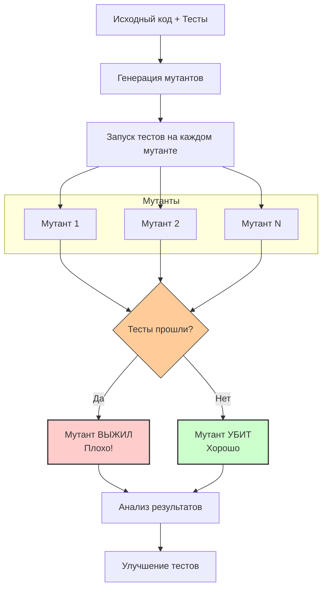

#testing #mutation-testing #quality #code-coverage #advanced-testing #swift #xctest

---

## Mutation-тестирование (Мутационное тестирование)

### Определение
**Mutation-тестирование** — это метод оценки качества тестов, который заключается во внесении небольших преднамеренных изменений (мутаций) в исходный код программы и последующем запуске тестов . Если тесты проходят успешно после внесения мутации, это означает, что они не смогли обнаружить изменение — мутация "выжила". Если тесты падают, мутация "убита".

Основная идея: хорошие тесты должны обнаруживать изменения в коде. Если тесты не реагируют на изменение логики, значит, они недостаточно качественны или проверяют не то, что нужно .

### Зачем это знать iOS-разработчику?
1.  **Оценка качества тестов:** Показывает реальную эффективность тестов, а не просто процент покрытия кода .
2.  **Выявление "слепых зон":** Помогает найти участки кода, которые не тестируются должным образом, даже если они формально покрыты .
3.  **Улучшение тестов:** Дает конкретные рекомендации, какие тесты нужно добавить или улучшить .
4.  **Дополнение к code coverage:** Code coverage показывает, какой код выполняется, а мутационное тестирование — насколько хорошо он проверяется .
5.  **Повышение качества:** В долгосрочной перспективе приводит к созданию более надежного и менее подверженного ошибкам кода .

---

### Как это работает: Процесс мутационного тестирования



**Пошаговый процесс:**

1.  **Анализ исходного кода:** Инструмент анализирует исходный код проекта.
2.  **Генерация мутантов:** Создаются мутанты — копии исходного кода с небольшими изменениями (мутациями). Каждый мутант содержит ровно одно изменение.
3.  **Запуск тестов:** Для каждого мутанта запускается тестовый набор.
4.  **Анализ результатов:**
    -   Если тесты **падают**, мутант считается **убитым**. Это хорошо — тесты сработали.
    -   Если тесты **проходят**, мутант считается **выжившим**. Это плохо — тесты не заметили изменение.
5.  **Отчет:** Формируется отчет с информацией о выживших мутантах и "мутационном score" (процент убитых мутантов).

---

### Типы мутаций (операторов)

Мутации имитируют типичные ошибки программистов. Вот основные типы мутаций, применяемых в Swift:

| Категория | Исходный код | Мутированный код | Что имитирует |
|-----------|--------------|------------------|---------------|
| **Арифметические операторы** | `a + b` | `a - b` | Ошибка в операторе |
| | `a * b` | `a / b` | |
| **Логические операторы** | `a && b` | `a \|\| b` | Ошибка в условии |
| | `a \|\| b` | `a && b` | |
| **Операторы сравнения** | `a > b` | `a >= b` | Ошибка в граничных условиях |
| | `a == b` | `a != b` | |
| | `a <= b` | `a < b` | |
| **Условные операторы** | `if (x > 0) { ... }` | Удаление блока `if` | Пропуск проверки условия |
| | `if (x > 0) { ... }` | Удаление условия (`if true`) | |
| **Возвращаемые значения** | `return true` | `return false` | Ошибка в логике возврата |
| | `return value` | `return nil` | |
| **Удаление вызовов** | `process(data)` | (вызов удален) | Пропуск важного действия |
| **Числовые константы** | `let max = 100` | `let max = 0` | Неправильная инициализация |
| | `let min = 0` | `let min = 100` | |

---

### Пример на Swift

Рассмотрим простую функцию и тесты к ней.

```swift
// Код продукта
func isEven(number: Int) -> Bool {
    return number % 2 == 0
}

// Тесты
import XCTest

class MathTests: XCTestCase {
    func testIsEven() {
        XCTAssertTrue(isEven(number: 2))
        XCTAssertTrue(isEven(number: 0))
        XCTAssertFalse(isEven(number: 3))
    }
}
```

Запускаем мутационное тестирование. Инструмент создает мутантов:

**Мутант 1:** Замена оператора `==` на `!=`
```swift
func isEven(number: Int) -> Bool {
    return number % 2 != 0 // Мутация: теперь проверяет на нечетность
}
```
Запускаем тесты:
- `isEven(number: 2)` ожидает `true`, получает `false` → **тест падает**
- Мутант **УБИТ** ✅

**Мутант 2:** Изменение числовой константы
```swift
func isEven(number: Int) -> Bool {
    return number % 1 == 0 // Мутация: вместо 2 стало 1
}
```
Запускаем тесты:
- Все тесты проходят (любое число делится на 1 без остатка) → **тесты проходят**
- Мутант **ВЫЖИЛ** ❌

**Вывод:** Наши тесты не проверяют случай с делением на 1. Нужно добавить тест для граничного случая:

```swift
func testIsEvenWithEdgeCases() {
    XCTAssertTrue(isEven(number: 2))
    XCTAssertTrue(isEven(number: 0))
    XCTAssertFalse(isEven(number: 3))
    // Добавляем тест на граничное условие
    XCTAssertFalse(isEven(number: 1)) // Проверяем, что 1 не четное
}
```

Теперь мутант 2 будет убит, потому что тест с `number: 1` упадет (1 % 1 == 0, но мы ожидаем false).

---

### Code Coverage vs Mutation Testing

| Характеристика | Code Coverage | Mutation Testing |
|----------------|---------------|------------------|
| **Что измеряет** | Какой код был выполнен | Насколько хорошо код протестирован |
| **Что показывает** | Строки, выполненные тестами | Способность тестов обнаруживать ошибки |
| **Ложные срабатывания** | 100% покрытие не гарантирует качество | Мутанты могут быть эквивалентными |
| **Скорость** | Быстро | Очень медленно |
| **Ресурсоемкость** | Низкая | Высокая |
| **Ценность** | Базовая метрика | Глубокая оценка качества |

**Важно:** Высокий процент покрытия кода не гарантирует, что тесты качественные. Мутационное тестирование помогает выявить "мертвые" или бесполезные тесты .

---

### Инструменты для Swift

#### 1. **Muter**
Бесплатный инструмент с открытым исходным кодом, написанный на [[Swift]]. Поддерживает [[XCTest]] и интеграцию с [[Xcode]].

```bash
# Установка через Homebrew
brew install muter

# Запуск
muter
```

**Конфигурация `muter.conf.json`:**
```json
{
    "executable": "/usr/bin/xcodebuild",
    "arguments": [
        "-project", "MyApp.xcodeproj",
        "-scheme", "MyApp",
        "-sdk", "iphonesimulator",
        "-destination", "platform=iOS Simulator,name=iPhone 15"
    ],
    "excludePaths": ["Pods", "Carthage"],
    "testPlan": "MyAppTests"
}
```

#### 2. **Stryker Mutator**
Популярный кроссплатформенный инструмент, поддерживающий Swift через плагин.

```bash
npm install --save-dev @stryker-mutator/core @stryker-mutator/xctest-runner
```

**Конфигурация `stryker.conf.js`:**
```javascript
module.exports = {
    mutator: "swift",
    packageManager: "npm",
    reporters: ["html", "clear-text", "progress"],
    testRunner: "xctest",
    testRunner_comment": "Learn more about the xctest plugin here: https://github.com/stryker-mutator/stryker-swift"
};
```

---

### Интеграция в [[CI]]/[[CD]]

Мутационное тестирование — ресурсоемкий процесс. Его не запускают на каждый коммит. Обычно используется один из подходов:

1.  **Ночные сборки (Nightly):** Запуск раз в сутки для выявления проблемных мест.
2.  **По расписанию:** Раз в неделю или перед крупными релизами.
3.  **На измененные файлы:** Запуск только на файлы, измененные в PR (если инструмент поддерживает).

```yaml
# Пример для GitHub Actions (ночной запуск)
name: Mutation Testing

on:
  schedule:
    - cron: '0 2 * * *'  # Каждый день в 2 часа ночи
  workflow_dispatch: # Возможность ручного запуска

jobs:
  mutation-test:
    runs-on: macos-latest
    steps:
      - uses: actions/checkout@v3
      - name: Install Muter
        run: brew install muter
      - name: Run Mutation Tests
        run: muter --output-json report.json
      - name: Upload Report
        uses: actions/upload-artifact@v3
        with:
          name: mutation-report
          path: report.json
```

---

### Преимущества Mutation-тестирования

1.  **Объективная оценка качества тестов:** Показывает реальную эффективность тестового набора .
2.  **Выявление слабых мест:** Помогает найти код, который плохо протестирован, даже при высоком покрытии .
3.  **Улучшение дизайна тестов:** Стимулирует писать более конкретные и проверяющие тесты .
4.  **Обнаружение эквивалентных мутаций:** Помогает выявить избыточный код (хотя это сложно) .
5.  **Долгосрочное повышение качества:** Систематическое применение приводит к значительному улучшению тестовой базы .

### Недостатки и ограничения

1.  **Высокая ресурсоемкость:** Запуск тестов для каждого мутанта требует огромных вычислительных мощностей и времени .
2.  **Эквивалентные мутанты:** Некоторые мутации не меняют поведение программы (например, изменение `a + b` на `b + a` в коммутативной операции). Такие мутанты всегда выживают, но не указывают на проблему .
3.  **Ложные срабатывания:** Тесты могут падать по причинам, не связанным с мутацией (например, из-за нестабильности тестов) .
4.  **Сложность настройки:** Требует дополнительной конфигурации и времени на интеграцию .
5.  **Не для всех проектов:** Для маленьких проектов окупаемость может быть низкой .

---

### Best Practices

1.  **Запускайте на критически важном коде:** Не пытайтесь покрыть все приложение сразу. Начните с бизнес-логики и core-функций.
2.  **Анализируйте выжившие мутанты:** Не все выжившие мутанты одинаково важны. Сосредоточьтесь на тех, которые указывают на реальные проблемы.
3.  **Интегрируйте в CI (но осторожно):** Запускайте ночью или по расписанию, не блокируя PR.
4.  **Комбинируйте с code coverage:** Используйте оба подхода для полной картины.
5.  **Постепенное внедрение:** Начните с одного модуля, затем расширяйте.
6.  **Автоматизируйте анализ:** Настройте отправку отчетов разработчикам.

### Итог
**Mutation-тестирование** — это мощный, но ресурсоемкий метод оценки качества тестов, который идет дальше простого подсчета покрытия кода. Для iOS-разработки существуют инструменты (Muter, Stryker), позволяющие внедрить этот подход в процесс разработки. Несмотря на высокую стоимость выполнения, мутационное тестирование дает уникальную возможность увидеть реальные слабые места в тестах и значительно повысить качество и надежность приложения в долгосрочной перспективе.