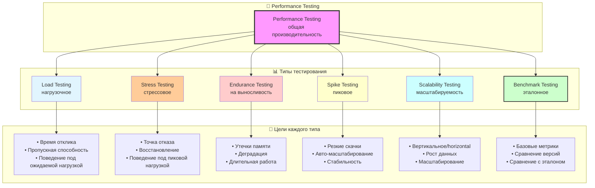

#testing #performance #benchmark #xctest #metrics #optimization #ios-testing #profiling

---
## Performance tests — Тестирование производительности

### Определение
**Performance testing (тестирование производительности)** — это процесс определения скорости, отзывчивости и стабильности приложения при определенной рабочей нагрузке . В контексте [[iOS]]-разработки это измерение таких показателей, как время запуска, плавность анимаций (FPS), использование памяти (RAM), нагрузка на процессор ([[CPU]]), энергопотребление (батарея) и скорость выполнения отдельных операций .

Цель тестирования производительности — не найти функциональные ошибки, а убедиться, что приложение соответствует нефункциональным требованиям по скорости и эффективности, обеспечивая качественный пользовательский опыт.

### Зачем это знать iOS-разработчику?
1.  **Плавность интерфейса:** Обеспечение стабильных 60/120 FPS (кадров в секунду) для комфортной работы пользователя.
2.  **Энергоэффективность:** Предотвращение быстрой разрядки батареи из-за неэффективного кода.
3.  **Управление памятью:** Выявление утечек памяти (memory leaks) и предотвращение вылетов приложения из-за нехватки памяти.
4.  **Быстрый запуск:** Соблюдение требований Apple к времени запуска приложения.
5.  **Масштабирование:** Проверка, как приложение ведет себя с большими объемами данных (например, длинные списки, большие изображения).
6.  **Регрессия производительности:** Предотвращение ситуаций, когда новый код замедляет работу ранее быстрых функций.

---

### Ключевые метрики производительности

| Метрика | Единица измерения | Описание |
|---------|-------------------|----------|
| **FPS (Frames Per Second)** | Кадры/сек | Плавность анимаций. Целевое значение — 60 (120 для ProMotion). |
| **CPU Usage** | % | Загрузка процессора. Высокий процент → быстрый разряд батареи. |
| **Memory Usage (Footprint)** | MB | Количество оперативной памяти, используемой приложением. |
| **Launch Time** | секунды / мс | Время от тапа на иконку до появления первого кадра. |
| **Time to Interactive** | секунды / мс | Время, через которое пользователь может взаимодействовать с UI. |
| **Network Latency** | мс | Задержка сетевых запросов. |
| **Disk I/O Speed** | MB/s | Скорость чтения/записи в файловую систему. |
| **Battery Impact** | mAh / % | Влияние на заряд батареи. |
| **App Size** | MB | Размер установленного приложения (IPA). |

---

### Виды тестирования производительности



#### 1. **Load Testing (Нагрузочное тестирование)**
Проверка поведения приложения под ожидаемой нагрузкой (например, одновременная загрузка 1000 элементов в таблицу).

#### 2. **Stress Testing (Стресс-тестирование)**
Проверка поведения при нагрузке, превышающей ожидаемую (например, загрузка 10000 изображений в память).

#### 3. **Endurance Testing (Тестирование на выносливость)**
Длительная работа приложения для выявления утечек памяти или деградации производительности со временем.

#### 4. **Benchmark Testing (Эталонное тестирование)**
Измерение производительности отдельных функций и сравнение с эталонными значениями (baseline) для выявления регрессий.

#### 5. **Scalability Testing (Тестирование масштабируемости)**
Проверка, как приложение справляется с ростом объема данных (например, [[Core Data]] с миллионом записей).

---

### Инструменты для тестирования производительности iOS

#### 1. **XCTest Performance (Measure API)**
Встроенный во [[XCTest]] [[API]] для измерения производительности отдельных блоков кода. Позволяет задавать baseline и автоматически выявлять регрессии .

```swift
func testPerformanceExample() {
    measure {
        // Код, производительность которого измеряем
        sortLargeArray()
    }
}
```

#### 2. **Xcode Instruments**
Мощный графический инструмент для профилирования и отладки производительности. Включает множество шаблонов:
- **Time Profiler** — анализ загрузки CPU.
- **Allocations** — отслеживание выделения памяти.
- **Leaks** — поиск утечек памяти.
- **Core Animation** — анализ FPS и работы графики.
- **Energy Log** — анализ энергопотребления.

#### 3. **MetricKit**
Фреймворк для сбора метрик производительности с устройств реальных пользователей. Позволяет получать анонимные данные о запуске приложения, падениях, использовании памяти и CPU .

#### 4. **os_signpost API**
API для кастомной инструментации кода. Позволяет отмечать важные участки и видеть их в Instruments.

---

### Примеры тестов производительности

#### Уровень 0: Подготовка тестового окружения

```swift
import XCTest
@testable import MyApp

class PerformanceTests: XCTestCase {
    
    override func setUpWithError() throws {
        try super.setUpWithError()
        // Настройка перед тестами
    }
    
    override func tearDownWithError() throws {
        // Очистка после тестов
        try super.tearDownWithError()
    }
}
```

#### Уровень 1: Простое измерение с `measure`

```swift
class SimplePerformanceTests: XCTestCase {
    
    func testArraySortPerformance() {
        // Подготовка данных
        var array = (0..<1000).map { _ in Int.random(in: 0...10000) }
        
        // Измерение производительности
        measure {
            array.sort()
        }
    }
    
    func testStringManipulationPerformance() {
        measure {
            var text = ""
            for i in 0..<1000 {
                text += "Строка номер \(i)\n"
            }
            _ = text.uppercased()
        }
    }
}
```

#### Уровень 2: Измерение с базовыми показателями (baseline)

```swift
class BaselinePerformanceTests: XCTestCase {
    
    func testImageResizingPerformance() {
        // Подготовка изображения
        guard let image = UIImage(named: "test_image", in: Bundle(for: type(of: self)), compatibleWith: nil) else {
            XCTFail("Тестовое изображение не найдено")
            return
        }
        
        // Измерение с baseline
        measureMetrics([.wallClockTime], automaticallyStartMeasuring: false) {
            let targetSize = CGSize(width: 1024, height: 1024)
            
            startMeasuring() // Начинаем измерение
            
            let renderer = UIGraphicsImageRenderer(size: targetSize)
            _ = renderer.image { context in
                image.draw(in: CGRect(origin: .zero, size: targetSize))
            }
            
            stopMeasuring() // Останавливаем измерение
        }
    }
    
    func testJSONParsingPerformance() {
        let jsonString = """
        [
            {"id": 1, "name": "Alice", "email": "alice@example.com"},
            {"id": 2, "name": "Bob", "email": "bob@example.com"},
            // ... еще 998 объектов
        ]
        """
        let jsonData = jsonString.data(using: .utf8)!
        
        measure {
            do {
                let users = try JSONDecoder().decode([User].self, from: jsonData)
                XCTAssertEqual(users.count, 1000)
            } catch {
                XCTFail("Ошибка парсинга: \(error)")
            }
        }
    }
}
```

#### Уровень 3: Тестирование FPS и UI-производительности с XCUITest

```swift
import XCTest

class FPSPerformanceTests: XCTestCase {
    
    var app: XCUIApplication!
    
    override func setUpWithError() throws {
        continueAfterFailure = false
        app = XCUIApplication()
        app.launch()
    }
    
    func testTableViewScrollingFPS() {
        // Переходим на экран с длинной таблицей
        app.buttons["catalogButton"].tap()
        
        let tableView = app.tables["catalogTable"]
        XCTAssertTrue(tableView.waitForExistence(timeout: 5))
        
        // Включаем измерение FPS (только в Instruments, не в XCTest)
        // В XCTest можно измерить время скролла
        measureMetrics([.wallClockTime], automaticallyStartMeasuring: false) {
            
            startMeasuring()
            
            // Скроллим таблицу вниз
            for _ in 0..<10 {
                tableView.swipeUp()
            }
            
            // Скроллим обратно вверх
            for _ in 0..<10 {
                tableView.swipeDown()
            }
            
            stopMeasuring()
        }
    }
    
    func testAnimationPerformance() {
        app.buttons["animationDemoButton"].tap()
        
        let animatedView = app.otherElements["animatedView"]
        XCTAssertTrue(animatedView.waitForExistence(timeout: 2))
        
        // Запускаем анимацию
        app.buttons["startAnimationButton"].tap()
        
        // Ждем завершения анимации (проверяем состояние)
        let finalState = app.staticTexts["animationCompletedLabel"]
        XCTAssertTrue(finalState.waitForExistence(timeout: 5))
    }
}
```

#### Уровень 4: Тестирование памяти с [[XCTest]]

```swift
class MemoryPerformanceTests: XCTestCase {
    
    func testMemoryFootprint() {
        // Измерение использования памяти вручную
        var memoryUsage: mach_vm_size_t = 0
        
        autoreleasepool {
            measureMetrics([], automaticallyStartMeasuring: false) {
                
                startMeasuring()
                
                // Создаем много объектов
                var cache = [String]()
                for i in 0..<10000 {
                    cache.append("Элемент \(i)")
                }
                
                // Измеряем память
                var info = mach_task_basic_info()
                var count = mach_msg_type_number_t(MemoryLayout<mach_task_basic_info>.size) / 4
                
                let kerr: kern_return_t = withUnsafeMutablePointer(to: &info) {
                    $0.withMemoryRebound(to: integer_t.self, capacity: 1) {
                        task_info(mach_task_self_,
                                 task_flavor_t(MACH_TASK_BASIC_INFO),
                                 $0,
                                 &count)
                    }
                }
                
                if kerr == KERN_SUCCESS {
                    memoryUsage = info.resident_size
                }
                
                stopMeasuring()
                
                // Используем cache, чтобы компилятор не оптимизировал
                print(cache.count)
            }
        }
        
        print("Использовано памяти: \(Double(memoryUsage) / 1024.0 / 1024.0) MB")
    }
    
    func testLeakDetection() {
        // Тест на утечки памяти
        weak var weakReference: UIViewController?
        
        autoreleasepool {
            let controller = MyViewController()
            weakReference = controller
            
            // Используем контроллер
            _ = controller.view
            
            // Здесь controller должен освободиться после выхода из autoreleasepool
        }
        
        XCTAssertNil(weakReference, "Контроллер не был освобожден — утечка памяти!")
    }
}
```

#### Уровень 5: Использование Signpost для кастомной инструментации

```swift
import os
import XCTest

class SignpostPerformanceTests: XCTestCase {
    
    let log = OSLog(subsystem: "com.myapp.performance", category: .pointsOfInterest)
    
    func testDatabaseQueryPerformance() {
        let database = DatabaseService()
        
        // Подготовка: заполняем БД тестовыми данными
        database.prepareTestData(count: 1000)
        
        measure {
            let signpostID = OSSignpostID(log: log)
            
            // Начинаем измерение
            os_signpost(.begin, log: log, name: "Database Query", signpostID: signpostID)
            
            // Выполняем сложный запрос
            let results = database.performComplexSearch()
            
            // Завершаем измерение
            os_signpost(.end, log: log, name: "Database Query", signpostID: signpostID)
            
            XCTAssertGreaterThan(results.count, 0)
        }
    }
    
    func testImageProcessingPipeline() {
        let processor = ImageProcessor()
        guard let image = UIImage(named: "test_large_image") else {
            XCTFail("Тестовое изображение не найдено")
            return
        }
        
        measureMetrics([.wallClockTime], automaticallyStartMeasuring: false) {
            
            let signpostID = OSSignpostID(log: log)
            
            os_signpost(.begin, log: log, name: "Image Processing", signpostID: signpostID)
            
            startMeasuring()
            
            // Этап 1: Загрузка
            os_signpost(.event, log: log, name: "Stage", signpostID: signpostID, "Loading")
            let loaded = processor.load(image)
            
            // Этап 2: Фильтрация
            os_signpost(.event, log: log, name: "Stage", signpostID: signpostID, "Filtering")
            let filtered = processor.applyFilters(loaded)
            
            // Этап 3: Сжатие
            os_signpost(.event, log: log, name: "Stage", signpostID: signpostID, "Compression")
            let compressed = processor.compress(filtered, quality: 0.8)
            
            stopMeasuring()
            
            os_signpost(.end, log: log, name: "Image Processing", signpostID: signpostID)
            
            XCTAssertNotNil(compressed)
        }
    }
}
```

#### Уровень 6: Сбор метрик с реальных устройств (MetricKit)

```swift
import MetricKit
import XCTest

// Этот код не для XCTest, а для приложения
class MetricsCollector: NSObject, MXMetricManagerSubscriber {
    
    override init() {
        super.init()
        MXMetricManager.shared.add(self)
    }
    
    func didReceive(_ payloads: [MXMetricPayload]) {
        for payload in payloads {
            // Анализ метрик запуска
            if let launchMetrics = payload.applicationLaunchMetrics {
                print("Время первого кадра: \(launchMetrics.histogrammedTimeToFirstDraw)")
            }
            
            // Анализ использования памяти
            if let memoryMetrics = payload.memoryMetrics {
                print("Среднее использование памяти: \(memoryMetrics.averageSuspendedMemory)")
                print("Пиковое использование: \(memoryMetrics.peakMemoryUsage)")
            }
            
            // Анализ CPU
            if let cpuMetrics = payload.cpuMetrics {
                print("Время CPU: \(cpuMetrics.cumulativeCPUTime)")
            }
            
            // Анализ анимаций
            if let animationMetrics = payload.applicationResponsivenessMetrics {
                print("Пропущенные кадры: \(animationMetrics.histogrammedApplicationHangTime)")
            }
        }
    }
    
    func didReceive(_ diagnostics: [MXDiagnosticPayload]) {
        for diagnostic in diagnostics {
            // Анализ падений
            if let crashDiagnostic = diagnostic.crashDiagnostics?.first {
                print("Падение: \(crashDiagnostic.exceptionType?.description ?? "unknown")")
            }
            
            // Анализ зависаний
            if let hangDiagnostic = diagnostic.hangDiagnostics?.first {
                print("Зависание: \(hangDiagnostic.hangDuration)")
            }
            
            // Анализ утечек CPU
            if let cpuExceptionDiagnostic = diagnostic.cpuExceptionDiagnostics?.first {
                print("CPU Exception: \(cpuExceptionDiagnostic.totalCPUTime)")
            }
        }
    }
}
```

#### Уровень 7: Тестирование времени запуска

```swift
import XCTest

class LaunchTimePerformanceTests: XCTestCase {
    
    func testAppLaunchTime() {
        // Измеряем время от запуска до первого кадра
        measure(metrics: [XCTApplicationLaunchMetric()]) {
            XCUIApplication().launch()
        }
    }
    
    func testColdLaunchTime() {
        // Холодный запуск (приложение не в памяти)
        let app = XCUIApplication()
        
        measureMetrics([.wallClockTime], automaticallyStartMeasuring: false) {
            
            // Завершаем приложение, если оно запущено
            app.terminate()
            
            // Даем системе время на полное завершение
            Thread.sleep(forTimeInterval: 1.0)
            
            startMeasuring()
            
            // Запускаем приложение
            app.launch()
            
            // Ждем появления первого экрана
            let firstScreen = app.staticTexts["mainScreenLabel"]
            _ = firstScreen.waitForExistence(timeout: 5)
            
            stopMeasuring()
        }
    }
    
    func testWarmLaunchTime() {
        // Теплый запуск (приложение уже в фоне)
        let app = XCUIApplication()
        app.launch() // Первый запуск
        
        measureMetrics([.wallClockTime], automaticallyStartMeasuring: false) {
            
            // Отправляем в фон
            XCUIDevice.shared.press(.home)
            
            // Небольшая задержка
            Thread.sleep(forTimeInterval: 1.0)
            
            startMeasuring()
            
            // Возвращаем из фона
            app.activate()
            
            // Ждем появления первого экрана
            let firstScreen = app.staticTexts["mainScreenLabel"]
            _ = firstScreen.waitForExistence(timeout: 5)
            
            stopMeasuring()
        }
    }
}
```

#### Уровень 8: Тестирование сетевой производительности

```swift
import XCTest
@testable import MyApp

class NetworkPerformanceTests: XCTestCase {
    
    var apiClient: APIClient!
    
    override func setUpWithError() throws {
        try super.setUpWithError()
        
        let config = URLSessionConfiguration.default
        config.timeoutIntervalForRequest = 30
        config.waitsForConnectivity = true
        
        apiClient = APIClient(configuration: config)
    }
    
    func testNetworkRequestLatency() {
        let expectation = XCTestExpectation(description: "Network request")
        expectation.expectedFulfillmentCount = 5 // Делаем несколько запросов для статистики
        
        var latencies: [TimeInterval] = []
        
        for i in 0..<5 {
            let startTime = CFAbsoluteTimeGetCurrent()
            
            apiClient.fetchUser(id: i + 1) { result in
                let endTime = CFAbsoluteTimeGetCurrent()
                let latency = endTime - startTime
                latencies.append(latency)
                
                switch result {
                case .success:
                    break
                case .failure(let error):
                    XCTFail("Ошибка: \(error)")
                }
                
                expectation.fulfill()
            }
        }
        
        wait(for: [expectation], timeout: 30.0)
        
        // Анализируем задержки
        let averageLatency = latencies.reduce(0, +) / Double(latencies.count)
        let maxLatency = latencies.max() ?? 0
        let minLatency = latencies.min() ?? 0
        
        print("Сетевая задержка - средняя: \(averageLatency * 1000) мс, мин: \(minLatency * 1000) мс, макс: \(maxLatency * 1000) мс")
        
        // Проверяем, что задержка в пределах нормы
        XCTAssertLessThan(averageLatency, 1.0) // Должно быть меньше 1 секунды
    }
    
    func testLargeDataDownload() {
        let expectation = XCTestExpectation(description: "Download large file")
        
        measureMetrics([.wallClockTime], automaticallyStartMeasuring: false) {
            
            startMeasuring()
            
            apiClient.downloadLargeFile { result in
                switch result {
                case .success(let data):
                    XCTAssertGreaterThan(data.count, 1024 * 1024) // Больше 1 MB
                case .failure(let error):
                    XCTFail("Ошибка: \(error)")
                }
                
                self.stopMeasuring()
                expectation.fulfill()
            }
            
            wait(for: [expectation], timeout: 60.0)
        }
    }
}
```

#### Уровень 9: Тестирование [[Core Data]] производительности

```swift
import XCTest
import CoreData
@testable import MyApp

class CoreDataPerformanceTests: XCTestCase {
    
    var persistentContainer: NSPersistentContainer!
    
    override func setUpWithError() throws {
        try super.setUpWithError()
        
        // In-memory Core Data для быстрых тестов
        persistentContainer = NSPersistentContainer(name: "MyApp")
        let description = NSPersistentStoreDescription()
        description.type = NSInMemoryStoreType
        persistentContainer.persistentStoreDescriptions = [description]
        
        let expectation = XCTestExpectation(description: "Load Core Data")
        persistentContainer.loadPersistentStores { _, error in
            XCTAssertNil(error)
            expectation.fulfill()
        }
        wait(for: [expectation], timeout: 5.0)
    }
    
    func testBatchInsertPerformance() {
        let context = persistentContainer.newBackgroundContext()
        
        measureMetrics([.wallClockTime], automaticallyStartMeasuring: false) {
            
            let expectation = XCTestExpectation(description: "Batch insert")
            
            startMeasuring()
            
            context.perform {
                for i in 0..<1000 {
                    let entity = NSEntityDescription.insertNewObject(forEntityName: "User", into: context)
                    entity.setValue(i, forKey: "id")
                    entity.setValue("User \(i)", forKey: "name")
                    entity.setValue("user\(i)@example.com", forKey: "email")
                }
                
                do {
                    try context.save()
                } catch {
                    XCTFail("Ошибка сохранения: \(error)")
                }
                
                self.stopMeasuring()
                expectation.fulfill()
            }
            
            wait(for: [expectation], timeout: 10.0)
        }
    }
    
    func testFetchPerformance() {
        // Подготовка: добавляем данные
        testBatchInsertPerformance()
        
        let context = persistentContainer.viewContext
        let fetchRequest: NSFetchRequest<NSManagedObject> = NSFetchRequest(entityName: "User")
        
        measure {
            do {
                let results = try context.fetch(fetchRequest)
                XCTAssertEqual(results.count, 1000)
            } catch {
                XCTFail("Ошибка запроса: \(error)")
            }
        }
    }
    
    func testComplexQueryPerformance() {
        testBatchInsertPerformance()
        
        let context = persistentContainer.viewContext
        let fetchRequest: NSFetchRequest<NSManagedObject> = NSFetchRequest(entityName: "User")
        
        // Сложный запрос с сортировкой и фильтрацией
        fetchRequest.predicate = NSPredicate(format: "id > 500 AND name CONTAINS '5'")
        fetchRequest.sortDescriptors = [NSSortDescriptor(key: "name", ascending: true)]
        
        measure {
            do {
                let results = try context.fetch(fetchRequest)
                XCTAssertGreaterThan(results.count, 0)
            } catch {
                XCTFail("Ошибка запроса: \(error)")
            }
        }
    }
}
```

#### Уровень 10: Комплексный тест с несколькими метриками

```swift
import XCTest
@testable import MyApp

class ComprehensivePerformanceTests: XCTestCase {
    
    func testImageGalleryPerformance() {
        let galleryVC = ImageGalleryViewController()
        galleryVC.loadViewIfNeeded()
        
        // Измеряем несколько метрик одновременно
        measure(metrics: [
            XCTClockMetric(),           // Время выполнения
            XCTCPUMetric(),             // Использование CPU
            XCTMemoryMetric(),           // Использование памяти
            XCTStorageMetric(),          // Операции с диском
            XCTApplicationLaunchMetric() // Метрики запуска (если применимо)
        ]) {
            
            // Загружаем изображения
            galleryVC.loadImages(count: 100)
            
            // Скроллим галерею
            for _ in 0..<10 {
                galleryVC.scrollView?.setContentOffset(
                    CGPoint(x: CGFloat.random(in: 0...1000), y: 0),
                    animated: true
                )
                RunLoop.current.run(until: Date(timeIntervalSinceNow: 0.1))
            }
            
            // Очищаем
            galleryVC.clearImages()
        }
    }
    
    func testDataProcessingPipeline() {
        let pipeline = DataPipeline()
        
        // Подготавливаем тестовые данные
        let testData = (0..<10000).map { _ in TestData.random() }
        
        measure(metrics: [XCTCPUMetric(), XCTMemoryMetric()]) {
            let result = pipeline.process(testData)
            XCTAssertEqual(result.count, testData.count)
        }
    }
}
```

---

### Интеграция в [[CI]]/[[CD]]

```yaml
# Пример для GitHub Actions
name: Performance Tests

on:
  pull_request:
    branches: [ main ]
  schedule:
    - cron: '0 0 * * *'  # Ежедневно в полночь

jobs:
  performance:
    runs-on: macos-latest
    steps:
      - uses: actions/checkout@v3
      
      - name: Select Xcode
        run: sudo xcode-select -s /Applications/Xcode_15.2.app
      
      - name: Run Performance Tests
        run: |
          xcodebuild test \
            -scheme MyApp \
            -destination "platform=iOS Simulator,name=iPhone 15" \
            -testPlan PerformanceTests \
            -resultBundlePath TestResults.xcresult
      
      - name: Compare with Baseline
        run: |
          # Кастомный скрипт для сравнения с baseline
          ./scripts/compare_performance.sh TestResults.xcresult
      
      - name: Upload Results
        if: always()
        uses: actions/upload-artifact@v3
        with:
          name: performance-results
          path: TestResults.xcresult
```

---

### Лучшие практики

#### 1. **Изолируйте тестовое окружение**
- Запускайте на одних и тех же устройствах/симуляторах
- Отключайте фоновые процессы
- Используйте release-сборку (optimized)

```swift
override func setUpWithError() throws {
    continueAfterFailure = false
    app = XCUIApplication()
    app.launchArguments = ["-AppleLanguages", "(en)", "-AppleLocale", "en_US"]
    app.launchEnvironment = ["IDEPreferLogStreaming": "YES"]
    app.launch()
}
```

#### 2. **Используйте baseline**
Устанавливайте базовые показатели и сравнивайте с ними. В XCTest можно настроить допустимое отклонение.

#### 3. **Тестируйте на реальных устройствах**
Симуляторы не дают точных показателей [[CPU]], памяти и энергопотребления.

#### 4. **Автоматизируйте, но не злоупотребляйте**
Запускайте полный набор тестов производительности не на каждый коммит, а по расписанию.

#### 5. **Анализируйте тренды**
Стройте графики изменения производительности во времени.

#### 6. **Комбинируйте подходы**
Используйте и XCTest для регрессионного тестирования, и Instruments для глубокого профилирования.

#### 7. **Учитывайте статистическую значимость**
Запускайте тесты несколько раз и используйте средние значения.

```swift
func testStablePerformance() {
    let options = XCTMeasureOptions()
    options.iterationCount = 10 // Делаем 10 замеров
    
    measure(metrics: [XCTCPUMetric()], options: options) {
        // тестируемый код
    }
}
```

### Итог
**Performance testing** — важнейшая часть обеспечения качества iOS-приложений. Оно позволяет:

1.  **Обеспечить плавность интерфейса** и хороший пользовательский опыт.
2.  **Предотвратить утечки памяти** и вылеты приложения.
3.  **Сэкономить заряд батареи** пользователей.
4.  **Выявить регрессии** до попадания в продакшн.
5.  **Оптимизировать ключевые операции** (запуск, загрузка данных).

Ключевые навыки: использование XCTest `measure`, работа с Instruments, настройка baseline, анализ метрик, интеграция в CI/CD, профилирование и оптимизация кода.