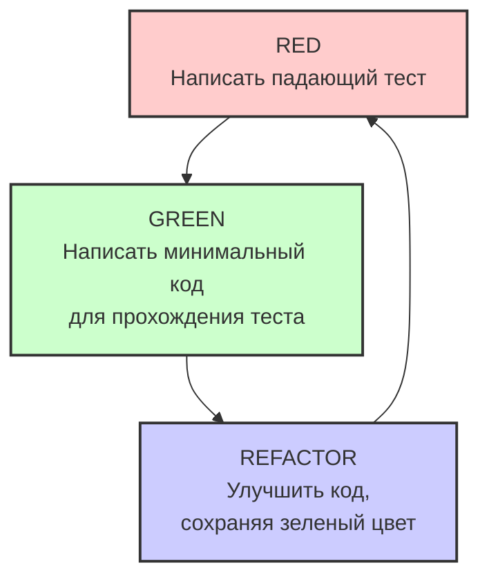

#tdd #testing #unit-test #xctest #development-process #agile #quality #swift

---
## TDD (Test-Driven Development) — Разработка через тестирование

### Определение
**TDD (Test-Driven Development)** — это методология разработки программного обеспечения, в которой тесты пишутся **до** написания самого кода. Процесс следует короткому итеративному циклу: сначала создается тест, который определяет желаемое поведение функции или модуля, затем пишется минимальный код, необходимый для прохождения этого теста, и, наконец, код рефакторится для улучшения его структуры при сохранении работоспособности .

TDD не является инструментом тестирования в первую очередь — это **метод проектирования**. Он заставляет разработчика думать о требованиях, интерфейсах и поведении кода до того, как писать реализацию, что приводит к более чистой, модульной и тестируемой архитектуре.

### Зачем это знать [[iOS]]-разработчику?
1.  **Улучшение архитектуры:** TDD поощряет написание слабо связанного, модульного кода, который легко тестировать и поддерживать.
2.  **Снижение количества багов:** Код, написанный через TDD, как правило, содержит меньше дефектов, так как каждая строка покрыта тестами.
3.  **Уверенность при рефакторинге:** Наличие полного набора тестов дает уверенность, что изменения не сломают существующую логику.
4.  **Документация:** Тесты служат живой документацией, показывающей, как должен вести себя код.
5.  **Ускорение разработки в долгосрочной перспективе:** Хотя на начальном этапе TDD может казаться медленнее, в долгосрочной перспективе он экономит время на отладке и исправлении багов.

---

### Философия и принципы TDD

#### Три закона TDD (по Роберту Мартину)

1.  **Не пишите производственный код, пока не написали упавший юнит-тест.**
2.  **Не пишите больше юнит-теста, чем достаточно для падения (ошибки компиляции — тоже падение).**
3.  **Не пишите больше производственного кода, чем достаточно для прохождения текущего падающего теста.**

#### Цикл Red-Green-Refactor



1.  **Красный (Red):** Напишите тест, который определяет небольшой кусочек функциональности. Тест должен **падать** (не проходить), потому что этой функциональности еще нет.
2.  **Зеленый (Green):** Напишите **минимальное количество кода**, чтобы тест прошел. Не думайте о красоте или эффективности — только о том, чтобы сделать тест зеленым.
3.  **Рефакторинг (Refactor):** Улучшите написанный код: удалите дублирование, улучшите имена переменных, выделите общие части. Тесты гарантируют, что вы ничего не сломали.

---

### Примеры от простого к сложному

#### Уровень 0: Подготовка тестового окружения

```swift
import XCTest
@testable import MyApp

// Базовый класс для тестов
class TDDTests: XCTestCase {
    override func setUpWithError() throws {
        try super.setUpWithError()
        // Инициализация перед каждым тестом
    }
    
    override func tearDownWithError() throws {
        // Очистка после каждого теста
        try super.tearDownWithError()
    }
}
```

#### Уровень 1: TDD для простой модели (Calculator)

**Шаг 1: Красный (Red) — пишем падающий тест**

```swift
import XCTest
@testable import MyApp

class CalculatorTests: XCTestCase {
    
    func testAdd_TwoNumbers_ReturnsSum() {
        // Arrange (Подготовка)
        let calculator = Calculator()
        let a = 5
        let b = 3
        
        // Act (Действие)
        let result = calculator.add(a, b)
        
        // Assert (Проверка)
        XCTAssertEqual(result, 8, "5 + 3 должно равняться 8")
    }
}
```

Тест не скомпилируется, потому что класса `Calculator` еще не существует. Это **красный этап**.

**Шаг 2: Зеленый (Green) — пишем минимальный код**

```swift
import Foundation

class Calculator {
    func add(_ a: Int, _ b: Int) -> Int {
        return 0 // Минимальный код для компиляции
    }
}
```

Теперь тест компилируется, но падает, потому что возвращает 0 вместо 8. Исправляем:

```swift
func add(_ a: Int, _ b: Int) -> Int {
    return a + b // Минимальный код для прохождения теста
}
```

Тест зеленый! ✅

**Шаг 3: Рефакторинг (Refactor)**

Код уже простой, но можно улучшить читаемость:

```swift
class Calculator {
    func add(_ a: Int, _ b: Int) -> Int {
        a + b // Неявный return в одну строку
    }
}
```

**Шаг 4: Следующий тест — умножение**

```swift
func testMultiply_TwoNumbers_ReturnsProduct() {
    let calculator = Calculator()
    let result = calculator.multiply(4, 3)
    XCTAssertEqual(result, 12)
}
```

Снова красный — метод `multiply` не существует. Добавляем минимальную реализацию:

```swift
func multiply(_ a: Int, _ b: Int) -> Int {
    return a * b
}
```

Зеленый. Рефакторинг не требуется.

#### Уровень 2: TDD для обработки опциональных значений

**Шаг 1: Тест для деления с проверкой на ноль**

```swift
func testDivide_ByNonZero_ReturnsQuotient() {
    let calculator = Calculator()
    let result = try? calculator.divide(10, 2)
    XCTAssertEqual(result, 5)
}

func testDivide_ByZero_ThrowsError() {
    let calculator = Calculator()
    XCTAssertThrowsError(try calculator.divide(10, 0)) { error in
        XCTAssertEqual(error as? CalculatorError, CalculatorError.divisionByZero)
    }
}
```

**Шаг 2: Минимальная реализация**

```swift
enum CalculatorError: Error {
    case divisionByZero
}

class Calculator {
    // ... предыдущие методы
    
    func divide(_ a: Int, _ b: Int) throws -> Int {
        guard b != 0 else {
            throw CalculatorError.divisionByZero
        }
        return a / b
    }
}
```

**Шаг 3: Рефакторинг** — можно добавить обработку для целочисленного деления, но оставляем как есть.

#### Уровень 3: TDD для ViewModel ([[MVVM (Model-View-ViewModel) Architecture|MVVM]])

Представим, что мы пишем ViewModel для экрана логина.

**Шаг 1: Тест на валидацию email**

```swift
import XCTest
@testable import MyApp

class LoginViewModelTests: XCTestCase {
    
    func testValidateEmail_ValidEmail_ReturnsTrue() {
        let viewModel = LoginViewModel()
        let isValid = viewModel.validateEmail("user@example.com")
        XCTAssertTrue(isValid)
    }
    
    func testValidateEmail_InvalidEmail_ReturnsFalse() {
        let viewModel = LoginViewModel()
        let isValid = viewModel.validateEmail("invalid-email")
        XCTAssertFalse(isValid)
    }
    
    func testValidateEmail_EmptyEmail_ReturnsFalse() {
        let viewModel = LoginViewModel()
        let isValid = viewModel.validateEmail("")
        XCTAssertFalse(isValid)
    }
}
```

**Шаг 2: Минимальная реализация**

```swift
import Foundation

class LoginViewModel {
    func validateEmail(_ email: String) -> Bool {
        return !email.isEmpty && email.contains("@")
    }
}
```

**Шаг 3: Рефакторинг** — используем регулярное выражение для более точной валидации

```swift
func validateEmail(_ email: String) -> Bool {
    let emailRegex = "[A-Z0-9a-z._%+-]+@[A-Za-z0-9.-]+\\.[A-Za-z]{2,64}"
    let predicate = NSPredicate(format: "SELF MATCHES %@", emailRegex)
    return predicate.evaluate(with: email)
}
```

#### Уровень 4: TDD для асинхронного кода

**Шаг 1: Тест для сетевого запроса**

```swift
import XCTest
@testable import MyApp

class NetworkServiceTests: XCTestCase {
    
    func testFetchUser_WithValidId_ReturnsUser() {
        // Создаем expectation для асинхронного теста
        let expectation = XCTestExpectation(description: "Получение пользователя")
        
        let service = NetworkService()
        
        service.fetchUser(id: 123) { result in
            switch result {
            case .success(let user):
                XCTAssertEqual(user.id, 123)
                XCTAssertNotNil(user.name)
                expectation.fulfill()
            case .failure:
                XCTFail("Запрос не должен был провалиться")
                expectation.fulfill()
            }
        }
        
        wait(for: [expectation], timeout: 5.0)
    }
    
    func testFetchUser_WithInvalidId_ReturnsError() {
        let expectation = XCTestExpectation(description: "Ошибка получения пользователя")
        
        let service = NetworkService()
        
        service.fetchUser(id: 999) { result in
            switch result {
            case .success:
                XCTFail("Должна была возникнуть ошибка")
            case .failure(let error):
                XCTAssertEqual(error, .userNotFound)
                expectation.fulfill()
            }
            expectation.fulfill()
        }
        
        wait(for: [expectation], timeout: 5.0)
    }
}
```

**Шаг 2: Минимальная реализация с мок-данными**

```swift
import Foundation

enum NetworkError: Error {
    case userNotFound
    case networkError
}

struct User {
    let id: Int
    let name: String
    let email: String
}

class NetworkService {
    func fetchUser(id: Int, completion: @escaping (Result<User, NetworkError>) -> Void) {
        // Имитация сети
        DispatchQueue.global().asyncAfter(deadline: .now() + 0.5) {
            if id == 123 {
                let user = User(id: 123, name: "Test User", email: "test@example.com")
                completion(.success(user))
            } else {
                completion(.failure(.userNotFound))
            }
        }
    }
}
```

#### Уровень 5: TDD для бизнес-логики (корзина покупок)

**Шаг 1: Тесты для корзины**

```swift
import XCTest
@testable import MyApp

class ShoppingCartTests: XCTestCase {
    
    func testAddItem_NewItem_IncreasesCount() {
        let cart = ShoppingCart()
        let item = CartItem(id: 1, name: "Товар", price: 100.0, quantity: 1)
        
        cart.addItem(item)
        
        XCTAssertEqual(cart.totalItems, 1)
        XCTAssertEqual(cart.totalPrice, 100.0)
    }
    
    func testAddItem_ExistingItem_IncreasesQuantity() {
        let cart = ShoppingCart()
        let item = CartItem(id: 1, name: "Товар", price: 100.0, quantity: 1)
        
        cart.addItem(item)
        cart.addItem(item) // Добавляем тот же товар
        
        XCTAssertEqual(cart.totalItems, 2) // Количество позиций? Или общее количество?
        // Уточним: totalItems должно быть общее количество товаров
        // А количество позиций (unique items) должно быть 1
        XCTAssertEqual(cart.uniqueItemsCount, 1)
        XCTAssertEqual(cart.totalPrice, 200.0)
    }
    
    func testRemoveItem_DecreasesCount() {
        let cart = ShoppingCart()
        let item = CartItem(id: 1, name: "Товар", price: 100.0, quantity: 1)
        
        cart.addItem(item)
        cart.removeItem(item)
        
        XCTAssertEqual(cart.totalItems, 0)
        XCTAssertEqual(cart.totalPrice, 0.0)
    }
    
    func testApplyDiscount_ReducesTotalPrice() {
        let cart = ShoppingCart()
        cart.addItem(CartItem(id: 1, name: "Товар", price: 1000.0, quantity: 2))
        
        cart.applyDiscount(10) // 10% скидка
        
        XCTAssertEqual(cart.totalPrice, 1800.0) // 2000 - 10% = 1800
    }
}
```

**Шаг 2: Минимальная реализация**

```swift
import Foundation

struct CartItem: Equatable {
    let id: Int
    let name: String
    let price: Double
    let quantity: Int
}

class ShoppingCart {
    private var items: [CartItem] = []
    private var discountPercentage: Double = 0
    
    var totalItems: Int {
        items.reduce(0) { $0 + $1.quantity }
    }
    
    var uniqueItemsCount: Int {
        items.count
    }
    
    var totalPrice: Double {
        let subtotal = items.reduce(0.0) { $0 + ($1.price * Double($1.quantity)) }
        return subtotal * (1 - discountPercentage / 100)
    }
    
    func addItem(_ item: CartItem) {
        if let index = items.firstIndex(where: { $0.id == item.id }) {
            // Товар уже есть - увеличиваем количество
            let existingItem = items[index]
            let updatedItem = CartItem(
                id: existingItem.id,
                name: existingItem.name,
                price: existingItem.price,
                quantity: existingItem.quantity + item.quantity
            )
            items[index] = updatedItem
        } else {
            items.append(item)
        }
    }
    
    func removeItem(_ item: CartItem) {
        items.removeAll { $0.id == item.id }
    }
    
    func applyDiscount(_ percentage: Double) {
        discountPercentage = percentage
    }
}
```

**Шаг 3: Рефакторинг** — можно выделить логику подсчета в отдельные методы, но оставим пока так.

#### Уровень 6: TDD с зависимостями и моками

**Шаг 1: Тест для сервиса, использующего [[API]]**

```swift
import XCTest
@testable import MyApp

// Протокол для зависимости
protocol APIClientProtocol {
    func fetchUser(id: Int, completion: @escaping (Result<User, Error>) -> Void)
}

// Мок для тестирования
class MockAPIClient: APIClientProtocol {
    var fetchUserCalled = false
    var fetchUserId: Int?
    var result: Result<User, Error>?
    
    func fetchUser(id: Int, completion: @escaping (Result<User, Error>) -> Void) {
        fetchUserCalled = true
        fetchUserId = id
        if let result = result {
            completion(result)
        }
    }
}

class UserServiceTests: XCTestCase {
    
    func testGetUserProfile_WithValidId_CallsCompletionWithUser() {
        // Arrange
        let mockClient = MockAPIClient()
        let expectedUser = User(id: 123, name: "Test", email: "test@example.com")
        mockClient.result = .success(expectedUser)
        
        let service = UserService(apiClient: mockClient)
        var receivedUser: User?
        var receivedError: Error?
        
        // Act
        let expectation = XCTestExpectation(description: "Получение профиля")
        service.getUserProfile(id: 123) { result in
            switch result {
            case .success(let user):
                receivedUser = user
            case .failure(let error):
                receivedError = error
            }
            expectation.fulfill()
        }
        
        // Assert
        wait(for: [expectation], timeout: 1.0)
        XCTAssertTrue(mockClient.fetchUserCalled)
        XCTAssertEqual(mockClient.fetchUserId, 123)
        XCTAssertEqual(receivedUser?.id, 123)
        XCTAssertNil(receivedError)
    }
    
    func testGetUserProfile_WithInvalidId_CallsCompletionWithError() {
        let mockClient = MockAPIClient()
        mockClient.result = .failure(NetworkError.userNotFound)
        
        let service = UserService(apiClient: mockClient)
        var receivedError: Error?
        
        let expectation = XCTestExpectation(description: "Ошибка получения профиля")
        service.getUserProfile(id: 999) { result in
            if case .failure(let error) = result {
                receivedError = error
            }
            expectation.fulfill()
        }
        
        wait(for: [expectation], timeout: 1.0)
        XCTAssertNotNil(receivedError)
    }
}
```

**Шаг 2: Реализация**

```swift
import Foundation

class UserService {
    private let apiClient: APIClientProtocol
    
    init(apiClient: APIClientProtocol) {
        self.apiClient = apiClient
    }
    
    func getUserProfile(id: Int, completion: @escaping (Result<User, Error>) -> Void) {
        apiClient.fetchUser(id: id, completion: completion)
    }
}
```

#### Уровень 7: TDD для UI-логики (без UI-тестов)

```swift
import XCTest
@testable import MyApp

class LoginViewModelTests: XCTestCase {
    
    func testLoginButtonEnabled_WhenEmailAndPasswordValid_ReturnsTrue() {
        let viewModel = LoginViewModel()
        viewModel.email = "user@example.com"
        viewModel.password = "password123"
        
        XCTAssertTrue(viewModel.isLoginButtonEnabled)
    }
    
    func testLoginButtonEnabled_WhenEmailInvalid_ReturnsFalse() {
        let viewModel = LoginViewModel()
        viewModel.email = "invalid"
        viewModel.password = "password123"
        
        XCTAssertFalse(viewModel.isLoginButtonEnabled)
    }
    
    func testLoginButtonEnabled_WhenPasswordTooShort_ReturnsFalse() {
        let viewModel = LoginViewModel()
        viewModel.email = "user@example.com"
        viewModel.password = "pass"
        
        XCTAssertFalse(viewModel.isLoginButtonEnabled)
    }
    
    func testLogin_Successful_CallsCompletionWithSuccess() {
        let viewModel = LoginViewModel()
        viewModel.email = "user@example.com"
        viewModel.password = "password123"
        
        var result: LoginResult?
        let expectation = XCTestExpectation(description: "Логин")
        
        viewModel.login { loginResult in
            result = loginResult
            expectation.fulfill()
        }
        
        wait(for: [expectation], timeout: 2.0)
        
        if case .success = result {
            XCTAssertTrue(true)
        } else {
            XCTFail("Ожидался успех")
        }
    }
    
    func testLogin_WithInvalidCredentials_CallsCompletionWithFailure() {
        let viewModel = LoginViewModel()
        viewModel.email = "user@example.com"
        viewModel.password = "wrong"
        
        var result: LoginResult?
        let expectation = XCTestExpectation(description: "Логин")
        
        viewModel.login { loginResult in
            result = loginResult
            expectation.fulfill()
        }
        
        wait(for: [expectation], timeout: 2.0)
        
        if case .failure = result {
            XCTAssertTrue(true)
        } else {
            XCTFail("Ожидалась ошибка")
        }
    }
}
```

**Реализация ViewModel:**

```swift
import Foundation

enum LoginResult {
    case success
    case failure(String)
}

class LoginViewModel {
    var email: String = ""
    var password: String = ""
    
    var isLoginButtonEnabled: Bool {
        validateEmail(email) && validatePassword(password)
    }
    
    private func validateEmail(_ email: String) -> Bool {
        let emailRegex = "[A-Z0-9a-z._%+-]+@[A-Za-z0-9.-]+\\.[A-Za-z]{2,64}"
        let predicate = NSPredicate(format: "SELF MATCHES %@", emailRegex)
        return predicate.evaluate(with: email)
    }
    
    private func validatePassword(_ password: String) -> Bool {
        password.count >= 8
    }
    
    func login(completion: @escaping (LoginResult) -> Void) {
        // Имитация сетевого запроса
        DispatchQueue.global().asyncAfter(deadline: .now() + 0.5) {
            if self.email == "user@example.com" && self.password == "password123" {
                completion(.success)
            } else {
                completion(.failure("Неверный email или пароль"))
            }
        }
    }
}
```

#### Уровень 8: TDD для парсинга данных

**Шаг 1: Тесты для парсинга [[JSON]]**

```swift
import XCTest
@testable import MyApp

class JSONParserTests: XCTestCase {
    
    func testParseUser_WithValidJSON_ReturnsUser() {
        let json = """
        {
            "id": 123,
            "name": "John Doe",
            "email": "john@example.com"
        }
        """.data(using: .utf8)!
        
        let parser = JSONParser()
        let user = parser.parseUser(from: json)
        
        XCTAssertNotNil(user)
        XCTAssertEqual(user?.id, 123)
        XCTAssertEqual(user?.name, "John Doe")
        XCTAssertEqual(user?.email, "john@example.com")
    }
    
    func testParseUser_WithMissingField_ReturnsNil() {
        let json = """
        {
            "id": 123,
            "name": "John Doe"
        }
        """.data(using: .utf8)!
        
        let parser = JSONParser()
        let user = parser.parseUser(from: json)
        
        XCTAssertNil(user)
    }
    
    func testParseUser_WithInvalidData_ReturnsNil() {
        let invalidData = "not json".data(using: .utf8)!
        
        let parser = JSONParser()
        let user = parser.parseUser(from: invalidData)
        
        XCTAssertNil(user)
    }
}
```

**Шаг 2: Реализация**

```swift
import Foundation

struct User: Codable {
    let id: Int
    let name: String
    let email: String
}

class JSONParser {
    func parseUser(from data: Data) -> User? {
        let decoder = JSONDecoder()
        return try? decoder.decode(User.self, from: data)
    }
}
```

---

### Преимущества TDD

1.  **Меньше багов:** Код покрыт тестами, что снижает вероятность регрессии .
2.  **Лучшая архитектура:** TDD заставляет думать об интерфейсах и зависимостях, что ведет к более чистой, модульной архитектуре .
3.  **Уверенность при изменениях:** Можно смело рефакторить, зная, что тесты поймают ошибки .
4.  **Документация:** Тесты показывают, как использовать API и какого поведения ожидать .
5.  **Меньше времени на отладку:** Проблемы обнаруживаются на ранних этапах .
6.  **Улучшение дизайна:** Слабосвязанный код легче тестировать, а значит, TDD поощряет написание именно такого кода .

### Недостатки и вызовы TDD

1.  **Кривая обучения:** Новичкам сложно привыкнуть писать тесты до кода .
2.  **Замедление на начальном этапе:** Разработка может казаться медленнее, пока не накопится критическая масса тестов .
3.  **Не для всего подходит:** [[UI-test]]s, сложные интеграции и прототипы могут быть не лучшими кандидатами для TDD .
4.  **Поддержка тестов:** Тесты нужно поддерживать и обновлять при изменении требований .
5.  **Ложное чувство безопасности:** Прохождение тестов не гарантирует отсутствие всех багов .

---

### TDD vs BDD vs ATDD

| Методология | Описание | Фокус |
|-------------|----------|-------|
| **TDD** | Тесты пишутся до кода разработчиками | Unit-тесты, архитектура |
| **BDD (Behavior-Driven Development)** | Тесты описывают поведение системы на естественном языке | Взаимодействие с пользователем, acceptance criteria |
| **ATDD (Acceptance Test-Driven Development)** | Тесты пишутся совместно с заказчиком до разработки | Приемочные тесты, бизнес-требования |

### Best Practices для TDD в iOS

1.  **Пишите маленькие, сфокусированные тесты:** Каждый тест должен проверять одну конкретную вещь.
2.  **Следуйте шаблону Arrange-Act-Assert:** Подготовка, действие, проверка.
3.  **Используйте понятные имена тестов:** Имя теста должно описывать, что проверяется и при каких условиях.
4.  **Не тестируйте приватные методы:** Тестируйте публичный интерфейс. Приватные методы будут покрыты косвенно.
5.  **Используйте моки и стабы для изоляции:** Заменяйте реальные зависимости на тестовые двойники.
6.  **Поддерживайте тесты в чистоте:** Тесты — такой же код, их нужно рефакторить и поддерживать.
7.  **Запускайте тесты часто:** Интегрируйте их в процесс сборки и [[CI]]/[[CD]].

### Итог
**TDD** — это не просто способ тестирования, а **методология проектирования**, которая приводит к созданию более качественного, надежного и поддерживаемого кода. Для iOS-разработчика владение TDD означает:

1.  **Умение проектировать** через тесты, думая о поведении до реализации.
2.  **Уверенность в коде** при рефакторинге и добавлении новых функций.
3.  **Способность создавать** слабосвязанные, тестируемые компоненты.
4.  **Понимание ценности** обратной связи от тестов на ранних этапах.

Ключевые навыки: написание падающих тестов, итеративный цикл Red-Green-Refactor, использование моков и стабов, тестирование асинхронного кода, поддержка тестов в актуальном состоянии.