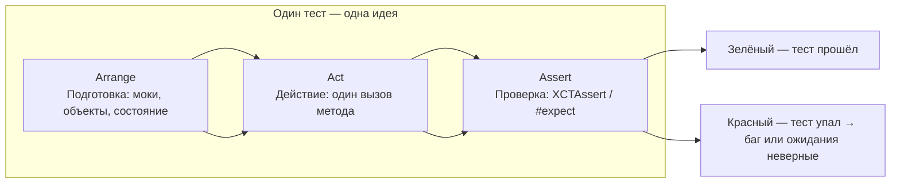

Вот **полное, подробное и максимально актуальное** (на 2026 год) руководство по трём основным блокам unit-теста в Swift — **Arrange-Act-Assert** (AAA) — с современными практиками, примерами и рекомендациями.

### 1. Почему именно AAA-структура — золотой стандарт в 2026 году

AAA (Arrange → Act → Assert) — это не просто рекомендация, а **де-факто стандарт** написания читаемых и поддерживаемых unit-тестов в Swift-экосистеме.

Преимущества AAA в 2026:

- **Читаемость** — любой разработчик за 5 секунд понимает, что тестируется  
- **Однозначность** — один тест = одна проверяемая идея  
- **Лёгкость рефакторинга** — блоки легко разделять/перемещать  
- **Поддержка Swift Testing** (новый фреймворк Xcode 16+) — `#expect`, `@Test` идеально ложатся на AAA  
- **Лучшая отладка** — падение теста сразу показывает, на каком этапе проблема (подготовка / действие / проверка)

### 2. Подробное объяснение каждого блока

| Блок       | Название       | Цель блока                                                                 | Что обычно делаем в 2026 году                          | Лучшие практики 2026 |
|------------|----------------|----------------------------------------------------------------------------|----------------------------------------------------------|-----------------------|
| **Arrange** | Подготовка     | Создать контролируемое окружение для теста                                 | Создание объектов, моки/stub/fake, установка состояний, настройка DI | Использовать `setUp()` / `setUpWithError()`, `@MainActor` для UI, `TaskLocal` для контекста |
| **Act**     | Действие       | Выполнить **одно** действие, которое хотим протестировать                  | Вызов метода / функции / асинхронной операции           | Только **один** вызов. Async — `await`. Не смешивать с проверками |
| **Assert**  | Проверка       | Убедиться, что результат соответствует ожиданиям                           | `XCTAssert*`, `#expect`, `#require`                     | Использовать `#expect` (Swift Testing), проверять поведение, а не реализацию |

### 3. Самые популярные и рекомендуемые шаблоны AAA в Swift 2026

#### Шаблон 1 — Классический синхронный тест (XCTest)

```swift
final class CalculatorTests: XCTestCase {
    
    func testAdditionOfTwoPositiveNumbers() {
        // Arrange
        let calculator = Calculator()
        let a = 5
        let b = 7
        
        // Act
        let result = calculator.add(a, b)
        
        // Assert
        XCTAssertEqual(result, 12, "5 + 7 должно быть 12")
    }
}
```

#### Шаблон 2 — Асинхронный тест (async/await + XCTest)

```swift
final class UserServiceTests: XCTestCase {
    
    @MainActor
    func testFetchUserSuccess() async throws {
        // Arrange
        let stub = UserServiceStub(users: [User(id: 1, name: "Alice")])
        let service = UserService(repository: stub)
        
        // Act
        let users = try await service.fetchUsers()
        
        // Assert
        XCTAssertEqual(users.count, 1)
        XCTAssertEqual(users.first?.name, "Alice")
    }
}
```

#### Шаблон 3 — Современный стиль с **Swift Testing** (Xcode 16+)

```swift
import Testing

@Suite("Calculator Tests")
struct CalculatorTests {
    
    @Test("Addition of two positive numbers")
    func addition() {
        // Arrange
        let calculator = Calculator()
        let a = 5
        let b = 7
        
        // Act
        let result = calculator.add(a, b)
        
        // Assert
        #expect(result == 12, "5 + 7 должно быть 12")
    }
    
    @Test("Division by zero throws error")
    func divisionByZero() throws {
        let calculator = Calculator()
        
        #expect(throws: CalculatorError.divisionByZero) {
            try calculator.divide(10, by: 0)
        }
    }
}
```

**Преимущества Swift Testing**:
- `#expect` / `#require` — более выразительные  
- `@Suite` / `@Test` — удобнее группировать  
- Полная поддержка async/await без `XCTestExpectation`  
- Лучшая интеграция с Xcode 16+ и CI

### 4. Лучшие практики AAA в Swift 2026

- **Один тест — одна идея** (один Act + 1–3 Assert)  
- **Arrange** — используй `setUp()` / `setUpWithError()` для повторяющегося кода  
- **Act** — **только один** вызов (если больше — разбей тест)  
- **Assert** — проверяй **поведение**, а не **реализацию**  
  → Плохо: `XCTAssertEqual(vm.privateVar, 42)`  
  → Хорошо: `XCTAssertEqual(vm.displayedText, "42")`

- **Async-тесты** — всегда `async throws` + `await` + `#expect` / `XCTAssertNoThrow`  
- **@MainActor** — обязателен для тестов ViewModel / UI-related  
- **Не смешивай** Arrange и Act (например, не вызывай метод внутри создания объекта)  
- **YAGNI в тестах** — не проверяй очевидное (например, `user.name == "Alice"` после присваивания)

### 5. Визуальная схема AAA (2026 стиль)



### 6. Итог: почему AAA — золотой стандарт в 2026

- **Читаемость** — тест читается как история: подготовили → сделали → проверили  
- **Поддерживаемость** — легко добавлять/удалять/переименовывать  
- **Отладка** — сразу видно, на каком этапе упал тест  
- **Swift Testing + async/await** — AAA идеально ложится на `#expect` и `await`  
- **Swift 6 strict concurrency** — тесты помогают сразу ловить ошибки изоляции

**Короткий девиз 2026**:
> «AAA — это когда тест читается как предложение:  
> «Когда мы сделали X в ситуации Y, то получили Z».  
> Всё остальное — нарушение читаемости и поддержки.»

Удачи с читаемыми, надёжными и современными unit-тестами в Swift! 🧪