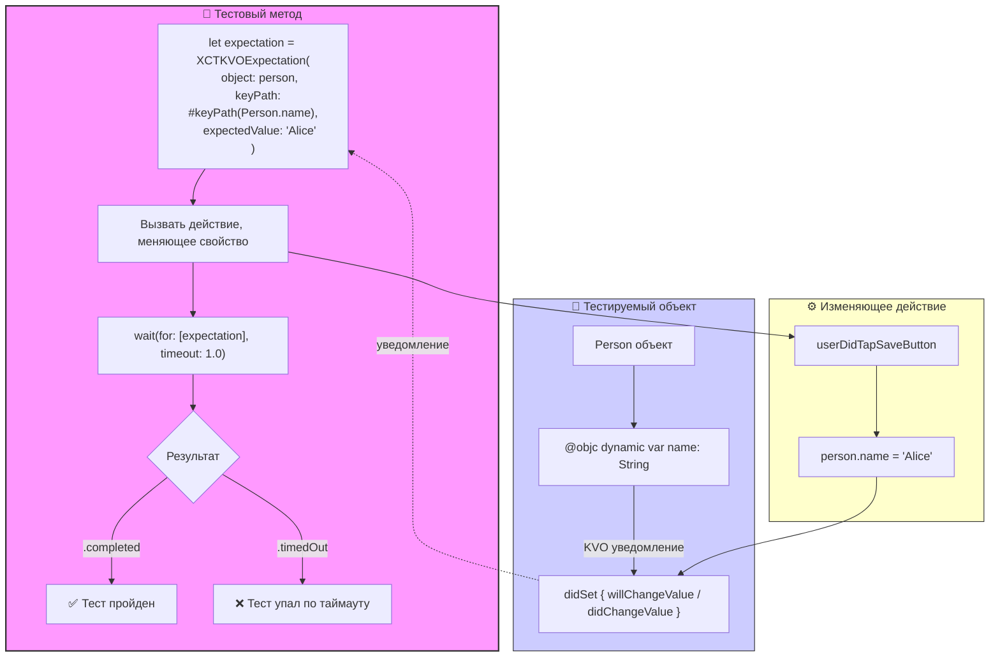

#testing #xctest #kvo #expectation #async #unit-test #swift #key-value-observing

---
### Определение
**XCTKVOExpectation** — это специализированный подкласс `XCTestExpectation` во фреймворке [[XCTest]], который предназначен для тестирования изменений свойств объектов через механизм [[KVO]] (Key-Value Observing). Он позволяет тесту ожидать, пока определенное свойство объекта не примет ожидаемое значение, и только потом продолжить выполнение .

Этот класс особенно полезен при тестировании реактивного кода, ViewModel во [[MVVM (Model-View-ViewModel) Architecture|MVVM]] архитектуре, а также любых объектов, которые уведомляют об изменениях через KVO-совместимые свойства.

### Зачем это знать iOS-разработчику?
1.  **Тестирование ViewModel:** Проверка, что свойства ViewModel правильно обновляются при изменении состояния.
2.  **Тестирование KVO-зависимого кода:** Убедиться, что объекты корректно уведомляют наблюдателей об изменениях.
3.  **Асинхронные проверки:** Ожидание, пока флаг `isLoading` не станет `false` после завершения загрузки данных.
4.  **Тестирование реактивных связей:** Проверка, что изменение одного свойства приводит к ожидаемому изменению другого.
5.  **Альтернатива делегатам и замыканиям:** Для объектов, которые используют KVO вместо callback'ов.

---

### Архитектура и основные концепции



### Основные методы создания

#### 1. Инициализация с ожидаемым значением
```swift
let expectation = XCTKVOExpectation(keyPath: "isLoading", 
                                    object: viewModel, 
                                    expectedValue: false)
```

#### 2. Инициализация с проверкой через блок
```swift
let expectation = XCTKVOExpectation(keyPath: "progress") { observedObject, change in
    guard let progress = change[.newKey] as? Double else { return false }
    return progress >= 1.0
}
```

#### 3. Инициализация с ключевым путем (Swift 5.2+)
```swift
let expectation = XCTKVOExpectation(keyPath: \ViewModel.isLoading, 
                                    object: viewModel, 
                                    expectedValue: false)
```

---

### Примеры от простого к сложному

#### Уровень 0: Модель для тестирования

```swift
import Foundation

// KVO-совместимый класс должен наследоваться от NSObject
// и отмечать свойства как @objc dynamic
class ViewModel: NSObject {
    @objc dynamic var isLoading: Bool = false
    @objc dynamic var progress: Double = 0.0
    @objc dynamic var status: String = "idle"
    @objc dynamic var items: [String] = []
    
    func startLoading() {
        isLoading = true
        status = "loading"
        
        // Симуляция асинхронной загрузки
        DispatchQueue.global().asyncAfter(deadline: .now() + 0.5) { [weak self] in
            self?.isLoading = false
            self?.status = "completed"
            self?.items = ["Item 1", "Item 2", "Item 3"]
        }
    }
    
    func updateProgress() {
        var currentProgress = 0.0
        Timer.scheduledTimer(withTimeInterval: 0.1, repeats: true) { timer in
            currentProgress += 0.2
            self.progress = currentProgress
            
            if currentProgress >= 1.0 {
                timer.invalidate()
            }
        }
    }
}
```

#### Уровень 1: Простое ожидание изменения свойства

```swift
import XCTest
@testable import MyApp

class KVOTests: XCTestCase {
    
    func testIsLoadingBecomesFalse() {
        // 1. Создаем объект для тестирования
        let viewModel = ViewModel()
        
        // 2. Создаем KVO ожидание
        let expectation = XCTKVOExpectation(keyPath: "isLoading",
                                            object: viewModel,
                                            expectedValue: false)
        
        // 3. Запускаем действие, которое должно изменить свойство
        viewModel.startLoading()
        
        // 4. Ждем, пока isLoading не станет false
        let result = XCTWaiter.wait(for: [expectation], timeout: 2.0)
        
        // 5. Проверяем результат
        XCTAssertEqual(result, .completed, "isLoading не стал false вовремя")
        XCTAssertEqual(viewModel.status, "completed")
    }
}
```

#### Уровень 2: Использование keyPath с синтаксисом [[Swift]]

```swift
import XCTest
@testable import MyApp

class KeyPathTests: XCTestCase {
    
    func testKeyPathSyntax() {
        let viewModel = ViewModel()
        
        // Используем keyPath через обратный слеш (Swift 5.2+)
        let expectation = XCTKVOExpectation(keyPath: \ViewModel.isLoading,
                                            object: viewModel,
                                            expectedValue: false)
        
        viewModel.startLoading()
        
        wait(for: [expectation], timeout: 2.0)
        
        // Дополнительные проверки
        XCTAssertFalse(viewModel.isLoading)
        XCTAssertEqual(viewModel.items.count, 3)
    }
}
```

#### Уровень 3: Ожидание с проверкой через блок

```swift
import XCTest
@testable import MyApp

class BlockTests: XCTestCase {
    
    func testProgressReachesOne() {
        let viewModel = ViewModel()
        
        // Создаем ожидание с блоком проверки
        let expectation = XCTKVOExpectation(keyPath: "progress",
                                            object: viewModel) { observed, change in
            guard let progress = change[.newKey] as? Double else { return false }
            print("Текущий прогресс: \(progress)")
            return progress >= 1.0
        }
        
        viewModel.updateProgress()
        
        wait(for: [expectation], timeout: 3.0)
        XCTAssertEqual(viewModel.progress, 1.0)
    }
    
    func testStatusChanges() {
        let viewModel = ViewModel()
        
        // Ожидаем, что статус изменится на "loading"
        let loadingExpectation = XCTKVOExpectation(keyPath: "status",
                                                   object: viewModel) { _, change in
            guard let newStatus = change[.newKey] as? String else { return false }
            return newStatus == "loading"
        }
        
        // Ожидаем, что статус изменится на "completed"
        let completedExpectation = XCTKVOExpectation(keyPath: "status",
                                                     object: viewModel) { _, change in
            guard let newStatus = change[.newKey] as? String else { return false }
            return newStatus == "completed"
        }
        
        viewModel.startLoading()
        
        // Ждем сначала loading, потом completed
        wait(for: [loadingExpectation], timeout: 1.0)
        wait(for: [completedExpectation], timeout: 2.0)
        
        XCTAssertEqual(viewModel.status, "completed")
    }
}
```

#### Уровень 4: Тестирование последовательности изменений

```swift
import XCTest
@testable import MyApp

class SequenceTests: XCTestCase {
    
    func testLoadingSequence() {
        let viewModel = ViewModel()
        
        // Создаем ожидания для разных этапов
        let isLoadingTrue = XCTKVOExpectation(keyPath: "isLoading",
                                              object: viewModel,
                                              expectedValue: true)
        
        let isLoadingFalse = XCTKVOExpectation(keyPath: "isLoading",
                                               object: viewModel,
                                               expectedValue: false)
        
        // Важно: enforceOrder гарантирует, что ожидания выполнятся в правильном порядке
        viewModel.startLoading()
        
        wait(for: [isLoadingTrue, isLoadingFalse], timeout: 2.0, enforceOrder: true)
        
        // Проверяем финальное состояние
        XCTAssertFalse(viewModel.isLoading)
        XCTAssertGreaterThan(viewModel.items.count, 0)
    }
}
```

#### Уровень 5: Тестирование массива через KVO

```swift
import XCTest
@testable import MyApp

class ArrayTests: XCTestCase {
    
    func testItemsArrayUpdates() {
        let viewModel = ViewModel()
        
        // KVO работает и с массивами
        let expectation = XCTKVOExpectation(keyPath: "items",
                                            object: viewModel) { _, change in
            guard let newItems = change[.newKey] as? [String] else { return false }
            return newItems.count == 3 && newItems.contains("Item 1")
        }
        
        viewModel.startLoading()
        
        wait(for: [expectation], timeout: 2.0)
        
        let expectedItems = ["Item 1", "Item 2", "Item 3"]
        XCTAssertEqual(viewModel.items, expectedItems)
    }
}
```

#### Уровень 6: Обработка ошибок и тайм-аутов

```swift
import XCTest
@testable import MyApp

class ErrorHandlingTests: XCTestCase {
    
    func testTimeoutHandling() {
        let viewModel = ViewModel()
        
        // Создаем ожидание, которое никогда не выполнится
        let expectation = XCTKVOExpectation(keyPath: "isLoading",
                                            object: viewModel,
                                            expectedValue: false)
        
        // НЕ вызываем startLoading()
        
        let result = XCTWaiter.wait(for: [expectation], timeout: 1.0)
        
        // Проверяем, что произошел тайм-аут
        XCTAssertEqual(result, .timedOut)
    }
    
    func testObjectDeallocated() {
        var viewModel: ViewModel? = ViewModel()
        weak var weakViewModel = viewModel
        
        let expectation = XCTKVOExpectation(keyPath: "isLoading",
                                            object: viewModel!,
                                            expectedValue: false)
        
        // Удаляем объект
        viewModel = nil
        XCTAssertNil(weakViewModel)
        
        // Ожидание должно провалиться, так как объект деаллоцирован
        let result = XCTWaiter.wait(for: [expectation], timeout: 1.0)
        XCTAssertNotEqual(result, .completed)
    }
}
```

#### Уровень 7: Тестирование с множественными KVO ожиданиями

```swift
import XCTest
@testable import MyApp

class MultiKVOExpectationTests: XCTestCase {
    
    func testMultipleProperties() {
        let viewModel = ViewModel()
        
        // Ожидаем изменения нескольких свойств
        let loadingExpectation = XCTKVOExpectation(keyPath: "isLoading",
                                                   object: viewModel,
                                                   expectedValue: true)
        
        let statusExpectation = XCTKVOExpectation(keyPath: "status",
                                                  object: viewModel) { _, change in
            guard let newStatus = change[.newKey] as? String else { return false }
            return newStatus == "loading"
        }
        
        // Комбинируем с обычным XCTestExpectation
        let customExpectation = XCTestExpectation(description: "Дополнительная проверка")
        DispatchQueue.main.asyncAfter(deadline: .now() + 0.2) {
            customExpectation.fulfill()
        }
        
        viewModel.startLoading()
        
        // Ждем все ожидания одновременно
        wait(for: [loadingExpectation, statusExpectation, customExpectation], timeout: 2.0)
        
        // Дополнительные проверки
        XCTAssertTrue(viewModel.isLoading)
        XCTAssertEqual(viewModel.status, "loading")
    }
}
```

#### Уровень 8: Тестирование KVO в коллекциях (обертка)

```swift
import XCTest
@testable import MyApp

// Класс-обертка для KVO-совместимости коллекций
class ObservableArray<T>: NSObject {
    @objc dynamic var array: [T] = []
    
    func append(_ element: T) {
        array.append(element)
    }
    
    func removeAll() {
        array.removeAll()
    }
}

class ObservableArrayTests: XCTestCase {
    
    func testObservableArray() {
        let observableArray = ObservableArray<String>()
        
        let appendExpectation = XCTKVOExpectation(keyPath: "array",
                                                  object: observableArray) { _, change in
            guard let newArray = change[.newKey] as? [String] else { return false }
            return newArray.count == 1 && newArray.first == "Test"
        }
        
        observableArray.append("Test")
        
        wait(for: [appendExpectation], timeout: 1.0)
        
        let removeExpectation = XCTKVOExpectation(keyPath: "array",
                                                  object: observableArray) { _, change in
            guard let newArray = change[.newKey] as? [String] else { return false }
            return newArray.isEmpty
        }
        
        observableArray.removeAll()
        
        wait(for: [removeExpectation], timeout: 1.0)
        XCTAssertTrue(observableArray.array.isEmpty)
    }
}
```

#### Уровень 9: Интеграция с Combine (KVO совместимость)

```swift
import XCTest
import Combine
@testable import MyApp

class CombineKVOTests: XCTestCase {
    var cancellables = Set<AnyCancellable>()
    
    func testKVOWithCombine() {
        let viewModel = ViewModel()
        
        // Combine может работать с KVO-совместимыми свойствами
        let publisher = viewModel.publisher(for: \.isLoading)
        
        let expectation = XCTestExpectation(description: "KVO через Combine")
        
        publisher
            .dropFirst() // Пропускаем начальное значение
            .sink { isLoading in
                if !isLoading {
                    expectation.fulfill()
                }
            }
            .store(in: &cancellables)
        
        viewModel.startLoading()
        
        wait(for: [expectation], timeout: 2.0)
        XCTAssertFalse(viewModel.isLoading)
    }
    
    func testKVOAndCombineExpectation() {
        let viewModel = ViewModel()
        
        // Используем KVO ожидание вместе с Combine
        let kvoExpectation = XCTKVOExpectation(keyPath: "status",
                                               object: viewModel,
                                               expectedValue: "completed")
        
        let combineExpectation = XCTestExpectation(description: "Combine finished")
        
        viewModel.publisher(for: \.items)
            .dropFirst()
            .sink { items in
                if items.count == 3 {
                    combineExpectation.fulfill()
                }
            }
            .store(in: &cancellables)
        
        viewModel.startLoading()
        
        wait(for: [kvoExpectation, combineExpectation], timeout: 2.0)
    }
}
```

#### Уровень 10: Реальный пример с ViewModel

```swift
import XCTest
@testable import MyApp

// Реальная ViewModel для поиска
class SearchViewModel: NSObject {
    @objc dynamic var searchText: String = ""
    @objc dynamic var isSearching: Bool = false
    @objc dynamic var searchResults: [String] = []
    @objc dynamic var errorMessage: String?
    
    private var searchTask: DispatchWorkItem?
    
    func search(_ query: String) {
        searchText = query
        isSearching = true
        errorMessage = nil
        
        // Отменяем предыдущий поиск
        searchTask?.cancel()
        
        let task = DispatchWorkItem { [weak self] in
            // Симуляция сетевого запроса
            Thread.sleep(forTimeInterval: 0.5)
            
            if query.isEmpty {
                self?.errorMessage = "Пустой запрос"
                self?.isSearching = false
                return
            }
            
            // Симуляция результатов
            self?.searchResults = (1...5).map { "Результат \($0) для '\(query)'" }
            self?.isSearching = false
        }
        
        searchTask = task
        DispatchQueue.global().asyncAfter(deadline: .now() + 0.3, execute: task)
    }
}

class SearchViewModelTests: XCTestCase {
    
    func testSearchFlow() {
        let viewModel = SearchViewModel()
        
        // Ожидаем начала поиска
        let searchingTrue = XCTKVOExpectation(keyPath: "isSearching",
                                              object: viewModel,
                                              expectedValue: true)
        
        // Ожидаем завершения поиска
        let searchingFalse = XCTKVOExpectation(keyPath: "isSearching",
                                               object: viewModel,
                                               expectedValue: false)
        
        // Ожидаем появления результатов
        let resultsExpectation = XCTKVOExpectation(keyPath: "searchResults",
                                                   object: viewModel) { _, change in
            guard let results = change[.newKey] as? [String] else { return false }
            return results.count == 5
        }
        
        // Запускаем поиск
        viewModel.search("тест")
        
        // Ждем все ожидания в правильном порядке
        wait(for: [searchingTrue], timeout: 0.5)
        wait(for: [searchingFalse, resultsExpectation], timeout: 2.0)
        
        // Проверяем финальное состояние
        XCTAssertFalse(viewModel.isSearching)
        XCTAssertEqual(viewModel.searchResults.count, 5)
        XCTAssertNil(viewModel.errorMessage)
        XCTAssertEqual(viewModel.searchText, "тест")
    }
    
    func testEmptySearch() {
        let viewModel = SearchViewModel()
        
        // Ожидаем начала поиска
        let searchingTrue = XCTKVOExpectation(keyPath: "isSearching",
                                              object: viewModel,
                                              expectedValue: true)
        
        // Ожидаем ошибки
        let errorExpectation = XCTKVOExpectation(keyPath: "errorMessage",
                                                 object: viewModel) { _, change in
            return change[.newKey] as? String == "Пустой запрос"
        }
        
        // Ожидаем завершения поиска
        let searchingFalse = XCTKVOExpectation(keyPath: "isSearching",
                                               object: viewModel,
                                               expectedValue: false)
        
        viewModel.search("")
        
        wait(for: [searchingTrue], timeout: 0.5)
        wait(for: [searchingFalse, errorExpectation], timeout: 2.0)
        
        XCTAssertFalse(viewModel.isSearching)
        XCTAssertEqual(viewModel.errorMessage, "Пустой запрос")
        XCTAssertTrue(viewModel.searchResults.isEmpty)
    }
}
```

---

### Важные нюансы и Best Practices

#### 1. **KVO-совместимость объектов**
Для работы `XCTKVOExpectation` объект должен быть KVO-совместимым:
- Класс должен наследоваться от `NSObject`
- Свойства должны быть отмечены как `@objc dynamic`

```swift
class MyClass: NSObject {  // Наследование от NSObject обязательно
    @objc dynamic var property: String  // dynamic обязательно
}
```

#### 2. **Проверка KVO-совместимости**
Если объект не поддерживает KVO, ожидание провалится с ошибкой. Убедитесь, что свойство действительно наблюдаемо.

#### 3. **Использование keyPath vs String**
Предпочитайте синтаксис с keyPath (`\Type.property`) строковым ключам. Это обеспечивает type-safety и автодополнение .

```swift
// Лучше
let expectation = XCTKVOExpectation(keyPath: \ViewModel.isLoading, ...)

// Хуже (опечатка может вызвать ошибку)
let expectation = XCTKVOExpectation(keyPath: "isLoadding", ...)
```

#### 4. **Начальные значения**
`XCTKVOExpectation` реагирует только на *изменения* значения. Если свойство уже имеет ожидаемое значение при создании ожидания, оно не выполнится сразу. Нужно дождаться изменения.

#### 5. **enforceOrder для последовательности**
Используйте `enforceOrder: true` в `wait(for:timeout:enforceOrder:)`, если важен порядок выполнения ожиданий .

#### 6. **Очистка в tearDown**
Убедитесь, что все наблюдатели удалены после тестов. Хотя XCTest управляет этим автоматически, в кастомных классах может потребоваться ручная очистка.

#### 7. **Производительность**
KVO добавляет небольшие накладные расходы. Для большого количества тестов это может быть заметно, но обычно не критично.

#### 8. **Альтернативы**
Для современных Swift-классов без `@objc dynamic` рассмотрите использование `Publisher` из Combine или `@Published` свойства с тестированием через `XCTestExpectation`.

### Итог
**XCTKVOExpectation** — это мощный инструмент для тестирования KVO-совместимых объектов. Он позволяет:

1.  **Ожидать изменения свойств** в асинхронном коде.
2.  **Проверять сложные условия** через блоки.
3.  **Тестировать последовательность изменений** с `enforceOrder`.
4.  **Интегрироваться с современными подходами** (Combine, реактивное программирование).

Ключевые навыки: понимание KVO-совместимости, правильное создание ожиданий, использование keyPath, комбинирование с другими типами ожиданий, обработка тайм-аутов и ошибок.