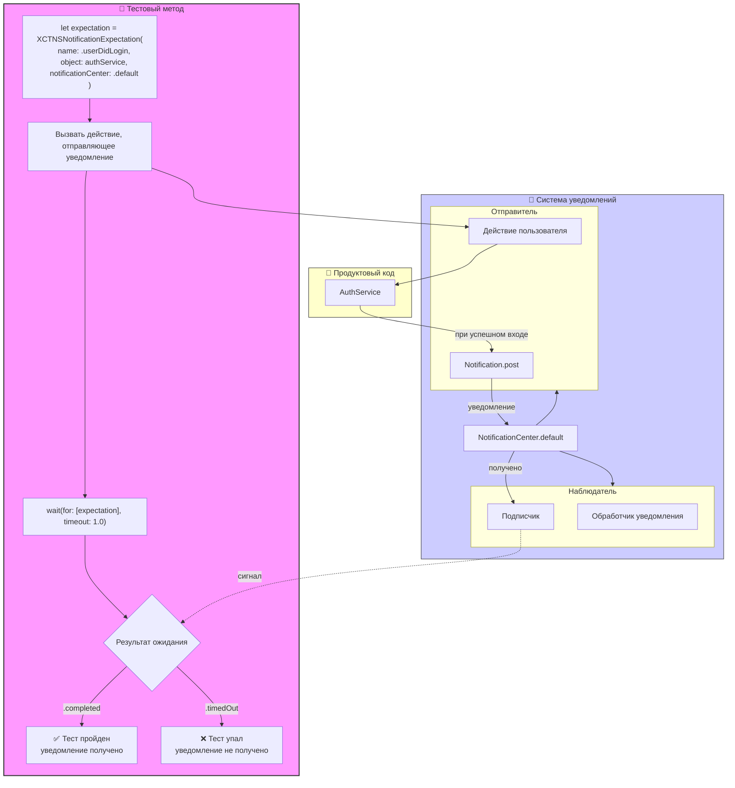

#testing #xctest #notification #expectation #async #unit-test #swift #notificationcenter 

---
### Определение
**XCTNSNotificationExpectation** — это специализированный подкласс [[XCTestExpectation]] во фреймворке [[XCTest]], который предназначен для тестирования отправки уведомлений через [[NotificationCenter]]. Он позволяет тесту ожидать, пока определенное уведомление не будет отправлено, и только потом продолжить выполнение .

Этот класс особенно полезен при тестировании компонентов, которые коммуницируют через уведомления: например, реакция на изменение настроек, обновление данных, системные события или межмодульное взаимодействие.

### Зачем это знать [[iOS]]-разработчику?
1.  **Тестирование уведомлений:** Проверка, что определенные уведомления отправляются в ответ на действия пользователя или изменения состояния.
2.  **Тестирование реакций на системные события:** Например, реакция приложения на уведомление `UIApplication.didBecomeActiveNotification`.
3.  **Межмодульное взаимодействие:** Если модули общаются через уведомления, это позволяет тестировать их изолированно.
4.  **Проверка наблюдателей:** Убедиться, что компоненты правильно подписываются на уведомления и реагируют на них.
5.  **Асинхронные проверки:** Ожидание уведомлений, которые приходят с задержкой.

---

### Архитектура и основные концепции



### Основные методы создания

#### 1. Простое ожидание уведомления
```swift
let expectation = XCTNSNotificationExpectation(name: .myCustomNotification)
```

#### 2. Ожидание уведомления от конкретного объекта
```swift
let expectation = XCTNSNotificationExpectation(name: .myCustomNotification, 
                                                object: expectedSender)
```

#### 3. Ожидание с дополнительной проверкой через блок
```swift
let expectation = XCTNSNotificationExpectation(name: .myCustomNotification) { notification in
    guard let value = notification.userInfo?["key"] as? String else { return false }
    return value == "expectedValue"
}
```

#### 4. Полная инициализация
```swift
let expectation = XCTNSNotificationExpectation(name: .myCustomNotification,
                                                object: expectedSender) { notification in
    // Дополнительная проверка
    return true
}
```

---

### Примеры от простого к сложному

#### Уровень 0: Подготовка тестового класса

```swift
import XCTest
@testable import MyApp

// Расширение для удобства работы с именами уведомлений
extension Notification.Name {
    static let dataUpdated = Notification.Name("com.myapp.dataUpdated")
    static let userLoggedIn = Notification.Name("com.myapp.userLoggedIn")
    static let progressChanged = Notification.Name("com.myapp.progressChanged")
    static let errorOccurred = Notification.Name("com.myapp.errorOccurred")
}

class NotificationManager {
    static let shared = NotificationManager()
    
    func postDataUpdated() {
        NotificationCenter.default.post(name: .dataUpdated, object: nil)
    }
    
    func postUserLoggedIn(userId: String) {
        NotificationCenter.default.post(name: .userLoggedIn, 
                                        object: self, 
                                        userInfo: ["userId": userId])
    }
    
    func postProgress(value: Double) {
        NotificationCenter.default.post(name: .progressChanged,
                                        object: nil,
                                        userInfo: ["progress": value])
    }
    
    func postError(message: String) {
        NotificationCenter.default.post(name: .errorOccurred,
                                        object: nil,
                                        userInfo: ["message": message])
    }
}
```

#### Уровень 1: Простое ожидание уведомления

```swift
import XCTest
@testable import MyApp

class NotificationTests: XCTestCase {
    
    func testDataUpdatedNotification() {
        // 1. Создаем ожидание уведомления
        let expectation = XCTNSNotificationExpectation(name: .dataUpdated)
        
        // 2. Запускаем действие, которое должно отправить уведомление
        NotificationManager.shared.postDataUpdated()
        
        // 3. Ждем выполнения
        let result = XCTWaiter.wait(for: [expectation], timeout: 1.0)
        
        // 4. Проверяем результат
        XCTAssertEqual(result, .completed, "Уведомление .dataUpdated не было получено")
    }
    
    func testNotificationNotPosted() {
        // Инвертированное ожидание - проверяем, что уведомление НЕ пришло
        let expectation = XCTNSNotificationExpectation(name: .dataUpdated)
        expectation.isInverted = true
        
        // НЕ отправляем уведомление
        
        let result = XCTWaiter.wait(for: [expectation], timeout: 1.0)
        XCTAssertEqual(result, .completed, "Уведомление пришло, хотя не должно было")
    }
}
```

#### Уровень 2: Ожидание с проверкой объекта-отправителя

```swift
import XCTest
@testable import MyApp

class SenderTests: XCTestCase {
    
    func testNotificationFromSpecificSender() {
        let manager = NotificationManager.shared
        
        // Ожидаем уведомление именно от этого менеджера
        let expectation = XCTNSNotificationExpectation(name: .userLoggedIn,
                                                        object: manager)
        
        manager.postUserLoggedIn(userId: "12345")
        
        wait(for: [expectation], timeout: 1.0)
    }
    
    func testNotificationFromWrongSender() {
        let manager = NotificationManager.shared
        let wrongSender = NSObject()
        
        // Ожидаем уведомление от конкретного объекта
        let expectation = XCTNSNotificationExpectation(name: .userLoggedIn,
                                                        object: wrongSender)
        
        // Уведомление приходит от другого объекта
        manager.postUserLoggedIn(userId: "12345")
        
        let result = XCTWaiter.wait(for: [expectation], timeout: 1.0)
        
        // Ожидание должно провалиться, так как отправитель не совпадает
        XCTAssertNotEqual(result, .completed)
    }
}
```

#### Уровень 3: Проверка userInfo через блок

```swift
import XCTest
@testable import MyApp

class UserInfoTests: XCTestCase {
    
    func testUserInfoContainsExpectedData() {
        let expectedUserId = "12345"
        
        // Создаем ожидание с блоком проверки
        let expectation = XCTNSNotificationExpectation(name: .userLoggedIn) { notification in
            guard let userId = notification.userInfo?["userId"] as? String else {
                return false
            }
            return userId == expectedUserId
        }
        
        NotificationManager.shared.postUserLoggedIn(userId: expectedUserId)
        
        wait(for: [expectation], timeout: 1.0)
    }
    
    func testProgressNotification() {
        let expectedProgress = 0.75
        
        let expectation = XCTNSNotificationExpectation(name: .progressChanged) { notification in
            guard let progress = notification.userInfo?["progress"] as? Double else {
                return false
            }
            return abs(progress - expectedProgress) < 0.001
        }
        
        NotificationCenter.default.post(name: .progressChanged,
                                        object: nil,
                                        userInfo: ["progress": expectedProgress])
        
        wait(for: [expectation], timeout: 1.0)
    }
}
```

#### Уровень 4: Ожидание нескольких уведомлений

```swift
import XCTest
@testable import MyApp

class MultipleNotificationsTests: XCTestCase {
    
    func testMultipleNotificationsInOrder() {
        // Создаем ожидания для разных уведомлений
        let dataUpdated = XCTNSNotificationExpectation(name: .dataUpdated)
        let userLoggedIn = XCTNSNotificationExpectation(name: .userLoggedIn)
        let progressChanged = XCTNSNotificationExpectation(name: .progressChanged)
        
        // Отправляем уведомления в определенном порядке
        DispatchQueue.main.asyncAfter(deadline: .now() + 0.1) {
            NotificationManager.shared.postDataUpdated()
        }
        
        DispatchQueue.main.asyncAfter(deadline: .now() + 0.2) {
            NotificationManager.shared.postUserLoggedIn(userId: "123")
        }
        
        DispatchQueue.main.asyncAfter(deadline: .now() + 0.3) {
            NotificationManager.shared.postProgress(value: 1.0)
        }
        
        // Ждем все уведомления
        wait(for: [dataUpdated, userLoggedIn, progressChanged], timeout: 1.0, enforceOrder: true)
    }
    
    func testMultipleNotificationsAnyOrder() {
        let dataUpdated = XCTNSNotificationExpectation(name: .dataUpdated)
        let userLoggedIn = XCTNSNotificationExpectation(name: .userLoggedIn)
        
        // Отправляем в обратном порядке
        NotificationManager.shared.postUserLoggedIn(userId: "123")
        NotificationManager.shared.postDataUpdated()
        
        // Ждем все, порядок не важен
        wait(for: [dataUpdated, userLoggedIn], timeout: 1.0, enforceOrder: false)
    }
}
```

#### Уровень 5: Тестирование наблюдателей

```swift
import XCTest
@testable import MyApp

// Класс, который подписывается на уведомления
class NotificationObserver: NSObject {
    var lastNotification: Notification?
    var notificationCount = 0
    
    override init() {
        super.init()
        NotificationCenter.default.addObserver(self,
                                               selector: #selector(handleNotification),
                                               name: .dataUpdated,
                                               object: nil)
    }
    
    @objc func handleNotification(_ notification: Notification) {
        lastNotification = notification
        notificationCount += 1
    }
    
    deinit {
        NotificationCenter.default.removeObserver(self)
    }
}

class ObserverTests: XCTestCase {
    
    func testObserverReceivesNotification() {
        let observer = NotificationObserver()
        
        // Ожидаем, что observer получит уведомление
        let expectation = XCTNSNotificationExpectation(name: .dataUpdated)
        
        NotificationManager.shared.postDataUpdated()
        
        wait(for: [expectation], timeout: 1.0)
        
        // Проверяем состояние observer'а
        XCTAssertEqual(observer.notificationCount, 1)
        XCTAssertNotNil(observer.lastNotification)
    }
    
    func testObserverReceivesMultipleNotifications() {
        let observer = NotificationObserver()
        
        let expectation1 = XCTNSNotificationExpectation(name: .dataUpdated)
        let expectation2 = XCTNSNotificationExpectation(name: .dataUpdated)
        
        NotificationManager.shared.postDataUpdated()
        NotificationManager.shared.postDataUpdated()
        
        wait(for: [expectation1, expectation2], timeout: 1.0)
        
        XCTAssertEqual(observer.notificationCount, 2)
    }
}
```

#### Уровень 6: Тестирование системных уведомлений

```swift
import XCTest
@testable import MyApp

class SystemNotificationTests: XCTestCase {
    
    var app: XCUIApplication?
    
    func testAppDidBecomeActive() {
        // Ожидаем системное уведомление о том, что приложение стало активным
        let expectation = XCTNSNotificationExpectation(name: UIApplication.didBecomeActiveNotification)
        
        // Симулируем возвращение приложения в активное состояние
        DispatchQueue.main.asyncAfter(deadline: .now() + 0.5) {
            NotificationCenter.default.post(name: UIApplication.didBecomeActiveNotification, object: nil)
        }
        
        wait(for: [expectation], timeout: 1.0)
    }
    
    func testKeyboardWillShow() {
        let expectation = XCTNSNotificationExpectation(name: UIResponder.keyboardWillShowNotification)
        
        // Пост уведомления о появлении клавиатуры
        NotificationCenter.default.post(name: UIResponder.keyboardWillShowNotification,
                                        object: nil,
                                        userInfo: [UIResponder.keyboardFrameEndUserInfoKey: CGRect(x: 0, y: 0, width: 320, height: 216)])
        
        wait(for: [expectation], timeout: 1.0)
    }
}
```

#### Уровень 7: Комбинирование с другими типами ожиданий

```swift
import XCTest
@testable import MyApp

class CombinedExpectationTests: XCTestCase {
    
    func testNotificationAndKVO() {
        let viewModel = ViewModel()
        
        // Ожидаем уведомление
        let notificationExpectation = XCTNSNotificationExpectation(name: .dataUpdated)
        
        // Ожидаем изменение KVO-свойства
        let kvoExpectation = XCTKVOExpectation(keyPath: \ViewModel.isLoading,
                                                object: viewModel,
                                                expectedValue: false)
        
        // Обычное ожидание
        let customExpectation = XCTestExpectation(description: "Дополнительная проверка")
        
        DispatchQueue.main.asyncAfter(deadline: .now() + 0.3) {
            NotificationManager.shared.postDataUpdated()
            customExpectation.fulfill()
        }
        
        viewModel.startLoading()
        
        // Ждем все ожидания
        wait(for: [notificationExpectation, kvoExpectation, customExpectation], timeout: 2.0)
    }
    
    func testNotificationWithPredicate() {
        // Ожидание с предикатом
        let predicate = NSPredicate { _, _ in
            // Сложная логика проверки
            return true
        }
        
        let predicateExpectation = XCTNSPredicateExpectation(predicate: predicate,
                                                              object: nil)
        
        let notificationExpectation = XCTNSNotificationExpectation(name: .dataUpdated)
        
        NotificationManager.shared.postDataUpdated()
        
        wait(for: [predicateExpectation, notificationExpectation], timeout: 1.0)
    }
}
```

#### Уровень 8: Тестирование с задержкой и асинхронностью

```swift
import XCTest
@testable import MyApp

class AsyncNotificationTests: XCTestCase {
    
    func testDelayedNotification() {
        let expectation = XCTNSNotificationExpectation(name: .dataUpdated)
        
        // Отправляем уведомление с задержкой
        DispatchQueue.global().asyncAfter(deadline: .now() + 0.5) {
            NotificationManager.shared.postDataUpdated()
        }
        
        // Ждем с достаточным тайм-аутом
        let result = XCTWaiter.wait(for: [expectation], timeout: 1.0)
        XCTAssertEqual(result, .completed)
    }
    
    func testNotificationOnBackgroundThread() {
        let expectation = XCTNSNotificationExpectation(name: .dataUpdated)
        
        // Отправляем уведомление из фонового потока
        DispatchQueue.global().async {
            NotificationCenter.default.post(name: .dataUpdated, object: nil)
        }
        
        // Ожидание должно работать независимо от потока
        wait(for: [expectation], timeout: 1.0)
    }
    
    func testMultipleDelayedNotifications() {
        let expectation1 = XCTNSNotificationExpectation(name: .dataUpdated)
        let expectation2 = XCTNSNotificationExpectation(name: .userLoggedIn)
        
        let group = DispatchGroup()
        
        group.enter()
        DispatchQueue.global().asyncAfter(deadline: .now() + 0.2) {
            NotificationManager.shared.postDataUpdated()
            group.leave()
        }
        
        group.enter()
        DispatchQueue.global().asyncAfter(deadline: .now() + 0.4) {
            NotificationManager.shared.postUserLoggedIn(userId: "123")
            group.leave()
        }
        
        // Ждем, пока обе отправки завершатся
        group.wait(timeout: .now() + 1.0)
        
        // Проверяем, что уведомления были получены
        let result1 = XCTWaiter.wait(for: [expectation1], timeout: 0.1)
        let result2 = XCTWaiter.wait(for: [expectation2], timeout: 0.1)
        
        XCTAssertEqual(result1, .completed)
        XCTAssertEqual(result2, .completed)
    }
}
```

#### Уровень 9: Обработка ошибок и тайм-аутов

```swift
import XCTest
@testable import MyApp

class ErrorHandlingTests: XCTestCase {
    
    func testNotificationTimeout() {
        // Создаем ожидание, которое никогда не выполнится
        let expectation = XCTNSNotificationExpectation(name: .dataUpdated)
        
        // НЕ отправляем уведомление
        
        let result = XCTWaiter.wait(for: [expectation], timeout: 1.0)
        
        // Проверяем, что произошел тайм-аут
        XCTAssertEqual(result, .timedOut)
    }
    
    func testNotificationWithWrongName() {
        // Ожидаем уведомление с неправильным именем
        let expectation = XCTNSNotificationExpectation(name: Notification.Name("WrongNotification"))
        
        // Отправляем правильное уведомление
        NotificationManager.shared.postDataUpdated()
        
        let result = XCTWaiter.wait(for: [expectation], timeout: 1.0)
        XCTAssertNotEqual(result, .completed)
    }
    
    func testNotificationWithCustomTimeoutMessage() {
        let expectation = XCTNSNotificationExpectation(name: .dataUpdated)
        
        let result = XCTWaiter.wait(for: [expectation], timeout: 0.5)
        
        switch result {
        case .completed:
            XCTFail("Уведомление пришло, хотя не должно было")
        case .timedOut:
            // Ожидаемый результат
            break
        case .incorrectOrder:
            XCTFail("Неправильный порядок")
        case .invertedFulfillment:
            XCTFail("Инвертированное ожидание выполнено")
        @unknown default:
            XCTFail("Неизвестный результат")
        }
    }
}
```

#### Уровень 10: Реальный пример - ViewModel с уведомлениями

```swift
import XCTest
@testable import MyApp

// ViewModel, которая использует уведомления
class SettingsViewModel: NSObject {
    @objc dynamic var isDarkMode: Bool = false
    
    override init() {
        super.init()
        
        NotificationCenter.default.addObserver(self,
                                               selector: #selector(handleSettingsChange),
                                               name: UserDefaults.didChangeNotification,
                                               object: nil)
    }
    
    @objc private func handleSettingsChange() {
        let newValue = UserDefaults.standard.bool(forKey: "darkMode")
        isDarkMode = newValue
    }
    
    func toggleDarkMode() {
        UserDefaults.standard.set(!isDarkMode, forKey: "darkMode")
    }
    
    deinit {
        NotificationCenter.default.removeObserver(self)
    }
}

class SettingsViewModelTests: XCTestCase {
    
    var viewModel: SettingsViewModel!
    
    override func setUp() {
        super.setUp()
        viewModel = SettingsViewModel()
        // Сбрасываем настройки перед каждым тестом
        UserDefaults.standard.removeObject(forKey: "darkMode")
    }
    
    func testSettingsChangeNotification() {
        // Ожидаем уведомление об изменении UserDefaults
        let expectation = XCTNSNotificationExpectation(name: UserDefaults.didChangeNotification)
        
        // Ожидаем KVO изменение свойства
        let kvoExpectation = XCTKVOExpectation(keyPath: \SettingsViewModel.isDarkMode,
                                                object: viewModel,
                                                expectedValue: true)
        
        viewModel.toggleDarkMode()
        
        // Ждем оба ожидания
        wait(for: [expectation, kvoExpectation], timeout: 1.0)
        
        XCTAssertTrue(viewModel.isDarkMode)
    }
    
    func testMultipleSettingsChanges() {
        let change1 = XCTNSNotificationExpectation(name: UserDefaults.didChangeNotification)
        let change2 = XCTNSNotificationExpectation(name: UserDefaults.didChangeNotification)
        
        viewModel.toggleDarkMode() // false -> true
        viewModel.toggleDarkMode() // true -> false
        
        wait(for: [change1, change2], timeout: 1.0)
        
        XCTAssertFalse(viewModel.isDarkMode)
    }
    
    func testNoNotificationWhenValueNotChanged() {
        // Инвертированное ожидание
        let expectation = XCTNSNotificationExpectation(name: UserDefaults.didChangeNotification)
        expectation.isInverted = true
        
        // Устанавливаем то же значение
        UserDefaults.standard.set(false, forKey: "darkMode")
        
        let result = XCTWaiter.wait(for: [expectation], timeout: 1.0)
        XCTAssertEqual(result, .completed, "Уведомление пришло, хотя значение не изменилось")
    }
}
```

---

### Важные нюансы и Best Practices

#### 1. **Имена уведомлений**
Всегда используйте расширения `Notification.Name` для создания типобезопасных имен уведомлений. Это предотвращает опечатки и делает код чище .

```swift
extension Notification.Name {
    static let myNotification = Notification.Name("com.myapp.myNotification")
}
```

#### 2. **Проверка объекта-отправителя**
Если важно, от кого именно пришло уведомление, обязательно указывайте параметр `object`. Иначе любое уведомление с таким именем выполнит ожидание .

#### 3. **Инвертированные ожидания**
Для проверки, что уведомление НЕ было отправлено, используйте `isInverted = true`. Это полезно для тестирования отрицательных сценариев .

#### 4. **Очистка после тестов**
Хотя `XCTNSNotificationExpectation` не требует ручной очистки, убедитесь, что ваши тесты не оставляют наблюдателей в `NotificationCenter`, которые могут повлиять на другие тесты.

#### 5. **Тайм-ауты**
Выбирайте разумные тайм-ауты. Для большинства уведомлений достаточно 0.5-1 секунды. Слишком большие тайм-ауты замедляют выполнение тестов.

#### 6. **Порядок выполнения**
Используйте `enforceOrder: true` в `wait(for:timeout:enforceOrder:)`, если важен порядок получения уведомлений .

#### 7. **Многопоточность**
Уведомления могут приходить из любого потока. `XCTNSNotificationExpectation` работает корректно независимо от потока, но помните о возможных состояниях гонки.

#### 8. **UserInfo и блоки**
Используйте блоки для проверки `userInfo`, если нужно убедиться, что уведомление содержит правильные данные.

#### 9. **Комбинирование с другими ожиданиями**
`XCTNSNotificationExpectation` можно комбинировать с `XCTKVOExpectation`, `XCTNSPredicateExpectation` и обычными `XCTestExpectation` для комплексных сценариев .

### Итог
**XCTNSNotificationExpectation** — это мощный инструмент для тестирования уведомлений в iOS. Он позволяет:

1.  **Ожидать отправку уведомлений** с проверкой имени и отправителя.
2.  **Проверять содержимое** `userInfo` через блоки.
3.  **Тестировать отрицательные сценарии** с инвертированными ожиданиями.
4.  **Комбинировать с другими типами ожиданий** для комплексного тестирования.
5.  **Работать с системными уведомлениями** так же легко, как с кастомными.

Ключевые навыки: создание типобезопасных имен уведомлений, использование блоков для проверки `userInfo`, комбинирование с другими ожиданиями, обработка тайм-аутов и инвертированных сценариев.