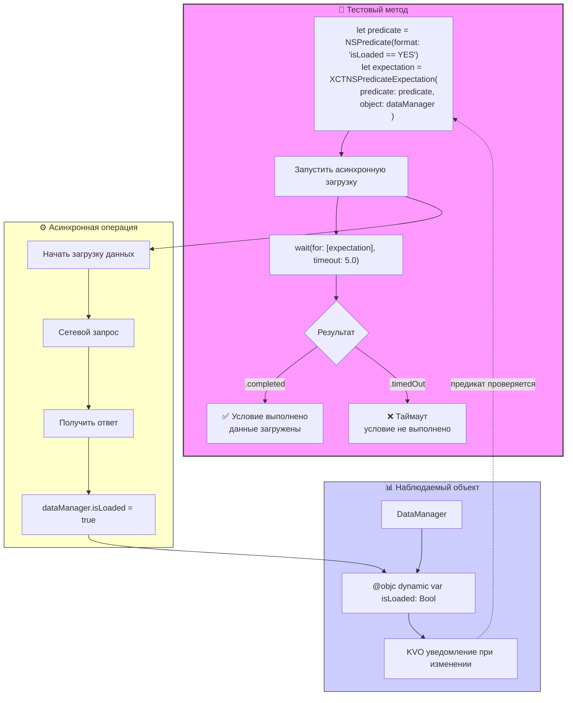

#testing #xctest #predicate #expectation #async #unit-test #swift #nspredicate

---
### Определение
**XCTNSPredicateExpectation** — это специализированный подкласс [[XCTestExpectation]] во фреймворке [[XCTest]], который позволяет тесту ожидать выполнения определенного условия, выраженного через `NSPredicate`. Ожидание считается выполненным, когда предикат возвращает `true` для заданного объекта или набора объектов .

Этот класс особенно полезен, когда нужно проверить, что некоторое состояние системы достигнуто, но это состояние не отслеживается через [[KVO]] или уведомления, либо когда условие сложное и требует комбинации проверок.

### Зачем это знать iOS-разработчику?
1.  **Сложные условия:** Проверка комбинации свойств объекта (например, `isLoaded && !isEmpty`).
2.  **Асинхронные состояния:** Ожидание, пока коллекция не достигнет определенного размера или пока элемент не появится в массиве.
3.  **Тестирование UI-состояний:** Например, ожидание, пока кнопка станет доступной (enabled) или пока лейбл не изменит текст.
4.  **Гибкость:** Предикаты позволяют выражать практически любые логические условия.
5.  **Альтернатива KVO:** Когда объект не поддерживает KVO, но его состояние можно проверить через предикат.

---

### Архитектура и основные концепции



### Основные методы создания

#### 1. Инициализация с предикатом и объектом
```swift
let predicate = NSPredicate(format: "isLoaded == true")
let expectation = XCTNSPredicateExpectation(predicate: predicate, 
                                             object: viewModel)
```

#### 2. Инициализация с блоком
```swift
let expectation = XCTNSPredicateExpectation { evaluatedObject, _ in
    guard let array = evaluatedObject as? [String] else { return false }
    return array.count > 5
}
```

#### 3. Инициализация с пользовательским блоком проверки
```swift
let expectation = XCTNSPredicateExpectation { evaluatedObject, _ in
    return (evaluatedObject as? MyClass)?.isReady ?? false
}
```

#### 4. Инициализация с именем для отчетности
```swift
let expectation = XCTNSPredicateExpectation(predicate: predicate,
                                             object: viewModel,
                                             description: "Ожидание загрузки данных")
```

---

### Примеры от простого к сложному

#### Уровень 0: Подготовка тестовых классов

```swift
import XCTest
@testable import MyApp

// Класс для тестирования
class DataManager: NSObject {
    @objc var items: [String] = []
    @objc var isLoading: Bool = false
    @objc var lastError: String?
    @objc var progress: Double = 0.0
    
    func loadData() {
        isLoading = true
        items = []
        
        DispatchQueue.global().asyncAfter(deadline: .now() + 0.5) { [weak self] in
            self?.items = ["Item 1", "Item 2", "Item 3", "Item 4", "Item 5"]
            self?.isLoading = false
            self?.progress = 1.0
        }
    }
    
    func loadWithProgress() {
        var currentProgress = 0.0
        Timer.scheduledTimer(withTimeInterval: 0.1, repeats: true) { timer in
            currentProgress += 0.2
            self.progress = currentProgress
            
            if currentProgress >= 1.0 {
                timer.invalidate()
                self.isLoading = false
            }
        }
    }
}
```

#### Уровень 1: Простое ожидание условия

```swift
import XCTest
@testable import MyApp

class PredicateTests: XCTestCase {
    
    func testWaitForItemsToLoad() {
        let dataManager = DataManager()
        
        // Создаем предикат: items не пуст
        let predicate = NSPredicate(format: "items.@count > 0")
        let expectation = XCTNSPredicateExpectation(predicate: predicate,
                                                     object: dataManager)
        
        dataManager.loadData()
        
        let result = XCTWaiter.wait(for: [expectation], timeout: 2.0)
        XCTAssertEqual(result, .completed)
        XCTAssertEqual(dataManager.items.count, 5)
    }
    
    func testWaitForLoadingToFinish() {
        let dataManager = DataManager()
        
        // Ожидаем, что isLoading станет false
        let predicate = NSPredicate(format: "isLoading == false")
        let expectation = XCTNSPredicateExpectation(predicate: predicate,
                                                     object: dataManager)
        
        dataManager.loadData()
        
        wait(for: [expectation], timeout: 2.0)
        XCTAssertFalse(dataManager.isLoading)
    }
}
```

#### Уровень 2: Сложные предикаты

```swift
import XCTest
@testable import MyApp

class ComplexPredicateTests: XCTestCase {
    
    func testComplexCondition() {
        let dataManager = DataManager()
        
        // Комбинация условий: загрузка завершена И есть элементы И нет ошибок
        let predicate = NSPredicate(format: "isLoading == false AND items.@count > 0 AND lastError == nil")
        let expectation = XCTNSPredicateExpectation(predicate: predicate,
                                                     object: dataManager)
        
        dataManager.loadData()
        
        wait(for: [expectation], timeout: 2.0)
        
        XCTAssertFalse(dataManager.isLoading)
        XCTAssertGreaterThan(dataManager.items.count, 0)
        XCTAssertNil(dataManager.lastError)
    }
    
    func testItemsCountExactly() {
        let dataManager = DataManager()
        
        // Ожидаем, что количество элементов станет равным 5
        let predicate = NSPredicate(format: "items.@count == 5")
        let expectation = XCTNSPredicateExpectation(predicate: predicate,
                                                     object: dataManager)
        
        dataManager.loadData()
        
        wait(for: [expectation], timeout: 2.0)
        XCTAssertEqual(dataManager.items.count, 5)
    }
}
```

#### Уровень 3: Использование ключевых путей и подстановок

```swift
import XCTest
@testable import MyApp

class KeyPathPredicateTests: XCTestCase {
    
    func testPredicateWithVariable() {
        let dataManager = DataManager()
        let expectedCount = 5
        
        // Используем переменную в предикате
        let predicate = NSPredicate(format: "items.@count == %d", expectedCount)
        let expectation = XCTNSPredicateExpectation(predicate: predicate,
                                                     object: dataManager)
        
        dataManager.loadData()
        
        wait(for: [expectation], timeout: 2.0)
    }
    
    func testPredicateWithStringVariable() {
        let dataManager = DataManager()
        let expectedItem = "Item 3"
        
        // Проверяем, что массив содержит конкретный элемент
        let predicate = NSPredicate(format: "ANY items == %@", expectedItem)
        let expectation = XCTNSPredicateExpectation(predicate: predicate,
                                                     object: dataManager)
        
        dataManager.loadData()
        
        wait(for: [expectation], timeout: 2.0)
        XCTAssertTrue(dataManager.items.contains(expectedItem))
    }
}
```

#### Уровень 4: Ожидание с блоком (без объекта)

```swift
import XCTest
@testable import MyApp

class BlockPredicateTests: XCTestCase {
    
    func testCustomBlockCondition() {
        var flag = false
        
        // Используем блок для проверки условия без конкретного объекта
        let expectation = XCTNSPredicateExpectation { _, _ in
            return flag == true
        }
        
        DispatchQueue.global().asyncAfter(deadline: .now() + 0.5) {
            flag = true
        }
        
        wait(for: [expectation], timeout: 1.0)
        XCTAssertTrue(flag)
    }
    
    func testComplexBlockCondition() {
        let dataManager = DataManager()
        
        let expectation = XCTNSPredicateExpectation { evaluatedObject, _ in
            guard let manager = evaluatedObject as? DataManager else { return false }
            return manager.items.count >= 3 && !manager.isLoading && manager.progress >= 0.5
        }
        
        dataManager.loadData()
        
        wait(for: [expectation], timeout: 2.0)
    }
}
```

#### Уровень 5: Ожидание изменений в коллекциях

```swift
import XCTest
@testable import MyApp

class CollectionPredicateTests: XCTestCase {
    
    func testArrayContainsElement() {
        let dataManager = DataManager()
        
        // Ожидаем, что массив содержит элемент с определенным префиксом
        let predicate = NSPredicate(format: "ANY items BEGINSWITH 'Item'")
        let expectation = XCTNSPredicateExpectation(predicate: predicate,
                                                     object: dataManager)
        
        dataManager.loadData()
        
        wait(for: [expectation], timeout: 2.0)
    }
    
    func testArrayAllElementsMatchCondition() {
        let dataManager = DataManager()
        
        // Все элементы должны начинаться с "Item"
        let predicate = NSPredicate(format: "ALL items BEGINSWITH 'Item'")
        let expectation = XCTNSPredicateExpectation(predicate: predicate,
                                                     object: dataManager)
        
        dataManager.loadData()
        
        wait(for: [expectation], timeout: 2.0)
        
        for item in dataManager.items {
            XCTAssertTrue(item.hasPrefix("Item"))
        }
    }
    
    func testArrayCountInRange() {
        let dataManager = DataManager()
        
        // Количество элементов от 3 до 10
        let predicate = NSPredicate(format: "items.@count BETWEEN {3, 10}")
        let expectation = XCTNSPredicateExpectation(predicate: predicate,
                                                     object: dataManager)
        
        dataManager.loadData()
        
        wait(for: [expectation], timeout: 2.0)
        XCTAssertTrue((3...10).contains(dataManager.items.count))
    }
}
```

#### Уровень 6: Ожидание прогресса

```swift
import XCTest
@testable import MyApp

class ProgressPredicateTests: XCTestCase {
    
    func testProgressReachesValue() {
        let dataManager = DataManager()
        
        // Ожидаем, что прогресс достигнет 0.5
        let predicate = NSPredicate(format: "progress >= 0.5")
        let expectation = XCTNSPredicateExpectation(predicate: predicate,
                                                     object: dataManager)
        
        dataManager.loadWithProgress()
        
        wait(for: [expectation], timeout: 1.0)
        
        // Проверяем, что прогресс действительно >= 0.5
        XCTAssertGreaterThanOrEqual(dataManager.progress, 0.5)
    }
    
    func testProgressExactlyOne() {
        let dataManager = DataManager()
        
        let predicate = NSPredicate(format: "progress == 1.0")
        let expectation = XCTNSPredicateExpectation(predicate: predicate,
                                                     object: dataManager)
        
        dataManager.loadWithProgress()
        
        wait(for: [expectation], timeout: 2.0)
        XCTAssertEqual(dataManager.progress, 1.0)
        XCTAssertFalse(dataManager.isLoading)
    }
}
```

#### Уровень 7: Комбинирование с другими ожиданиями

```swift
import XCTest
@testable import MyApp

class CombinedPredicateTests: XCTestCase {
    
    func testPredicateWithNotification() {
        let dataManager = DataManager()
        
        // Ожидаем выполнения предиката
        let predicate = NSPredicate(format: "isLoading == false AND items.@count > 0")
        let predicateExpectation = XCTNSPredicateExpectation(predicate: predicate,
                                                              object: dataManager)
        
        // Ожидаем уведомление
        let notificationExpectation = XCTNSNotificationExpectation(name: .dataUpdated)
        
        dataManager.loadData()
        
        wait(for: [predicateExpectation, notificationExpectation], timeout: 2.0)
    }
    
    func testPredicateWithKVO() {
        let dataManager = DataManager()
        
        // Предикат ожидания
        let predicate = NSPredicate(format: "progress == 1.0")
        let predicateExpectation = XCTNSPredicateExpectation(predicate: predicate,
                                                              object: dataManager)
        
        // KVO ожидание
        let kvoExpectation = XCTKVOExpectation(keyPath: \DataManager.isLoading,
                                                object: dataManager,
                                                expectedValue: false)
        
        dataManager.loadWithProgress()
        
        wait(for: [predicateExpectation, kvoExpectation], timeout: 2.0)
    }
}
```

#### Уровень 8: Обработка тайм-аутов и инвертированные ожидания

```swift
import XCTest
@testable import MyApp

class TimeoutPredicateTests: XCTestCase {
    
    func testPredicateTimeout() {
        let dataManager = DataManager()
        
        // Предикат, который никогда не выполнится
        let predicate = NSPredicate(format: "isLoading == false AND items.@count == 100")
        let expectation = XCTNSPredicateExpectation(predicate: predicate,
                                                     object: dataManager)
        
        dataManager.loadData() // загрузит только 5 элементов
        
        let result = XCTWaiter.wait(for: [expectation], timeout: 1.0)
        
        // Должен быть тайм-аут
        XCTAssertEqual(result, .timedOut)
        XCTAssertEqual(dataManager.items.count, 5)
    }
    
    func testInvertedPredicate() {
        let dataManager = DataManager()
        
        // Инвертированное ожидание - проверяем, что условие НЕ выполнится
        let predicate = NSPredicate(format: "items.@count == 10")
        let expectation = XCTNSPredicateExpectation(predicate: predicate,
                                                     object: dataManager)
        expectation.isInverted = true
        
        dataManager.loadData() // загрузит 5 элементов
        
        let result = XCTWaiter.wait(for: [expectation], timeout: 1.0)
        XCTAssertEqual(result, .completed, "Предикат выполнился, хотя не должен был")
    }
}
```

#### Уровень 9: Реальный пример с UI-элементами

```swift
import XCTest
import UIKit
@testable import MyApp

class UIPredicateTests: XCTestCase {
    
    func testButtonBecomesEnabled() {
        let button = UIButton()
        button.isEnabled = false
        
        let expectation = XCTNSPredicateExpectation { _, _ in
            return button.isEnabled
        }
        
        DispatchQueue.main.asyncAfter(deadline: .now() + 0.5) {
            button.isEnabled = true
        }
        
        wait(for: [expectation], timeout: 1.0)
        XCTAssertTrue(button.isEnabled)
    }
    
    func testLabelTextChanges() {
        let label = UILabel()
        label.text = "Начальный текст"
        
        // Ожидаем, что текст лейбла изменится на ожидаемый
        let predicate = NSPredicate(format: "text == 'Новый текст'")
        let expectation = XCTNSPredicateExpectation(predicate: predicate,
                                                     object: label)
        
        DispatchQueue.main.asyncAfter(deadline: .now() + 0.3) {
            label.text = "Новый текст"
        }
        
        wait(for: [expectation], timeout: 1.0)
        XCTAssertEqual(label.text, "Новый текст")
    }
}
```

#### Уровень 10: Комплексный пример с несколькими объектами

```swift
import XCTest
@testable import MyApp

class MultiObjectPredicateTests: XCTestCase {
    
    class Container: NSObject {
        @objc var manager1: DataManager
        @objc var manager2: DataManager
        
        init(manager1: DataManager, manager2: DataManager) {
            self.manager1 = manager1
            self.manager2 = manager2
            super.init()
        }
    }
    
    func testMultipleManagers() {
        let manager1 = DataManager()
        let manager2 = DataManager()
        let container = Container(manager1: manager1, manager2: manager2)
        
        // Ожидаем, что оба менеджера загрузили данные
        let predicate = NSPredicate(format: "manager1.isLoading == false AND manager2.isLoading == false")
        let expectation = XCTNSPredicateExpectation(predicate: predicate,
                                                     object: container)
        
        manager1.loadData()
        manager2.loadData()
        
        wait(for: [expectation], timeout: 3.0)
        
        XCTAssertFalse(manager1.isLoading)
        XCTAssertFalse(manager2.isLoading)
        XCTAssertGreaterThan(manager1.items.count, 0)
        XCTAssertGreaterThan(manager2.items.count, 0)
    }
    
    func testAnyManagerFinished() {
        let manager1 = DataManager()
        let manager2 = DataManager()
        let container = Container(manager1: manager1, manager2: manager2)
        
        // Ожидаем, что хотя бы один менеджер завершил загрузку
        let predicate = NSPredicate(format: "manager1.isLoading == false OR manager2.isLoading == false")
        let expectation = XCTNSPredicateExpectation(predicate: predicate,
                                                     object: container)
        
        manager1.loadData()
        manager2.loadData()
        
        wait(for: [expectation], timeout: 3.0)
        
        XCTAssertTrue(!manager1.isLoading || !manager2.isLoading)
    }
}
```

---

### Синтаксис NSPredicate для XCTNSPredicateExpectation

#### Основные операторы

| Оператор | Значение | Пример |
|----------|----------|--------|
| `==` | Равно | `isLoading == false` |
| `!=` | Не равно | `status != 'error'` |
| `>` | Больше | `items.@count > 5` |
| `<` | Меньше | `progress < 1.0` |
| `>=` | Больше или равно | `value >= 10` |
| `<=` | Меньше или равно | `value <= 20` |
| `BETWEEN` | В диапазоне | `items.@count BETWEEN {3, 10}` |
| `CONTAINS` | Содержит | `name CONTAINS 'John'` |
| `BEGINSWITH` | Начинается с | `name BEGINSWITH 'A'` |
| `ENDSWITH` | Заканчивается на | `name ENDSWITH 'son'` |
| `LIKE` | Поиск по шаблону | `name LIKE '*smith*'` |
| `MATCHES` | Регулярное выражение | `email MATCHES '.*@.*\..*'` |

#### Логические операторы

| Оператор | Значение | Пример |
|----------|----------|--------|
| `AND` (или `&&`) | И | `isLoading == false AND items.@count > 0` |
| `OR` (или `\|\|`) | ИЛИ | `status == 'loaded' OR status == 'cached'` |
| `NOT` (или `!`) | НЕ | `NOT isLoading` |

#### Агрегатные операторы для коллекций

| Оператор | Значение | Пример |
|----------|----------|--------|
| `@count` | Количество | `items.@count == 5` |
| `@min` | Минимум | `items.@min < 10` |
| `@max` | Максимум | `items.@max > 100` |
| `@avg` | Среднее | `items.@avg > 50` |
| `@sum` | Сумма | `items.@sum == 500` |
| `ANY` | Любой элемент | `ANY items == 'target'` |
| `ALL` | Все элементы | `ALL items BEGINSWITH 'Item'` |

---

### Важные нюансы и Best Practices

#### 1. **KVO-совместимость**
Для автоматической проверки предиката объект должен быть KVO-совместимым по отслеживаемым свойствам. Если свойство не KVO-совместимо, предикат будет проверяться только один раз при создании ожидания .

```swift
// Правильно - KVO-совместимое свойство
class MyClass: NSObject {
    @objc dynamic var value: Int = 0  // dynamic обязательно
}

// Неправильно - обычное свойство
class MyClass {
    var value: Int = 0  // KVO не работает
}
```

#### 2. **Периодическая проверка**
`XCTNSPredicateExpectation` автоматически переоценивает предикат с частотой, управляемой системой (обычно каждый цикл [[RunLoop]]). Не нужно вручную вызывать проверки.

#### 3. **Производительность**
Сложные предикаты могут замедлять тесты. Для часто проверяемых условий старайтесь делать предикаты максимально простыми.

#### 4. **Альтернатива блокам**
Если условие сложное или не укладывается в синтаксис предикатов, используйте блок:

```swift
let expectation = XCTNSPredicateExpectation { evaluatedObject, _ in
    // Любая сложная логика
    return condition
}
```

#### 5. **Отладка**
При падении теста добавьте дополнительную информацию:

```swift
let expectation = XCTNSPredicateExpectation(predicate: predicate,
                                             object: dataManager,
                                             description: "Ожидание загрузки данных")
```

#### 6. **Тайм-ауты**
Всегда устанавливайте разумные тайм-ауты. Для большинства UI-тестов достаточно 1-2 секунд, для сетевых - 3-5 секунд.

#### 7. **Инвертированные ожидания**
Используйте `isInverted = true` для проверки, что условие НЕ должно выполниться в течение заданного времени .

#### 8. **Комбинирование**
Не бойтесь комбинировать `XCTNSPredicateExpectation` с другими типами ожиданий для комплексных сценариев.

### Итог
**XCTNSPredicateExpectation** — это универсальный инструмент для тестирования асинхронных условий. Он позволяет:

1.  **Ожидать сложные логические условия** через мощный синтаксис NSPredicate.
2.  **Проверять состояния объектов**, которые не поддерживают KVO или уведомления.
3.  **Работать с коллекциями** и их свойствами (количество, наличие элементов).
4.  **Комбинироваться с другими ожиданиями** для полного покрытия сценариев.
5.  **Использовать блоки** для кастомной логики проверки.

Ключевые навыки: написание эффективных предикатов, понимание KVO-совместимости, комбинирование с другими типами ожиданий, обработка тайм-аутов и инвертированных сценариев.