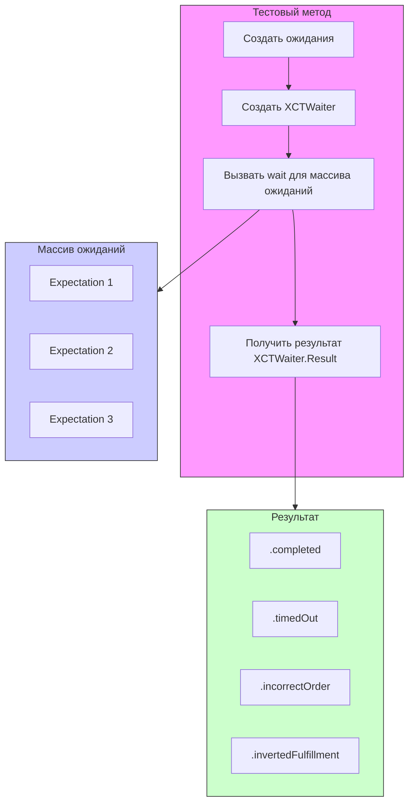

#testing #xctest #waiter #expectation #async #unit-test #swift #xctwaiter

---
### Определение
**XCTWaiter** — это класс во фреймворке [[XCTest]], который предоставляет расширенные возможности для ожидания выполнения асинхронных операций. В отличие от функции `wait(for:timeout:)`, `XCTWaiter` дает разработчику больше контроля над процессом ожидания: он позволяет обрабатывать результаты, ожидать несколько ожиданий с разными тайм-аутами, а также создавать кастомные стратегии ожидания .

По сути, `XCTWaiter` — это "ожидальщик" (waiter), который управляет массивом ожиданий ([[XCTestExpectation]]) и возвращает детальный результат о том, как завершилось ожидание: успешно, по тайм-ауту, в неправильном порядке или с инвертированным ожиданием.

### Зачем это знать iOS-разработчику?
1.  **Детальная обработка результатов:** Нужно знать не просто "успех/неуспех", а конкретную причину (тайм-аут, неправильный порядок).
2.  **Ожидание с разными тайм-аутами:** Для разных ожиданий могут требоваться разные максимальные времена ожидания.
3.  **Параллельное ожидание:** Возможность ожидать несколько ожиданий одновременно с контролем результата.
4.  **Кастомные стратегии:** Создание собственных waiter'ов с определенным поведением.
5.  **Более чистый код:** В некоторых случаях использование `XCTWaiter` делает код более явным и читаемым.

---

### Архитектура и основные концепции



### Основные методы

#### 1. Стандартное ожидание
```swift
let result = XCTWaiter.wait(for: [expectation], timeout: 1.0)
```

#### 2. Ожидание с контролем порядка
```swift
let result = XCTWaiter.wait(for: [exp1, exp2], timeout: 1.0, enforceOrder: true)
```

#### 3. Кастомный waiter
```swift
let waiter = XCTWaiter()
let result = waiter.wait(for: [expectation], timeout: 1.0)
```

#### 4. Статический метод (устаревший)
```swift
// Не рекомендуется, используйте wait(for:timeout:)
XCTWaiter.wait(for: [expectation], timeout: 1.0)
```

### Тип результата XCTWaiter.Result

`XCTWaiter.Result` — это перечисление, которое возвращает метод `wait`:

| Значение | Описание |
|----------|----------|
| `.completed` | Все ожидания были успешно выполнены |
| `.timedOut` | Время ожидания истекло, и не все ожидания были выполнены |
| `.incorrectOrder` | Ожидания были выполнены в неправильном порядке (при `enforceOrder = true`) |
| `.invertedFulfillment` | Инвертированное ожидание (`isInverted = true`) было выполнено (что является ошибкой) |

---

### Примеры от простого к сложному

#### Уровень 0: Подготовка тестового класса

```swift
import XCTest
@testable import MyApp

class WaiterTests: XCTestCase {
    
    func createExpectation(description: String, fulfillAfter delay: TimeInterval) -> XCTestExpectation {
        let expectation = XCTestExpectation(description: description)
        
        DispatchQueue.global().asyncAfter(deadline: .now() + delay) {
            expectation.fulfill()
        }
        
        return expectation
    }
    
    func createInvertedExpectation(description: String) -> XCTestExpectation {
        let expectation = XCTestExpectation(description: description)
        expectation.isInverted = true
        return expectation
    }
}
```

#### Уровень 1: Базовое использование

```swift
import XCTest
@testable import MyApp

class BasicWaiterTests: XCTestCase {
    
    func testSimpleWait() {
        let expectation = XCTestExpectation(description: "Простое ожидание")
        
        DispatchQueue.global().asyncAfter(deadline: .now() + 0.5) {
            expectation.fulfill()
        }
        
        let result = XCTWaiter.wait(for: [expectation], timeout: 1.0)
        
        // Проверяем результат
        switch result {
        case .completed:
            XCTAssertTrue(true, "Ожидание выполнено успешно")
        case .timedOut:
            XCTFail("Ожидание не выполнилось вовремя")
        case .incorrectOrder:
            XCTFail("Неправильный порядок (не должен был случиться)")
        case .invertedFulfillment:
            XCTFail("Инвертированное ожидание выполнено (не должно было)")
        @unknown default:
            XCTFail("Неизвестный результат")
        }
    }
    
    func testWaitWithTimeout() {
        let expectation = createExpectation(description: "Медленная операция", 
                                           fulfillAfter: 2.0)
        
        let result = XCTWaiter.wait(for: [expectation], timeout: 1.0)
        
        // Должен быть тайм-аут
        XCTAssertEqual(result, .timedOut)
    }
}
```

#### Уровень 2: Ожидание нескольких ожиданий

```swift
import XCTest
@testable import MyApp

class MultipleExpectationsTests: XCTestCase {
    
    func testMultipleExpectations() {
        let exp1 = createExpectation(description: "Операция 1", fulfillAfter: 0.3)
        let exp2 = createExpectation(description: "Операция 2", fulfillAfter: 0.5)
        let exp3 = createExpectation(description: "Операция 3", fulfillAfter: 0.7)
        
        let result = XCTWaiter.wait(for: [exp1, exp2, exp3], timeout: 1.0)
        
        XCTAssertEqual(result, .completed)
    }
    
    func testMultipleWithOneFailing() {
        let exp1 = createExpectation(description: "Быстрая", fulfillAfter: 0.1)
        let exp2 = createExpectation(description: "Медленная", fulfillAfter: 2.0)
        let exp3 = createExpectation(description: "Средняя", fulfillAfter: 0.5)
        
        let result = XCTWaiter.wait(for: [exp1, exp2, exp3], timeout: 1.0)
        
        // Одна из операций не успела
        XCTAssertEqual(result, .timedOut)
    }
}
```

#### Уровень 3: Контроль порядка выполнения

```swift
import XCTest
@testable import MyApp

class OrderTests: XCTestCase {
    
    func testCorrectOrder() {
        let exp1 = createExpectation(description: "Первый шаг", fulfillAfter: 0.2)
        let exp2 = createExpectation(description: "Второй шаг", fulfillAfter: 0.4)
        let exp3 = createExpectation(description: "Третий шаг", fulfillAfter: 0.6)
        
        let result = XCTWaiter.wait(for: [exp1, exp2, exp3], 
                                     timeout: 1.0, 
                                     enforceOrder: true)
        
        XCTAssertEqual(result, .completed, "Ожидания должны выполниться в правильном порядке")
    }
    
    func testIncorrectOrder() {
        let exp1 = createExpectation(description: "Первый шаг", fulfillAfter: 0.4)
        let exp2 = createExpectation(description: "Второй шаг", fulfillAfter: 0.2) // Выполнится раньше
        
        let result = XCTWaiter.wait(for: [exp1, exp2], 
                                     timeout: 1.0, 
                                     enforceOrder: true)
        
        // Должен быть неправильный порядок
        XCTAssertEqual(result, .incorrectOrder)
    }
    
    func testPartialIncorrectOrder() {
        let exp1 = createExpectation(description: "Шаг 1", fulfillAfter: 0.1)
        let exp2 = createExpectation(description: "Шаг 2", fulfillAfter: 0.3)
        let exp3 = createExpectation(description: "Шаг 3", fulfillAfter: 0.2) // exp3 раньше exp2
        
        let result = XCTWaiter.wait(for: [exp1, exp2, exp3], 
                                     timeout: 1.0, 
                                     enforceOrder: true)
        
        // exp1 выполнился правильно, но потом exp3 до exp2
        XCTAssertEqual(result, .incorrectOrder)
    }
}
```

#### Уровень 4: Инвертированные ожидания

```swift
import XCTest
@testable import MyApp

class InvertedTests: XCTestCase {
    
    func testInvertedNotFulfilled() {
        let exp = createInvertedExpectation(description: "Не должно выполниться")
        
        // НЕ выполняем ожидание
        
        let result = XCTWaiter.wait(for: [exp], timeout: 1.0)
        
        // Инвертированное ожидание НЕ выполнилось - это успех
        XCTAssertEqual(result, .completed)
    }
    
    func testInvertedFulfilled() {
        let exp = createInvertedExpectation(description: "Не должно выполниться")
        
        // Выполняем ожидание (хотя оно инвертированное)
        exp.fulfill()
        
        let result = XCTWaiter.wait(for: [exp], timeout: 1.0)
        
        // Инвертированное ожидание выполнилось - это ошибка
        XCTAssertEqual(result, .invertedFulfillment)
    }
    
    func testMixedInvertedAndNormal() {
        let normalExp = createExpectation(description: "Нормальное", fulfillAfter: 0.3)
        let invertedExp = createInvertedExpectation(description: "Инвертированное")
        
        let result = XCTWaiter.wait(for: [normalExp, invertedExp], timeout: 1.0)
        
        // Нормальное выполнилось, инвертированное не выполнилось - успех
        XCTAssertEqual(result, .completed)
    }
    
    func testMixedWithInvertedFulfilled() {
        let normalExp = createExpectation(description: "Нормальное", fulfillAfter: 0.3)
        let invertedExp = createInvertedExpectation(description: "Инвертированное")
        
        // Выполняем инвертированное
        invertedExp.fulfill()
        
        let result = XCTWaiter.wait(for: [normalExp, invertedExp], timeout: 1.0)
        
        // Инвертированное выполнилось - ошибка
        XCTAssertEqual(result, .invertedFulfillment)
    }
}
```

#### Уровень 5: Кастомные waiter'ы и повторное использование

```swift
import XCTest
@testable import MyApp

class CustomWaiterTests: XCTestCase {
    
    func testCustomWaiterInstance() {
        let waiter = XCTWaiter()
        
        let exp1 = createExpectation(description: "Операция 1", fulfillAfter: 0.2)
        let exp2 = createExpectation(description: "Операция 2", fulfillAfter: 0.4)
        
        let result1 = waiter.wait(for: [exp1], timeout: 0.5)
        XCTAssertEqual(result1, .completed)
        
        let result2 = waiter.wait(for: [exp2], timeout: 0.5)
        XCTAssertEqual(result2, .completed)
    }
    
    func testReusingWaiter() {
        let waiter = XCTWaiter()
        
        // Первая группа ожиданий
        let expGroup1 = createExpectation(description: "Группа 1", fulfillAfter: 0.1)
        let result1 = waiter.wait(for: [expGroup1], timeout: 0.5)
        XCTAssertEqual(result1, .completed)
        
        // Вторая группа ожиданий (можно использовать того же waiter'а)
        let expGroup2 = createExpectation(description: "Группа 2", fulfillAfter: 0.2)
        let result2 = waiter.wait(for: [expGroup2], timeout: 0.5)
        XCTAssertEqual(result2, .completed)
    }
}
```

#### Уровень 6: Параллельное ожидание с разными тайм-аутами

```swift
import XCTest
@testable import MyApp

class ParallelWaiterTests: XCTestCase {
    
    func testWaitWithDifferentTimeouts() {
        let waiter1 = XCTWaiter()
        let waiter2 = XCTWaiter()
        
        let exp1 = createExpectation(description: "Короткая", fulfillAfter: 0.3)
        let exp2 = createExpectation(description: "Длинная", fulfillAfter: 1.5)
        
        let expectation = self.expectation(description: "Параллельные ожидания")
        
        DispatchQueue.global().async {
            let result1 = waiter1.wait(for: [exp1], timeout: 0.5)
            XCTAssertEqual(result1, .completed)
            
            let result2 = waiter2.wait(for: [exp2], timeout: 2.0)
            XCTAssertEqual(result2, .completed)
            
            expectation.fulfill()
        }
        
        wait(for: [expectation], timeout: 3.0)
    }
    
    func testConcurrentWaitWithDelegate() {
        class WaiterDelegate: NSObject, XCTWaiterDelegate {
            var fulfilledExpectations: [XCTestExpectation] = []
            
            func waiter(_ waiter: XCTWaiter, didFulfillInvertedExpectation expectation: XCTestExpectation) {
                XCTFail("Инвертированное ожидание выполнилось: \(expectation.description)")
            }
            
            func waiter(_ waiter: XCTWaiter, fulfillmentDidExpectationOrder expectation: XCTestExpectation) {
                fulfilledExpectations.append(expectation)
                print("Ожидание выполнено: \(expectation.description)")
            }
            
            func waiterDidTimeout(_ waiter: XCTWaiter) {
                print("Waiter завершился по тайм-ауту")
            }
        }
        
        let delegate = WaiterDelegate()
        let waiter = XCTWaiter(delegate: delegate)
        
        let exp1 = createExpectation(description: "Первое", fulfillAfter: 0.2)
        let exp2 = createExpectation(description: "Второе", fulfillAfter: 0.4)
        
        let result = waiter.wait(for: [exp1, exp2], timeout: 1.0)
        
        XCTAssertEqual(result, .completed)
        XCTAssertEqual(delegate.fulfilledExpectations.count, 2)
    }
}
```

#### Уровень 7: Обработка результатов с [[switch]]

```swift
import XCTest
@testable import MyApp

class ResultHandlingTests: XCTestCase {
    
    func testHandleAllPossibleResults() {
        let exp1 = createExpectation(description: "Ожидание 1", fulfillAfter: 0.5)
        let exp2 = createExpectation(description: "Ожидание 2", fulfillAfter: 0.3)
        
        let result = XCTWaiter.wait(for: [exp1, exp2], timeout: 1.0, enforceOrder: true)
        
        switch result {
        case .completed:
            // Все хорошо
            XCTAssertTrue(true)
            
        case .timedOut:
            XCTFail("Не все ожидания выполнились вовремя")
            // Можно вывести, какие именно не выполнились
            if !exp1.isInverted && !exp1.isFulfilled {
                print("exp1 не выполнилось")
            }
            if !exp2.isInverted && !exp2.isFulfilled {
                print("exp2 не выполнилось")
            }
            
        case .incorrectOrder:
            XCTFail("Ожидания выполнились в неправильном порядке")
            // Можно проверить порядок вручную
            print("Порядок выполнения нарушен")
            
        case .invertedFulfillment:
            XCTFail("Инвертированное ожидание было выполнено")
            
        @unknown default:
            XCTFail("Неизвестный результат")
        }
    }
    
    func testDetailedTimeoutAnalysis() {
        let exp1 = createExpectation(description: "Быстрая", fulfillAfter: 0.2)
        let exp2 = createExpectation(description: "Медленная", fulfillAfter: 1.5)
        
        let startTime = Date()
        let result = XCTWaiter.wait(for: [exp1, exp2], timeout: 1.0)
        let elapsed = Date().timeIntervalSince(startTime)
        
        switch result {
        case .timedOut:
            print("Тайм-аут через \(elapsed) секунд")
            XCTAssertTrue(exp1.isFulfilled)
            XCTAssertFalse(exp2.isFulfilled)
            
        default:
            XCTFail("Ожидался тайм-аут")
        }
    }
}
```

#### Уровень 8: Комбинирование с [[XCTNSNotificationExpectation]]

```swift
import XCTest
@testable import MyApp

class MixedExpectationsTests: XCTestCase {
    
    func testMixedExpectations() {
        let predicateExp = XCTNSPredicateExpectation { _, _ in
            // Сложное условие
            return true
        }
        
        let notificationExp = XCTNSNotificationExpectation(name: .dataUpdated)
        
        let kvoExp = XCTKVOExpectation(keyPath: \DataManager.isLoading,
                                        object: DataManager(),
                                        expectedValue: false)
        
        let result = XCTWaiter.wait(for: [predicateExp, notificationExp, kvoExp], timeout: 2.0)
        
        XCTAssertEqual(result, .completed)
    }
    
    func testMixedWithOrder() {
        let firstExp = XCTestExpectation(description: "Первый шаг")
        let secondExp = XCTNSNotificationExpectation(name: .dataUpdated)
        
        DispatchQueue.global().asyncAfter(deadline: .now() + 0.2) {
            firstExp.fulfill()
        }
        
        DispatchQueue.global().asyncAfter(deadline: .now() + 0.4) {
            NotificationCenter.default.post(name: .dataUpdated, object: nil)
        }
        
        let result = XCTWaiter.wait(for: [firstExp, secondExp], timeout: 1.0, enforceOrder: true)
        XCTAssertEqual(result, .completed)
    }
}
```

#### Уровень 9: Тестирование с XCTWaiter.Delegate

```swift
import XCTest
@testable import MyApp

class WaiterDelegateTests: XCTestCase {
    
    class TestWaiterDelegate: NSObject, XCTWaiterDelegate {
        var timeoutCalled = false
        var invertedFulfilled: XCTestExpectation?
        var fulfilledOrder: [XCTestExpectation] = []
        
        func waiter(_ waiter: XCTWaiter, didTimeoutWithUnfulfilledExpectations unfulfilledExpectations: [XCTestExpectation]) {
            timeoutCalled = true
            print("Тайм-аут. Не выполнены: \(unfulfilledExpectations.map { $0.description })")
        }
        
        func waiter(_ waiter: XCTWaiter, didFulfillInvertedExpectation expectation: XCTestExpectation) {
            invertedFulfilled = expectation
            XCTFail("Инвертированное ожидание '\(expectation.description)' было выполнено")
        }
        
        func waiter(_ waiter: XCTWaiter, fulfillmentDidExpectationOrder expectation: XCTestExpectation) {
            fulfilledOrder.append(expectation)
            print("Ожидание выполнено: \(expectation.description)")
        }
        
        func waiterDidTimeout(_ waiter: XCTWaiter) {
            timeoutCalled = true
        }
    }
    
    func testWaiterWithDelegate() {
        let delegate = TestWaiterDelegate()
        let waiter = XCTWaiter(delegate: delegate)
        
        let exp1 = XCTestExpectation(description: "Ожидание 1")
        let exp2 = XCTestExpectation(description: "Ожидание 2")
        
        DispatchQueue.global().asyncAfter(deadline: .now() + 0.1) { exp1.fulfill() }
        DispatchQueue.global().asyncAfter(deadline: .now() + 0.2) { exp2.fulfill() }
        
        let result = waiter.wait(for: [exp1, exp2], timeout: 1.0, enforceOrder: true)
        
        XCTAssertEqual(result, .completed)
        XCTAssertEqual(delegate.fulfilledOrder.count, 2)
        XCTAssertEqual(delegate.fulfilledOrder.first, exp1)
        XCTAssertEqual(delegate.fulfilledOrder.last, exp2)
        XCTAssertFalse(delegate.timeoutCalled)
    }
    
    func testWaiterWithTimeoutDelegate() {
        let delegate = TestWaiterDelegate()
        let waiter = XCTWaiter(delegate: delegate)
        
        let exp = XCTestExpectation(description: "Ожидание, которое не выполнится")
        
        let result = waiter.wait(for: [exp], timeout: 0.5)
        
        XCTAssertEqual(result, .timedOut)
        XCTAssertTrue(delegate.timeoutCalled)
    }
}
```

#### Уровень 10: Реальный пример с сетевыми запросами

```swift
import XCTest
@testable import MyApp

class NetworkWaiterTests: XCTestCase {
    
    class NetworkService {
        func fetchData(completion: @escaping (Result<[String], Error>) -> Void) {
            DispatchQueue.global().asyncAfter(deadline: .now() + 0.5) {
                completion(.success(["Item 1", "Item 2", "Item 3"]))
            }
        }
        
        func fetchWithProgress(progressHandler: @escaping (Double) -> Void, 
                               completion: @escaping () -> Void) {
            var progress = 0.0
            Timer.scheduledTimer(withTimeInterval: 0.1, repeats: true) { timer in
                progress += 0.2
                progressHandler(progress)
                
                if progress >= 1.0 {
                    timer.invalidate()
                    completion()
                }
            }
        }
    }
    
    func testNetworkRequestWithWaiter() {
        let service = NetworkService()
        let completionExp = XCTestExpectation(description: "Завершение запроса")
        var resultData: [String]?
        
        service.fetchData { result in
            switch result {
            case .success(let data):
                resultData = data
            case .failure:
                XCTFail("Ошибка запроса")
            }
            completionExp.fulfill()
        }
        
        let waiter = XCTWaiter()
        let result = waiter.wait(for: [completionExp], timeout: 2.0)
        
        XCTAssertEqual(result, .completed)
        XCTAssertEqual(resultData?.count, 3)
    }
    
    func testProgressWithWaiter() {
        let service = NetworkService()
        
        let progressExp = XCTKVOExpectation(keyPath: "progress") // Упрощенно
        let completionExp = XCTestExpectation(description: "Завершение")
        
        service.fetchWithProgress { progress in
            print("Прогресс: \(progress)")
        } completion: {
            completionExp.fulfill()
        }
        
        let result = XCTWaiter.wait(for: [progressExp, completionExp], timeout: 2.0)
        XCTAssertEqual(result, .completed)
    }
    
    func testMultipleNetworkRequests() {
        let service = NetworkService()
        let exp1 = XCTestExpectation(description: "Запрос 1")
        let exp2 = XCTestExpectation(description: "Запрос 2")
        
        service.fetchData { _ in exp1.fulfill() }
        service.fetchData { _ in exp2.fulfill() }
        
        let result = XCTWaiter.wait(for: [exp1, exp2], timeout: 2.0)
        XCTAssertEqual(result, .completed)
    }
}
```

---

### Сравнение: wait(for:timeout:) vs XCTWaiter

| Характеристика | wait(for:timeout:) | XCTWaiter |
|----------------|-------------------|-----------|
| **Возвращаемое значение** | `Void` (только падает при ошибке) | `XCTWaiter.Result` (детальный результат) |
| **Обработка ошибок** | Только через падение теста | Можно анализировать результат |
| **Порядок выполнения** | Не поддерживает | Поддерживает `enforceOrder` |
| **Кастомные делегаты** | Нет | Да, через `XCTWaiterDelegate` |
| **Повторное использование** | Нет | Да, можно создавать экземпляры |
| **Инвертированные ожидания** | Поддерживает | Поддерживает с детальным результатом |

### XCTWaiterDelegate

Протокол `XCTWaiterDelegate` позволяет получать обратные вызовы в процессе ожидания:

```swift
public protocol XCTWaiterDelegate: AnyObject {
    func waiter(_ waiter: XCTWaiter, didFulfillInvertedExpectation expectation: XCTestExpectation)
    func waiter(_ waiter: XCTWaiter, fulfillmentDidExpectationOrder expectation: XCTestExpectation)
    func waiterDidTimeout(_ waiter: XCTWaiter)
}
```

- **`didFulfillInvertedExpectation`**: Вызывается, если инвертированное ожидание было выполнено (что обычно является ошибкой).
- **`fulfillmentDidExpectationOrder`**: Вызывается каждый раз, когда ожидание выполняется в правильном порядке.
- **`waiterDidTimeout`**: Вызывается при тайм-ауте.

---

### Важные нюансы и Best Practices

#### 1. **Предпочитайте XCTWaiter простому wait**
Для тестов, где важна диагностика, используйте `XCTWaiter`, так как он предоставляет детальную информацию о результате .

#### 2. **Проверяйте результат**
Всегда проверяйте результат `XCTWaiter`, а не просто вызывайте `wait`. Это дает больше информации о причине падения теста.

```swift
let result = XCTWaiter.wait(for: [exp], timeout: 1.0)
XCTAssertEqual(result, .completed, "Ожидание не выполнилось: \(result)")
```

#### 3. **Используйте enforceOrder для последовательных операций**
Если важен порядок выполнения, всегда устанавливайте `enforceOrder: true`.

#### 4. **Обрабатывайте инвертированные ожидания**
Инвертированные ожидания могут привести к непредсказуемым результатам. Используйте их осторожно и всегда проверяйте результат.

#### 5. **Не смешивайте тайм-ауты без необходимости**
Если используете несколько waiter'ов с разными тайм-аутами, убедитесь, что это действительно нужно, и документируйте причину.

#### 6. **Delegate для сложной логики**
Используйте `XCTWaiterDelegate` для логирования или кастомной обработки событий в процессе ожидания.

#### 7. **Производительность**
`XCTWaiter` не добавляет значительных накладных расходов по сравнению с простым `wait`. Используйте его всегда, когда нужен контроль.

#### 8. **Комбинируйте с разными типами ожиданий**
`XCTWaiter` отлично работает с любыми типами ожиданий: `XCTestExpectation`, `XCTKVOExpectation`, `XCTNSNotificationExpectation`, `XCTNSPredicateExpectation`.

### Итог
**XCTWaiter** — это мощный инструмент для управления асинхронными ожиданиями в тестах. Он предоставляет:

1.  **Детальную информацию о результате** через `XCTWaiter.Result`.
2.  **Контроль порядка выполнения** ожиданий.
3.  **Кастомные делегаты** для мониторинга процесса.
4.  **Гибкость в обработке** инвертированных ожиданий.
5.  **Возможность повторного использования** экземпляров waiter'а.

Ключевые навыки: анализ результатов ожидания, использование `enforceOrder` для последовательных операций, обработка инвертированных ожиданий, создание кастомных делегатов, комбинирование с различными типами ожиданий.