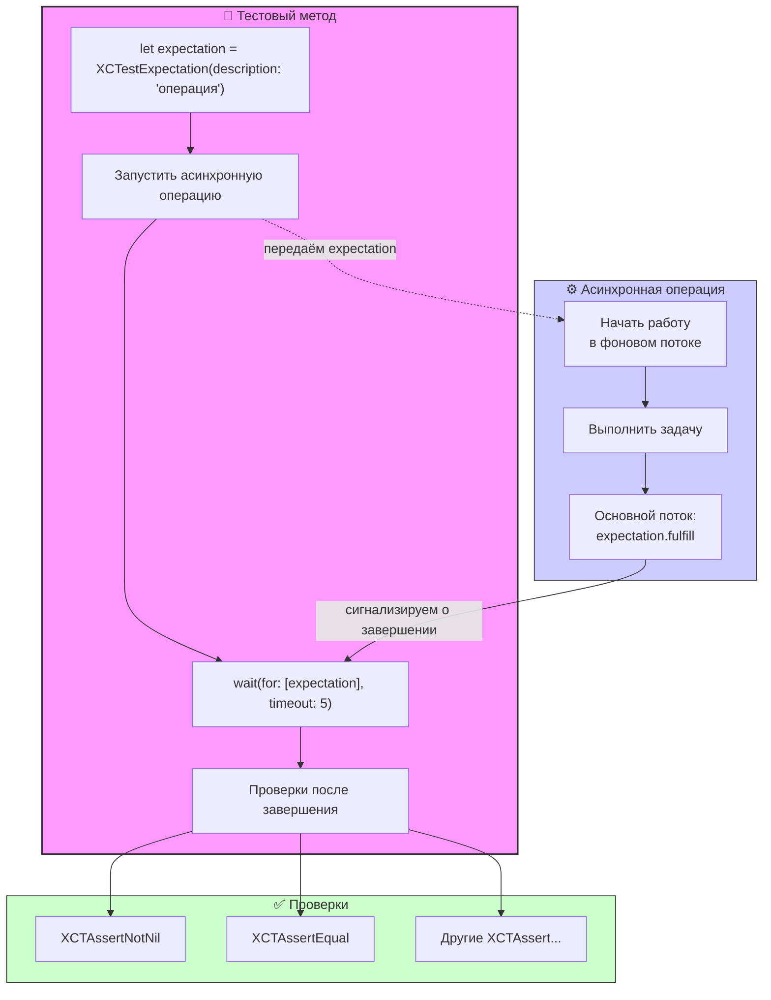

#testing #xctest #async #expectation #unit-test #swift #ios-testing

---
## XCTestExpectation

### Определение
**XCTestExpectation** — это класс во фреймворке [[XCTest]], который используется для тестирования асинхронного кода. Он позволяет тесту "ожидать" наступления определенного события или выполнения условия, прежде чем продолжить выполнение или завершиться .

В синхронном мире тесты выполняются линейно: строка за строкой. Однако в [[iOS]]-разработке полно асинхронных операций: сетевые запросы, анимации, работа с базой данных, уведомления. `XCTestExpectation` предоставляет механизм, позволяющий тесту приостановиться и дождаться, пока асинхронная операция не завершится, прежде чем проверять результаты.

### Зачем это знать iOS-разработчику?
1.  **Тестирование сетевых запросов:** Убедиться, что данные корректно загружаются с сервера.
2.  **Тестирование callback'ов:** Проверка, что замыкания вызываются с правильными параметрами.
3.  **Тестирование делегатов:** Ожидание вызова определенных методов делегата.
4.  **Тестирование уведомлений:** Проверка, что [[NotificationCenter]] отправляет ожидаемые уведомления.
5.  **Тестирование анимаций:** Ожидание завершения анимации перед проверкой конечного состояния UI.
6.  **Тестирование Core Data:** Ожидание завершения фоновых операций сохранения.

---

### Архитектура и основные концепции



### Основные понятия

1.  **Ожидание (Expectation):** Объект, представляющий условие, которое должно быть выполнено.
2.  **Выполнение (Fulfillment):** Вызов метода `fulfill()` на ожидании, сигнализирующий о том, что условие выполнено.
3.  **Тайм-аут (Timeout):** Максимальное время ожидания в секундах. Если за это время ожидание не выполнено, тест падает с ошибкой.
4.  **Ожидание нескольких ожиданий:** Можно создать массив ожиданий и ждать, пока все они выполнятся.

### Методы создания ожиданий

XCTest предоставляет несколько способов создания ожиданий:

#### 1. Ручное создание
```swift
let expectation = XCTestExpectation(description: "Ожидание загрузки данных")
```

#### 2. Ожидание уведомлений
```swift
let expectation = XCTNSNotificationExpectation(name: .myNotification, object: nil)
```

#### 3. Ожидание [[KVO]] (Key-Value Observing)
```swift
let expectation = XCTKVOExpectation(keyPath: "isLoading", object: viewModel, expectedValue: false)
```

#### 4. Ожидание через NSPredicate
```swift
let predicate = NSPredicate(format: "isLoaded == true")
let expectation = XCTNSPredicateExpectation(predicate: predicate, object: viewModel)
```

---

### Примеры от простого к сложному

#### Уровень 0: Тестирование простого асинхронного кода

```swift
import XCTest
@testable import MyApp

class AsyncTests: XCTestCase {
    
    func testSimpleAsyncOperation() {
        // 1. Создаем ожидание
        let expectation = XCTestExpectation(description: "Асинхронная операция завершена")
        
        // 2. Запускаем асинхронный код
        performAsyncOperation { result in
            // 3. Выполняем ожидание, когда операция завершена
            expectation.fulfill()
        }
        
        // 4. Ждем выполнения ожидания (максимум 1 секунду)
        wait(for: [expectation], timeout: 1.0)
    }
    
    private func performAsyncOperation(completion: @escaping (String) -> Void) {
        DispatchQueue.global().asyncAfter(deadline: .now() + 0.5) {
            completion("Готово")
        }
    }
}
```

#### Уровень 1: Тестирование сетевого запроса с проверкой данных

```swift
import XCTest
@testable import MyApp

class NetworkTests: XCTestCase {
    
    func testFetchUserData() {
        // Создаем ожидание
        let expectation = XCTestExpectation(description: "Получение данных пользователя")
        
        let networkService = NetworkService()
        
        networkService.fetchUser(id: 123) { result in
            switch result {
            case .success(let user):
                // Проверяем полученные данные
                XCTAssertEqual(user.id, 123)
                XCTAssertNotNil(user.name)
                XCTAssertFalse(user.email.isEmpty)
            case .failure(let error):
                XCTFail("Ошибка при запросе: \(error.localizedDescription)")
            }
            
            // Важно: вызываем fulfill ВСЕГДА, даже при ошибке
            expectation.fulfill()
        }
        
        // Ждем выполнения
        wait(for: [expectation], timeout: 5.0)
    }
}
```

#### Уровень 2: Ожидание нескольких асинхронных операций

```swift
import XCTest
@testable import MyApp

class ParallelRequestsTests: XCTestCase {
    
    func testMultipleParallelRequests() {
        // Создаем несколько ожиданий
        let expectation1 = XCTestExpectation(description: "Запрос 1")
        let expectation2 = XCTestExpectation(description: "Запрос 2")
        let expectation3 = XCTestExpectation(description: "Запрос 3")
        
        let service = NetworkService()
        
        service.fetchData(endpoint: "/api/data1") { _ in
            expectation1.fulfill()
        }
        
        service.fetchData(endpoint: "/api/data2") { _ in
            expectation2.fulfill()
        }
        
        service.fetchData(endpoint: "/api/data3") { _ in
            expectation3.fulfill()
        }
        
        // Ждем выполнения ВСЕХ ожиданий
        wait(for: [expectation1, expectation2, expectation3], timeout: 5.0)
    }
}
```

#### Уровень 3: Тестирование уведомлений ([[XCTNSNotificationExpectation]])

```swift
import XCTest
@testable import MyApp

class NotificationTests: XCTestCase {
    
    func testNotificationPosted() {
        // Создаем ожидание уведомления
        let expectation = XCTNSNotificationExpectation(name: .userDidLogin)
        
        // Действие, которое должно вызвать уведомление
        AuthService.shared.login(username: "test", password: "pass")
        
        // Ждем уведомления
        let result = XCTWaiter.wait(for: [expectation], timeout: 2.0)
        
        // Проверяем результат ожидания
        XCTAssertEqual(result, .completed, "Уведомление не было получено")
    }
    
    func testNotificationWithSpecificObject() {
        let expectedObject = SomeObject()
        
        let expectation = XCTNSNotificationExpectation(name: .dataUpdated,
                                                        object: expectedObject)
        
        // Публикуем уведомление с правильным объектом
        NotificationCenter.default.post(name: .dataUpdated, object: expectedObject)
        
        wait(for: [expectation], timeout: 1.0)
    }
}
```

#### Уровень 4: Тестирование KVO ([[XCTKVOExpectation]])

```swift
import XCTest
@testable import MyApp

class KVOTests: XCTestCase {
    
    func testIsLoadingChanges() {
        let viewModel = LoadingViewModel()
        
        // Создаем KVO ожидание для свойства isLoading
        let expectation = XCTKVOExpectation(keyPath: "isLoading",
                                            object: viewModel,
                                            expectedValue: false)
        
        // Запускаем операцию, которая меняет isLoading
        viewModel.loadData()
        
        // Ждем, когда isLoading станет false
        wait(for: [expectation], timeout: 3.0)
        
        // Дополнительная проверка
        XCTAssertFalse(viewModel.isLoading)
    }
}
```

#### Уровень 5: Тестирование с NSPredicate ([[XCTNSPredicateExpectation]])

```swift
import XCTest
@testable import MyApp

class PredicateTests: XCTestCase {
    
    func testArrayCountPredicate() {
        let dataManager = DataManager()
        
        // Создаем предикат для проверки условия
        let predicate = NSPredicate(format: "items.count > 5")
        let expectation = XCTNSPredicateExpectation(predicate: predicate,
                                                     object: dataManager)
        
        // Запускаем загрузку данных
        dataManager.loadMoreItems()
        
        // Ждем выполнения предиката
        wait(for: [expectation], timeout: 3.0)
        
        XCTAssertTrue(dataManager.items.count > 5)
    }
    
    func testCustomCondition() {
        let conditionMet = AtomicBoolean(false)
        
        // Сложное условие, которое нельзя выразить простым предикатом
        let expectation = XCTestExpectation(description: "Сложное условие")
        
        // Запускаем серию асинхронных операций
        performComplexAsyncOperations {
            conditionMet.value = true
            expectation.fulfill()
        }
        
        wait(for: [expectation], timeout: 5.0)
        XCTAssertTrue(conditionMet.value)
    }
}
```

#### Уровень 6: Инвертированные ожидания (ожидание НЕ-выполнения)

```swift
import XCTest
@testable import MyApp

class InvertedExpectationTests: XCTestCase {
    
    func testOperationNotCalled() {
        // Инвертированное ожидание - проверяет, что событие НЕ произошло
        let expectation = XCTestExpectation(description: "Не должно быть вызвано")
        expectation.isInverted = true
        
        let operation = SomeOperation()
        operation.onComplete = {
            expectation.fulfill() // Этот вызов должен произойти
        }
        
        // Не запускаем операцию, поэтому fulfill не должен быть вызван
        // operation.start()
        
        // Ждем 1 секунду - если fulfill будет вызван, тест упадет
        wait(for: [expectation], timeout: 1.0)
        
        // Тест проходит, потому что ожидание не было выполнено
    }
}
```

#### Уровень 7: Обработка тайм-аутов с [[XCTWaiter]]

```swift
import XCTest
@testable import MyApp

class WaiterTests: XCTestCase {
    
    func testWaitWithResult() {
        let expectation = XCTestExpectation(description: "Ожидание")
        
        // Запускаем очень медленную операцию
        performSlowOperation {
            expectation.fulfill()
        }
        
        // Используем XCTWaiter для получения детального результата
        let result = XCTWaiter.wait(for: [expectation], timeout: 2.0)
        
        switch result {
        case .completed:
            // Ожидание выполнено успешно
            XCTAssertTrue(true)
        case .timedOut:
            XCTFail("Операция не завершилась вовремя")
        case .incorrectOrder:
            XCTFail("Неправильный порядок ожиданий")
        case .invertedFulfillment:
            XCTFail("Инвертированное ожидание было выполнено")
        @unknown default:
            XCTFail("Неизвестный результат")
        }
    }
    
    func testMultipleWaiters() {
        let expectation1 = XCTestExpectation(description: "Ожидание 1")
        let expectation2 = XCTestExpectation(description: "Ожидание 2")
        
        // Разные тайм-ауты для разных ожиданий
        DispatchQueue.global().asyncAfter(deadline: .now() + 0.5) {
            expectation1.fulfill()
        }
        
        DispatchQueue.global().asyncAfter(deadline: .now() + 1.5) {
            expectation2.fulfill()
        }
        
        // Ждем только первое ожидание 1 секунду
        let result1 = XCTWaiter.wait(for: [expectation1], timeout: 1.0)
        XCTAssertEqual(result1, .completed)
        
        // Ждем второе ожидание еще 1 секунду
        let result2 = XCTWaiter.wait(for: [expectation2], timeout: 1.0)
        XCTAssertEqual(result2, .completed)
    }
}
```

#### Уровень 8: Реальный пример - тестирование [[Core Data]]

```swift
import XCTest
import CoreData
@testable import MyApp

class CoreDataTests: XCTestCase {
    
    var persistentContainer: NSPersistentContainer!
    
    override func setUp() {
        super.setUp()
        
        // Настраиваем in-memory Core Data для тестов
        persistentContainer = NSPersistentContainer(name: "MyApp")
        let description = NSPersistentStoreDescription()
        description.type = NSInMemoryStoreType
        persistentContainer.persistentStoreDescriptions = [description]
        
        let expectation = XCTestExpectation(description: "Загрузка Core Data")
        
        persistentContainer.loadPersistentStores { _, error in
            XCTAssertNil(error)
            expectation.fulfill()
        }
        
        wait(for: [expectation], timeout: 2.0)
    }
    
    func testBackgroundSave() {
        let saveExpectation = XCTestExpectation(description: "Сохранение в фоне")
        
        let backgroundContext = persistentContainer.newBackgroundContext()
        
        backgroundContext.perform {
            // Создаем объект в фоновом контексте
            let entity = NSEntityDescription.insertNewObject(forEntityName: "User",
                                                              into: backgroundContext)
            entity.setValue("Test User", forKey: "name")
            
            do {
                try backgroundContext.save()
                
                // Проверяем, что объект появился в основном контексте
                let mainContext = self.persistentContainer.viewContext
                let fetchRequest = NSFetchRequest<NSManagedObject>(entityName: "User")
                let count = try mainContext.count(for: fetchRequest)
                
                XCTAssertEqual(count, 1)
                saveExpectation.fulfill()
                
            } catch {
                XCTFail("Ошибка сохранения: \(error)")
                saveExpectation.fulfill()
            }
        }
        
        wait(for: [saveExpectation], timeout: 3.0)
    }
}
```

#### Уровень 9: Тестирование [[Combine]]-паблишеров

```swift
import XCTest
import Combine
@testable import MyApp

class CombineTests: XCTestCase {
    var cancellables = Set<AnyCancellable>()
    
    func testPublisherEmitsValue() {
        let expectation = XCTestExpectation(description: "Паблишер отправил значение")
        let expectedValue = 42
        
        let publisher = Just(expectedValue)
            .delay(for: 0.5, scheduler: DispatchQueue.main)
        
        publisher
            .sink { value in
                XCTAssertEqual(value, expectedValue)
                expectation.fulfill()
            }
            .store(in: &cancellables)
        
        wait(for: [expectation], timeout: 1.0)
    }
    
    func testMultipleValuesFromPublisher() {
        let valueExpectation = XCTestExpectation(description: "Получено значение")
        let completionExpectation = XCTestExpectation(description: "Паблишер завершен")
        
        let publisher = PassthroughSubject<Int, Never>()
        
        var receivedValues: [Int] = []
        
        publisher
            .sink { completion in
                completionExpectation.fulfill()
            } receiveValue: { value in
                receivedValues.append(value)
                if receivedValues.count == 3 {
                    valueExpectation.fulfill()
                }
            }
            .store(in: &cancellables)
        
        publisher.send(1)
        publisher.send(2)
        publisher.send(3)
        publisher.send(completion: .finished)
        
        wait(for: [valueExpectation, completionExpectation], timeout: 1.0)
        XCTAssertEqual(receivedValues, [1, 2, 3])
    }
}
```

#### Уровень 10: Тестирование последовательности асинхронных операций

```swift
import XCTest
@testable import MyApp

class SequenceTests: XCTestCase {
    
    func testSequentialOperations() {
        let step1Expectation = XCTestExpectation(description: "Шаг 1 выполнен")
        let step2Expectation = XCTestExpectation(description: "Шаг 2 выполнен")
        let step3Expectation = XCTestExpectation(description: "Шаг 3 выполнен")
        
        var order: [String] = []
        
        performStep1 {
            order.append("step1")
            step1Expectation.fulfill()
            
            self.performStep2 {
                order.append("step2")
                step2Expectation.fulfill()
                
                self.performStep3 {
                    order.append("step3")
                    step3Expectation.fulfill()
                }
            }
        }
        
        wait(for: [step1Expectation, step2Expectation, step3Expectation], timeout: 3.0, enforceOrder: true)
        
        XCTAssertEqual(order, ["step1", "step2", "step3"])
    }
    
    private func performStep1(completion: @escaping () -> Void) {
        DispatchQueue.global().asyncAfter(deadline: .now() + 0.1, execute: completion)
    }
    
    private func performStep2(completion: @escaping () -> Void) {
        DispatchQueue.global().asyncAfter(deadline: .now() + 0.1, execute: completion)
    }
    
    private func performStep3(completion: @escaping () -> Void) {
        DispatchQueue.global().asyncAfter(deadline: .now() + 0.1, execute: completion)
    }
}
```

---

### Важные нюансы и Best Practices

#### 1. **Всегда вызывайте fulfill()**
Даже в случае ошибки или неожиданного пути выполнения обязательно вызывайте `fulfill()`. Иначе тест будет ждать до тайм-аута и упадет, скрывая реальную причину проблемы .

```swift
fetchData { result in
    defer { expectation.fulfill() } // Хороший паттерн
    
    switch result {
    case .success(let data):
        XCTAssertNotNil(data)
    case .failure(let error):
        XCTFail("Ошибка: \(error)")
    }
}
```

#### 2. **Выбирайте разумные тайм-ауты**
Слишком маленький тайм-аут приведет к ложным падениям тестов на медленных машинах. Слишком большой — замедлит выполнение тестов. Обычно 1-5 секунд достаточно для большинства операций .

#### 3. **Используйте описания (description)**
Всегда давайте осмысленные описания ожиданиям. Это поможет быстро понять, какое именно ожидание не выполнилось при падении теста.

#### 4. **Порядок ожиданий**
Параметр `enforceOrder: true` в `wait(for:timeout:enforceOrder:)` позволяет проверить, что ожидания выполняются в заданном порядке .

#### 5. **Очистка после тестов**
Убедитесь, что все асинхронные операции отменяются или завершаются после теста, чтобы они не влияли на другие тесты.

#### 6. **Избегайте "flaky" тестов**
Тесты, которые иногда падают, а иногда проходят, — большая проблема. Обычно это связано с:
- Слишком маленькими тайм-аутами
- Состояниями гонки ([[race condition]]s)
- Зависимостью от внешних факторов (сеть, время)

#### 7. **Используйте XCTWaiter для сложной логики**
`XCTWaiter` дает больше контроля над процессом ожидания и позволяет обрабатывать различные результаты .

#### 8. **Тестирование делегатов**
При тестировании делегатов не забывайте устанавливать delegate перед вызовом тестируемого метода.

```swift
func testDelegateMethodCalled() {
    let expectation = XCTestExpectation(description: "Делегат вызван")
    
    let object = SomeObject()
    object.delegate = TestDelegate { _ in
        expectation.fulfill()
    }
    
    object.start()
    
    wait(for: [expectation], timeout: 2.0)
}
```

### Итог
**XCTestExpectation** — незаменимый инструмент для тестирования асинхронного кода в iOS. Он позволяет:

1.  **Тестировать сетевые запросы** и другие асинхронные операции.
2.  **Проверять уведомления** и KVO-события.
3.  **Синхронизировать** несколько параллельных операций.
4.  **Управлять временем ожидания** через тайм-ауты.
5.  **Создавать надежные и предсказуемые тесты** для асинхронного кода.

Ключевые навыки: создание ожиданий, правильный вызов `fulfill()`, настройка тайм-аутов, использование специализированных ожиданий (`XCTNSNotificationExpectation`, `XCTKVOExpectation`), обработка результатов с помощью `XCTWaiter`.