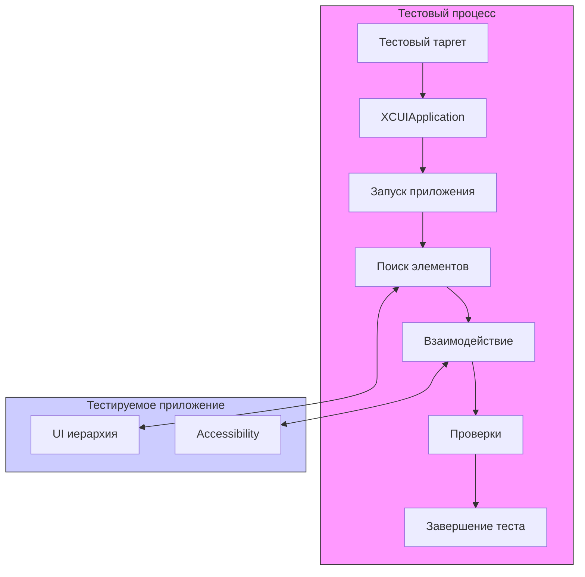

#testing #xctest #ui-testing #automation #xcuitest #ios-testing #qa

---
### Определение
**XCUITest** — это фреймворк для автоматизированного тестирования пользовательского интерфейса (UI) приложений под [[iOS]], macOS, tvOS и watchOS, встроенный непосредственно в Xcode . Он является частью семейства [[XCTest]] и позволяет разработчикам и тестировщикам писать тесты, которые взаимодействуют с приложением так же, как это делал бы реальный пользователь: нажимают на кнопки, вводят текст, свайпают, проверяют наличие элементов на экране .

В отличие от модульных тестов ([[Unit-Test]]s), которые проверяют отдельные методы и классы изолированно, XCUITest проверяет приложение целиком, запуская его на симуляторе или реальном устройстве и эмулируя пользовательские сценарии.

### Зачем это знать iOS-разработчику?
1.  **Регрессионное тестирование:** Автоматическая проверка, что новый код не сломал существующий функционал.
2.  **Тестирование критических путей (Critical Paths):** Убедиться, что ключевые пользовательские сценарии (онбординг, авторизация, покупка) работают корректно.
3.  **Экономия времени:** Автоматизация рутинных проверок, которые раньше выполнялись вручную.
4.  **Тестирование на разных устройствах:** Легко запустить одни и те же тесты на разных симуляторах и реальных девайсах.
5.  **CI/CD интеграция:** XCUITest легко интегрируется в пайплайны непрерывной интеграции ([[GitHub]] Actions, Bitrise, [[Jenkins]]).
6.  **Поиск проблем с доступностью (Accessibility):** Тесты часто используют accessibility-идентификаторы, что попутно улучшает доступность приложения.

---

### Архитектура XCUITest



### Основные компоненты

#### 1. XCUIApplication
Класс, представляющий тестируемое приложение. Он используется для запуска, завершения и управления состоянием приложения .

```swift
let app = XCUIApplication()
app.launch() // Запуск приложения
app.terminate() // Завершение приложения
```

#### 2. XCUIElement
Представляет элемент пользовательского интерфейса: кнопку, текстовое поле, таблицу, ячейку и т.д. Элементы ищутся по различным квалификаторам .

```swift
let button = app.buttons["loginButton"]
let textField = app.textFields["usernameField"]
let table = app.tables["usersTable"]
```

#### 3. Квалификаторы (Queries)
Способы поиска элементов в иерархии UI:

- По типу: `app.buttons`, `app.tables`, `app.staticTexts`
- По идентификатору accessibility: `app.buttons["myButton"]`
- По индексу: `app.buttons.element(boundBy: 0)`
- По предикату: `app.buttons.containing(NSPredicate(format: "label CONTAINS 'Submit'"))`

#### 4. Взаимодействия (Interactions)
Методы для симуляции действий пользователя:

```swift
button.tap() // Нажатие
textField.typeText("Hello") // Ввод текста
slider.adjust(toNormalizedSliderPosition: 0.5) // Перемещение слайдера
table.swipeUp() // Свайп вверх
element.press(forDuration: 2) // Долгое нажатие
```

#### 5. Проверки (Assertions)
Методы для проверки состояния элементов:

```swift
XCTAssertTrue(button.exists) // Элемент существует
XCTAssertFalse(button.isEnabled) // Кнопка неактивна
XCTAssertEqual(label.label, "Привет") // Текст лейбла совпадает
```

---

### Примеры от простого к сложному

#### Уровень 0: Настройка Accessibility Identifiers

Прежде чем писать тесты, нужно подготовить приложение — добавить accessibility-идентификаторы к элементам, с которыми тесты будут взаимодействовать .

```swift
// В коде приложения
class LoginViewController: UIViewController {
    
    @IBOutlet weak var usernameTextField: UITextField!
    @IBOutlet weak var passwordTextField: UITextField!
    @IBOutlet weak var loginButton: UIButton!
    @IBOutlet weak var errorLabel: UILabel!
    
    override func viewDidLoad() {
        super.viewDidLoad()
        
        // Назначаем accessibility identifiers
        usernameTextField.accessibilityIdentifier = "usernameField"
        passwordTextField.accessibilityIdentifier = "passwordField"
        loginButton.accessibilityIdentifier = "loginButton"
        errorLabel.accessibilityIdentifier = "errorLabel"
    }
}
```

#### Уровень 1: Простейший тест - проверка заголовка

```swift
import XCTest

class LoginUITests: XCTestCase {
    
    var app: XCUIApplication!
    
    override func setUpWithError() throws {
        continueAfterFailure = false // Останавливать тест при первом падении
        app = XCUIApplication()
        app.launch() // Запускаем приложение перед каждым тестом
    }
    
    override func tearDownWithError() throws {
        app.terminate() // Завершаем приложение после каждого теста
    }
    
    func testWelcomeLabelExists() {
        // Ищем статический текст с идентификатором "welcomeLabel"
        let welcomeLabel = app.staticTexts["welcomeLabel"]
        
        // Проверяем, что он существует
        XCTAssertTrue(welcomeLabel.exists)
        
        // Проверяем его текст
        XCTAssertEqual(welcomeLabel.label, "Добро пожаловать!")
    }
}
```

#### Уровень 2: Тестирование формы логина

```swift
import XCTest

class LoginUITests: XCTestCase {
    
    var app: XCUIApplication!
    
    override func setUpWithError() throws {
        continueAfterFailure = false
        app = XCUIApplication()
        app.launch()
    }
    
    func testSuccessfulLogin() {
        // 1. Находим элементы
        let usernameField = app.textFields["usernameField"]
        let passwordField = app.secureTextFields["passwordField"] // Для паролей
        let loginButton = app.buttons["loginButton"]
        
        // 2. Взаимодействуем с ними
        usernameField.tap()
        usernameField.typeText("testuser")
        
        passwordField.tap()
        passwordField.typeText("password123")
        
        loginButton.tap()
        
        // 3. Проверяем результат - переход на главный экран
        let welcomeMessage = app.staticTexts["welcomeMessage"]
        XCTAssertTrue(welcomeMessage.waitForExistence(timeout: 5))
        XCTAssertEqual(welcomeMessage.label, "Привет, testuser!")
    }
    
    func testFailedLoginShowsError() {
        let usernameField = app.textFields["usernameField"]
        let passwordField = app.secureTextFields["passwordField"]
        let loginButton = app.buttons["loginButton"]
        let errorLabel = app.staticTexts["errorLabel"]
        
        usernameField.tap()
        usernameField.typeText("wrong")
        
        passwordField.tap()
        passwordField.typeText("wrong")
        
        loginButton.tap()
        
        // Ждем появления сообщения об ошибке
        XCTAssertTrue(errorLabel.waitForExistence(timeout: 3))
        XCTAssertEqual(errorLabel.label, "Неверный логин или пароль")
    }
}
```

#### Уровень 3: Использование ожиданий (XCUIElement.waitForExistence)

```swift
import XCTest

class AsyncUITests: XCTestCase {
    
    var app: XCUIApplication!
    
    override func setUpWithError() throws {
        continueAfterFailure = false
        app = XCUIApplication()
        app.launch()
    }
    
    func testDataLoading() {
        let loadDataButton = app.buttons["loadDataButton"]
        loadDataButton.tap()
        
        // Ждем появления индикатора загрузки
        let spinner = app.activityIndicators["loadingSpinner"]
        XCTAssertTrue(spinner.waitForExistence(timeout: 2))
        
        // Ждем появления данных (таблица с результатами)
        let tableView = app.tables["resultsTable"]
        XCTAssertTrue(tableView.waitForExistence(timeout: 5))
        
        // Проверяем, что в таблице есть ячейки
        XCTAssertGreaterThan(tableView.cells.count, 0)
        
        // Проверяем содержимое первой ячейки
        let firstCell = tableView.cells.element(boundBy: 0)
        let cellTitle = firstCell.staticTexts["cellTitle"]
        XCTAssertEqual(cellTitle.label, "Первый элемент")
    }
}
```

#### Уровень 4: Работа с таблицами и коллекциями

```swift
import XCTest

class TableViewUITests: XCTestCase {
    
    var app: XCUIApplication!
    
    override func setUpWithError() throws {
        continueAfterFailure = false
        app = XCUIApplication()
        app.launch()
    }
    
    func testTableScrolling() {
        let tableView = app.tables["catalogTable"]
        XCTAssertTrue(tableView.waitForExistence(timeout: 3))
        
        // Скроллим вниз
        tableView.swipeUp()
        tableView.swipeUp()
        
        // Ищем ячейку с определенным текстом
        let targetCell = tableView.cells.staticTexts["Товар #20"]
        XCTAssertTrue(targetCell.exists)
        
        // Тапаем на ячейку
        targetCell.tap()
        
        // Проверяем переход на детальный экран
        let detailLabel = app.staticTexts["detailTitle"]
        XCTAssertTrue(detailLabel.waitForExistence(timeout: 2))
        XCTAssertEqual(detailLabel.label, "Детали товара #20")
    }
    
    func testDeleteCell() {
        let tableView = app.tables["editableTable"]
        
        // Получаем количество ячеек до удаления
        let initialCount = tableView.cells.count
        
        // Свайпаем влево на первой ячейке
        let firstCell = tableView.cells.element(boundBy: 0)
        firstCell.swipeLeft()
        
        // Появляется кнопка удаления
        let deleteButton = app.buttons["Delete"]
        XCTAssertTrue(deleteButton.exists)
        deleteButton.tap()
        
        // Проверяем, что количество ячеек уменьшилось
        let newCount = tableView.cells.count
        XCTAssertEqual(newCount, initialCount - 1)
    }
}
```

#### Уровень 5: Тестирование навигации и вкладок

```swift
import XCTest

class NavigationUITests: XCTestCase {
    
    var app: XCUIApplication!
    
    override func setUpWithError() throws {
        continueAfterFailure = false
        app = XCUIApplication()
        app.launch()
    }
    
    func testTabBarNavigation() {
        // Проверяем первую вкладку
        let firstTab = app.tabBars.buttons["Главная"]
        XCTAssertTrue(firstTab.exists)
        firstTab.tap()
        
        // Проверяем контент на главной
        let mainLabel = app.staticTexts["mainScreenLabel"]
        XCTAssertTrue(mainLabel.exists)
        
        // Переходим на вторую вкладку
        let secondTab = app.tabBars.buttons["Профиль"]
        secondTab.tap()
        
        // Проверяем контент в профиле
        let profileLabel = app.staticTexts["profileScreenLabel"]
        XCTAssertTrue(profileLabel.waitForExistence(timeout: 2))
        
        // Нажимаем кнопку "Настройки" на профиле
        let settingsButton = app.buttons["settingsButton"]
        settingsButton.tap()
        
        // Проверяем, что открылся экран настроек
        let settingsTitle = app.navigationBars["Настройки"]
        XCTAssertTrue(settingsTitle.exists)
        
        // Возвращаемся назад
        app.navigationBars.buttons.firstMatch.tap()
    }
}
```

#### Уровень 6: Создание скриншотов для отчета

```swift
import XCTest

class ScreenshotUITests: XCTestCase {
    
    var app: XCUIApplication!
    
    override func setUpWithError() throws {
        continueAfterFailure = false
        app = XCUIApplication()
        app.launch()
    }
    
    func testTakeScreenshots() {
        // Делаем скриншот главного экрана
        let mainScreenScreenshot = app.screenshot()
        let attachment = XCTAttachment(screenshot: mainScreenScreenshot)
        attachment.name = "Главный экран"
        attachment.lifetime = .keepAlways // Сохранять всегда
        add(attachment)
        
        // Переходим на другой экран
        app.buttons["goToProfileButton"].tap()
        
        // Делаем скриншот профиля
        let profileScreenshot = app.screenshot()
        let profileAttachment = XCTAttachment(screenshot: profileScreenshot)
        profileAttachment.name = "Экран профиля"
        profileAttachment.lifetime = .keepAlways
        add(profileAttachment)
    }
}
```

#### Уровень 7: Использование NSPredicate для сложного поиска

```swift
import XCTest

class PredicateUITests: XCTestCase {
    
    var app: XCUIApplication!
    
    override func setUpWithError() throws {
        continueAfterFailure = false
        app = XCUIApplication()
        app.launch()
    }
    
    func testFindElementsByPredicate() {
        // Ищем кнопки, чей label начинается с "Submit"
        let predicate = NSPredicate(format: "label BEGINSWITH 'Submit'")
        let submitButtons = app.buttons.containing(predicate)
        
        XCTAssertGreaterThan(submitButtons.count, 0)
        submitButtons.element(boundBy: 0).tap()
        
        // Ищем все статические тексты, содержащие "Error"
        let errorPredicate = NSPredicate(format: "label CONTAINS 'Error'")
        let errorMessages = app.staticTexts.containing(errorPredicate)
        
        // Проверяем, что сообщение об ошибке появилось
        if errorMessages.count > 0 {
            XCTAssertTrue(errorMessages.element.exists)
        }
    }
    
    func testComplexQuery() {
        // Ищем ячейки в таблице, у которых есть кнопка с текстом "Удалить"
        let cellsWithDeleteButton = app.tables.cells.containing(.button, identifier: "deleteButton")
        
        // Проходим по всем таким ячейкам и удаляем их
        while cellsWithDeleteButton.count > 0 {
            let cell = cellsWithDeleteButton.element(boundBy: 0)
            let deleteButton = cell.buttons["deleteButton"]
            deleteButton.tap()
            
            // Подтверждаем удаление в алерте
            app.alerts.buttons["Удалить"].tap()
        }
    }
}
```

#### Уровень 8: Springboard и системные алерты

```swift
import XCTest

class SystemAlertsUITests: XCTestCase {
    
    var app: XCUIApplication!
    
    override func setUpWithError() throws {
        continueAfterFailure = false
        app = XCUIApplication()
        
        // Настройка для обработки системных алертов
        addUIInterruptionMonitor(withDescription: "Системный алерт") { alert -> Bool in
            if alert.buttons["Разрешить"].exists {
                alert.buttons["Разрешить"].tap()
                return true
            }
            if alert.buttons["OK"].exists {
                alert.buttons["OK"].tap()
                return true
            }
            return false
        }
        
        app.launch()
    }
    
    func testLocationPermission() {
        // Нажимаем кнопку, которая запрашивает геолокацию
        app.buttons["requestLocationButton"].tap()
        
        // Взаимодействуем с приложением, чтобы триггернуть обработку алерта
        app.tap() // Тап в пустое место вызывает обработчик перехвата
        
        // Проверяем, что запрос геолокации обработан
        let locationLabel = app.staticTexts["locationStatus"]
        XCTAssertTrue(locationLabel.waitForExistence(timeout: 3))
    }
    
    func testPhotoLibraryPermission() {
        app.buttons["selectPhotoButton"].tap()
        app.tap() // Триггерим обработчик
        
        // Теперь можем взаимодействовать с системным пикером
        let springboard = XCUIApplication(bundleIdentifier: "com.apple.springboard")
        
        // В Springboard'е ищем элемент с фото
        let photo = springboard.collectionViews.cells.element(boundBy: 0)
        if photo.waitForExistence(timeout: 5) {
            photo.tap()
        }
        
        // Проверяем, что фото выбрано в нашем приложении
        let selectedPhoto = app.images["selectedPhoto"]
        XCTAssertTrue(selectedPhoto.exists)
    }
}
```

#### Уровень 9: Параметризованные тесты

```swift
import XCTest

class ParameterizedUITests: XCTestCase {
    
    var app: XCUIApplication!
    
    override func setUpWithError() throws {
        continueAfterFailure = false
        app = XCUIApplication()
        app.launch()
    }
    
    // Тест будет запущен для каждого значения в массиве
    func testLoginWithDifferentCredentials() {
        let testCases = [
            (username: "user1", password: "pass1", shouldSucceed: true),
            (username: "user2", password: "wrong", shouldSucceed: false),
            (username: "", password: "pass3", shouldSucceed: false)
        ]
        
        for testCase in testCases {
            // Даем каждому тесту уникальное имя для отчетности
            XCTContext.runActivity(named: "Тест с логином \(testCase.username)") { activity in
                let usernameField = app.textFields["usernameField"]
                let passwordField = app.secureTextFields["passwordField"]
                let loginButton = app.buttons["loginButton"]
                
                usernameField.tap()
                usernameField.clearAndEnterText(testCase.username) // Кастомный хелпер
                
                passwordField.tap()
                passwordField.clearAndEnterText(testCase.password)
                
                loginButton.tap()
                
                if testCase.shouldSucceed {
                    let welcomeScreen = app.staticTexts["welcomeMessage"]
                    XCTAssertTrue(welcomeScreen.waitForExistence(timeout: 3))
                } else {
                    let errorLabel = app.staticTexts["errorLabel"]
                    XCTAssertTrue(errorLabel.waitForExistence(timeout: 3))
                }
            }
        }
    }
}

// Хелпер для очистки текстового поля
extension XCUIElement {
    func clearAndEnterText(_ text: String) {
        guard let stringValue = self.value as? String else {
            XCTFail("Не удалось получить значение поля")
            return
        }
        
        // Удаляем существующий текст
        let deleteString = String(repeating: XCUIKeyboardKey.delete.rawValue, count: stringValue.count)
        self.typeText(deleteString)
        
        // Вводим новый текст
        self.typeText(text)
    }
}
```

#### Уровень 10: Тестирование с помощью Page Object паттерна

```swift
import XCTest

// Page Object для экрана логина
class LoginPage {
    let app: XCUIApplication
    
    init(app: XCUIApplication) {
        self.app = app
    }
    
    var usernameField: XCUIElement {
        app.textFields["usernameField"]
    }
    
    var passwordField: XCUIElement {
        app.secureTextFields["passwordField"]
    }
    
    var loginButton: XCUIElement {
        app.buttons["loginButton"]
    }
    
    var errorLabel: XCUIElement {
        app.staticTexts["errorLabel"]
    }
    
    @discardableResult
    func login(username: String, password: String) -> Self {
        usernameField.tap()
        usernameField.typeText(username)
        
        passwordField.tap()
        passwordField.typeText(password)
        
        loginButton.tap()
        return self
    }
    
    func waitForError(timeout: TimeInterval = 3) -> Bool {
        errorLabel.waitForExistence(timeout: timeout)
    }
}

// Page Object для главного экрана
class MainPage {
    let app: XCUIApplication
    
    init(app: XCUIApplication) {
        self.app = app
    }
    
    var welcomeLabel: XCUIElement {
        app.staticTexts["welcomeMessage"]
    }
    
    var profileButton: XCUIElement {
        app.buttons["profileButton"]
    }
    
    func waitForLoading(timeout: TimeInterval = 5) -> Bool {
        welcomeLabel.waitForExistence(timeout: timeout)
    }
}

// Тесты с использованием Page Objects
class PageObjectUITests: XCTestCase {
    
    var app: XCUIApplication!
    var loginPage: LoginPage!
    var mainPage: MainPage!
    
    override func setUpWithError() throws {
        continueAfterFailure = false
        app = XCUIApplication()
        loginPage = LoginPage(app: app)
        mainPage = MainPage(app: app)
        app.launch()
    }
    
    func testSuccessfulLogin() {
        loginPage.login(username: "testuser", password: "pass123")
        
        XCTAssertTrue(mainPage.waitForLoading())
        XCTAssertTrue(mainPage.welcomeLabel.label.contains("testuser"))
    }
    
    func testFailedLogin() {
        loginPage.login(username: "wrong", password: "wrong")
        
        XCTAssertTrue(loginPage.waitForError())
        XCTAssertEqual(loginPage.errorLabel.label, "Неверный логин или пароль")
    }
    
    func testLoginThenNavigateToProfile() {
        loginPage.login(username: "testuser", password: "pass123")
        
        XCTAssertTrue(mainPage.waitForLoading())
        
        mainPage.profileButton.tap()
        
        let profileTitle = app.staticTexts["profileTitle"]
        XCTAssertTrue(profileTitle.exists)
    }
}
```

---

### Лучшие практики

#### 1. **Используйте accessibilityIdentifier**
Всегда назначайте `accessibilityIdentifier` элементам, с которыми тесты взаимодействуют. Это делает тесты устойчивыми к изменениям текста или дизайна .

```swift
// Плохо
let button = app.buttons["Submit"]

// Хорошо
let button = app.buttons["submitButton"] // accessibilityIdentifier
```

#### 2. **Структурируйте тесты**
Используйте паттерн **Page Object** для изоляции логики взаимодействия с экранами. Это делает тесты чище и легче поддерживать .

#### 3. **Используйте ожидания, а не sleep**
Никогда не используйте `sleep(1)`. Вместо этого используйте `waitForExistence(timeout:)` или другие ожидания.

```swift
// Плохо
sleep(2)
button.tap()

// Хорошо
XCTAssertTrue(button.waitForExistence(timeout: 2))
button.tap()
```

#### 4. **Тестируйте на реальных устройствах**
Симулятор полезен, но реальные устройства могут показать проблемы с производительностью, жестами и системными алертами.

#### 5. **Поддерживайте тесты в чистоте**
UI-тесты требуют поддержки. Если приложение меняется, тесты тоже должны меняться. Удаляйте неактуальные тесты и рефакторите.

#### 6. **Используйте continueAfterFailure = false**
По умолчанию устанавливайте `continueAfterFailure = false`, чтобы тест останавливался при первом же падении. Это упрощает анализ результатов .

#### 7. **Добавляйте скриншоты при падениях**
Автоматически добавляйте скриншоты в отчеты, чтобы видеть состояние приложения в момент ошибки.

```swift
add(XCTAttachment(screenshot: app.screenshot()))
```

#### 8. **Изолируйте тесты**
Каждый тест должен запускаться с чистого состояния приложения. Используйте `setUp()` для перезапуска приложения и `tearDown()` для очистки.

#### 9. **Используйте уникальные идентификаторы**
Избегайте общих идентификаторов типа "button". Используйте имена, отражающие назначение элемента ("loginButton", "saveProfileButton").

### Итог
**XCUITest** — это мощный и интегрированный в Xcode фреймворк для автоматизации UI-тестирования. Он позволяет:

1.  **Автоматизировать регрессионное тестирование** ключевых пользовательских сценариев.
2.  **Проверять поведение приложения** на разных устройствах и версиях iOS.
3.  **Интегрироваться в [[CI]]/[[CD]]** для автоматического запуска тестов при каждом изменении кода.
4.  **Улучшать качество приложения** и снижать количество багов, попадающих в продакшн.

Ключевые навыки: настройка accessibility-идентификаторов, поиск элементов, использование ожиданий, работа с таблицами и коллекциями, обработка системных алертов, структурирование тестов через Page Object.