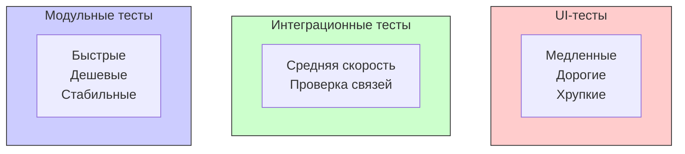

#testing #integration-tests #xctest #quality #swift #database #network #module-testing

---
## Интеграционные тесты (Integration Tests)

### Определение
**Интеграционные тесты** — это вид тестирования программного обеспечения, который проверяет корректность взаимодействия между различными модулями, компонентами или сервисами приложения. В отличие от модульных тестов ([[unit-test]]s), которые изолируют и тестируют один небольшой фрагмент кода, интеграционные тесты проверяют, как эти фрагменты работают вместе .

В контексте [[iOS]]-разработки интеграционные тесты могут проверять:
- Взаимодействие с реальной базой данных ([[Core Data]], [[Realm]], [[SQLite]])
- Сетевые запросы к реальному [[API]] (или тестовому серверу)
- Взаимодействие между ViewModel и сервисами
- Работу с файловой системой
- Интеграцию с системными фреймворками ([[Keychain]], [[UserDefaults]])

### Зачем это знать iOS-разработчику?
1.  **Обнаружение проблем на стыках:** Модульные тесты могут проходить, но интеграция модулей может давать сбои.
2.  **Тестирование реальных сценариев:** Интеграционные тесты ближе к реальному использованию приложения.
3.  **Уверенность в работе с внешними зависимостями:** База данных, сеть, файловая система — все это нужно тестировать в комплексе.
4.  **Снижение рисков при рефакторинге:** Интеграционные тесты гарантируют, что изменения в одном модуле не сломают его взаимодействие с другими.
5.  **Дополнение к модульным и UI-тестам:** Интеграционные тесты занимают промежуточное положение между быстрыми модульными и медленными UI-тестами.

---

### Пирамида тестирования



**Пирамида тестирования (по Майку Кону):**
- **Основание (Unit тесты):** Много быстрых, изолированных тестов.
- **Середина (Интеграционные тесты):** Меньше тестов, проверяющих взаимодействие.
- **Вершина (UI/[[E2E-tests]]):** Мало тестов, проверяющих приложение целиком.

---

### Интеграционные vs Модульные vs UI-тесты

| Характеристика          | Модульные (Unit)   | Интеграционные                   | UI / E2E            |
| ----------------------- | ------------------ | -------------------------------- | ------------------- |
| **Объект тестирования** | Один класс/метод   | Взаимодействие модулей           | Приложение целиком  |
| **Изоляция**            | Полная (моки)      | Частичная (реальные зависимости) | Без изоляции        |
| **Скорость**            | Очень быстрые (мс) | Средние (секунды)                | Медленные (минуты)  |
| **Стабильность**        | Высокая            | Средняя                          | Низкая (хрупкие)    |
| **Количество**          | Много              | Средне                           | Мало                |
| **Зависимости**         | Моки, стабы        | Реальные БД, [[API]] (тестовые)  | Реальное устройство |

---

### Виды интеграционных тестов в iOS

#### 1. Тесты с реальной базой данных
Проверка [[Core Data]], [[Realm]] или [[SQLite]] с реальным хранилищем ([[in-memory]] или временный файл).

#### 2. Тесты сетевого слоя
Проверка запросов к реальному API (обычно к тестовому серверу или с использованием мок-сервера).

#### 3. Тесты файловой системы
Проверка записи, чтения и удаления файлов.

#### 4. Тесты межмодульного взаимодействия
Проверка взаимодействия между сервисами, репозиториями и ViewModel.

#### 5. Тесты с системными фреймворками
Проверка работы с [[Keychain]], [[UserDefaults]], [[NotificationCenter]].

---

### Примеры от простого к сложному

#### Уровень 0: Подготовка тестового окружения

```swift
import XCTest
@testable import MyApp

class IntegrationTests: XCTestCase {
    
    override func setUpWithError() throws {
        try super.setUpWithError()
        // Настройка перед каждым тестом
    }
    
    override func tearDownWithError() throws {
        // Очистка после каждого теста
        try super.tearDownWithError()
    }
}
```

#### Уровень 1: Интеграционный тест [[Core Data]]

```swift
import XCTest
import CoreData
@testable import MyApp

class CoreDataIntegrationTests: XCTestCase {
    
    var persistentContainer: NSPersistentContainer!
    var context: NSManagedObjectContext!
    
    override func setUpWithError() throws {
        try super.setUpWithError()
        
        // Создаем in-memory Core Data стек для тестов
        persistentContainer = NSPersistentContainer(name: "MyApp")
        let description = NSPersistentStoreDescription()
        description.type = NSInMemoryStoreType
        persistentContainer.persistentStoreDescriptions = [description]
        
        let expectation = XCTestExpectation(description: "Load Core Data")
        
        persistentContainer.loadPersistentStores { _, error in
            XCTAssertNil(error)
            expectation.fulfill()
        }
        
        wait(for: [expectation], timeout: 2.0)
        context = persistentContainer.viewContext
    }
    
    override func tearDownWithError() throws {
        context = nil
        persistentContainer = nil
        try super.tearDownWithError()
    }
    
    func testSaveAndFetchUser() {
        // 1. Создаем пользователя
        let user = UserEntity(context: context)
        user.id = 123
        user.name = "John Doe"
        user.email = "john@example.com"
        
        // 2. Сохраняем
        XCTAssertNoThrow(try context.save())
        
        // 3. Запрашиваем
        let fetchRequest: NSFetchRequest<UserEntity> = UserEntity.fetchRequest()
        fetchRequest.predicate = NSPredicate(format: "id == %d", 123)
        
        let results = try? context.fetch(fetchRequest)
        
        // 4. Проверяем
        XCTAssertNotNil(results)
        XCTAssertEqual(results?.count, 1)
        XCTAssertEqual(results?.first?.name, "John Doe")
        XCTAssertEqual(results?.first?.email, "john@example.com")
    }
    
    func testUpdateUser() {
        // Создаем
        let user = UserEntity(context: context)
        user.id = 123
        user.name = "Old Name"
        try? context.save()
        
        // Обновляем
        user.name = "New Name"
        XCTAssertNoThrow(try context.save())
        
        // Проверяем
        let fetchRequest: NSFetchRequest<UserEntity> = UserEntity.fetchRequest()
        fetchRequest.predicate = NSPredicate(format: "id == %d", 123)
        
        let results = try? context.fetch(fetchRequest)
        XCTAssertEqual(results?.first?.name, "New Name")
    }
    
    func testDeleteUser() {
        // Создаем
        let user = UserEntity(context: context)
        user.id = 123
        try? context.save()
        
        // Удаляем
        context.delete(user)
        XCTAssertNoThrow(try context.save())
        
        // Проверяем
        let fetchRequest: NSFetchRequest<UserEntity> = UserEntity.fetchRequest()
        let results = try? context.fetch(fetchRequest)
        XCTAssertEqual(results?.count, 0)
    }
}
```

#### Уровень 2: Интеграционный тест с реальной сетью (с мок-сервером)

```swift
import XCTest
@testable import MyApp

// Мок-сервер для тестирования сети
class MockServer {
    var users: [Int: User] = [:]
    var shouldFail = false
    var failureError: Error = NetworkError.serverError
    
    func start() {
        // Имитация запуска сервера
        users = [
            1: User(id: 1, name: "Alice", email: "alice@example.com"),
            2: User(id: 2, name: "Bob", email: "bob@example.com")
        ]
    }
    
    func handleRequest(_ request: URLRequest) -> (Data?, URLResponse?, Error?) {
        if shouldFail {
            return (nil, nil, failureError)
        }
        
        guard let url = request.url,
              let component = URLComponents(url: url, resolvingAgainstBaseURL: false) else {
            return (nil, nil, NetworkError.invalidURL)
        }
        
        if component.path.contains("/users/") {
            let idString = component.path.replacingOccurrences(of: "/users/", with: "")
            guard let id = Int(idString) else {
                return (nil, nil, NetworkError.invalidUserID)
            }
            
            if let user = users[id] {
                let data = try? JSONEncoder().encode(user)
                let response = HTTPURLResponse(url: url, statusCode: 200, httpVersion: nil, headerFields: nil)
                return (data, response, nil)
            } else {
                let response = HTTPURLResponse(url: url, statusCode: 404, httpVersion: nil, headerFields: nil)
                return (nil, response, nil)
            }
        }
        
        return (nil, nil, NetworkError.notFound)
    }
}

// Кастомный URLProtocol для перехвата запросов
class MockURLProtocol: URLProtocol {
    static var mockServer: MockServer?
    
    override class func canInit(with request: URLRequest) -> Bool {
        return true
    }
    
    override class func canonicalRequest(for request: URLRequest) -> URLRequest {
        return request
    }
    
    override func startLoading() {
        guard let mockServer = MockURLProtocol.mockServer else {
            client?.urlProtocol(self, didFailWithError: NetworkError.mockServerNotConfigured)
            return
        }
        
        let (data, response, error) = mockServer.handleRequest(request)
        
        if let error = error {
            client?.urlProtocol(self, didFailWithError: error)
        } else {
            if let response = response {
                client?.urlProtocol(self, didReceive: response, cacheStoragePolicy: .notAllowed)
            }
            if let data = data {
                client?.urlProtocol(self, didLoad: data)
            }
            client?.urlProtocolDidFinishLoading(self)
        }
    }
    
    override func stopLoading() {}
}

class NetworkIntegrationTests: XCTestCase {
    
    let mockServer = MockServer()
    var apiClient: APIClient!
    
    override func setUpWithError() throws {
        try super.setUpWithError()
        
        // Настраиваем мок-сервер
        mockServer.start()
        MockURLProtocol.mockServer = mockServer
        
        // Настраиваем URLSession с мок-протоколом
        let config = URLSessionConfiguration.ephemeral
        config.protocolClasses = [MockURLProtocol.self]
        let session = URLSession(configuration: config)
        
        apiClient = APIClient(session: session, baseURL: URL(string: "https://test-api.example.com")!)
    }
    
    override func tearDownWithError() throws {
        MockURLProtocol.mockServer = nil
        apiClient = nil
        try super.tearDownWithError()
    }
    
    func testFetchExistingUser() {
        let expectation = XCTestExpectation(description: "Fetch user")
        var resultUser: User?
        var resultError: Error?
        
        apiClient.fetchUser(id: 1) { result in
            switch result {
            case .success(let user):
                resultUser = user
            case .failure(let error):
                resultError = error
            }
            expectation.fulfill()
        }
        
        wait(for: [expectation], timeout: 2.0)
        
        XCTAssertNil(resultError)
        XCTAssertNotNil(resultUser)
        XCTAssertEqual(resultUser?.id, 1)
        XCTAssertEqual(resultUser?.name, "Alice")
    }
    
    func testFetchNonExistingUser() {
        let expectation = XCTestExpectation(description: "Fetch non-existing user")
        var resultError: Error?
        
        apiClient.fetchUser(id: 999) { result in
            if case .failure(let error) = result {
                resultError = error
            }
            expectation.fulfill()
        }
        
        wait(for: [expectation], timeout: 2.0)
        
        XCTAssertNotNil(resultError)
    }
    
    func testServerFailure() {
        mockServer.shouldFail = true
        
        let expectation = XCTestExpectation(description: "Server failure")
        var resultError: Error?
        
        apiClient.fetchUser(id: 1) { result in
            if case .failure(let error) = result {
                resultError = error
            }
            expectation.fulfill()
        }
        
        wait(for: [expectation], timeout: 2.0)
        
        XCTAssertNotNil(resultError)
    }
}
```

#### Уровень 3: Интеграционный тест UserDefaults и файловой системы

```swift
import XCTest
@testable import MyApp

class FileSystemIntegrationTests: XCTestCase {
    
    let testDirectory = FileManager.default.temporaryDirectory
        .appendingPathComponent("TestFiles", isDirectory: true)
    
    override func setUpWithError() throws {
        try super.setUpWithError()
        try FileManager.default.createDirectory(at: testDirectory, 
                                                withIntermediateDirectories: true)
    }
    
    override func tearDownWithError() throws {
        try FileManager.default.removeItem(at: testDirectory)
        try super.tearDownWithError()
    }
    
    func testSaveAndReadUserDefaults() {
        let userDefaults = UserDefaults(suiteName: "testSuite")!
        userDefaults.removePersistentDomain(forName: "testSuite")
        
        // Сохраняем
        userDefaults.set("John", forKey: "name")
        userDefaults.set(30, forKey: "age")
        userDefaults.set(true, forKey: "isActive")
        
        // Читаем
        let name = userDefaults.string(forKey: "name")
        let age = userDefaults.integer(forKey: "age")
        let isActive = userDefaults.bool(forKey: "isActive")
        
        XCTAssertEqual(name, "John")
        XCTAssertEqual(age, 30)
        XCTAssertTrue(isActive)
    }
    
    func testSaveAndReadJSONFile() throws {
        let testUser = User(id: 1, name: "John", email: "john@example.com")
        let fileURL = testDirectory.appendingPathComponent("user.json")
        
        // Сохраняем в файл
        let encoder = JSONEncoder()
        let data = try encoder.encode(testUser)
        try data.write(to: fileURL)
        
        // Читаем из файла
        let loadedData = try Data(contentsOf: fileURL)
        let decoder = JSONDecoder()
        let loadedUser = try decoder.decode(User.self, from: loadedData)
        
        XCTAssertEqual(loadedUser.id, testUser.id)
        XCTAssertEqual(loadedUser.name, testUser.name)
        XCTAssertEqual(loadedUser.email, testUser.email)
    }
    
    func testFileOperations() throws {
        let testFile = testDirectory.appendingPathComponent("test.txt")
        let testString = "Hello, Integration Test!"
        
        // Запись
        try testString.write(to: testFile, atomically: true, encoding: .utf8)
        XCTAssertTrue(FileManager.default.fileExists(atPath: testFile.path))
        
        // Чтение
        let loadedString = try String(contentsOf: testFile, encoding: .utf8)
        XCTAssertEqual(loadedString, testString)
        
        // Удаление
        try FileManager.default.removeItem(at: testFile)
        XCTAssertFalse(FileManager.default.fileExists(atPath: testFile.path))
    }
}
```

#### Уровень 4: Интеграционный тест с Keychain

```swift
import XCTest
@testable import MyApp

// Простая обертка для Keychain
class KeychainService {
    static let shared = KeychainService()
    private let service = "com.myapp.tests"
    
    func save(_ value: String, for key: String) -> Bool {
        guard let data = value.data(using: .utf8) else { return false }
        
        let query: [String: Any] = [
            kSecClass as String: kSecClassGenericPassword,
            kSecAttrService as String: service,
            kSecAttrAccount as String: key,
            kSecValueData as String: data
        ]
        
        SecItemDelete(query as CFDictionary)
        let status = SecItemAdd(query as CFDictionary, nil)
        return status == errSecSuccess
    }
    
    func load(_ key: String) -> String? {
        let query: [String: Any] = [
            kSecClass as String: kSecClassGenericPassword,
            kSecAttrService as String: service,
            kSecAttrAccount as String: key,
            kSecReturnData as String: true
        ]
        
        var result: AnyObject?
        let status = SecItemCopyMatching(query as CFDictionary, &result)
        
        if status == errSecSuccess,
           let data = result as? Data,
           let value = String(data: data, encoding: .utf8) {
            return value
        }
        return nil
    }
    
    func delete(_ key: String) -> Bool {
        let query: [String: Any] = [
            kSecClass as String: kSecClassGenericPassword,
            kSecAttrService as String: service,
            kSecAttrAccount as String: key
        ]
        
        let status = SecItemDelete(query as CFDictionary)
        return status == errSecSuccess
    }
}

class KeychainIntegrationTests: XCTestCase {
    
    override func setUpWithError() throws {
        try super.setUpWithError()
        // Очищаем тестовые данные перед каждым тестом
        _ = KeychainService.shared.delete("testKey")
    }
    
    override func tearDownWithError() throws {
        _ = KeychainService.shared.delete("testKey")
        try super.tearDownWithError()
    }
    
    func testSaveAndLoadString() {
        let key = "testKey"
        let value = "secretValue123"
        
        // Сохраняем
        let saveResult = KeychainService.shared.save(value, for: key)
        XCTAssertTrue(saveResult)
        
        // Загружаем
        let loadedValue = KeychainService.shared.load(key)
        XCTAssertEqual(loadedValue, value)
    }
    
    func testLoadNonExistentKey() {
        let loadedValue = KeychainService.shared.load("nonExistentKey")
        XCTAssertNil(loadedValue)
    }
    
    func testDeleteKey() {
        let key = "testKey"
        let value = "toDelete"
        
        KeychainService.shared.save(value, for: key)
        XCTAssertNotNil(KeychainService.shared.load(key))
        
        let deleteResult = KeychainService.shared.delete(key)
        XCTAssertTrue(deleteResult)
        XCTAssertNil(KeychainService.shared.load(key))
    }
    
    func testOverwriteExistingKey() {
        let key = "testKey"
        
        KeychainService.shared.save("first", for: key)
        XCTAssertEqual(KeychainService.shared.load(key), "first")
        
        KeychainService.shared.save("second", for: key)
        XCTAssertEqual(KeychainService.shared.load(key), "second")
    }
}
```

#### Уровень 5: Интеграционный тест ViewModel с реальными сервисами

```swift
import XCTest
import Combine
@testable import MyApp

class LoginViewModelIntegrationTests: XCTestCase {
    
    var viewModel: LoginViewModel!
    var authService: AuthService!
    var userRepository: UserRepository!
    var cancellables = Set<AnyCancellable>()
    
    override func setUpWithError() throws {
        try super.setUpWithError()
        
        // Реальные сервисы (не моки!)
        let config = URLSessionConfiguration.default
        // В реальности тут может быть тестовый сервер
        config.protocolClasses = [MockURLProtocol.self] // Используем мок-сервер из предыдущих примеров
        
        let session = URLSession(configuration: config)
        let apiClient = APIClient(session: session, baseURL: URL(string: "https://test-api.example.com")!)
        
        authService = AuthService(apiClient: apiClient)
        userRepository = UserRepository()
        
        viewModel = LoginViewModel(authService: authService, 
                                   userRepository: userRepository)
    }
    
    override func tearDownWithError() throws {
        cancellables.removeAll()
        viewModel = nil
        authService = nil
        userRepository = nil
        try super.tearDownWithError()
    }
    
    func testSuccessfulLoginFlow() {
        let expectation = XCTestExpectation(description: "Login flow")
        var stateChanges: [LoginState] = []
        
        viewModel.$state
            .dropFirst() // Пропускаем начальное состояние
            .sink { state in
                stateChanges.append(state)
                if case .loggedIn = state {
                    expectation.fulfill()
                }
            }
            .store(in: &cancellables)
        
        viewModel.email = "valid@example.com"
        viewModel.password = "validPass123"
        viewModel.login()
        
        wait(for: [expectation], timeout: 5.0)
        
        // Проверяем последовательность состояний
        XCTAssertEqual(stateChanges.count, 2) // loading -> loggedIn
        if case .loading = stateChanges[0] {
            XCTAssertTrue(true)
        } else {
            XCTFail("Первое состояние должно быть loading")
        }
        
        // Проверяем, что пользователь сохранился в репозитории
        XCTAssertNotNil(userRepository.currentUser)
        XCTAssertEqual(userRepository.currentUser?.email, "valid@example.com")
    }
    
    func testFailedLoginFlow() {
        let expectation = XCTestExpectation(description: "Failed login")
        var stateChanges: [LoginState] = []
        
        viewModel.$state
            .dropFirst()
            .sink { state in
                stateChanges.append(state)
                if case .error = state {
                    expectation.fulfill()
                }
            }
            .store(in: &cancellables)
        
        viewModel.email = "invalid@example.com"
        viewModel.password = "wrong"
        viewModel.login()
        
        wait(for: [expectation], timeout: 5.0)
        
        // Проверяем последовательность состояний
        XCTAssertEqual(stateChanges.count, 2) // loading -> error
        if case .loading = stateChanges[0] {
            XCTAssertTrue(true)
        } else {
            XCTFail("Первое состояние должно быть loading")
        }
        
        // Пользователь не должен сохраниться
        XCTAssertNil(userRepository.currentUser)
    }
}
```

#### Уровень 6: Интеграционный тест с NotificationCenter и фоновыми задачами

```swift
import XCTest
@testable import MyApp

class NotificationIntegrationTests: XCTestCase {
    
    var notificationCenter: NotificationCenter!
    var service: DataSyncService!
    
    override func setUpWithError() throws {
        try super.setUpWithError()
        notificationCenter = NotificationCenter()
        service = DataSyncService(notificationCenter: notificationCenter)
    }
    
    override func tearDownWithError() throws {
        notificationCenter = nil
        service = nil
        try super.tearDownWithError()
    }
    
    func testSyncCompleteNotification() {
        let expectation = XCTNSNotificationExpectation(name: .dataSyncCompleted)
        
        service.syncData()
        
        let result = XCTWaiter.wait(for: [expectation], timeout: 2.0)
        XCTAssertEqual(result, .completed)
    }
    
    func testSyncProgressNotifications() {
        var progressValues: [Double] = []
        let progressExpectation = XCTestExpectation(description: "Progress updates")
        progressExpectation.expectedFulfillmentCount = 3 // Ожидаем 3 обновления прогресса
        
        let observer = notificationCenter.addObserver(
            forName: .dataSyncProgress,
            object: nil,
            queue: .main
        ) { notification in
            if let progress = notification.userInfo?["progress"] as? Double {
                progressValues.append(progress)
                progressExpectation.fulfill()
            }
        }
        
        service.syncData()
        
        wait(for: [progressExpectation], timeout: 3.0)
        
        XCTAssertEqual(progressValues.count, 3)
        XCTAssertEqual(progressValues, [0.3, 0.6, 1.0])
        
        notificationCenter.removeObserver(observer)
    }
    
    func testMultipleObservers() {
        let expectation1 = XCTNSNotificationExpectation(name: .dataSyncCompleted)
        let expectation2 = XCTNSNotificationExpectation(name: .dataSyncCompleted)
        
        service.syncData()
        
        let result = XCTWaiter.wait(for: [expectation1, expectation2], timeout: 2.0)
        XCTAssertEqual(result, .completed)
    }
}
```

#### Уровень 7: Интеграционный тест с реальным временем и датами

```swift
import XCTest
@testable import MyApp

class TimeBasedIntegrationTests: XCTestCase {
    
    func testCacheWithExpiration() {
        let cache = Cache<String, String>(expirationInterval: 1.0) // 1 секунда
        
        // Сохраняем значение
        cache.set("value", forKey: "key")
        XCTAssertEqual(cache.get("key"), "value")
        
        // Ждем истечения срока
        let expectation = XCTestExpectation(description: "Wait for expiration")
        DispatchQueue.main.asyncAfter(deadline: .now() + 1.5) {
            expectation.fulfill()
        }
        wait(for: [expectation], timeout: 2.0)
        
        // Значение должно быть nil
        XCTAssertNil(cache.get("key"))
    }
    
    func testScheduledTask() {
        let scheduler = TaskScheduler()
        var taskExecuted = false
        
        let expectation = XCTestExpectation(description: "Scheduled task")
        
        scheduler.schedule(after: 1.0) {
            taskExecuted = true
            expectation.fulfill()
        }
        
        wait(for: [expectation], timeout: 2.0)
        XCTAssertTrue(taskExecuted)
    }
    
    func testDebouncedFunction() {
        let debouncer = Debouncer(delay: 0.5)
        var callCount = 0
        
        let expectation = XCTestExpectation(description: "Debounced call")
        
        // Вызываем несколько раз подряд
        for _ in 0..<5 {
            debouncer.debounce {
                callCount += 1
                expectation.fulfill()
            }
        }
        
        wait(for: [expectation], timeout: 1.0)
        
        // Должен выполниться только один раз
        XCTAssertEqual(callCount, 1)
    }
}
```

#### Уровень 8: Интеграционный тест с многопоточностью

```swift
import XCTest
@testable import MyApp

class ConcurrencyIntegrationTests: XCTestCase {
    
    func testThreadSafeArray() {
        let safeArray = ThreadSafeArray<Int>()
        let dispatchGroup = DispatchGroup()
        let iterationCount = 1000
        
        // Пишем из нескольких потоков
        for i in 0..<iterationCount {
            dispatchGroup.enter()
            DispatchQueue.global().async {
                safeArray.append(i)
                dispatchGroup.leave()
            }
        }
        
        dispatchGroup.wait()
        
        // Проверяем, что все элементы сохранились
        XCTAssertEqual(safeArray.count, iterationCount)
        
        // Проверяем уникальность (может быть не гарантировано, но в ThreadSafeArray должно быть)
        let set = Set(safeArray.allValues)
        XCTAssertEqual(set.count, iterationCount)
    }
    
    func testConcurrentReadsAndWrites() {
        let cache = ThreadSafeCache<Int, String>()
        let expectation = XCTestExpectation(description: "Concurrent ops")
        expectation.expectedFulfillmentCount = 1000
        
        for i in 0..<1000 {
            DispatchQueue.global().async {
                if i % 2 == 0 {
                    cache.set("value\(i)", forKey: i)
                } else {
                    _ = cache.get(i - 1)
                }
                expectation.fulfill()
            }
        }
        
        wait(for: [expectation], timeout: 5.0)
        
        // Проверяем, что все четные ключи сохранились
        for i in stride(from: 0, to: 1000, by: 2) {
            XCTAssertNotNil(cache.get(i))
        }
    }
}
```

#### Уровень 9: Интеграционный тест с реальным API (без моков)

```swift
import XCTest
@testable import MyApp

class RealAPIIntegrationTests: XCTestCase {
    
    // Внимание: Эти тесты обращаются к реальному API
    // Их следует запускать отдельно и осторожно
    
    var apiClient: APIClient!
    
    override func setUpWithError() throws {
        try super.setUpWithError()
        
        // Реальная сессия, реальный API
        let config = URLSessionConfiguration.default
        config.timeoutIntervalForRequest = 10.0
        
        let session = URLSession(configuration: config)
        apiClient = APIClient(session: session, 
                              baseURL: URL(string: "https://jsonplaceholder.typicode.com")!)
    }
    
    func testFetchRealUser() {
        let expectation = XCTestExpectation(description: "Fetch real user")
        
        apiClient.fetchUser(id: 1) { result in
            switch result {
            case .success(let user):
                XCTAssertEqual(user.id, 1)
                XCTAssertNotNil(user.name)
                XCTAssertNotNil(user.email)
            case .failure(let error):
                XCTFail("Ошибка: \(error)")
            }
            expectation.fulfill()
        }
        
        wait(for: [expectation], timeout: 10.0)
    }
    
    func testFetchAllUsers() {
        let expectation = XCTestExpectation(description: "Fetch all users")
        
        apiClient.fetchAllUsers { result in
            switch result {
            case .success(let users):
                XCTAssertGreaterThan(users.count, 0)
                XCTAssertTrue(users.contains { $0.id == 1 })
            case .failure(let error):
                XCTFail("Ошибка: \(error)")
            }
            expectation.fulfill()
        }
        
        wait(for: [expectation], timeout: 10.0)
    }
    
    func testCreatePost() {
        let expectation = XCTestExpectation(description: "Create post")
        
        let newPost = Post(title: "Test Post", body: "This is a test", userId: 1)
        
        apiClient.createPost(newPost) { result in
            switch result {
            case .success(let post):
                XCTAssertNotNil(post.id)
                XCTAssertEqual(post.title, newPost.title)
            case .failure(let error):
                XCTFail("Ошибка: \(error)")
            }
            expectation.fulfill()
        }
        
        wait(for: [expectation], timeout: 10.0)
    }
}
```

#### Уровень 10: Интеграционный тест с базой данных и сетью (комплексный)

```swift
import XCTest
import CoreData
@testable import MyApp

class FullIntegrationTests: XCTestCase {
    
    var persistentContainer: NSPersistentContainer!
    var apiClient: APIClient!
    var syncService: SyncService!
    
    override func setUpWithError() throws {
        try super.setUpWithError()
        
        // In-memory Core Data
        persistentContainer = NSPersistentContainer(name: "MyApp")
        let description = NSPersistentStoreDescription()
        description.type = NSInMemoryStoreType
        persistentContainer.persistentStoreDescriptions = [description]
        
        let loadExpectation = XCTestExpectation(description: "Load Core Data")
        persistentContainer.loadPersistentStores { _, error in
            XCTAssertNil(error)
            loadExpectation.fulfill()
        }
        wait(for: [loadExpectation], timeout: 2.0)
        
        // Mock API для тестов
        let config = URLSessionConfiguration.default
        config.protocolClasses = [MockURLProtocol.self]
        let session = URLSession(configuration: config)
        apiClient = APIClient(session: session, 
                              baseURL: URL(string: "https://test-api.example.com")!)
        
        // Настраиваем мок-сервер
        let mockServer = MockServer()
        mockServer.start()
        MockURLProtocol.mockServer = mockServer
        
        // Реальный SyncService, работающий с реальной БД и API
        syncService = SyncService(apiClient: apiClient, 
                                  persistentContainer: persistentContainer)
    }
    
    override func tearDownWithError() throws {
        MockURLProtocol.mockServer = nil
        syncService = nil
        apiClient = nil
        persistentContainer = nil
        try super.tearDownWithError()
    }
    
    func testSyncUsersFromAPI() {
        let expectation = XCTestExpectation(description: "Sync users")
        var syncResult: Result<[UserEntity], Error>?
        
        syncService.syncUsers { result in
            syncResult = result
            expectation.fulfill()
        }
        
        wait(for: [expectation], timeout: 5.0)
        
        switch syncResult {
        case .success(let users):
            XCTAssertEqual(users.count, 2) // Должно быть 2 пользователя из мок-сервера
            
            // Проверяем сохранение в Core Data
            let context = persistentContainer.viewContext
            let fetchRequest: NSFetchRequest<UserEntity> = UserEntity.fetchRequest()
            let savedUsers = try? context.fetch(fetchRequest)
            
            XCTAssertEqual(savedUsers?.count, 2)
            XCTAssertTrue(savedUsers?.contains { $0.id == 1 && $0.name == "Alice" } ?? false)
            XCTAssertTrue(savedUsers?.contains { $0.id == 2 && $0.name == "Bob" } ?? false)
            
        case .failure(let error):
            XCTFail("Sync failed: \(error)")
        case nil:
            XCTFail("No result")
        }
    }
    
    func testSyncAndUpdateLocal() {
        // Сначала синхронизируем
        let syncExpectation = XCTestExpectation(description: "Initial sync")
        syncService.syncUsers { _ in
            syncExpectation.fulfill()
        }
        wait(for: [syncExpectation], timeout: 5.0)
        
        // Обновляем локально
        let context = persistentContainer.newBackgroundContext()
        let updateExpectation = XCTestExpectation(description: "Update local")
        
        context.perform {
            let fetchRequest: NSFetchRequest<UserEntity> = UserEntity.fetchRequest()
            fetchRequest.predicate = NSPredicate(format: "id == %d", 1)
            
            if let user = try? context.fetch(fetchRequest).first {
                user.name = "Updated Alice"
                try? context.save()
            }
            updateExpectation.fulfill()
        }
        
        wait(for: [updateExpectation], timeout: 2.0)
        
        // Проверяем, что обновление сохранилось
        let viewContext = persistentContainer.viewContext
        let fetchRequest: NSFetchRequest<UserEntity> = UserEntity.fetchRequest()
        fetchRequest.predicate = NSPredicate(format: "id == %d", 1)
        
        let updatedUser = try? viewContext.fetch(fetchRequest).first
        XCTAssertEqual(updatedUser?.name, "Updated Alice")
    }
}
```

---

### Лучшие практики для интеграционных тестов

#### 1. **Изолируйте тестовое окружение**
- Используйте in-memory базы данных
- Создавайте временные директории для файлов
- Используйте мок-серверы для API
- Очищайте состояние после каждого теста

#### 2. **Поддерживайте независимость тестов**
Каждый тест должен работать с чистым состоянием и не зависеть от других тестов.

#### 3. **Используйте реальные зависимости, но контролируйте их**
Вместо моков используйте упрощенные, но реальные реализации (in-memory БД, тестовый сервер).

#### 4. **Документируйте сложные сценарии**
Интеграционные тесты часто проверяют нетривиальные взаимодействия. Комментируйте, что именно тестируется.

#### 5. **Управляйте тайм-аутами**
Интеграционные тесты могут быть медленнее модульных. Устанавливайте адекватные тайм-ауты.

#### 6. **Запускайте отдельно от модульных тестов**
Интеграционные тесты часто медленнее и могут требовать особого окружения. Выделите их в отдельную схему или таргет.

#### 7. **Используйте setup и teardown**
Создавайте необходимое состояние в `setUpWithError()` и очищайте в `tearDownWithError()`.

#### 8. **Минимизируйте внешние зависимости**
Если возможно, используйте тестовые версии внешних сервисов.

### Итог
**Интеграционные тесты** — это важный уровень в пирамиде тестирования, проверяющий взаимодействие между компонентами приложения. В iOS-разработке они позволяют:

1.  **Проверить работу с реальными хранилищами** (Core Data, файлы, Keychain).
2.  **Тестировать сетевой слой** с контролируемыми ответами.
3.  **Проверять бизнес-логику** с реальными зависимостями.
4.  **Обнаруживать проблемы** на стыках модулей.
5.  **Дополнять модульные тесты**, обеспечивая более высокую уверенность в качестве.

Ключевые навыки: настройка тестового окружения, работа с in-memory базами данных, создание мок-серверов, управление состоянием, обработка асинхронности, написание изолированных и повторяемых тестов.