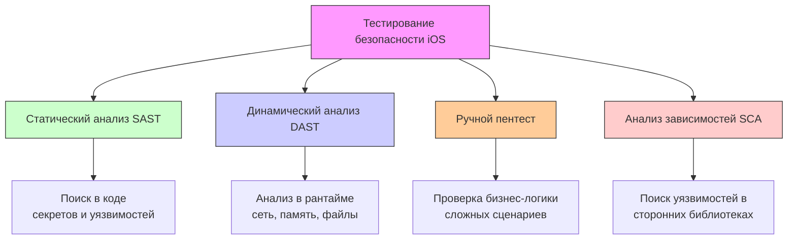

#security #testing #pentest #sast #dast #mobile-security #appsec #ios-security

---

## Тестирование безопасности (iOS Security Testing)

### Определение
**Тестирование безопасности мобильных приложений** — это процесс оценки защищенности приложения с целью выявления уязвимостей, слабых мест и несоответствий политикам безопасности, которые могут быть использованы злоумышленниками для компрометации данных, функциональности или пользователей . Это не разовое действие, а непрерывный процесс, интегрированный в жизненный цикл разработки (SDLC), направленный на обеспечение конфиденциальности, целостности и доступности информации .

В контексте iOS-разработки тестирование безопасности имеет свою специфику, обусловленную закрытостью экосистемы Apple, строгими правилами песочницы (sandbox) и особенностями аппаратного обеспечения .

### Зачем это знать [[iOS]]-разработчику?
1.  **Защита данных пользователей:** Предотвращение утечек персональных данных, паролей и платежной информации .
2.  **Соответствие требованиям (Compliance):** Многие отрасли (финансы, медицина) требуют соответствия стандартам (PCI DSS, HIPAA, GDPR) и проведения регулярных проверок безопасности .
3.  **Сохранение репутации:** Уязвимости в приложении могут привести к репутационным потерям и оттоку пользователей .
4.  **Бизнес-логика:** Тесты безопасности проверяют не только код, но и бизнес-логику на предмет ее обхода (например, покупка без оплаты) .
5.  **Предотвращение взлома:** Защита от копирования кода, пиратства и внедрения вредоносного кода .

---

### Классификация методов тестирования безопасности

Тестирование безопасности iOS-приложений можно разделить на несколько взаимодополняющих категорий .



#### 1. Статическое тестирование безопасности (SAST — Static Application Security Testing)
SAST-анализ проводится на исходном коде или скомпилированном бинарном файле без его запуска. Он помогает выявить проблемные паттерны на ранних этапах разработки .
*   **Что ищет:**
    *   Хардкод секретов ([[API]]-ключи, пароли) в исходниках и ресурсах .
    *   Использование небезопасных криптографических функций (например, MD5, SHA1) .
    *   Небезопасные конфигурации в `Info.plist` (например, разрешение на произвольную загрузку `NSAllowsArbitraryLoads`) .
    *   Наличие отладочных символов (`get-task-allow`) .
    *   Использование устаревших и небезопасных API .

**Инструменты:** MobSF , iOS Security Scanner , встроенные анализаторы Xcode.

#### 2. Динамическое тестирование безопасности (DAST — Dynamic Application Security Testing)
DAST-анализ проводится на запущенном приложении. Он имитирует атаки на работающий код и исследует его поведение во время выполнения . Для глубокого DAST-анализа на iOS часто требуется доступ к **джейлбрейк-устройству** или его виртуальному аналогу, чтобы получить низкоуровневый доступ к файловой системе и процессам .
*   **Что ищет:**
    *   Утечки данных в логах, кэше, временных файлах и баз данных [[SQLite]] .
    *   Проверка корректности работы SSL Pinning .
    *   Небезопасное хранение данных в Keychain .
    *   Реакция на взлом (detection of jailbreak/root, отладку) .
    *   Перехват и модификацию сетевого трафика .

**Инструменты:** Frida, Objection, Burp Suite, Corellium (виртуальные джейлбрейк-устройства) .

#### 3. Пентест (Penetration Testing)
Ручное тестирование безопасности, проводимое экспертами, которые симулируют действия реального злоумышленника. Цель — найти не только технические уязвимости, но и логические ошибки, которые не обнаруживаются автоматическими сканерами .
*   **Что ищет:**
    *   Недостатки авторизации (IDOR — возможность доступа к чужим данным) .
    *   Обход бизнес-логики (например, многоэтапной процедуры заказа).
    *   Сложные атаки на deep linking и custom URL schemes .
    *   Проверка механизмов аутентификации и управления сессиями .

#### 4. Анализ состава ПО (SCA — Software Composition Analysis)
Анализ сторонних библиотек и зависимостей на наличие известных уязвимостей (CVEs) .

---

### Ключевые области проверки в iOS

#### 1. Хранение данных (Data Storage)
Самая частая проблема — небезопасное хранение чувствительных данных .
*   **Keychain:** Используется ли Keychain для хранения токенов и паролей? Правильно ли настроены атрибуты доступа (`kSecAttrAccessible`)?
*   **UserDefaults / Plist:** Не хранятся ли там пароли или токены в открытом виде?
*   **Кэш и логи:** Не попадают ли данные в логи (`NSLog`, `print`) или кэш [[URLSession]]?
*   **Базы данных:** Шифруются ли чувствительные данные в [[SQLite]]/[[Realm]]? .

#### 2. Сетевое взаимодействие (Network Communication)
*   **App Transport Security (ATS):** Есть ли исключения, разрешающие незащищенное соединение (`NSAllowsArbitraryLoads`)? .
*   **SSL Pinning:** Проверяется ли сертификат сервера? Можно ли перехватить трафик, установив свой корневой сертификат? .
*   **Шифрование:** Используются ли современные протоколы TLS? .

#### 3. Аутентификация и управление сессиями
*   **Слабая аутентификация:** Отсутствие многофакторной аутентификации (MFA) для критических действий .
*   **Небезопасное хранение токенов:** Токены сессии, хранящиеся в легкодоступных местах .
*   **Отсутствие завершения сессии:** Неправильная реализация logout (токен не инвалидируется на сервере).

#### 4. Взаимодействие с платформой (Platform Interaction)
*   **URL Schemes:** Проверка на возможность несанкционированного вызова схемы из другого приложения .
*   **Пермишены (Permissions):** Запрашиваются ли разрешения (камера, геолокация) только тогда, когда они действительно нужны, и есть ли понятное описание в `Info.plist`? .

#### 5. Целостность кода (Code Integrity)
*   **Обфускация:** Затруднен ли анализ кода? .
*   **Защита от отладки:** Есть ли проверки на наличие отладчика? .
*   **Защита от джейлбрейка:** Проверяет ли приложение, не взломано ли устройство, и адекватно ли реагирует (блокировка, предупреждение)? .

#### 6. Обработка ошибок и логирование
*   **Утечка информации в ошибках:** Не возвращает ли сервер или само приложение слишком подробные ошибки (stack trace, детали БД) .

---

### Проблема тестирования на современных iOS (iOS 17+)

С каждым годом проводить глубокое динамическое тестирование (DAST) на реальных устройствах становится сложнее. Публичных джейлбрейков для последних версий iOS (17–26) не существует, что делает невозможным получение рут-доступа к файловой системе и низкоуровневую инструментовку на физических устройствах . Это лишает тестировщиков возможности проверять:

*   Реальное содержимое Keychain и файловой системы.
*   Работу механизмов анти-джейлбрейка.
*   Проводить глубокий динамический анализ трафика без переупаковки приложения .

**Решение:** Использование виртуальных платформ, таких как **Corellium**, которые предоставляют виртуализированные устройства с полным рут-доступом и встроенными инструментами для пентеста .

---

### Инструменты для тестирования безопасности iOS

| Инструмент               | Тип       | Назначение                                                                                  |
| :----------------------- | :-------- | :------------------------------------------------------------------------------------------ |
| **MobSF**                | SAST/DAST | Бесплатная платформа для автоматизированного анализа (поддерживает Swift) .                 |
| **iOS Security Scanner** | SAST      | CLI-утилита для поиска мисКонфигураций в .app/.ipa файлах .                                 |
| **Frida / Objection**    | DAST      | Инструменты для динамической инструментации, перехвата и модификации поведения приложения . |
| **Burp Suite / Charles** | DAST      | Прокси-серверы для анализа и модификации [[HTTP]]/[[HTTPS]] трафика .                       |
| **Corellium**            | Платформа | Виртуализированные джейлбрейк-устройства для глубокого DAST-анализа .                       |

---

### Интеграция в [[CI]]/[[CD]] (DevSecOps)

Для обеспечения безопасности на постоянной основе тесты безопасности интегрируются в конвейер CI/CD.

1.  **SAST в CI:** Запуск SAST-сканера (например, MobSF  или iOS Security Scanner) при каждом пулл-реквесте. Блокировка слияния при обнаружении критических уязвимостей (например, хардкод секретов) .
2.  **SCA в CI:** Автоматическая проверка зависимостей на наличие известных уязвимостей (CVEs) .
3.  **DAST по расписанию:** Запуск более глубоких динамических тестов в среде, приближенной к продакшну (например, на Corellium ), по расписанию или после значительных изменений.

**Пример подготовки проекта для MobSF в Bitrise** :
```yaml
# Упрощенный пример шага для Bitrise
mobSF-check-diff:
    steps:
      - script:
          inputs:
          - content: |
              #!/bin/bash
              # Скрипт для упаковки измененных файлов и отправки в MobSF
              sh prepare_mobsf.sh MyProject $BITRISE_GIT_BRANCH $BITRISEIO_GIT_BRANCH_DEST
    after_run:
      - upload-to-mobSF
```

---

### Чек-лист безопасности (iOS)

*   [ ] **Конфиденциальные данные:** Вся чувствительная информация (токены, пароли) хранится в **Keychain** с правильными атрибутами доступа .
*   [ ] **Сеть:** ATS настроено безопасно, нет исключений `NSAllowsArbitraryLoads`. Реализован и протестирован **SSL Pinning** .
*   [ ] **Логи:** Отсутствие `print` или `NSLog` с чувствительными данными в релизной сборке.
*   [ ] **Бинарь:** Проверка, что отключена отладка (`get-task-allow`) в релизной сборке .
*   [ ] **Зависимости:** Все сторонние библиотеки обновлены и не содержат известных CVE .
*   [ ] **Защита от взлома:** Реализованы базовые проверки на наличие джейлбрейка и отладчика .
*   [ ] **Плашка (Info.plist):** Для всех запрашиваемых разрешений (камера, гео и т.д.) есть понятное описание .
*   [ ] **Deep Links:** Кастомные URL схемы защищены от вызова сторонними приложениями .

### Итог
**Тестирование безопасности** — это комплексная дисциплина, выходящая далеко за рамки модульного тестирования. Оно требует комбинации автоматических (SAST, DAST, SCA) и ручных (пентест) подходов. Для iOS-разработчика понимание основ безопасности и умение пользоваться соответствующими инструментами является критически важным для создания надежных и защищенных приложений, особенно в условиях ужесточения политик Apple и требований регуляторов.