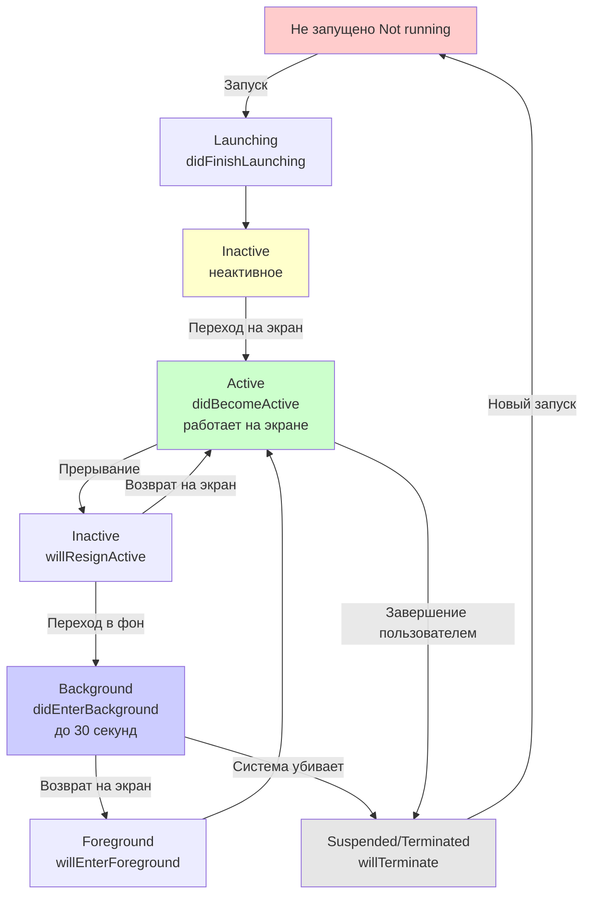

#uikit #Swift
## 📘 Определение
**`UIApplication`** — это **централизованный singleton-объект** в фреймворке [[UIKit]], который представляет и управляет всем приложением [[iOS]] (или iPadOS, tvOS, visionOS). Это единственная точка координации между вашим приложением и системой.

Каждое приложение имеет **ровно один экземпляр** `UIApplication` (или очень редко — его подкласс). Он создаётся системой автоматически во время запуска приложения (через функцию `UIApplicationMain(_:_:_:_:)`).

Доступ к нему осуществляется через статическое свойство:
```swift
UIApplication.shared
```

`UIApplication` наследуется от **[[UIResponder]]**, поэтому может участвовать в цепочке респондентов ([[Responder Chain]]) и обрабатывать события, которые не были обработаны ниже (например, shake для undo, клавиатурные команды и т.д.).

Относится к **UIKit → App Fundamentals → Application Management**.

### Основные роли UIApplication
- Управление жизненным циклом приложения (launch, background, terminate и т.д.)
- Доступ к глобальным состояниям: active/inactive, background, protected data, clipboard и т.д.
- Отправка событий и действий (`sendAction`, `sendEvent`)
- Управление окнами (`windows`, `keyWindow` — устарело в новых версиях)
- Работа со статус-баром (в старых версиях), ориентацией, уведомлениями, shortcut'ами, URL-схемами
- Контроль multitasking, background fetch, remote notifications и т.д.

`UIApplication` тесно сотрудничает с объектом-делегатом, который соответствует протоколу **UIApplicationDelegate** (или **[[SceneDelegate]]** в современных приложениях с UIScene).

---
## 🔹 Жизненный цикл приложения (Application Lifecycle)
`UIApplication` управляет состояниями приложения и уведомляет делегат о переходах между ними.

### Основные состояния (UIApplication.State):
```swift
enum State : Int {
    case active          // Приложение на экране и взаимодействует с пользователем
    case inactive        // На экране, но не получает ввода (например, при показе уведомления, звонка)
    case background      // В фоне, может выполнять код ограниченное время
    case inactive → background → terminated // (неактивно, но может быть возобновлено)
}
```

### Ключевые методы делегата (UIApplicationDelegate)
```swift
func application(_ application: UIApplication, didFinishLaunchingWithOptions launchOptions: [UIApplication.LaunchOptionsKey: Any]?) -> Bool
// Запуск приложения

func applicationDidBecomeActive(_ application: UIApplication)
// Стало активным (пользователь видит и взаимодействует)

func applicationWillResignActive(_ application: UIApplication)
// Скоро потеряет активность (например, входящий звонок)

func applicationDidEnterBackground(_ application: UIApplication)
// Перешло в фон (сохраняем состояние)

func applicationWillEnterForeground(_ application: UIApplication)
// Возвращается на экран

func applicationWillTerminate(_ application: UIApplication)
// Приложение завершается (редко вызывается в современных iOS)
```

### Схема жизненного цикла приложения 


Эта схема отражает типичный путь приложения в iOS.

---
## 🔹 Цепочка респондентов и UIApplication
`UIApplication` — **последний** объект в цепочке респондентов (responder chain) для большинства событий.

Пример цепочки при касании:
```
UIView (где касание) → superview → ... → rootView → UIViewController → UIWindow → UIApplication
```

Если событие не обработано никем ниже, оно доходит до `UIApplication.shared`, а затем может быть обработано в делегате или проигнорировано.

Пример отправки кастомного действия:
```swift
UIApplication.shared.sendAction(#selector(MyClass.myAction), to: nil, from: self, for: nil)
```

---
## 🔹 Примеры кода
### 1. Проверка текущего состояния приложения
```swift
let state = UIApplication.shared.applicationState

switch state {
case .active:
    print("Приложение активно")
case .inactive:
    print("Приложение неактивно")
case .background:
    print("В фоне")
@unknown default:
    break
}
```

### 2. Открытие URL (Safari, настройки и т.д.)
```swift
if let url = URL(string: "https://developer.apple.com") {
    UIApplication.shared.open(url) { success in
        if success {
            print("URL открыт")
        }
    }
}

// Открыть настройки приложения
if let url = URL(string: UIApplication.openSettingsURLString) {
    UIApplication.shared.open(url)
}
```

### 3. Управление иконкой badge (уведомления)
```swift
UIApplication.shared.applicationIconBadgeNumber = 5
UIApplication.shared.applicationIconBadgeNumber = 0 // сброс
```

### 4. Проверка, поддерживается ли multitasking / background modes
```swift
if UIApplication.shared.supportsMultipleScenes {
    print("Поддержка нескольких сцен (iPad, multitasking)")
}
```

### 5. Получение списка всех окон (включая сцены)
```swift
let allWindows = UIApplication.shared.windows
// или в сценах: UIApplication.shared.connectedScenes
```

### 6. Обработка shake (потрясти для undo) через responder chain
```swift
// В любом UIResponder (UIView, UIViewController и т.д.)
override func motionEnded(_ motion: UIEvent.EventSubtype, with event: UIEvent?) {
    if motion == .motionShake {
        print("Устройство потрясли!")
        // Показать undo/redo
    }
}
```

### 7. Регистрация на remote notifications (push)
```swift
UIApplication.shared.registerForRemoteNotifications()
```

### 8. Запрос временного расширения времени в фоне
```swift
var backgroundTask: UIBackgroundTaskIdentifier = .invalid

backgroundTask = UIApplication.shared.beginBackgroundTask { [weak self] in
    // Система требует завершить задачу
    self?.endBackgroundTask()
}

func endBackgroundTask() {
    if backgroundTask != .invalid {
        UIApplication.shared.endBackgroundTask(backgroundTask)
        backgroundTask = .invalid
    }
}
```

---
## 🔹 Современные подходы (Scene-based apps, iOS 13+)
С iOS 13 Apple ввела **UIScene** и **UIWindowScene**, поэтому многие методы `UIApplication` устарели или заменены:

- Вместо `keyWindow` → `UIWindowScene.windows.first { $0.isKeyWindow }`
- Жизненный цикл частично переместился в **UISceneDelegate**
- Делегат приложения (`UIApplicationDelegate`) всё ещё используется, но для сцен — `UISceneDelegate`

В SwiftUI-приложениях часто используется `@UIApplicationDelegateAdaptor` или полностью Scene-based подход.

### Пример в SwiftUI (подключение делегата)
```swift
@main
struct MyApp: App {
    @UIApplicationDelegateAdaptor(AppDelegate.self) var appDelegate
    
    var body: some Scene {
        WindowGroup {
            ContentView()
        }
    }
}

class AppDelegate: NSObject, UIApplicationDelegate {
    func application(_ application: UIApplication, didFinishLaunchingWithOptions launchOptions: [UIApplication.LaunchOptionsKey : Any]? = nil) -> Bool {
        print("Запущено из AppDelegate")
        return true
    }
}
```

---
## 🔹 Лучшие практики и замечания (2026 год)
- Избегайте прямого подклассинга `UIApplication` — почти никогда не нужно.
- Для большинства задач используйте **SceneDelegate** или **SwiftUI lifecycle**.
- `UIApplicationDelegate` **не deprecated** в iOS 18/19 (по состоянию на 2026), но его роль уменьшилась в пользу сцен.
- Всегда проверяйте `canOpenURL` перед вызовом `open(_:)` для лучшей UX.
- Для фоновых задач предпочтительнее **BGTaskScheduler** вместо старых background modes.
- Официальная документация: [UIApplication](https://developer.apple.com/documentation/uikit/uiapplication)
