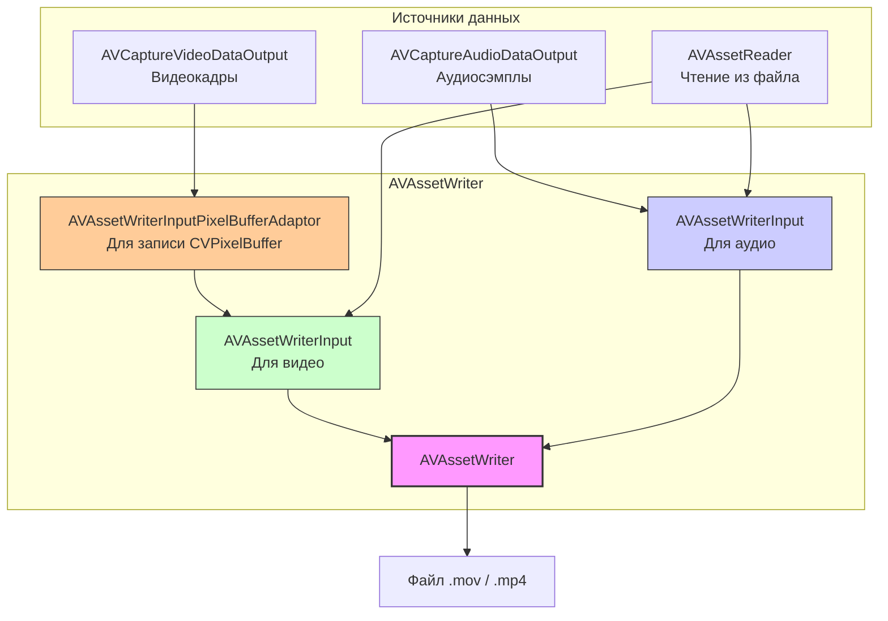

#avfoundation #avassetwriter #video #audio #recording #encoding #ios #swift

---

## AVAssetWriter — Низкоуровневая запись мультимедиа

### Определение
**AVAssetWriter** — это класс во фреймворке [[AVFoundation]], который обеспечивает **низкоуровневую запись** аудио и видео данных в файл. В отличие от [[AVCaptureMovieFileOutput]] (который предоставляет высокоуровневый [[API]] для записи), `AVAssetWriter` дает разработчику полный контроль над процессом кодирования, мультиплексирования и настройки параметров записи .

`AVAssetWriter` используется в сценариях, где требуется:
- Кастомное перекодирование видео
- Добавление водяных знаков или фильтров в реальном времени
- Запись с настраиваемыми параметрами кодека (битрейт, профиль)
- Создание видео из отдельных кадров (например, анимация или слайд-шоу)
- Микширование аудио и видео из разных источников

### Зачем это знать iOS-разработчику?
1.  **Полный контроль:** Настройка битрейта, разрешения, частоты кадров, кодека .
2.  **Обработка в реальном времени:** Запись видео с наложенными фильтрами или эффектами .
3.  **Гибкость:** Можно записывать видео не только с камеры, но и генерировать его программно (например, из `CIImage` или `AVPixelBuffer`) .
4.  **Оптимизация:** Настройка параметров сжатия для достижения нужного баланса между качеством и размером файла .
5.  **Профессиональные приложения:** Используется в видеоредакторах, приложениях для обработки видео, стриминговых клиентах .

---

### Архитектура и ключевые компоненты



### Ключевые компоненты

#### 1. **AVAssetWriter**
Основной объект, управляющий записью. Создается с указанием выходного URL и типа файла.

#### 2. **AVAssetWriterInput**
Представляет один поток (трек) данных — видео или аудио. Настраивается с помощью `outputSettings` (кодек, битрейт, разрешение).

#### 3. **AVAssetWriterInputPixelBufferAdaptor**
Специальный адаптер для записи видеоданных в формате `CVPixelBuffer`. Позволяет эффективно передавать кадры от камеры или из Core Image в `AVAssetWriterInput`.

---

### Примеры от простого к сложному

#### Уровень 0: Настройка Info.plist и разрешений

Для записи видео с камеры нужно добавить описание в `Info.plist`:

```xml
<key>NSCameraUsageDescription</key>
<string>Для записи видео</string>
<key>NSMicrophoneUsageDescription</key>
<string>Для записи звука</string>
```

#### Уровень 1: Базовый пример — запись видео из массива изображений

Создание видео из последовательности `UIImage` (слайд-шоу).

```swift
import UIKit
import AVFoundation

class SlideshowToVideoViewController: UIViewController {
    
    func createVideoFromImages(images: [UIImage], outputURL: URL) {
        // 1. Настройка размеров видео
        let size = CGSize(width: 1280, height: 720)
        let frameDuration = CMTime(value: 1, timescale: 1) // 1 кадр в секунду
        
        // 2. Создаем AVAssetWriter
        guard let writer = try? AVAssetWriter(outputURL: outputURL, fileType: .mov) else {
            print("Не удалось создать AVAssetWriter")
            return
        }
        
        // 3. Настройка видео-входа
        let videoSettings: [String: Any] = [
            AVVideoCodecKey: AVVideoCodecType.h264,
            AVVideoWidthKey: size.width,
            AVVideoHeightKey: size.height
        ]
        
        let videoInput = AVAssetWriterInput(mediaType: .video, outputSettings: videoSettings)
        videoInput.expectsMediaDataInRealTime = false // Не для реального времени
        
        guard writer.canAdd(videoInput) else {
            print("Не удалось добавить видео вход")
            return
        }
        writer.add(videoInput)
        
        // 4. Настройка адаптера для записи пиксельных буферов
        let pixelBufferAttributes: [String: Any] = [
            kCVPixelBufferPixelFormatTypeKey as String: kCVPixelFormatType_32ARGB,
            kCVPixelBufferWidthKey as String: size.width,
            kCVPixelBufferHeightKey as String: size.height
        ]
        
        let pixelBufferAdaptor = AVAssetWriterInputPixelBufferAdaptor(
            assetWriterInput: videoInput,
            sourcePixelBufferAttributes: pixelBufferAttributes
        )
        
        // 5. Запуск записи
        writer.startWriting()
        writer.startSession(atSourceTime: .zero)
        
        // 6. Запись каждого изображения
        var frameTime = CMTime.zero
        for image in images {
            guard let pixelBuffer = image.toPixelBuffer(size: size) else { continue }
            
            // Ждем готовности входа
            while !videoInput.isReadyForMoreMediaData {
                Thread.sleep(forTimeInterval: 0.01)
            }
            
            pixelBufferAdaptor.append(pixelBuffer, withPresentationTime: frameTime)
            frameTime = CMTimeAdd(frameTime, frameDuration)
        }
        
        // 7. Завершение записи
        videoInput.markAsFinished()
        writer.finishWriting {
            print("Видео сохранено: \(outputURL)")
        }
    }
}

// Расширение UIImage для конвертации в CVPixelBuffer
extension UIImage {
    func toPixelBuffer(size: CGSize) -> CVPixelBuffer? {
        let attributes: [String: Any] = [
            kCVPixelBufferCGImageCompatibilityKey as String: true,
            kCVPixelBufferCGBitmapContextCompatibilityKey as String: true
        ]
        
        var pixelBuffer: CVPixelBuffer?
        let status = CVPixelBufferCreate(
            kCFAllocatorDefault,
            Int(size.width),
            Int(size.height),
            kCVPixelFormatType_32ARGB,
            attributes as CFDictionary,
            &pixelBuffer
        )
        
        guard status == kCVReturnSuccess, let buffer = pixelBuffer else { return nil }
        
        CVPixelBufferLockBaseAddress(buffer, [])
        defer { CVPixelBufferUnlockBaseAddress(buffer, []) }
        
        let context = CGContext(
            data: CVPixelBufferGetBaseAddress(buffer),
            width: Int(size.width),
            height: Int(size.height),
            bitsPerComponent: 8,
            bytesPerRow: CVPixelBufferGetBytesPerRow(buffer),
            space: CGColorSpaceCreateDeviceRGB(),
            bitmapInfo: CGImageAlphaInfo.noneSkipFirst.rawValue
        )
        
        guard let ctx = context else { return nil }
        
        UIGraphicsPushContext(ctx)
        draw(in: CGRect(origin: .zero, size: size))
        UIGraphicsPopContext()
        
        return buffer
    }
}
```

#### Уровень 2: Запись видео с камеры в реальном времени

```swift
import UIKit
import AVFoundation

class RealTimeCameraRecorder: NSObject {
    private let captureSession = AVCaptureSession()
    private var assetWriter: AVAssetWriter?
    private var videoInput: AVAssetWriterInput?
    private var audioInput: AVAssetWriterInput?
    private var pixelBufferAdaptor: AVAssetWriterInputPixelBufferAdaptor?
    
    private var outputURL: URL?
    private var isRecording = false
    private var sessionStarted = false
    private var firstFrameTime: CMTime?
    
    override init() {
        super.init()
        setupCaptureSession()
    }
    
    private func setupCaptureSession() {
        captureSession.sessionPreset = .hd1920x1080
        
        // Видео вход
        guard let camera = AVCaptureDevice.default(.builtInWideAngleCamera, for: .video, position: .back),
              let videoInput = try? AVCaptureDeviceInput(device: camera),
              captureSession.canAddInput(videoInput) else {
            print("Не удалось добавить видео вход")
            return
        }
        captureSession.addInput(videoInput)
        
        // Аудио вход
        if let microphone = AVCaptureDevice.default(for: .audio),
           let audioInput = try? AVCaptureDeviceInput(device: microphone),
           captureSession.canAddInput(audioInput) {
            captureSession.addInput(audioInput)
        }
        
        // Видео выход для получения кадров
        let videoOutput = AVCaptureVideoDataOutput()
        videoOutput.videoSettings = [
            kCVPixelBufferPixelFormatTypeKey as String: kCVPixelFormatType_32BGRA
        ]
        videoOutput.setSampleBufferDelegate(self, queue: DispatchQueue(label: "videoQueue"))
        
        if captureSession.canAddOutput(videoOutput) {
            captureSession.addOutput(videoOutput)
        }
        
        // Аудио выход для получения звука
        let audioOutput = AVCaptureAudioDataOutput()
        audioOutput.setSampleBufferDelegate(self, queue: DispatchQueue(label: "audioQueue"))
        
        if captureSession.canAddOutput(audioOutput) {
            captureSession.addOutput(audioOutput)
        }
    }
    
    func startRecording() {
        guard !isRecording else { return }
        
        // Создаем временный файл
        let tempDir = FileManager.default.temporaryDirectory
        let fileName = "video_\(Date().timeIntervalSince1970).mov"
        outputURL = tempDir.appendingPathComponent(fileName)
        
        guard let outputURL = outputURL else { return }
        
        // Создаем asset writer
        do {
            assetWriter = try AVAssetWriter(outputURL: outputURL, fileType: .mov)
        } catch {
            print("Ошибка создания AVAssetWriter: \(error)")
            return
        }
        
        guard let writer = assetWriter else { return }
        
        // Настройка видео входа
        let videoSettings: [String: Any] = [
            AVVideoCodecKey: AVVideoCodecType.h264,
            AVVideoWidthKey: 1920,
            AVVideoHeightKey: 1080,
            AVVideoCompressionPropertiesKey: [
                AVVideoAverageBitRateKey: 10_000_000,
                AVVideoMaxKeyFrameIntervalKey: 30
            ]
        ]
        
        videoInput = AVAssetWriterInput(mediaType: .video, outputSettings: videoSettings)
        videoInput?.expectsMediaDataInRealTime = true
        
        // Настройка адаптера для пиксельных буферов
        let pixelBufferAttributes: [String: Any] = [
            kCVPixelBufferPixelFormatTypeKey as String: kCVPixelFormatType_32BGRA,
            kCVPixelBufferWidthKey as String: 1920,
            kCVPixelBufferHeightKey as String: 1080
        ]
        
        pixelBufferAdaptor = AVAssetWriterInputPixelBufferAdaptor(
            assetWriterInput: videoInput!,
            sourcePixelBufferAttributes: pixelBufferAttributes
        )
        
        guard let videoInput = videoInput,
              let adaptor = pixelBufferAdaptor else { return }
        
        if writer.canAdd(videoInput) {
            writer.add(videoInput)
        }
        
        // Настройка аудио входа
        let audioSettings: [String: Any] = [
            AVFormatIDKey: kAudioFormatMPEG4AAC,
            AVSampleRateKey: 44100,
            AVNumberOfChannelsKey: 2,
            AVEncoderBitRateKey: 128000
        ]
        
        audioInput = AVAssetWriterInput(mediaType: .audio, outputSettings: audioSettings)
        audioInput?.expectsMediaDataInRealTime = true
        
        guard let audioInput = audioInput else { return }
        
        if writer.canAdd(audioInput) {
            writer.add(audioInput)
        }
        
        // Запуск сессии захвата
        captureSession.startRunning()
        isRecording = true
        sessionStarted = false
        firstFrameTime = nil
        
        print("Запись начата")
    }
    
    func stopRecording() {
        guard isRecording else { return }
        
        isRecording = false
        captureSession.stopRunning()
        
        // Завершаем запись
        assetWriter?.finishWriting { [weak self] in
            guard let url = self?.outputURL else { return }
            print("Запись завершена: \(url)")
            
            // Сохраняем в фотоальбом
            UISaveVideoAtPathToSavedPhotosAlbum(url.path, nil, nil, nil)
        }
    }
    
    private func processVideoSample(_ sampleBuffer: CMSampleBuffer) {
        guard isRecording,
              let writer = assetWriter,
              let videoInput = videoInput,
              let adaptor = pixelBufferAdaptor else { return }
        
        // Получаем время кадра
        let presentationTime = CMSampleBufferGetPresentationTimeStamp(sampleBuffer)
        
        // Начинаем сессию с первым кадром
        if !sessionStarted {
            writer.startWriting()
            writer.startSession(atSourceTime: presentationTime)
            sessionStarted = true
            firstFrameTime = presentationTime
        }
        
        // Получаем пиксельный буфер
        guard let pixelBuffer = CMSampleBufferGetImageBuffer(sampleBuffer) else { return }
        
        // Ждем готовности входа
        if !videoInput.isReadyForMoreMediaData {
            return
        }
        
        // Добавляем кадр
        adaptor.append(pixelBuffer, withPresentationTime: presentationTime)
    }
    
    private func processAudioSample(_ sampleBuffer: CMSampleBuffer) {
        guard isRecording,
              let writer = assetWriter,
              let audioInput = audioInput,
              sessionStarted else { return }
        
        if audioInput.isReadyForMoreMediaData {
            audioInput.append(sampleBuffer)
        }
    }
}

// MARK: - AVCaptureVideoDataOutputSampleBufferDelegate
extension RealTimeCameraRecorder: AVCaptureVideoDataOutputSampleBufferDelegate {
    func captureOutput(_ output: AVCaptureOutput,
                       didOutput sampleBuffer: CMSampleBuffer,
                       from connection: AVCaptureConnection) {
        if output is AVCaptureVideoDataOutput {
            processVideoSample(sampleBuffer)
        } else if output is AVCaptureAudioDataOutput {
            processAudioSample(sampleBuffer)
        }
    }
}
```

#### Уровень 3: Запись с наложением фильтра (Core Image)

```swift
import UIKit
import AVFoundation
import CoreImage

class FilteredVideoRecorder: NSObject {
    private let captureSession = AVCaptureSession()
    private var assetWriter: AVAssetWriter?
    private var videoInput: AVAssetWriterInput?
    private var pixelBufferAdaptor: AVAssetWriterInputPixelBufferAdaptor?
    private let ciContext = CIContext()
    
    func startRecordingWithFilter() {
        // ... настройка captureSession и assetWriter (как в уровне 2) ...
    }
    
    private func processVideoWithFilter(_ sampleBuffer: CMSampleBuffer) {
        guard let pixelBuffer = CMSampleBufferGetImageBuffer(sampleBuffer),
              let adaptor = pixelBufferAdaptor,
              let videoInput = videoInput else { return }
        
        // Применяем фильтр
        let ciImage = CIImage(cvPixelBuffer: pixelBuffer)
        let filter = CIFilter(name: "CISepiaTone")
        filter?.setValue(ciImage, forKey: kCIInputImageKey)
        filter?.setValue(0.8, forKey: kCIInputIntensityKey)
        
        guard let outputImage = filter?.outputImage else { return }
        
        // Рендерим в новый буфер
        var newPixelBuffer: CVPixelBuffer?
        let attributes: [String: Any] = [
            kCVPixelBufferPixelFormatTypeKey as String: kCVPixelFormatType_32BGRA,
            kCVPixelBufferWidthKey as String: 1920,
            kCVPixelBufferHeightKey as String: 1080
        ]
        
        CVPixelBufferCreate(
            kCFAllocatorDefault,
            1920,
            1080,
            kCVPixelFormatType_32BGRA,
            attributes as CFDictionary,
            &newPixelBuffer
        )
        
        guard let buffer = newPixelBuffer else { return }
        
        ciContext.render(outputImage, to: buffer)
        
        // Записываем обработанный кадр
        let presentationTime = CMSampleBufferGetPresentationTimeStamp(sampleBuffer)
        adaptor.append(buffer, withPresentationTime: presentationTime)
    }
}
```

#### Уровень 4: Перекодирование видео с AVAssetReader

```swift
import UIKit
import AVFoundation

class VideoTranscoder {
    
    func transcodeVideo(inputURL: URL, outputURL: URL) {
        // 1. Создаем AVAsset из входного файла
        let asset = AVAsset(url: inputURL)
        
        // 2. Читаем видео трек
        guard let videoTrack = asset.tracks(withMediaType: .video).first else {
            print("Видео трек не найден")
            return
        }
        
        // 3. Настраиваем AVAssetReader
        guard let reader = try? AVAssetReader(asset: asset) else {
            print("Не удалось создать AVAssetReader")
            return
        }
        
        let videoReaderOutput = AVAssetReaderTrackOutput(
            track: videoTrack,
            outputSettings: [
                kCVPixelBufferPixelFormatTypeKey as String: kCVPixelFormatType_32BGRA
            ]
        )
        
        guard reader.canAdd(videoReaderOutput) else { return }
        reader.add(videoReaderOutput)
        
        // 4. Настраиваем AVAssetWriter
        guard let writer = try? AVAssetWriter(outputURL: outputURL, fileType: .mp4) else {
            print("Не удалось создать AVAssetWriter")
            return
        }
        
        // 5. Настраиваем видео вход с более высоким битрейтом
        let videoSettings: [String: Any] = [
            AVVideoCodecKey: AVVideoCodecType.h264,
            AVVideoWidthKey: 1920,
            AVVideoHeightKey: 1080,
            AVVideoCompressionPropertiesKey: [
                AVVideoAverageBitRateKey: 12_000_000,
                AVVideoMaxKeyFrameIntervalKey: 30
            ]
        ]
        
        let videoWriterInput = AVAssetWriterInput(mediaType: .video, outputSettings: videoSettings)
        videoWriterInput.expectsMediaDataInRealTime = false
        
        guard writer.canAdd(videoWriterInput) else { return }
        writer.add(videoWriterInput)
        
        // 6. Настраиваем адаптер для перекодирования
        let pixelBufferAttributes: [String: Any] = [
            kCVPixelBufferPixelFormatTypeKey as String: kCVPixelFormatType_32BGRA,
            kCVPixelBufferWidthKey as String: 1920,
            kCVPixelBufferHeightKey as String: 1080
        ]
        
        let pixelBufferAdaptor = AVAssetWriterInputPixelBufferAdaptor(
            assetWriterInput: videoWriterInput,
            sourcePixelBufferAttributes: pixelBufferAttributes
        )
        
        // 7. Запускаем чтение и запись
        reader.startReading()
        writer.startWriting()
        writer.startSession(atSourceTime: .zero)
        
        let readingQueue = DispatchQueue(label: "readingQueue")
        let group = DispatchGroup()
        
        group.enter()
        readingQueue.async {
            var frameTime = CMTime.zero
            let frameDuration = CMTime(value: 1, timescale: 30) // 30 fps
            
            while reader.status == .reading {
                guard let sampleBuffer = videoReaderOutput.copyNextSampleBuffer() else {
                    break
                }
                
                // Ждем готовности входа
                while !videoWriterInput.isReadyForMoreMediaData {
                    Thread.sleep(forTimeInterval: 0.01)
                }
                
                if let pixelBuffer = CMSampleBufferGetImageBuffer(sampleBuffer) {
                    pixelBufferAdaptor.append(pixelBuffer, withPresentationTime: frameTime)
                    frameTime = CMTimeAdd(frameTime, frameDuration)
                }
            }
            
            videoWriterInput.markAsFinished()
            writer.finishWriting {
                print("Перекодирование завершено")
                group.leave()
            }
        }
        
        group.wait()
        print("Файл сохранен: \(outputURL)")
    }
}
```

---

### Важные нюансы и Best Practices

#### 1. **expectsMediaDataInRealTime**
- Для записи с камеры или в реальном времени: `true`
- Для перекодирования или обработки файлов: `false`

```swift
videoInput.expectsMediaDataInRealTime = true
```

#### 2. **Pixel Buffer Format**
Убедитесь, что формат пикселей совпадает с тем, что вы передаете:

```swift
let pixelBufferAttributes: [String: Any] = [
    kCVPixelBufferPixelFormatTypeKey as String: kCVPixelFormatType_32BGRA,
    // ...
]
```

#### 3. **Управление памятью**
- Освобождайте `CVPixelBuffer` после использования
- Используйте `autoreleasepool` в циклах записи

```swift
autoreleasepool {
    // Запись кадра
}
```

#### 4. **Обработка ошибок**
Всегда проверяйте статусы:
- `writer.status`
- `reader.status`
- Результаты добавления кадров

#### 5. **Потокобезопасность**
`AVAssetWriterInput` не является потокобезопасным. Используйте одну очередь для записи в один вход.

#### 6. **Запись аудио и видео одновременно**
Нужно синхронизировать временные метки аудио и видео.

#### 7. **Сохранение в фотоальбом**
После завершения записи используйте `UISaveVideoAtPathToSavedPhotosAlbum` или `PHPhotoLibrary`.

### Итог
**AVAssetWriter** — мощный инструмент для профессиональной работы с видео и аудио в iOS. Он дает полный контроль над процессом записи, что делает его незаменимым в приложениях для обработки и редактирования мультимедиа. Ключевые навыки: настройка параметров записи, работа с пиксельными буферами, синхронизация аудио и видео, оптимизация производительности.