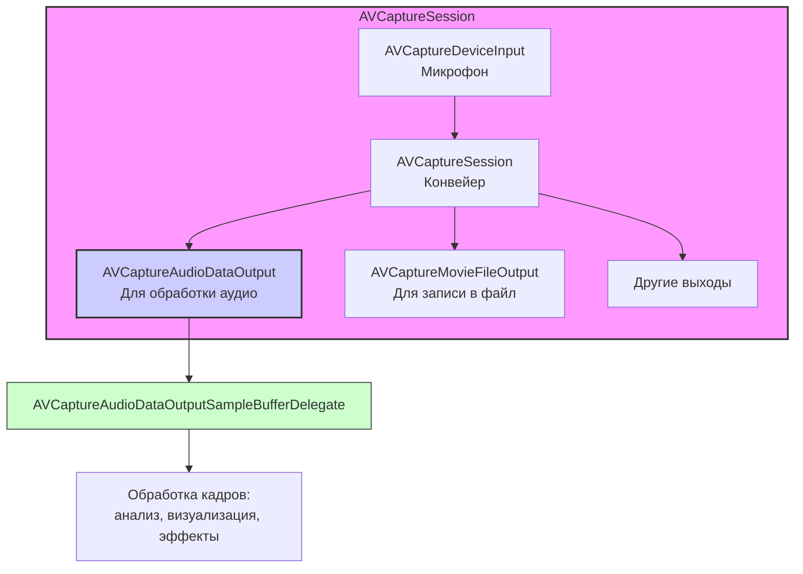

#avfoundation #audio #capture #microphone #avcaptureaudiodataoutput #real-time #processing #coreaudio

---
### Определение
**AVCaptureAudioDataOutput** — это класс фреймворка [[AVFoundation]], который предоставляет доступ к аудиоданным, захваченным с микрофона (или другого аудиоустройства ввода), в реальном времени. Он является частью системы [[AVCaptureSession]] и позволяет разработчику получать каждый аудиокадр (буфер) по мере его поступления для последующей обработки, анализа или записи .

В отличие от [[AVCaptureMovieFileOutput]], который сохраняет аудио сразу в файл, `AVCaptureAudioDataOutput` дает вам **прямой доступ к сырым аудиоданным**, что открывает широкие возможности для создания приложений с обработкой звука в реальном времени.

### Зачем это знать iOS-разработчику?
1.  **Анализ звука:** Детекция уровня громкости, распознавание речи, обнаружение определенных частот.
2.  **Обработка в реальном времени:** Применение эффектов (эхо, реверберация), изменение тональности, вокалы (караоке).
3.  **Визуализация:** Создание осциллограмм, спектрограмм, визуальных эффектов, реагирующих на звук.
4.  **Смешивание с другим аудио:** Микрофон + музыка из приложения одновременно.
5.  **Специализированная запись:** Когда нужно записывать аудио в кастомный формат или с дополнительной обработкой.

---

### Архитектура и место в [[AVCaptureSession]]

`AVCaptureAudioDataOutput` работает аналогично [[AVCaptureVideoDataOutput]], но для аудио. Он добавляется в сессию как отдельный выход (output).



### Ключевые компоненты

1.  **AVCaptureAudioDataOutput:** Сам объект, который нужно добавить в сессию.
2.  **[[AVCaptureAudioDataOutputSampleBufferDelegate]]:** Протокол делегата, который получает аудиобуферы. Содержит один основной метод:
    - `captureOutput(_:didOutput:sampleBuffer:from:)` — вызывается каждый раз, когда доступен новый аудиокадр.
3.  **CMSampleBuffer:** Контейнер, содержащий собственно аудиоданные (обычно в формате `AudioBufferList`). Из него можно извлечь:
    - Аудиобуферы (`AudioBufferList`)
    - Формат (`CMAudioFormatDescription`)
    - Временную информацию (`CMSampleTimingInfo`)

---

### Примеры от простого к сложному

#### Уровень 0: Настройка Info.plist (разрешения)
Для доступа к микрофону обязательно нужно добавить описание в `Info.plist`.

- **NSMicrophoneUsageDescription** — "Для анализа звука и визуализации"

#### Уровень 1: Базовый захват аудио и получение буферов
Самый простой пример — подключиться к микрофону и начать получать аудиоданные.

```swift
import UIKit
import AVFoundation

class SimpleAudioCaptureViewController: UIViewController, AVCaptureAudioDataOutputSampleBufferDelegate {

    var captureSession: AVCaptureSession!
    let audioDataOutputQueue = DispatchQueue(label: "audioDataOutputQueue")

    override func viewDidLoad() {
        super.viewDidLoad()
        checkPermissionsAndSetup()
    }

    private func checkPermissionsAndSetup() {
        switch AVCaptureDevice.authorizationStatus(for: .audio) {
        case .authorized:
            setupAudioCapture()
        case .notDetermined:
            AVCaptureDevice.requestAccess(for: .audio) { granted in
                if granted {
                    DispatchQueue.main.async {
                        self.setupAudioCapture()
                    }
                }
            }
        case .denied, .restricted:
            print("Нет доступа к микрофону")
        @unknown default:
            fatalError()
        }
    }

    private func setupAudioCapture() {
        // 1. Создаем сессию
        captureSession = AVCaptureSession()

        // 2. Получаем аудиоустройство (микрофон)
        guard let audioDevice = AVCaptureDevice.default(for: .audio) else {
            print("Микрофон не найден")
            return
        }

        do {
            // 3. Создаем инпут из микрофона
            let audioInput = try AVCaptureDeviceInput(device: audioDevice)
            
            // 4. Добавляем инпут в сессию
            if captureSession.canAddInput(audioInput) {
                captureSession.addInput(audioInput)
            } else {
                print("Не удалось добавить аудио инпут")
                return
            }

            // 5. Создаем и настраиваем AVCaptureAudioDataOutput
            let audioOutput = AVCaptureAudioDataOutput()
            
            // Устанавливаем делегат на нашу очередь
            audioOutput.setSampleBufferDelegate(self, queue: audioDataOutputQueue)
            
            if captureSession.canAddOutput(audioOutput) {
                captureSession.addOutput(audioOutput)
            } else {
                print("Не удалось добавить аудио output")
                return
            }

            // 6. Запускаем сессию
            DispatchQueue.global(qos: .userInitiated).async { [weak self] in
                self?.captureSession.startRunning()
                print("Аудио сессия запущена")
            }

        } catch {
            print("Ошибка создания аудио инпута: \(error.localizedDescription)")
        }
    }

    // MARK: - AVCaptureAudioDataOutputSampleBufferDelegate
    func captureOutput(_ output: AVCaptureOutput, didOutput sampleBuffer: CMSampleBuffer, from connection: AVCaptureConnection) {
        // Этот метод вызывается для каждого аудиокадра!
        
        // Получаем информацию о буфере
        let formatDesc = CMSampleBufferGetFormatDescription(sampleBuffer)
        let asbd = CMAudioFormatDescriptionGetStreamBasicDescription(formatDesc!)?.pointee
        
        // Получаем сами аудиоданные
        if let blockBuffer = CMSampleBufferGetDataBuffer(sampleBuffer) {
            var length = 0
            var dataPointer: UnsafeMutablePointer<Int8>?
            CMBlockBufferGetDataPointer(blockBuffer, atOffset: 0, lengthAtOffsetOut: nil, totalLengthOut: &length, dataPointerOut: &dataPointer)
            
            // Здесь dataPointer указывает на сырые аудиоданные (PCM)
            print("Получен аудиокадр: \(length) байт")
            
            // Частота дискретизации (обычно 44100 или 48000 Гц)
            if let asbd = asbd {
                print("Частота: \(asbd.mSampleRate) Гц, каналов: \(asbd.mChannelsPerFrame)")
            }
        }
    }
}
```

#### Уровень 2: Анализ уровня громкости (RMS)
Практический пример — получение уровня громкости (громкости звука) в реальном времени.

```swift
import UIKit
import AVFoundation
import Accelerate // Для быстрых математических операций

class AudioLevelMeterViewController: UIViewController, AVCaptureAudioDataOutputSampleBufferDelegate {

    var captureSession: AVCaptureSession!
    let audioDataOutputQueue = DispatchQueue(label: "audioDataOutputQueue")
    
    // UI элементы
    let levelMeterView = UIView()
    let levelLabel = UILabel()
    
    override func viewDidLoad() {
        super.viewDidLoad()
        setupUI()
        setupAudioCapture()
    }
    
    private func setupUI() {
        view.backgroundColor = .black
        
        levelMeterView.frame = CGRect(x: 50, y: 200, width: 300, height: 30)
        levelMeterView.backgroundColor = .gray
        levelMeterView.layer.cornerRadius = 15
        levelMeterView.clipsToBounds = true
        view.addSubview(levelMeterView)
        
        let levelIndicator = UIView(frame: CGRect(x: 0, y: 0, width: 0, height: 30))
        levelIndicator.backgroundColor = .green
        levelIndicator.tag = 100 // Для доступа позже
        levelMeterView.addSubview(levelIndicator)
        
        levelLabel.frame = CGRect(x: 50, y: 250, width: 300, height: 30)
        levelLabel.textColor = .white
        levelLabel.textAlignment = .center
        levelLabel.text = "Громкость: 0.0"
        view.addSubview(levelLabel)
    }
    
    private func setupAudioCapture() {
        captureSession = AVCaptureSession()
        
        guard let audioDevice = AVCaptureDevice.default(for: .audio),
              let audioInput = try? AVCaptureDeviceInput(device: audioDevice) else { return }
        
        if captureSession.canAddInput(audioInput) {
            captureSession.addInput(audioInput)
        }
        
        let audioOutput = AVCaptureAudioDataOutput()
        audioOutput.setSampleBufferDelegate(self, queue: audioDataOutputQueue)
        
        if captureSession.canAddOutput(audioOutput) {
            captureSession.addOutput(audioOutput)
        }
        
        DispatchQueue.global(qos: .userInitiated).async { [weak self] in
            self?.captureSession.startRunning()
        }
    }
    
    // MARK: - AVCaptureAudioDataOutputSampleBufferDelegate
    func captureOutput(_ output: AVCaptureOutput, didOutput sampleBuffer: CMSampleBuffer, from connection: AVCaptureConnection) {
        
        // Получаем аудиобуфер
        guard let blockBuffer = CMSampleBufferGetDataBuffer(sampleBuffer) else { return }
        
        var length = 0
        var dataPointer: UnsafeMutablePointer<Int8>?
        CMBlockBufferGetDataPointer(blockBuffer, atOffset: 0, lengthAtOffsetOut: nil, totalLengthOut: &length, dataPointerOut: &dataPointer)
        
        guard let ptr = dataPointer else { return }
        
        // Предполагаем, что аудио в формате Float32 (часто бывает так)
        // На самом деле формат нужно проверять через asbd, но для примера упростим
        let audioBuffer = UnsafeBufferPointer(start: ptr.withMemoryRebound(to: Float32.self, capacity: length / 4) { $0 }, count: length / 4)
        
        // Вычисляем RMS (Root Mean Square) — среднеквадратичное значение
        var rms: Float = 0.0
        vDSP_rmsqv(audioBuffer.baseAddress!, 1, &rms, UInt(audioBuffer.count))
        
        // Нормализуем и ограничиваем значение
        let level = min(1.0, max(0.0, Double(rms) * 5.0)) // Множитель 5 для чувствительности
        
        DispatchQueue.main.async {
            // Обновляем UI
            if let indicator = self.levelMeterView.viewWithTag(100) {
                let width = CGFloat(level) * self.levelMeterView.bounds.width
                indicator.frame = CGRect(x: 0, y: 0, width: width, height: 30)
                indicator.backgroundColor = level > 0.7 ? .red : (level > 0.3 ? .yellow : .green)
            }
            self.levelLabel.text = String(format: "Громкость: %.2f", level)
        }
    }
}
```

#### Уровень 3: Одновременный захват аудио и видео
Часто нужно получать и аудио, и видео одновременно (например, для записи с эффектами).

```swift
import UIKit
import AVFoundation

class AudioVideoCaptureViewController: UIViewController, 
                                       AVCaptureVideoDataOutputSampleBufferDelegate,
                                       AVCaptureAudioDataOutputSampleBufferDelegate {

    var captureSession: AVCaptureSession!
    var previewLayer: AVCaptureVideoPreviewLayer!
    
    let videoQueue = DispatchQueue(label: "videoQueue")
    let audioQueue = DispatchQueue(label: "audioQueue")

    override func viewDidLoad() {
        super.viewDidLoad()
        checkPermissionsAndSetup()
    }

    private func checkPermissionsAndSetup() {
        // Проверяем разрешения для камеры и микрофона
        let cameraStatus = AVCaptureDevice.authorizationStatus(for: .video)
        let audioStatus = AVCaptureDevice.authorizationStatus(for: .audio)
        
        if cameraStatus == .authorized && audioStatus == .authorized {
            setupCaptureSession()
        } else if cameraStatus == .notDetermined {
            AVCaptureDevice.requestAccess(for: .video) { _ in
                self.checkPermissionsAndSetup()
            }
        } else if audioStatus == .notDetermined {
            AVCaptureDevice.requestAccess(for: .audio) { _ in
                self.checkPermissionsAndSetup()
            }
        } else {
            print("Нет разрешений")
        }
    }

    private func setupCaptureSession() {
        captureSession = AVCaptureSession()
        captureSession.sessionPreset = .hd1280x720

        // === ВИДЕО ===
        guard let videoDevice = AVCaptureDevice.default(.builtInWideAngleCamera, for: .video, position: .back),
              let videoInput = try? AVCaptureDeviceInput(device: videoDevice),
              captureSession.canAddInput(videoInput) else { return }
        captureSession.addInput(videoInput)

        let videoOutput = AVCaptureVideoDataOutput()
        videoOutput.videoSettings = [kCVPixelBufferPixelFormatTypeKey as String: kCVPixelFormatType_32BGRA]
        videoOutput.setSampleBufferDelegate(self, queue: videoQueue)
        if captureSession.canAddOutput(videoOutput) {
            captureSession.addOutput(videoOutput)
        }

        // === АУДИО ===
        guard let audioDevice = AVCaptureDevice.default(for: .audio),
              let audioInput = try? AVCaptureDeviceInput(device: audioDevice),
              captureSession.canAddInput(audioInput) else { return }
        captureSession.addInput(audioInput)

        let audioOutput = AVCaptureAudioDataOutput()
        audioOutput.setSampleBufferDelegate(self, queue: audioQueue)
        if captureSession.canAddOutput(audioOutput) {
            captureSession.addOutput(audioOutput)
        }

        // Preview
        previewLayer = AVCaptureVideoPreviewLayer(session: captureSession)
        previewLayer.frame = view.bounds
        previewLayer.videoGravity = .resizeAspectFill
        view.layer.addSublayer(previewLayer)

        DispatchQueue.global(qos: .userInitiated).async { [weak self] in
            self?.captureSession.startRunning()
        }
    }

    // MARK: - Video Delegate
    func captureOutput(_ output: AVCaptureOutput, didOutput sampleBuffer: CMSampleBuffer, from connection: AVCaptureConnection) {
        // Обработка видео
        print("Видео кадр в \(Date())")
    }

    // MARK: - Audio Delegate
    func captureOutput(_ output: AVCaptureOutput, didOutput sampleBuffer: CMSampleBuffer, from connection: AVCaptureConnection) {
        // Обработка аудио
        print("Аудио кадр в \(Date())")
    }
}
```

#### Уровень 4: Применение эффектов к аудио в реальном времени
Пример использования Audio Unit (v2) или SimpleAudioEngine для обработки. Это сложная тема, но покажем концепцию.

```swift
import UIKit
import AVFoundation
import AudioToolbox

class AudioEffectViewController: UIViewController, AVCaptureAudioDataOutputSampleBufferDelegate {

    var captureSession: AVCaptureSession!
    let audioQueue = DispatchQueue(label: "audioQueue")
    
    // Эффект: простое эхо (задержка)
    var delayBuffer: [Float] = []
    let delaySize = 44100 // 1 секунда задержки при 44.1 кГц
    var writePosition = 0

    override func viewDidLoad() {
        super.viewDidLoad()
        delayBuffer = [Float](repeating: 0, count: delaySize)
        setupAudioCapture()
    }

    private func setupAudioCapture() {
        captureSession = AVCaptureSession()
        
        guard let audioDevice = AVCaptureDevice.default(for: .audio),
              let audioInput = try? AVCaptureDeviceInput(device: audioDevice) else { return }
        
        if captureSession.canAddInput(audioInput) {
            captureSession.addInput(audioInput)
        }
        
        let audioOutput = AVCaptureAudioDataOutput()
        audioOutput.setSampleBufferDelegate(self, queue: audioQueue)
        
        if captureSession.canAddOutput(audioOutput) {
            captureSession.addOutput(audioOutput)
        }
        
        // Важно: для обработки нам нужно знать формат аудио
        // Обычно это Float32, non-interleaved
        
        DispatchQueue.global(qos: .userInitiated).async { [weak self] in
            self?.captureSession.startRunning()
        }
    }

    // MARK: - Audio Delegate
    func captureOutput(_ output: AVCaptureOutput, didOutput sampleBuffer: CMSampleBuffer, from connection: AVCaptureConnection) {
        
        guard let formatDesc = CMSampleBufferGetFormatDescription(sampleBuffer),
              let asbd = CMAudioFormatDescriptionGetStreamBasicDescription(formatDesc)?.pointee else { return }
        
        // Проверяем, что формат подходит (Float32, non-interleaved)
        guard asbd.mFormatID == kAudioFormatLinearPCM,
              asbd.mFormatFlags & kAudioFormatFlagIsFloat != 0,
              asbd.mBitsPerChannel == 32 else {
            print("Неподдерживаемый формат аудио")
            return
        }

        // Получаем буфер
        guard let blockBuffer = CMSampleBufferGetDataBuffer(sampleBuffer) else { return }
        
        var length = 0
        var dataPointer: UnsafeMutablePointer<Int8>?
        CMBlockBufferGetDataPointer(blockBuffer, atOffset: 0, lengthAtOffsetOut: nil, totalLengthOut: &length, dataPointerOut: &dataPointer)
        
        guard let ptr = dataPointer else { return }
        
        // Количество сэмплов (Float32 = 4 байта)
        let sampleCount = length / 4
        let audioPtr = ptr.bindMemory(to: Float32.self, capacity: sampleCount)
        
        // Применяем эффект: добавляем эхо
        for i in 0..<sampleCount {
            let inputSample = audioPtr[i]
            
            // Читаем из буфера задержки
            let delayedSample = delayBuffer[writePosition]
            
            // Микшируем оригинал с задержкой (50% сухого, 50% мокрого)
            let outputSample = inputSample * 0.6 + delayedSample * 0.4
            
            // Записываем в буфер задержки
            delayBuffer[writePosition] = inputSample
            
            // Обновляем позицию
            writePosition = (writePosition + 1) % delaySize
            
            // Перезаписываем исходный буфер (или можно создать новый)
            // ВНИМАНИЕ: Так делать не совсем корректно, лучше создать новый буфер
            // и передать дальше. Здесь мы модифицируем оригинал для простоты.
            audioPtr[i] = outputSample
        }
        
        // Здесь можно передать модифицированный sampleBuffer дальше
        // (например, в AVAssetWriter для записи)
    }
}
```

#### Уровень 5: Запись обработанного аудио в файл
Сочетаем обработку с записью.

```swift
import UIKit
import AVFoundation

class ProcessedAudioRecorderViewController: UIViewController, AVCaptureAudioDataOutputSampleBufferDelegate {

    var captureSession: AVCaptureSession!
    let audioQueue = DispatchQueue(label: "audioQueue")
    
    var assetWriter: AVAssetWriter?
    var assetWriterInput: AVAssetWriterInput?
    var isRecording = false
    
    let recordButton = UIButton()

    override func viewDidLoad() {
        super.viewDidLoad()
        setupUI()
        setupAudioCapture()
    }

    private func setupUI() {
        recordButton.setTitle("Начать запись", for: .normal)
        recordButton.backgroundColor = .red
        recordButton.frame = CGRect(x: view.bounds.midX - 100, y: view.bounds.height - 150, width: 200, height: 50)
        recordButton.addTarget(self, action: #selector(toggleRecording), for: .touchUpInside)
        view.addSubview(recordButton)
    }

    private func setupAudioCapture() {
        captureSession = AVCaptureSession()
        
        guard let audioDevice = AVCaptureDevice.default(for: .audio),
              let audioInput = try? AVCaptureDeviceInput(device: audioDevice) else { return }
        
        if captureSession.canAddInput(audioInput) {
            captureSession.addInput(audioInput)
        }
        
        let audioOutput = AVCaptureAudioDataOutput()
        audioOutput.setSampleBufferDelegate(self, queue: audioQueue)
        
        if captureSession.canAddOutput(audioOutput) {
            captureSession.addOutput(audioOutput)
        }
        
        DispatchQueue.global(qos: .userInitiated).async { [weak self] in
            self?.captureSession.startRunning()
        }
    }

    @objc func toggleRecording() {
        if isRecording {
            stopRecording()
        } else {
            startRecording()
        }
    }

    private func startRecording() {
        let audioSettings: [String: Any] = [
            AVFormatIDKey: kAudioFormatMPEG4AAC,
            AVSampleRateKey: 44100,
            AVNumberOfChannelsKey: 1,
            AVEncoderBitRateKey: 128000
        ]
        
        let outputURL = FileManager.default.urls(for: .documentDirectory, in: .userDomainMask).first!
            .appendingPathComponent("processed_audio_\(Date().timeIntervalSince1970).m4a")
        
        do {
            assetWriter = try AVAssetWriter(outputURL: outputURL, fileType: .m4a)
            assetWriterInput = AVAssetWriterInput(mediaType: .audio, outputSettings: audioSettings)
            assetWriterInput?.expectsMediaDataInRealTime = true
            
            if let input = assetWriterInput, assetWriter?.canAdd(input) == true {
                assetWriter?.add(input)
            }
            
            assetWriter?.startWriting()
            assetWriter?.startSession(atSourceTime: .zero)
            
            isRecording = true
            recordButton.setTitle("Остановить запись", for: .normal)
            recordButton.backgroundColor = .gray
            
        } catch {
            print("Ошибка создания asset writer: \(error)")
        }
    }

    private func stopRecording() {
        isRecording = false
        assetWriterInput?.markAsFinished()
        assetWriter?.finishWriting { [weak self] in
            print("Запись завершена")
            self?.recordButton.setTitle("Начать запись", for: .normal)
            self?.recordButton.backgroundColor = .red
            self?.assetWriter = nil
            self?.assetWriterInput = nil
        }
    }

    // MARK: - Audio Delegate
    func captureOutput(_ output: AVCaptureOutput, didOutput sampleBuffer: CMSampleBuffer, from connection: AVCaptureConnection) {
        
        // Здесь можно применить обработку (как в Level 4)
        // Для простоты просто передаем оригинал в запись
        
        if isRecording,
           let assetWriterInput = assetWriterInput,
           assetWriterInput.isReadyForMoreMediaData {
            assetWriterInput.append(sampleBuffer)
        }
    }
}
```

---

### Важные нюансы и Best Practices

#### 1. **Форматы аудио**
Всегда проверяйте формат аудио, который вы получаете. Обычно это:
- **Linear PCM** (несжатый)
- **Float32** или **Int16**
- Частота: 44100 или 48000 Гц
- Моно или стерео

Используйте `CMAudioFormatDescriptionGetStreamBasicDescription` для получения информации.

#### 2. **Производительность**
- Обработка аудио должна быть **очень быстрой**. Вы получаете 44100 сэмплов в секунду (на каждый канал). Если обработка одного буфера занимает больше времени, чем длится буфер, будут пропуски.
- Используйте **Accelerate framework** (vDSP) для быстрых математических операций.
- Никогда не делайте тяжелых операций (например, запись в БД) в делегате.

#### 3. **Задержка (Latency)**
`AVCaptureAudioDataOutput` добавляет некоторую задержку (обычно несколько миллисекунд). Для приложений, где критична минимальная задержка (музыкальные инструменты), рассмотрите использование **Audio Unit** напрямую.

#### 4. **Микрофон и музыка одновременно**
Если нужно захватывать микрофон и одновременно проигрывать музыку, используйте `AVAudioSession` для настройки микширования:

```swift
do {
    try AVAudioSession.sharedInstance().setCategory(.playAndRecord, mode: .default)
    try AVAudioSession.sharedInstance().setActive(true)
} catch {
    print("Ошибка настройки аудиосессии")
}
```

#### 5. **Синхронизация аудио и видео**
Если вы обрабатываете и аудио, и видео одновременно, используйте временные метки (`CMSampleBufferGetPresentationTimeStamp`) для синхронизации.

#### 6. **Управление сессией**
Не забывайте останавливать сессию, когда она не нужна:

```swift
override func viewWillDisappear(_ animated: Bool) {
    super.viewWillDisappear(animated)
    DispatchQueue.global(qos: .background).async { [weak self] in
        self?.captureSession.stopRunning()
    }
}
```

### Итог
**AVCaptureAudioDataOutput** — мощный инструмент для доступа к аудиопотоку в реальном времени. Он позволяет:
- Получать сырые аудиоданные с микрофона
- Анализировать звук (громкость, частоты)
- Применять эффекты в реальном времени
- Синхронизировать с видео
- Записывать обработанный звук в файл

Ключевые навыки: понимание форматов аудио, эффективная обработка с помощью Accelerate, правильное управление сессией и делегатами на фоновых очередях.