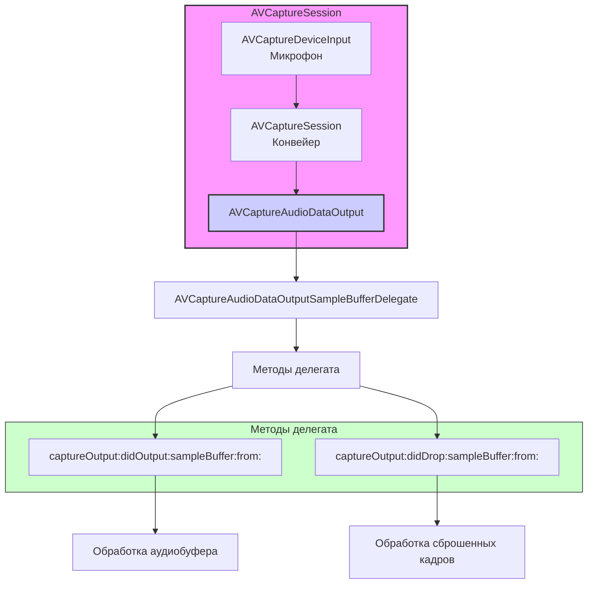

#avfoundation #audio #delegate #samplebuffer #real-time #processing #capture #coreaudio`

---
### Определение
**AVCaptureAudioDataOutputSampleBufferDelegate** — это протокол в фреймворке [[AVFoundation]], который определяет набор методов для обработки захваченных аудиосэмплов в реальном времени. Он является основным механизмом получения доступа к аудиоданным, поступающим с микрофона или другого аудиоустройства ввода, через `AVCaptureAudioDataOutput` .

Когда вы добавляете [[AVCaptureAudioDataOutput]] в сессию захвата ([[AVCaptureSession]]) и устанавливаете делегат, этот протокол позволяет вашему приложению получать каждый аудиокадр (в виде `CMSampleBuffer`) по мере его захвата, открывая возможности для анализа, обработки, визуализации или перекодирования звука.

### Зачем это знать [[iOS]]-разработчику?
1.  **Реальный доступ к аудиопотоку:** Получение сырых аудиоданных для кастомной обработки.
2.  **Анализ звука:** Вычисление уровня громкости (RMS), частотный анализ (FFT), детекция активности голоса (VAD).
3.  **Применение эффектов:** Наложение эхо, реверберации, изменение тональности, эквалайзер.
4.  **Визуализация:** Создание осциллограмм, спектрограмм, визуальных эффектов, реагирующих на звук.
5.  **Машинное обучение:** Передача аудиосэмплов в Core ML модели для распознавания команд, звуков и т.д.
6.  **Специализированная запись:** Когда нужно записывать обработанный звук в кастомный формат.

---

### Архитектура и место в AVCaptureSession



### Ключевые методы протокола

Протокол содержит два основных метода:

#### 1. `captureOutput(_:didOutput:sampleBuffer:from:)`
**Назначение:** Вызывается каждый раз, когда захвачен новый аудиосэмпл (кадр).

```swift
func captureOutput(_ output: AVCaptureOutput, 
                   didOutput sampleBuffer: CMSampleBuffer, 
                   from connection: AVCaptureConnection)
```

**Параметры:**
- `output`: Ссылка на объект `AVCaptureAudioDataOutput`, который сгенерировал сэмпл.
- `sampleBuffer`: Объект `CMSampleBuffer`, содержащий аудиоданные и метаданные.
- `connection`: Объект `AVCaptureConnection`, представляющий соединение между выходом и устройством.

**Этот метод — сердце обработки аудио в реальном времени.** Здесь вы получаете доступ к каждому аудиокадру.

#### 2. `captureOutput(_:didDrop:sampleBuffer:from:)`
**Назначение:** Вызывается, когда аудиосэмпл был сброшен (не обработан) из-за переполнения очереди или недостаточной производительности.

```swift
optional func captureOutput(_ output: AVCaptureOutput, 
                            didDrop sampleBuffer: CMSampleBuffer, 
                            from connection: AVCaptureConnection)
```

**Параметры:** Аналогичны первому методу.

**Важность:** Этот метод критически важен для отладки производительности. Если он вызывается часто, значит ваша обработка не успевает за темпом поступления данных, и нужно оптимизировать код.

---

### Структура CMSampleBuffer (для аудио)

`CMSampleBuffer` — это контейнер, содержащий:
1.  **Аудиоданные:** Обычно в виде `AudioBufferList` или `CMBlockBuffer`.
2.  **Формат:** `CMAudioFormatDescription`, описывающий формат аудио (частота дискретизации, количество каналов, битность и т.д.).
3.  **Временная информация:** Время захвата, длительность сэмпла.
4.  **Аттачи (Attachments):** Метаданные, такие как тайминги.

#### Извлечение ключевой информации из CMSampleBuffer

```swift
// Получение информации о формате
if let formatDesc = CMSampleBufferGetFormatDescription(sampleBuffer) {
    let asbd = CMAudioFormatDescriptionGetStreamBasicDescription(formatDesc)?.pointee
    let sampleRate = asbd?.mSampleRate // Частота дискретизации (44100, 48000)
    let channels = asbd?.mChannelsPerFrame // Количество каналов
    let bitsPerChannel = asbd?.mBitsPerChannel // Бит на канал
}

// Получение временной информации
let presentationTime = CMSampleBufferGetPresentationTimeStamp(sampleBuffer)
let duration = CMSampleBufferGetDuration(sampleBuffer)
let totalSamples = CMSampleBufferGetNumSamples(sampleBuffer)

// Получение самих данных
if let blockBuffer = CMSampleBufferGetDataBuffer(sampleBuffer) {
    // Работа с CMBlockBuffer
} else if let audioBufferList = CMSampleBufferGetAudioBufferListWithRetainedBlockBuffer(...) {
    // Работа с AudioBufferList
}
```

---

### Примеры от простого к сложному

#### Уровень 0: Настройка Info.plist и аудиосессии
Для доступа к микрофону обязательно нужно добавить описание в `Info.plist`.

- **NSMicrophoneUsageDescription** — "Для анализа звука и визуализации"

Также нужно настроить аудиосессию:

```swift
import AVFoundation

func setupAudioSession() {
    do {
        try AVAudioSession.sharedInstance().setCategory(.playAndRecord, mode: .default)
        try AVAudioSession.sharedInstance().setActive(true)
    } catch {
        print("Ошибка настройки аудиосессии: \(error)")
    }
}
```

#### Уровень 1: Базовая реализация делегата и получение аудиоданных
Самый простой пример — подключение к микрофону и логирование информации о каждом кадре.

```swift
import UIKit
import AVFoundation

class BasicAudioDelegateViewController: UIViewController, AVCaptureAudioDataOutputSampleBufferDelegate {

    var captureSession: AVCaptureSession!
    let audioQueue = DispatchQueue(label: "audioQueue")

    override func viewDidLoad() {
        super.viewDidLoad()
        setupAudioSession()
        setupAudioCapture()
    }

    private func setupAudioSession() {
        do {
            try AVAudioSession.sharedInstance().setCategory(.playAndRecord, mode: .default)
            try AVAudioSession.sharedInstance().setActive(true)
        } catch {
            print("Ошибка аудиосессии: \(error)")
        }
    }

    private func checkPermissionsAndSetup() {
        switch AVCaptureDevice.authorizationStatus(for: .audio) {
        case .authorized:
            setupAudioCapture()
        case .notDetermined:
            AVCaptureDevice.requestAccess(for: .audio) { granted in
                if granted {
                    DispatchQueue.main.async {
                        self.setupAudioCapture()
                    }
                }
            }
        default:
            print("Нет доступа к микрофону")
        }
    }

    private func setupAudioCapture() {
        captureSession = AVCaptureSession()

        guard let audioDevice = AVCaptureDevice.default(for: .audio),
              let audioInput = try? AVCaptureDeviceInput(device: audioDevice),
              captureSession.canAddInput(audioInput) else {
            print("Не удалось настроить аудиовход")
            return
        }
        captureSession.addInput(audioInput)

        let audioOutput = AVCaptureAudioDataOutput()
        audioOutput.setSampleBufferDelegate(self, queue: audioQueue)

        if captureSession.canAddOutput(audioOutput) {
            captureSession.addOutput(audioOutput)
        }

        DispatchQueue.global(qos: .userInitiated).async { [weak self] in
            self?.captureSession.startRunning()
        }
    }

    // MARK: - AVCaptureAudioDataOutputSampleBufferDelegate
    func captureOutput(_ output: AVCaptureOutput, 
                      didOutput sampleBuffer: CMSampleBuffer, 
                      from connection: AVCaptureConnection) {
        
        // Получаем информацию о формате
        guard let formatDesc = CMSampleBufferGetFormatDescription(sampleBuffer),
              let asbd = CMAudioFormatDescriptionGetStreamBasicDescription(formatDesc)?.pointee else { return }
        
        let sampleRate = asbd.mSampleRate
        let channels = asbd.mChannelsPerFrame
        let bytesPerFrame = asbd.mBytesPerFrame
        let totalSamples = CMSampleBufferGetNumSamples(sampleBuffer)
        
        // Получаем сами данные
        if let blockBuffer = CMSampleBufferGetDataBuffer(sampleBuffer) {
            var length = 0
            var dataPointer: UnsafeMutablePointer<Int8>?
            CMBlockBufferGetDataPointer(blockBuffer, 
                                       atOffset: 0, 
                                       lengthAtOffsetOut: nil, 
                                       totalLengthOut: &length, 
                                       dataPointerOut: &dataPointer)
            
            print("""
            Аудиокадр:
            - Частота: \(sampleRate) Гц
            - Каналов: \(channels)
            - Сэмплов: \(totalSamples)
            - Байт: \(length)
            - Время: \(CMSampleBufferGetPresentationTimeStamp(sampleBuffer).seconds)
            """)
        }
    }

    func captureOutput(_ output: AVCaptureOutput, 
                      didDrop sampleBuffer: CMSampleBuffer, 
                      from connection: AVCaptureConnection) {
        print("⚠️ Аудиокадр был сброшен! Не успеваем обрабатывать.")
    }

    override func viewWillDisappear(_ animated: Bool) {
        super.viewWillDisappear(animated)
        DispatchQueue.global(qos: .background).async { [weak self] in
            self?.captureSession.stopRunning()
        }
    }
}
```

#### Уровень 2: Вычисление уровня громкости (RMS) с помощью Accelerate
Практический пример — получение уровня громкости микрофона в реальном времени.

```swift
import UIKit
import AVFoundation
import Accelerate

class AudioLevelMeterViewController: UIViewController, AVCaptureAudioDataOutputSampleBufferDelegate {

    var captureSession: AVCaptureSession!
    let audioQueue = DispatchQueue(label: "audioQueue")
    
    // UI элементы
    let levelMeterView = UIView()
    let levelIndicator = UIView()
    let levelLabel = UILabel()
    let peakLabel = UILabel()
    
    var peakLevel: Float = 0.0
    let peakDecayFactor: Float = 0.8 // Скорость затухания пикового индикатора

    override func viewDidLoad() {
        super.viewDidLoad()
        setupUI()
        checkPermissionsAndSetup()
    }

    private func setupUI() {
        view.backgroundColor = .black
        
        levelMeterView.frame = CGRect(x: 50, y: 200, width: 300, height: 40)
        levelMeterView.backgroundColor = .darkGray
        levelMeterView.layer.cornerRadius = 20
        levelMeterView.clipsToBounds = true
        view.addSubview(levelMeterView)
        
        levelIndicator.frame = CGRect(x: 0, y: 0, width: 0, height: 40)
        levelIndicator.backgroundColor = .green
        levelMeterView.addSubview(levelIndicator)
        
        levelLabel.frame = CGRect(x: 50, y: 260, width: 150, height: 30)
        levelLabel.textColor = .white
        levelLabel.text = "Уровень: 0.0"
        view.addSubview(levelLabel)
        
        peakLabel.frame = CGRect(x: 220, y: 260, width: 100, height: 30)
        peakLabel.textColor = .yellow
        peakLabel.text = "Пик: 0.0"
        view.addSubview(peakLabel)
    }

    private func checkPermissionsAndSetup() {
        switch AVCaptureDevice.authorizationStatus(for: .audio) {
        case .authorized:
            setupAudioCapture()
        case .notDetermined:
            AVCaptureDevice.requestAccess(for: .audio) { granted in
                if granted { DispatchQueue.main.async { self.setupAudioCapture() } }
            }
        default:
            print("Нет доступа к микрофону")
        }
    }

    private func setupAudioCapture() {
        captureSession = AVCaptureSession()
        
        guard let audioDevice = AVCaptureDevice.default(for: .audio),
              let audioInput = try? AVCaptureDeviceInput(device: audioDevice) else { return }
        
        if captureSession.canAddInput(audioInput) {
            captureSession.addInput(audioInput)
        }
        
        let audioOutput = AVCaptureAudioDataOutput()
        audioOutput.setSampleBufferDelegate(self, queue: audioQueue)
        
        if captureSession.canAddOutput(audioOutput) {
            captureSession.addOutput(audioOutput)
        }
        
        DispatchQueue.global(qos: .userInitiated).async { [weak self] in
            self?.captureSession.startRunning()
        }
    }

    // MARK: - AVCaptureAudioDataOutputSampleBufferDelegate
    func captureOutput(_ output: AVCaptureOutput, 
                      didOutput sampleBuffer: CMSampleBuffer, 
                      from connection: AVCaptureConnection) {
        
        // Извлекаем аудиоданные
        guard let blockBuffer = CMSampleBufferGetDataBuffer(sampleBuffer) else { return }
        
        var length = 0
        var dataPointer: UnsafeMutablePointer<Int8>?
        CMBlockBufferGetDataPointer(blockBuffer, 
                                   atOffset: 0, 
                                   lengthAtOffsetOut: nil, 
                                   totalLengthOut: &length, 
                                   dataPointerOut: &dataPointer)
        
        guard let ptr = dataPointer else { return }
        
        // Предполагаем, что аудио в формате Float32
        // В реальном приложении нужно проверять формат через asbd
        let audioBuffer = UnsafeBufferPointer(start: ptr.withMemoryRebound(to: Float32.self, capacity: length / 4) { $0 }, 
                                             count: length / 4)
        
        // Вычисляем RMS (Root Mean Square) с помощью Accelerate
        var rms: Float = 0.0
        vDSP_rmsqv(audioBuffer.baseAddress!, 1, &rms, UInt(audioBuffer.count))
        
        // Нормализуем (обычно значение RMS для речи ~0.01-0.1, для музыки до 0.3)
        let normalizedLevel = min(1.0, rms * 5.0)
        
        // Обновляем пиковый уровень (с затуханием)
        if normalizedLevel > peakLevel {
            peakLevel = normalizedLevel
        } else {
            peakLevel = peakLevel * peakDecayFactor + normalizedLevel * (1 - peakDecayFactor)
        }
        
        DispatchQueue.main.async {
            // Обновляем индикатор уровня
            let meterWidth = CGFloat(normalizedLevel) * self.levelMeterView.bounds.width
            self.levelIndicator.frame.size.width = meterWidth
            
            // Меняем цвет в зависимости от уровня
            switch normalizedLevel {
            case 0..<0.3:
                self.levelIndicator.backgroundColor = .green
            case 0.3..<0.7:
                self.levelIndicator.backgroundColor = .yellow
            default:
                self.levelIndicator.backgroundColor = .red
            }
            
            self.levelLabel.text = String(format: "Уровень: %.2f", normalizedLevel)
            self.peakLabel.text = String(format: "Пик: %.2f", self.peakLevel)
        }
    }
    
    func captureOutput(_ output: AVCaptureOutput, 
                      didDrop sampleBuffer: CMSampleBuffer, 
                      from connection: AVCaptureConnection) {
        print("⚠️ Кадр сброшен!")
    }
}
```

#### Уровень 3: Обработка и модификация аудио в реальном времени
Пример применения простого эффекта — эхо (задержка).

```swift
import UIKit
import AVFoundation
import Accelerate

class AudioEffectViewController: UIViewController, AVCaptureAudioDataOutputSampleBufferDelegate {

    var captureSession: AVCaptureSession!
    let audioQueue = DispatchQueue(label: "audioQueue")
    
    // Буфер для эхо (задержки)
    var delayBuffer: [Float] = []
    let delaySize = 44100 // 1 секунда задержки при 44.1 кГц
    var writePosition = 0
    var sampleRate: Float64 = 44100.0

    override func viewDidLoad() {
        super.viewDidLoad()
        setupDelayBuffer()
        checkPermissionsAndSetup()
    }

    private func setupDelayBuffer() {
        delayBuffer = [Float](repeating: 0, count: delaySize)
    }

    private func checkPermissionsAndSetup() {
        // ... (аналогично предыдущим примерам)
    }

    private func setupAudioCapture() {
        captureSession = AVCaptureSession()
        
        guard let audioDevice = AVCaptureDevice.default(for: .audio),
              let audioInput = try? AVCaptureDeviceInput(device: audioDevice) else { return }
        
        if captureSession.canAddInput(audioInput) {
            captureSession.addInput(audioInput)
        }
        
        let audioOutput = AVCaptureAudioDataOutput()
        audioOutput.setSampleBufferDelegate(self, queue: audioQueue)
        
        if captureSession.canAddOutput(audioOutput) {
            captureSession.addOutput(audioOutput)
        }
        
        DispatchQueue.global(qos: .userInitiated).async { [weak self] in
            self?.captureSession.startRunning()
        }
    }

    // MARK: - Обработка с эффектом
    func captureOutput(_ output: AVCaptureOutput, 
                      didOutput sampleBuffer: CMSampleBuffer, 
                      from connection: AVCaptureConnection) {
        
        // Получаем информацию о формате
        guard let formatDesc = CMSampleBufferGetFormatDescription(sampleBuffer),
              let asbd = CMAudioFormatDescriptionGetStreamBasicDescription(formatDesc)?.pointee else { return }
        
        // Сохраняем частоту дискретизации
        sampleRate = asbd.mSampleRate
        
        // Проверяем формат (должен быть Float32, non-interleaved)
        guard asbd.mFormatID == kAudioFormatLinearPCM,
              asbd.mFormatFlags & kAudioFormatFlagIsFloat != 0,
              asbd.mBitsPerChannel == 32 else {
            print("Неподдерживаемый формат аудио")
            return
        }

        // Получаем буфер
        guard let blockBuffer = CMSampleBufferGetDataBuffer(sampleBuffer) else { return }
        
        var length = 0
        var dataPointer: UnsafeMutablePointer<Int8>?
        CMBlockBufferGetDataPointer(blockBuffer, 
                                   atOffset: 0, 
                                   lengthAtOffsetOut: nil, 
                                   totalLengthOut: &length, 
                                   dataPointerOut: &dataPointer)
        
        guard let ptr = dataPointer else { return }
        
        let sampleCount = length / 4
        let audioPtr = ptr.bindMemory(to: Float32.self, capacity: sampleCount)
        
        // Применяем эффект эхо (сухой сигнал + задержанный)
        for i in 0..<sampleCount {
            let inputSample = audioPtr[i]
            
            // Читаем из буфера задержки
            let delayedSample = delayBuffer[writePosition]
            
            // Микшируем: 70% сухого, 30% мокрого
            let outputSample = inputSample * 0.7 + delayedSample * 0.3
            
            // Записываем текущий сэмпл в буфер задержки (для будущих кадров)
            delayBuffer[writePosition] = inputSample
            
            // Обновляем позицию (кольцевой буфер)
            writePosition = (writePosition + 1) % delaySize
            
            // Заменяем исходный сэмпл обработанным
            audioPtr[i] = outputSample
        }
        
        // Здесь можно передать модифицированный sampleBuffer дальше
        // (например, в AVAssetWriter для записи)
    }
}
```

#### Уровень 4: Запись обработанного аудио в файл
Сочетаем обработку с записью в AAC-файл.

```swift
import UIKit
import AVFoundation

class ProcessedAudioRecorderViewController: UIViewController, AVCaptureAudioDataOutputSampleBufferDelegate {

    var captureSession: AVCaptureSession!
    let audioQueue = DispatchQueue(label: "audioQueue")
    
    // Для записи
    var assetWriter: AVAssetWriter?
    var assetWriterInput: AVAssetWriterInput?
    var isRecording = false
    var startTime: CMTime?
    
    // Эффект (простое усиление)
    let gain: Float = 2.0
    
    let recordButton = UIButton()
    let statusLabel = UILabel()

    override func viewDidLoad() {
        super.viewDidLoad()
        setupUI()
        checkPermissionsAndSetup()
    }

    private func setupUI() {
        view.backgroundColor = .darkGray
        
        recordButton.setTitle("Начать запись", for: .normal)
        recordButton.backgroundColor = .red
        recordButton.frame = CGRect(x: view.bounds.midX - 100, y: view.bounds.height - 150, width: 200, height: 50)
        recordButton.addTarget(self, action: #selector(toggleRecording), for: .touchUpInside)
        view.addSubview(recordButton)
        
        statusLabel.frame = CGRect(x: 20, y: 100, width: view.bounds.width - 40, height: 50)
        statusLabel.textColor = .white
        statusLabel.textAlignment = .center
        statusLabel.text = "Готов к записи"
        view.addSubview(statusLabel)
    }

    private func checkPermissionsAndSetup() {
        // ... (как в предыдущих примерах)
        setupAudioCapture()
    }

    private func setupAudioCapture() {
        captureSession = AVCaptureSession()
        
        guard let audioDevice = AVCaptureDevice.default(for: .audio),
              let audioInput = try? AVCaptureDeviceInput(device: audioDevice) else { return }
        
        if captureSession.canAddInput(audioInput) {
            captureSession.addInput(audioInput)
        }
        
        let audioOutput = AVCaptureAudioDataOutput()
        audioOutput.setSampleBufferDelegate(self, queue: audioQueue)
        
        if captureSession.canAddOutput(audioOutput) {
            captureSession.addOutput(audioOutput)
        }
        
        DispatchQueue.global(qos: .userInitiated).async { [weak self] in
            self?.captureSession.startRunning()
        }
    }

    @objc func toggleRecording() {
        if isRecording {
            stopRecording()
        } else {
            startRecording()
        }
    }

    private func startRecording() {
        // Настройки аудио для записи (AAC)
        let audioSettings: [String: Any] = [
            AVFormatIDKey: kAudioFormatMPEG4AAC,
            AVSampleRateKey: 44100,
            AVNumberOfChannelsKey: 1,
            AVEncoderBitRateKey: 128000
        ]
        
        let outputURL = FileManager.default.urls(for: .documentDirectory, in: .userDomainMask).first!
            .appendingPathComponent("processed_audio_\(Date().timeIntervalSince1970).m4a")
        
        do {
            assetWriter = try AVAssetWriter(outputURL: outputURL, fileType: .m4a)
            assetWriterInput = AVAssetWriterInput(mediaType: .audio, outputSettings: audioSettings)
            assetWriterInput?.expectsMediaDataInRealTime = true
            
            if let input = assetWriterInput, assetWriter?.canAdd(input) == true {
                assetWriter?.add(input)
            }
            
            isRecording = true
            startTime = nil
            
            DispatchQueue.main.async {
                self.recordButton.setTitle("Остановить запись", for: .normal)
                self.recordButton.backgroundColor = .gray
                self.statusLabel.text = "Идет запись..."
            }
            
        } catch {
            print("Ошибка создания asset writer: \(error)")
        }
    }

    private func stopRecording() {
        isRecording = false
        assetWriterInput?.markAsFinished()
        assetWriter?.finishWriting { [weak self] in
            DispatchQueue.main.async {
                self?.recordButton.setTitle("Начать запись", for: .normal)
                self?.recordButton.backgroundColor = .red
                self?.statusLabel.text = "Запись сохранена"
            }
            self?.assetWriter = nil
            self?.assetWriterInput = nil
            print("Запись завершена")
        }
    }

    // MARK: - AVCaptureAudioDataOutputSampleBufferDelegate
    func captureOutput(_ output: AVCaptureOutput, 
                      didOutput sampleBuffer: CMSampleBuffer, 
                      from connection: AVCaptureConnection) {
        
        // Применяем простую обработку (усиление)
        guard let blockBuffer = CMSampleBufferGetDataBuffer(sampleBuffer) else { return }
        
        var length = 0
        var dataPointer: UnsafeMutablePointer<Int8>?
        CMBlockBufferGetDataPointer(blockBuffer, 
                                   atOffset: 0, 
                                   lengthAtOffsetOut: nil, 
                                   totalLengthOut: &length, 
                                   dataPointerOut: &dataPointer)
        
        guard let ptr = dataPointer else { return }
        
        let audioPtr = ptr.bindMemory(to: Float32.self, capacity: length / 4)
        
        // Усиление сигнала
        for i in 0..<(length / 4) {
            audioPtr[i] = min(1.0, max(-1.0, audioPtr[i] * gain))
        }
        
        // Запись обработанного аудио
        if isRecording,
           let assetWriterInput = assetWriterInput,
           assetWriterInput.isReadyForMoreMediaData {
            
            if startTime == nil {
                startTime = CMSampleBufferGetPresentationTimeStamp(sampleBuffer)
                assetWriter?.startWriting()
                assetWriter?.startSession(atSourceTime: startTime!)
            }
            
            assetWriterInput.append(sampleBuffer)
        }
    }
    
    func captureOutput(_ output: AVCaptureOutput, 
                      didDrop sampleBuffer: CMSampleBuffer, 
                      from connection: AVCaptureConnection) {
        DispatchQueue.main.async {
            self.statusLabel.text = "⚠️ Сброс кадров! Слишком медленная обработка."
        }
    }
}
```

#### Уровень 5: Частотный анализ (FFT) с помощью Accelerate
Получение спектра звука в реальном времени.

```swift
import UIKit
import AVFoundation
import Accelerate

class FrequencyAnalyzerViewController: UIViewController, AVCaptureAudioDataOutputSampleBufferDelegate {

    var captureSession: AVCaptureSession!
    let audioQueue = DispatchQueue(label: "audioQueue")
    
    // Параметры FFT
    let fftSize = 4096
    lazy var fftSetup = vDSP_create_fftsetup(vDSP_Length(log2(Float(fftSize))), FFTRadix(kFFTRadix2))
    var audioBuffer = [Float]()
    
    // UI для визуализации спектра
    let spectrumView = UIView()
    var frequencyBars: [UIView] = []
    let numberOfBars = 20

    override func viewDidLoad() {
        super.viewDidLoad()
        setupUI()
        checkPermissionsAndSetup()
    }

    private func setupUI() {
        view.backgroundColor = .black
        
        spectrumView.frame = CGRect(x: 20, y: 200, width: view.bounds.width - 40, height: 200)
        spectrumView.backgroundColor = .darkGray
        view.addSubview(spectrumView)
        
        // Создаем полоски для спектра
        let barWidth = spectrumView.bounds.width / CGFloat(numberOfBars) - 2
        for i in 0..<numberOfBars {
            let bar = UIView(frame: CGRect(x: CGFloat(i) * (barWidth + 2), 
                                          y: spectrumView.bounds.height - 20, 
                                          width: barWidth, 
                                          height: 20))
            bar.backgroundColor = .green
            bar.tag = i
            spectrumView.addSubview(bar)
            frequencyBars.append(bar)
        }
    }

    private func checkPermissionsAndSetup() {
        // ... (как в предыдущих примерах)
        setupAudioCapture()
    }

    private func setupAudioCapture() {
        captureSession = AVCaptureSession()
        
        guard let audioDevice = AVCaptureDevice.default(for: .audio),
              let audioInput = try? AVCaptureDeviceInput(device: audioDevice) else { return }
        
        if captureSession.canAddInput(audioInput) {
            captureSession.addInput(audioInput)
        }
        
        let audioOutput = AVCaptureAudioDataOutput()
        audioOutput.setSampleBufferDelegate(self, queue: audioQueue)
        
        if captureSession.canAddOutput(audioOutput) {
            captureSession.addOutput(audioOutput)
        }
        
        DispatchQueue.global(qos: .userInitiated).async { [weak self] in
            self?.captureSession.startRunning()
        }
    }

    // MARK: - FFT Analysis
    func performFFT(on audioData: [Float]) {
        var realPart = [Float](repeating: 0, count: fftSize / 2)
        var imagPart = [Float](repeating: 0, count: fftSize / 2)
        
        // Подготовка данных
        var splitComplex = DSPSplitComplex(realp: &realPart, imagp: &imagPart)
        
        // Копируем аудиоданные в вещественную часть
        audioData.withUnsafeBytes { ptr in
            vDSP_ctoz(ptr.bindMemory(to: DSPComplex.self).baseAddress!, 2, &splitComplex, 1, vDSP_Length(fftSize / 2))
        }
        
        // Выполняем FFT
        vDSP_fft_zrip(fftSetup!, &splitComplex, 1, vDSP_Length(log2(Float(fftSize))), FFTDirection(kFFTDirection_Forward))
        
        // Вычисляем амплитуды
        var magnitudes = [Float](repeating: 0, count: fftSize / 2)
        vDSP_zvmags(&splitComplex, 1, &magnitudes, 1, vDSP_Length(fftSize / 2))
        
        // Преобразуем в децибелы
        var one = Float(1)
        var zero = Float(0)
        vDSP_vdbcon(&magnitudes, 1, &one, &magnitudes, 1, vDSP_Length(fftSize / 2), 0)
        
        // Усредняем по частотам для визуализации
        let bandsPerBar = (fftSize / 2) / numberOfBars
        var barLevels = [Float](repeating: 0, count: numberOfBars)
        
        for bar in 0..<numberOfBars {
            let start = bar * bandsPerBar
            let end = min((bar + 1) * bandsPerBar, fftSize / 2)
            var sum: Float = 0
            for freq in start..<end {
                sum += magnitudes[freq]
            }
            barLevels[bar] = sum / Float(end - start)
        }
        
        // Нормализуем
        var maxLevel: Float = 0
        vDSP_maxv(barLevels, 1, &maxLevel, vDSP_Length(numberOfBars))
        
        DispatchQueue.main.async {
            for (index, bar) in self.frequencyBars.enumerated() {
                let level = max(0.1, barLevels[index] / maxLevel) // Минимум 0.1 для видимости
                let height = CGFloat(level) * self.spectrumView.bounds.height
                bar.frame.size.height = max(5, height)
                bar.frame.origin.y = self.spectrumView.bounds.height - bar.frame.height
                
                // Цвет от зеленого до красного
                bar.backgroundColor = UIColor(hue: CGFloat(1.0 - level) * 0.3, 
                                             saturation: 1, 
                                             brightness: 1, 
                                             alpha: 1)
            }
        }
    }

    func captureOutput(_ output: AVCaptureOutput, 
                      didOutput sampleBuffer: CMSampleBuffer, 
                      from connection: AVCaptureConnection) {
        
        guard let blockBuffer = CMSampleBufferGetDataBuffer(sampleBuffer) else { return }
        
        var length = 0
        var dataPointer: UnsafeMutablePointer<Int8>?
        CMBlockBufferGetDataPointer(blockBuffer, 
                                   atOffset: 0, 
                                   lengthAtOffsetOut: nil, 
                                   totalLengthOut: &length, 
                                   dataPointerOut: &dataPointer)
        
        guard let ptr = dataPointer else { return }
        
        let audioPtr = ptr.bindMemory(to: Float32.self, capacity: length / 4)
        let audioArray = Array(UnsafeBufferPointer(start: audioPtr, count: length / 4))
        
        // Накопление буфера для FFT
        audioBuffer.append(contentsOf: audioArray)
        
        // Когда накопили достаточно данных, выполняем FFT
        if audioBuffer.count >= fftSize {
            let fftData = Array(audioBuffer.prefix(fftSize))
            audioBuffer.removeFirst(fftSize / 2) // Перекрытие 50%
            performFFT(on: fftData)
        }
    }
}
```

---

### Важные нюансы и Best Practices

#### 1. **Производительность — критически важна**
- Метод делегата вызывается **до 100 раз в секунду** (в зависимости от размера буфера).
- Все вычисления должны быть **быстрыми**. Используйте **Accelerate framework** для математики.
- Если обработка занимает больше времени, чем длится буфер, будут сбросы (`didDrop`).

#### 2. **Всегда обрабатывайте didDrop**
Метод `captureOutput(_:didDrop:sampleBuffer:from:)` — ваш друг. Если он вызывается, значит вы не успеваете. Нужно:
- Упростить обработку
- Использовать более быстрые алгоритмы
- Возможно, уменьшить частоту обработки (обрабатывать каждый второй кадр)