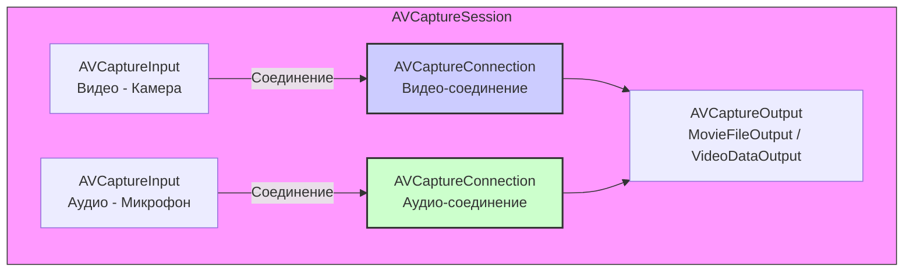

#avfoundation #capture #connection #video #audio #orientation #stabilization #camera`

---
### Определение
**AVCaptureConnection** — это объект во фреймворке [[AVFoundation]], который представляет собой абстрактное соединение (канал передачи данных) между одним или несколькими входами ([[AVCaptureInput]]) и конкретным выходом ([[AVCaptureOutput]]) в сессии захвата ([[AVCaptureSession]]) .

Простыми словами, `AVCaptureConnection` — это "мост", по которому данные от камеры или микрофона поступают к месту назначения (файл, экран, буфер). Через этот объект разработчик может управлять параметрами потока данных: ориентацией видео, стабилизацией, масштабированием, зеркалированием и другими свойствами, специфичными для конкретного типа соединения.

### Зачем это знать iOS-разработчику?
1.  **Управление ориентацией:** Правильная ориентация записываемого видео и предпросмотра независимо от того, как пользователь держит устройство.
2.  **Стабилизация:** Включение оптической или цифровой стабилизации для плавного видео.
3.  **Масштабирование:** Программное изменение масштаба (zoom) видео.
4.  **Зеркалирование:** Для фронтальной камеры часто нужно зеркальное отображение.
5.  **Активные аудиоканалы:** Выбор, какие каналы микрофона использовать.
6.  **Включение/отключение потоков:** Возможность временно отключить видео, но оставить аудио.

---

### Архитектура и место в AVCaptureSession



### Типы соединений

`AVCaptureConnection` может быть разных типов в зависимости от типа данных:

1.  **Видео-соединение (video connection):** Соединение для видеоданных. Предоставляет дополнительные свойства, связанные с видео (ориентация, стабилизация, масштабирование).
2.  **Аудио-соединение (audio connection):** Соединение для аудиоданных. Позволяет управлять аудиоканалами.
3.  **Metadata-соединение:** Для метаданных (обычно не требует настройки).

### Как получить AVCaptureConnection

Обычно соединение получают от выхода (`AVCaptureOutput`):

```swift
// Для конкретного типа медиа (видео)
if let videoConnection = movieOutput.connection(with: .video) {
    // Настройка видео-соединения
}

// Для аудио
if let audioConnection = movieOutput.connection(with: .audio) {
    // Настройка аудио-соединения
}

// Или из всех соединений выхода
for connection in movieOutput.connections {
    if connection.isVideoStabilizationSupported {
        // Это видео-соединение
    }
}
```

---

### Ключевые свойства и методы

#### Общие свойства (для всех типов)
- `isEnabled` — включено ли соединение. Если `false`, данные не передаются.
- `inputPorts` — массив входных портов, участвующих в соединении.
- `output` — выход, которому принадлежит соединение.

#### Свойства для видео (AVCaptureConnection+VideoSupport)
- `isVideoOrientationSupported` — поддерживается ли изменение ориентации.
- `videoOrientation` — текущая ориентация видео (портрет, ландшафт и т.д.).
- `isVideoMirroringSupported` — поддерживается ли зеркалирование.
- `isVideoMirrored` — включено ли зеркалирование.
- `isVideoStabilizationSupported` — поддерживается ли стабилизация.
- `preferredVideoStabilizationMode` — предпочтительный режим стабилизации.
- `activeVideoStabilizationMode` — фактический активный режим (только для чтения).
- `videoScaleAndCropFactor` — текущий коэффициент масштабирования (1.0 = без масштабирования).
- `videoMaxScaleAndCropFactor` — максимальный поддерживаемый коэффициент (только для чтения).
- `isCameraIntrinsicMatrixDeliverySupported` — поддержка матрицы внутренних параметров камеры.
- `isCameraIntrinsicMatrixDeliveryEnabled` — включена ли доставка матрицы.

#### Свойства для аудио (AVCaptureConnection+AudioSupport)
- `audioChannels` — массив аудиоканалов.
- `isAudioChannelsMutable` — можно ли изменять активные каналы.

---

### Примеры от простого к сложному

#### Уровень 0: Базовая структура с получением соединения

```swift
import UIKit
import AVFoundation

class ConnectionDemoViewController: UIViewController {
    
    var captureSession: AVCaptureSession!
    var movieOutput: AVCaptureMovieFileOutput!
    var previewLayer: AVCaptureVideoPreviewLayer!
    
    override func viewDidLoad() {
        super.viewDidLoad()
        setupCamera()
    }
    
    private func setupCamera() {
        captureSession = AVCaptureSession()
        captureSession.sessionPreset = .hd1920x1080
        
        // Видео вход
        guard let videoDevice = AVCaptureDevice.default(.builtInWideAngleCamera, for: .video, position: .back),
              let videoInput = try? AVCaptureDeviceInput(device: videoDevice) else { return }
        captureSession.addInput(videoInput)
        
        // Аудио вход
        if let audioDevice = AVCaptureDevice.default(for: .audio),
           let audioInput = try? AVCaptureDeviceInput(device: audioDevice) {
            captureSession.addInput(audioInput)
        }
        
        // Movie output
        movieOutput = AVCaptureMovieFileOutput()
        if captureSession.canAddOutput(movieOutput) {
            captureSession.addOutput(movieOutput)
        }
        
        previewLayer = AVCaptureVideoPreviewLayer(session: captureSession)
        previewLayer.frame = view.bounds
        previewLayer.videoGravity = .resizeAspectFill
        view.layer.addSublayer(previewLayer)
        
        DispatchQueue.global(qos: .userInitiated).async { [weak self] in
            self?.captureSession.startRunning()
        }
    }
    
    // Получение соединений
    func getConnections() {
        // Получаем видео-соединение
        if let videoConnection = movieOutput.connection(with: .video) {
            print("Видео соединение найдено: \(videoConnection)")
        }
        
        // Получаем аудио-соединение
        if let audioConnection = movieOutput.connection(with: .audio) {
            print("Аудио соединение найдено: \(audioConnection)")
        }
        
        // Или перебираем все
        for connection in movieOutput.connections {
            print("Тип соединения: \(connection)")
        }
    }
}
```

#### Уровень 1: Настройка ориентации видео
Самое частое использование — правильная ориентация записываемого видео.

```swift
import UIKit
import AVFoundation

class OrientationAwareViewController: ConnectionDemoViewController {
    
    override func viewDidLoad() {
        super.viewDidLoad()
        
        // Подписываемся на уведомления об изменении ориентации
        NotificationCenter.default.addObserver(self, 
                                              selector: #selector(orientationChanged), 
                                              name: UIDevice.orientationDidChangeNotification, 
                                              object: nil)
        UIDevice.current.beginGeneratingDeviceOrientationNotifications()
    }
    
    @objc func orientationChanged() {
        updateVideoOrientation()
    }
    
    func updateVideoOrientation() {
        guard let videoConnection = movieOutput?.connection(with: .video),
              videoConnection.isVideoOrientationSupported else { return }
        
        let currentOrientation = UIDevice.current.orientation
        let videoOrientation: AVCaptureVideoOrientation
        
        switch currentOrientation {
        case .portrait:
            videoOrientation = .portrait
        case .portraitUpsideDown:
            videoOrientation = .portraitUpsideDown
        case .landscapeLeft:
            // Для landscapeLeft физически устройство повернуто так, что home справа
            // Видео должно быть landscapeRight
            videoOrientation = .landscapeRight
        case .landscapeRight:
            videoOrientation = .landscapeLeft
        default:
            return // Игнорируем faceUp, faceDown, unknown
        }
        
        // Важно: это влияет на записываемое видео, но не на previewLayer
        videoConnection.videoOrientation = videoOrientation
        
        print("Ориентация видео установлена: \(videoOrientation.rawValue)")
    }
    
    // Для previewLayer нужно использовать другую ориентацию или трансформацию
    func updatePreviewOrientation() {
        guard let previewConnection = previewLayer?.connection,
              previewConnection.isVideoOrientationSupported else { return }
        
        let currentOrientation = UIDevice.current.orientation
        let previewOrientation: AVCaptureVideoOrientation
        
        switch currentOrientation {
        case .portrait:
            previewOrientation = .portrait
        case .portraitUpsideDown:
            previewOrientation = .portraitUpsideDown
        case .landscapeLeft:
            previewOrientation = .landscapeLeft
        case .landscapeRight:
            previewOrientation = .landscapeRight
        default:
            return
        }
        
        previewConnection.videoOrientation = previewOrientation
    }
    
    deinit {
        NotificationCenter.default.removeObserver(self)
        UIDevice.current.endGeneratingDeviceOrientationNotifications()
    }
}
```

#### Уровень 2: Зеркалирование для фронтальной камеры
При использовании фронтальной камеры часто нужно зеркальное отображение.

```swift
import UIKit
import AVFoundation

class FrontCameraMirroringViewController: ConnectionDemoViewController {
    
    var isUsingFrontCamera = false
    
    override func setupCamera() {
        captureSession = AVCaptureSession()
        captureSession.sessionPreset = .hd1920x1080
        
        // Начинаем с задней камеры
        addVideoInput(position: .back)
        
        // Аудио вход
        if let audioDevice = AVCaptureDevice.default(for: .audio),
           let audioInput = try? AVCaptureDeviceInput(device: audioDevice) {
            captureSession.addInput(audioInput)
        }
        
        movieOutput = AVCaptureMovieFileOutput()
        if captureSession.canAddOutput(movieOutput) {
            captureSession.addOutput(movieOutput)
        }
        
        previewLayer = AVCaptureVideoPreviewLayer(session: captureSession)
        previewLayer.frame = view.bounds
        previewLayer.videoGravity = .resizeAspectFill
        view.layer.addSublayer(previewLayer)
        
        DispatchQueue.global(qos: .userInitiated).async { [weak self] in
            self?.captureSession.startRunning()
        }
    }
    
    func addVideoInput(position: AVCaptureDevice.Position) {
        // Удаляем старый видео вход
        captureSession.inputs
            .filter { ($0 as? AVCaptureDeviceInput)?.device.hasMediaType(.video) ?? false }
            .forEach { captureSession.removeInput($0) }
        
        guard let videoDevice = AVCaptureDevice.default(.builtInWideAngleCamera, for: .video, position: position),
              let videoInput = try? AVCaptureDeviceInput(device: videoDevice),
              captureSession.canAddInput(videoInput) else { return }
        
        captureSession.addInput(videoInput)
        isUsingFrontCamera = (position == .front)
        
        // Настраиваем зеркалирование для нового видео
        applyMirroring()
    }
    
    func applyMirroring() {
        // Для записи в файл
        if let videoConnection = movieOutput?.connection(with: .video),
           videoConnection.isVideoMirroringSupported {
            
            // Для фронтальной камеры включаем зеркалирование
            videoConnection.isVideoMirrored = isUsingFrontCamera
            
            print("Зеркалирование для записи: \(videoConnection.isVideoMirrored)")
        }
        
        // Для previewLayer
        if let previewConnection = previewLayer?.connection,
           previewConnection.isVideoMirroringSupported {
            
            // Preview тоже должен быть зеркальным для естественного отображения
            previewConnection.isVideoMirrored = isUsingFrontCamera
        }
    }
    
    @objc func switchCamera() {
        let newPosition: AVCaptureDevice.Position = isUsingFrontCamera ? .back : .front
        
        DispatchQueue.global(qos: .userInitiated).async { [weak self] in
            self?.captureSession.beginConfiguration()
            self?.addVideoInput(position: newPosition)
            self?.captureSession.commitConfiguration()
        }
    }
}
```

#### Уровень 3: Стабилизация видео
Включение и настройка стабилизации для плавного видео.

```swift
import UIKit
import AVFoundation

class StabilizationViewController: ConnectionDemoViewController {
    
    let stabilizationSegmentedControl = UISegmentedControl(items: ["Off", "Auto", "Cinematic"])
    
    override func viewDidLoad() {
        super.viewDidLoad()
        setupUI()
    }
    
    private func setupUI() {
        stabilizationSegmentedControl.frame = CGRect(x: 20, y: 100, width: view.bounds.width - 40, height: 30)
        stabilizationSegmentedControl.selectedSegmentIndex = 1
        stabilizationSegmentedControl.addTarget(self, action: #selector(stabilizationModeChanged), for: .valueChanged)
        view.addSubview(stabilizationSegmentedControl)
    }
    
    @objc func stabilizationModeChanged() {
        guard let videoConnection = movieOutput?.connection(with: .video),
              videoConnection.isVideoStabilizationSupported else {
            print("Стабилизация не поддерживается")
            return
        }
        
        let mode: AVCaptureVideoStabilizationMode
        
        switch stabilizationSegmentedControl.selectedSegmentIndex {
        case 0:
            mode = .off
        case 1:
            mode = .auto
        case 2:
            mode = .cinematic
        default:
            mode = .auto
        }
        
        // Устанавливаем предпочтительный режим
        videoConnection.preferredVideoStabilizationMode = mode
        
        print("Режим стабилизации установлен: \(mode.rawValue)")
        
        // Через некоторое время можно проверить активный режим
        DispatchQueue.main.asyncAfter(deadline: .now() + 0.5) { [weak self] in
            let activeMode = self?.movieOutput?.connection(with: .video)?.activeVideoStabilizationMode ?? .off
            print("Активный режим стабилизации: \(activeMode.rawValue)")
        }
    }
    
    override func viewDidAppear(_ animated: Bool) {
        super.viewDidAppear(animated)
        
        // Показываем доступные режимы
        if let videoConnection = movieOutput?.connection(with: .video) {
            print("Стабилизация поддерживается: \(videoConnection.isVideoStabilizationSupported)")
            
            if videoConnection.isVideoStabilizationSupported {
                print("Доступные режимы: off, auto, cinematic")
            }
        }
    }
}
```

#### Уровень 4: Масштабирование (Zoom)
Программное изменение масштаба через `videoScaleAndCropFactor`.

```swift
import UIKit
import AVFoundation

class ZoomViewController: ConnectionDemoViewController {
    
    let zoomLabel = UILabel()
    let zoomSlider = UISlider()
    var videoConnection: AVCaptureConnection?
    
    override func viewDidLoad() {
        super.viewDidLoad()
        setupZoomUI()
    }
    
    override func setupCamera() {
        super.setupCamera()
        
        // Сохраняем ссылку на видео-соединение
        videoConnection = movieOutput?.connection(with: .video)
        
        if let connection = videoConnection {
            let maxZoom = connection.videoMaxScaleAndCropFactor
            print("Максимальный zoom: \(maxZoom)")
            
            DispatchQueue.main.async {
                self.zoomSlider.maximumValue = Float(min(maxZoom, 6.0)) // Ограничиваем до 6x для UI
                self.zoomSlider.minimumValue = 1.0
                self.zoomSlider.value = 1.0
            }
        }
    }
    
    private func setupZoomUI() {
        zoomLabel.frame = CGRect(x: 20, y: 150, width: view.bounds.width - 40, height: 30)
        zoomLabel.textAlignment = .center
        zoomLabel.textColor = .white
        zoomLabel.backgroundColor = UIColor.black.withAlphaComponent(0.5)
        zoomLabel.text = "Zoom: 1.0x"
        view.addSubview(zoomLabel)
        
        zoomSlider.frame = CGRect(x: 20, y: 200, width: view.bounds.width - 40, height: 30)
        zoomSlider.addTarget(self, action: #selector(zoomChanged), for: .valueChanged)
        view.addSubview(zoomSlider)
    }
    
    @objc func zoomChanged() {
        guard let videoConnection = videoConnection else { return }
        
        let zoomFactor = CGFloat(zoomSlider.value)
        
        // videoScaleAndCropFactor должно быть в пределах [1.0, videoMaxScaleAndCropFactor]
        videoConnection.videoScaleAndCropFactor = zoomFactor
        
        zoomLabel.text = String(format: "Zoom: %.1fx", zoomFactor)
        
        // Масштабирование применяется к выходным данным (запись, обработка),
        // но не к previewLayer. Для previewLayer нужно использовать трансформацию.
    }
    
    // Для предпросмотра zoom делается через трансформацию
    func applyZoomToPreview(zoomFactor: CGFloat) {
        // Не через connection, а через трансформацию слоя
        let transform = previewLayer?.affineTransform()
        previewLayer?.setAffineTransform(CGAffineTransform(scaleX: zoomFactor, y: zoomFactor))
    }
}
```

#### Уровень 5: Управление аудиоканалами
Выбор активных каналов микрофона (например, для стерео-записи).

```swift
import UIKit
import AVFoundation

class AudioChannelsViewController: ConnectionDemoViewController {
    
    override func viewDidAppear(_ animated: Bool) {
        super.viewDidAppear(animated)
        
        // Получаем аудио-соединение
        guard let audioConnection = movieOutput?.connection(with: .audio) else {
            print("Нет аудио-соединения")
            return
        }
        
        print("Аудио каналы: \(audioConnection.audioChannels.count)")
        print("Можно изменять каналы: \(audioConnection.isAudioChannelsMutable)")
        
        // Если нужно отключить некоторые каналы (например, оставить только левый)
        if audioConnection.isAudioChannelsMutable {
            for (index, channel) in audioConnection.audioChannels.enumerated() {
                // Левый канал включаем, правый выключаем
                channel.isEnabled = (index == 0)
                print("Канал \(index) включен: \(channel.isEnabled)")
            }
        }
    }
}
```

#### Уровень 6: Включение/отключение потоков на лету
Можно временно отключить видео, но оставить аудио.

```swift
import UIKit
import AVFoundation

class ToggleStreamsViewController: ConnectionDemoViewController {
    
    let toggleVideoButton = UIButton()
    let toggleAudioButton = UIButton()
    
    override func viewDidLoad() {
        super.viewDidLoad()
        setupToggleUI()
    }
    
    private func setupToggleUI() {
        toggleVideoButton.setTitle("Выключить видео", for: .normal)
        toggleVideoButton.backgroundColor = .blue
        toggleVideoButton.frame = CGRect(x: 20, y: 120, width: 150, height: 40)
        toggleVideoButton.addTarget(self, action: #selector(toggleVideo), for: .touchUpInside)
        view.addSubview(toggleVideoButton)
        
        toggleAudioButton.setTitle("Выключить аудио", for: .normal)
        toggleAudioButton.backgroundColor = .blue
        toggleAudioButton.frame = CGRect(x: view.bounds.width - 170, y: 120, width: 150, height: 40)
        toggleAudioButton.addTarget(self, action: #selector(toggleAudio), for: .touchUpInside)
        view.addSubview(toggleAudioButton)
    }
    
    @objc func toggleVideo() {
        guard let videoConnection = movieOutput?.connection(with: .video) else { return }
        
        videoConnection.isEnabled.toggle()
        
        let status = videoConnection.isEnabled ? "Включено" : "Выключено"
        toggleVideoButton.setTitle("\(status) видео", for: .normal)
        toggleVideoButton.backgroundColor = videoConnection.isEnabled ? .blue : .gray
        
        print("Видео поток: \(status)")
    }
    
    @objc func toggleAudio() {
        guard let audioConnection = movieOutput?.connection(with: .audio) else { return }
        
        audioConnection.isEnabled.toggle()
        
        let status = audioConnection.isEnabled ? "Включено" : "Выключено"
        toggleAudioButton.setTitle("\(status) аудио", for: .normal)
        toggleAudioButton.backgroundColor = audioConnection.isEnabled ? .blue : .gray
        
        print("Аудио поток: \(status)")
    }
    
    // Пример: если нужно отключить видео, но оставить аудио при записи
    func startRecordingWithAudioOnly() {
        guard let videoConnection = movieOutput?.connection(with: .video),
              let audioConnection = movieOutput?.connection(with: .audio) else { return }
        
        // Временно отключаем видео
        videoConnection.isEnabled = false
        audioConnection.isEnabled = true
        
        let paths = FileManager.default.urls(for: .documentDirectory, in: .userDomainMask)
        let fileURL = paths[0].appendingPathComponent("audio_only.mov")
        movieOutput.startRecording(to: fileURL, recordingDelegate: self)
        
        // После записи можно снова включить
        DispatchQueue.main.asyncAfter(deadline: .now() + 5) { [weak self] in
            videoConnection.isEnabled = true
        }
    }
}
```

#### Уровень 7: Получение информации о соединениях
Диагностика и отладка.

```swift
import UIKit
import AVFoundation

class ConnectionInfoViewController: ConnectionDemoViewController {
    
    let infoTextView = UITextView()
    
    override func viewDidLoad() {
        super.viewDidLoad()
        setupInfoUI()
        
        DispatchQueue.main.asyncAfter(deadline: .now() + 1) { [weak self] in
            self?.displayConnectionInfo()
        }
    }
    
    private func setupInfoUI() {
        infoTextView.frame = CGRect(x: 20, y: 200, width: view.bounds.width - 40, height: 300)
        infoTextView.backgroundColor = UIColor.black.withAlphaComponent(0.7)
        infoTextView.textColor = .white
        infoTextView.font = UIFont.monospacedSystemFont(ofSize: 12, weight: .regular)
        infoTextView.isEditable = false
        view.addSubview(infoTextView)
    }
    
    func displayConnectionInfo() {
        var info = "=== ИНФОРМАЦИЯ О СОЕДИНЕНИЯХ ===\n\n"
        
        for (index, connection) in movieOutput.connections.enumerated() {
            info += "СОЕДИНЕНИЕ #\(index + 1)\n"
            info += "  Тип: \(connection.mediaType?.rawValue ?? "unknown")\n"
            info += "  Включено: \(connection.isEnabled)\n"
            info += "  Входные порты: \(connection.inputPorts.count)\n"
            
            if connection.isVideoOrientationSupported {
                info += "  Ориентация видео: \(connection.videoOrientation.rawValue)\n"
            }
            
            if connection.isVideoMirroringSupported {
                info += "  Зеркалирование: \(connection.isVideoMirrored)\n"
            }
            
            if connection.isVideoStabilizationSupported {
                info += "  Стабилизация (pref): \(connection.preferredVideoStabilizationMode.rawValue)\n"
                info += "  Стабилизация (active): \(connection.activeVideoStabilizationMode.rawValue)\n"
            }
            
            if connection.videoMaxScaleAndCropFactor > 1.0 {
                info += String(format: "  Zoom макс: %.1fx\n", connection.videoMaxScaleAndCropFactor)
                info += String(format: "  Zoom текущий: %.1fx\n", connection.videoScaleAndCropFactor)
            }
            
            info += "\n"
        }
        
        // Информация о previewLayer
        if let previewConnection = previewLayer?.connection {
            info += "PREVIEW LAYER CONNECTION\n"
            info += "  Ориентация: \(previewConnection.videoOrientation.rawValue)\n"
            info += "  Зеркалирование: \(previewConnection.isVideoMirrored)\n"
        }
        
        infoTextView.text = info
    }
}
```

---

### Важные нюансы и Best Practices

#### 1. **Когда получать соединение**
Соединения создаются автоматически после добавления выходов в сессию. Лучше получать их после того, как сессия настроена и запущена:

```swift
// После captureSession.startRunning()
if let videoConnection = movieOutput.connection(with: .video) {
    // Настройка
}
```

#### 2. **Проверка поддержки**
Всегда проверяйте, поддерживается ли функция, прежде чем её использовать:

```swift
if connection.isVideoOrientationSupported {
    connection.videoOrientation = .portrait
}

if connection.isVideoStabilizationSupported {
    connection.preferredVideoStabilizationMode = .auto
}
```

#### 3. **Ориентация preview vs запись**
- `previewLayer.connection.videoOrientation` влияет только на отображение.
- `movieOutput.connection(with: .video)?.videoOrientation` влияет на записываемый файл.
- Они могут быть разными, если нужно.

#### 4. **Масштабирование (Zoom)**
- `videoScaleAndCropFactor` применяется только к выходным данным (запись, обработка).
- Для previewLayer используйте трансформацию: `previewLayer.setAffineTransform(CGAffineTransform(scaleX: factor, y: factor))`.

#### 5. **Стабилизация и crop factor**
Включение стабилизации может изменить эффективный `videoScaleAndCropFactor` (кадр может быть немного обрезан).

#### 6. **Множественные соединения**
Один выход может иметь несколько соединений (например, если несколько камер). Проверяйте все:

```swift
for connection in movieOutput.connections {
    if connection.mediaType == .video {
        // Настройка видео
    }
}
```

#### 7. **Изменение настроек во время записи**
Некоторые свойства (например, `isVideoMirrored`) нельзя менять во время активной записи. Проверяйте `isRecording`.

#### 8. **Аудиоканалы**
Для стерео-микрофонов можно управлять отдельными каналами, но не все устройства поддерживают это.

### Итог
**AVCaptureConnection** — это важный, но часто недооцениваемый компонент AVFoundation. Он предоставляет тонкий контроль над потоками данных между входами и выходами. Ключевые возможности:

1.  **Ориентация** — правильное отображение и запись видео.
2.  **Зеркалирование** — естественный вид для фронтальной камеры.
3.  **Стабилизация** — плавное видео.
4.  **Масштабирование** — программный zoom.
5.  **Управление потоками** — включение/отключение видео или аудио.
6.  **Аудиоканалы** — выбор активных каналов.

Понимание и правильное использование `AVCaptureConnection` необходимо для создания профессиональных приложений для работы с камерой и микрофоном.