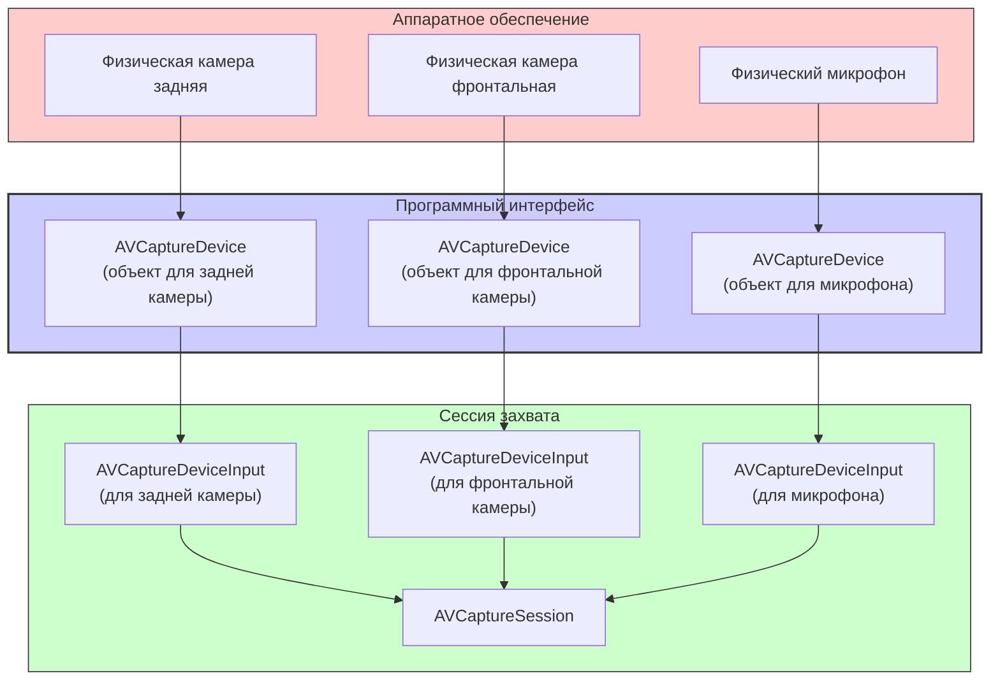

#avfoundation #camera #microphone #hardware #avcapturedevice #video #audio #ios 

---
## AVCaptureDevice

### Определение
**AVCaptureDevice** — это класс во фреймворке [[AVFoundation]], который представляет физическое устройство захвата мультимедийных данных (аппаратное обеспечение), подключенное к системе . Это может быть камера (фронтальная, задняя, телеобъектив, сверхширокоугольная), микрофон или даже вспышка .

`AVCaptureDevice` не только предоставляет источник данных для сессии захвата ([[AVCaptureSession]]) через [[AVCaptureDeviceInput]], но и позволяет разработчику конфигурировать специфические аппаратные свойства, такие как фокус, экспозиция, баланс белого, частота кадров и вспышка .

### Зачем это знать iOS-разработчику?
1.  **Выбор источника данных:** Необходимо для получения нужной камеры (задней/фронтальной) или микрофона перед созданием `AVCaptureDeviceInput` .
2.  **Управление аппаратными функциями:** Настройка фокуса, экспозиции, вспышки и стабилизации для создания профессиональных камер-приложений .
3.  **Конфигурация формата:** Выбор оптимального разрешения (`activeFormat`) и частоты кадров (`activeVideoMinFrameDuration`) в зависимости от потребностей приложения .
4.  **Обработка подключения/отключения:** Отслеживание событий, когда устройство (например, внешняя камера) становится доступным или недоступным .
5.  **Проверка поддержки функций:** Прежде чем пытаться установить режим фокуса или вспышку, необходимо проверить, поддерживает ли данное устройство эту функцию (например, `isFlashAvailable`) .

---

### Архитектура и место в AVCaptureSession



### Ключевые методы и свойства

#### Получение устройств
- `AVCaptureDevice.default(_:for:position:)` — рекомендуемый способ получения устройства по типу и позиции .
- `AVCaptureDevice.DiscoverySession` — для поиска всех устройств, соответствующих заданным критериям (тип, позиция, медиа-тип) .

#### Управление конфигурацией (блокировка)
Перед изменением большинства аппаратных свойств необходимо **получить эксклюзивный доступ** к конфигурации устройства, чтобы изменения были атомарными и не конфликтовали с другими процессами .
- `lockForConfiguration()` — запрашивает доступ для настройки. Может выбросить ошибку.
- `unlockForConfiguration()` — освобождает доступ. Всегда должна вызываться в паре с `lockForConfiguration`.

#### Свойства
- `position` — физическое расположение устройства (`.front`, `.back`, `.unspecified`) .
- `hasFlash` / `isFlashAvailable` — наличие и доступность вспышки .
- `isFocusModeSupported(_:)` — проверка поддержки режима фокуса .
- `activeFormat` — текущий активный формат захвата (разрешение, FPS).
- `formats` — массив всех форматов, поддерживаемых устройством .

---

### Примеры от простого к сложному

#### Уровень 0: Настройка Info.plist и проверка разрешений
Для доступа к камере и микрофону необходимо добавить описания в `Info.plist` :
- **NSCameraUsageDescription** — "Для съемки фото и видео"
- **NSMicrophoneUsageDescription** — "Для записи звука"

**Проверка и запрос разрешений:**
```swift
import AVFoundation

func checkCameraPermissions(completion: @escaping (Bool) -> Void) {
    switch AVCaptureDevice.authorizationStatus(for: .video) {
    case .authorized:
        completion(true)
    case .notDetermined:
        AVCaptureDevice.requestAccess(for: .video) { granted in
            DispatchQueue.main.async {
                completion(granted)
            }
        }
    case .denied, .restricted:
        completion(false)
    @unknown default:
        completion(false)
    }
}
```
*Запись аудио всегда требует явного разрешения пользователя; запись видео также требует разрешения на устройствах, продаваемых в определенных регионах .*

#### Уровень 1: Получение устройств

**Самый простой способ (для iOS 10+):**
```swift
import AVFoundation

// Получить камеру по умолчанию для видео (обычно задняя широкоугольная)
guard let defaultVideoDevice = AVCaptureDevice.default(for: .video) else {
    print("Видеоустройство не найдено")
    return
}

// Получить фронтальную камеру
if let frontCamera = AVCaptureDevice.default(.builtInWideAngleCamera, for: .video, position: .front) {
    print("Найдена фронтальная камера: \(frontCamera.localizedName)")
}

// Получить заднюю камеру
if let backCamera = AVCaptureDevice.default(.builtInWideAngleCamera, for: .video, position: .back) {
    print("Найдена задняя камера: \(backCamera.localizedName)")
}

// Получить микрофон
if let microphone = AVCaptureDevice.default(for: .audio) {
    print("Найден микрофон: \(microphone.localizedName)")
}
```

**Поиск всех доступных устройств (с использованием DiscoverySession):**
```swift
let discoverySession = AVCaptureDevice.DiscoverySession(
    deviceTypes: [.builtInWideAngleCamera, .builtInTelephotoCamera, .builtInUltraWideCamera],
    mediaType: .video,
    position: .unspecified
)

let allCameras = discoverySession.devices
print("Найдено камер: \(allCameras.count)")
for camera in allCameras {
    print(" - \(camera.localizedName) (\(camera.position == .back ? "задняя" : "фронтальная"))")
}
```

#### Уровень 2: Базовое создание входа ([[AVCaptureDeviceInput]])
После получения устройства из него создается вход для сессии .

```swift
import AVFoundation

class CameraSetupViewController: UIViewController {

    var captureSession: AVCaptureSession!

    override func viewDidLoad() {
        super.viewDidLoad()
        setupCamera()
    }

    func setupCamera() {
        captureSession = AVCaptureSession()
        
        // 1. Получаем устройство
        guard let videoDevice = AVCaptureDevice.default(.builtInWideAngleCamera, for: .video, position: .back) else {
            print("Не удалось получить камеру")
            return
        }
        
        // 2. Создаем вход из устройства
        do {
            let videoInput = try AVCaptureDeviceInput(device: videoDevice)
            
            // 3. Добавляем вход в сессию
            if captureSession.canAddInput(videoInput) {
                captureSession.addInput(videoInput)
                print("Видео вход добавлен")
            }
        } catch {
            print("Ошибка создания входа: \(error.localizedDescription)")
        }
        
        // Здесь можно добавить выходы и запустить сессию
    }
}
```

#### Уровень 3: Управление фокусом и экспозицией
Пример установки фокуса в режим автоматической фокусировки по точке касания.

```swift
import AVFoundation

func focus(at devicePoint: CGPoint, for device: AVCaptureDevice) {
    // Проверяем, поддерживается ли фокус по точке интереса
    guard device.isFocusPointOfInterestSupported else { return }
    
    do {
        // 1. Заблокировать конфигурацию
        try device.lockForConfiguration()
        
        // 2. Установить точку фокуса и режим
        device.focusPointOfInterest = devicePoint
        device.focusMode = .autoFocus // или .continuousAutoFocus, .locked
        
        // 3. (Опционально) Установить точку экспозиции
        if device.isExposurePointOfInterestSupported {
            device.exposurePointOfInterest = devicePoint
            device.exposureMode = .autoExpose
        }
        
        // 4. Разблокировать конфигурацию
        device.unlockForConfiguration()
        
    } catch {
        print("Не удалось заблокировать устройство для конфигурации: \(error)")
    }
}

// Использование в контроллере с preview layer
@objc func handleTap(_ gesture: UITapGestureRecognizer) {
    let location = gesture.location(in: view)
    guard let previewLayer = previewLayer else { return }
    
    // Конвертируем координаты из previewLayer в координаты устройства
    let devicePoint = previewLayer.captureDevicePointConverted(fromLayerPoint: location)
    
    guard let device = videoInput?.device else { return }
    focus(at: devicePoint, for: device)
}
```

#### Уровень 4: Настройка формата и частоты кадров
Выбор оптимального формата (например, 1080p при 60 fps) .

```swift
import AVFoundation

func configureHighestFrameRate(for device: AVCaptureDevice, desiredWidth: Int32 = 1920, desiredHeight: Int32 = 1080) {
    var bestFormat: AVCaptureDevice.Format?
    var bestFrameRateRange: AVFrameRateRange?
    
    // 1. Ищем формат, наиболее близкий к желаемому разрешению и с максимальным FPS
    for format in device.formats {
        let dimensions = CMVideoFormatDescriptionGetDimensions(format.formatDescription)
        if dimensions.width == desiredWidth && dimensions.height == desiredHeight {
            for range in format.videoSupportedFrameRateRanges {
                if bestFrameRateRange == nil || range.maxFrameRate > bestFrameRateRange!.maxFrameRate {
                    bestFormat = format
                    bestFrameRateRange = range
                }
            }
        }
    }
    
    // 2. Если нашли подходящий формат, применяем его
    guard let format = bestFormat, let range = bestFrameRateRange else {
        print("Желаемый формат не найден")
        return
    }
    
    do {
        try device.lockForConfiguration()
        device.activeFormat = format
        // Устанавливаем желаемую частоту кадров (например, максимальную)
        device.activeVideoMinFrameDuration = range.minFrameDuration
        device.activeVideoMaxFrameDuration = range.minFrameDuration // для постоянного FPS
        device.unlockForConfiguration()
        
        print("Формат установлен: \(desiredWidth)x\(desiredHeight) @ \(range.maxFrameRate) fps")
    } catch {
        print("Ошибка конфигурации: \(error)")
    }
}
```

#### Уровень 5: Переключение между камерами (фронтальная/задняя)
Динамическое изменение входа в сессии .

```swift
import AVFoundation

class CameraSwitchManager {
    var captureSession: AVCaptureSession
    var videoInput: AVCaptureDeviceInput?
    
    init(session: AVCaptureSession) {
        self.captureSession = session
    }
    
    func switchCamera() {
        captureSession.beginConfiguration()
        
        // 1. Удаляем текущий видео вход
        if let currentInput = videoInput {
            captureSession.removeInput(currentInput)
        }
        
        // 2. Определяем новую позицию
        let newPosition: AVCaptureDevice.Position = (videoInput?.device.position == .back) ? .front : .back
        
        // 3. Ищем новое устройство
        guard let newCamera = AVCaptureDevice.default(.builtInWideAngleCamera, for: .video, position: newPosition),
              let newInput = try? AVCaptureDeviceInput(device: newCamera) else {
            captureSession.commitConfiguration()
            return
        }
        
        // 4. Добавляем новый вход
        if captureSession.canAddInput(newInput) {
            captureSession.addInput(newInput)
            videoInput = newInput
        }
        
        captureSession.commitConfiguration()
    }
}
```

#### Уровень 6: Наблюдение за изменениями состояния устройства
Использование уведомлений для отслеживания подключения/отключения камер .

```swift
import AVFoundation
import UIKit

class DeviceObservationViewController: UIViewController {

    override func viewDidLoad() {
        super.viewDidLoad()
        
        // Подписываемся на уведомления о подключении/отключении устройств
        NotificationCenter.default.addObserver(self,
                                               selector: #selector(deviceWasConnected),
                                               name: .AVCaptureDeviceWasConnected,
                                               object: nil)
        
        NotificationCenter.default.addObserver(self,
                                               selector: #selector(deviceWasDisconnected),
                                               name: .AVCaptureDeviceWasDisconnected,
                                               object: nil)
        
        // Уведомление об изменении области съемки (если включено)
        NotificationCenter.default.addObserver(self,
                                               selector: #selector(subjectAreaDidChange),
                                               name: .AVCaptureDeviceSubjectAreaDidChange,
                                               object: nil)
    }
    
    @objc func deviceWasConnected(_ notification: Notification) {
        if let device = notification.object as? AVCaptureDevice {
            print("✅ Устройство подключено: \(device.localizedName)")
        }
    }
    
    @objc func deviceWasDisconnected(_ notification: Notification) {
        if let device = notification.object as? AVCaptureDevice {
            print("❌ Устройство отключено: \(device.localizedName)")
        }
    }
    
    @objc func subjectAreaDidChange(_ notification: Notification) {
        print("Область съемки существенно изменилась. Можно перефокусироваться.")
        // Здесь можно сбросить фокус на авто, если нужно
    }
    
    deinit {
        NotificationCenter.default.removeObserver(self)
    }
}
```

#### Уровень 7: Управление вспышкой и фонариком
Настройка режима вспышки (через `AVCapturePhotoSettings`) и включение фонарика (торча) .

```swift
import AVFoundation

extension AVCaptureDevice {
    
    /// Включение/выключение фонарика (Torch)
    func toggleTorch() {
        guard hasTorch, isTorchAvailable else { return }
        
        do {
            try lockForConfiguration()
            torchMode = isTorchActive ? .off : .on
            unlockForConfiguration()
        } catch {
            print("Ошибка установки torch: \(error)")
        }
    }
    
    /// Установка уровня яркости фонарика (0.0 - 1.0)
    func setTorchLevel(_ level: Float) {
        guard hasTorch, isTorchAvailable else { return }
        
        do {
            try lockForConfiguration()
            try setTorchModeOn(level: level)
            unlockForConfiguration()
        } catch {
            print("Ошибка установки уровня torch: \(error)")
        }
    }
}

// Использование:
// device.toggleTorch()
```

---

### Важные нюансы и Best Practices

#### 1. **Всегда проверяйте поддержку функции**
Перед вызовом методов конфигурации (фокус, экспозиция, вспышка) используйте соответствующие `is...Supported` свойства (например, `isFocusModeSupported`, `hasFlash`), чтобы избежать ошибок и крашей .

#### 2. **Блокировка конфигурации**
- Всегда используйте `lockForConfiguration()` и `unlockForConfiguration()` парой при изменении свойств устройства.
- Не держите блокировку дольше, чем необходимо, так как это может ухудшить качество захвата в других приложениях, использующих то же устройство .
- Используйте `defer { device.unlockForConfiguration() }` для гарантированного освобождения ресурса.

```swift
do {
    try device.lockForConfiguration()
    defer { device.unlockForConfiguration() } // Будет вызван при выходе из области видимости
    // ... настройки
} catch {
    print("Ошибка блокировки: \(error)")
}
```

#### 3. **Устаревшие методы**
Методы `devices()` и `devices(for:)` устарели начиная с iOS 10. Используйте `AVCaptureDevice.default` или `DiscoverySession` .

#### 4. **Активный формат и производительность**
- Выбор очень высокого разрешения (например, 4K) и высокой частоты кадров (60 fps, 120 fps) значительно увеличивает нагрузку на процессор и энергопотребление. Выбирайте минимально необходимый формат для вашей задачи .
- Проверяйте доступные форматы через свойство `formats`.

#### 5. **Обработка ошибок**
Метод `lockForConfiguration()` может выбрасывать ошибки (например, если устройство занято). Обязательно обрабатывайте их в `do-catch`.

#### 6. **AVCaptureDeviceInput и сессия**
Помните, что само устройство (`AVCaptureDevice`) не добавляется напрямую в сессию. Сначала создается `AVCaptureDeviceInput`, который затем добавляется в `AVCaptureSession` .

### Итог
**AVCaptureDevice** — это интерфейс к аппаратному обеспечению камеры и микрофона в iOS. Понимание его возможностей необходимо для:
- Правильного выбора источника данных.
- Тонкой настройки параметров съемки (фокус, экспозиция, формат).
- Управления вспомогательным оборудованием (вспышка, фонарик).
- Создания профессиональных приложений для работы с медиа.