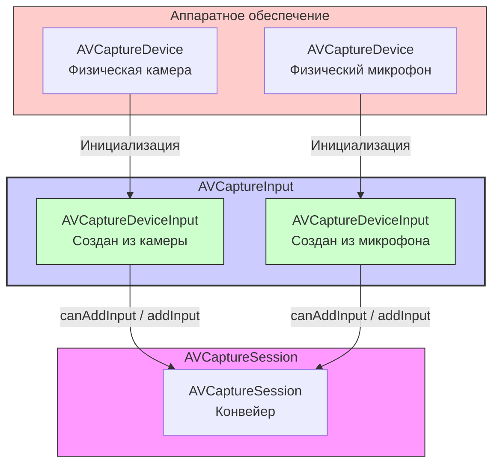

#avfoundation #capture #input #avcapturedeviceinput #camera #microphone #avcaptureinput #ios

---
## AVCaptureDeviceInput

### Определение
**AVCaptureDeviceInput** — это конкретный подкласс абстрактного класса [[AVCaptureInput]] во фреймворке [[AVFoundation]], который служит мостом между физическим устройством захвата ([[AVCaptureDevice]]) и сессией захвата ([[AVCaptureSession]]) . Он создается из объекта устройства и предоставляет данные от этого устройства (камеры, микрофона) в сессию для дальнейшей обработки и вывода.

Простыми словами, если `AVCaptureDevice` — это сама камера или микрофон (аппаратное обеспечение), то `AVCaptureDeviceInput` — это "разъем", который подключает это устройство к виртуальному конвейеру обработки данных (`AVCaptureSession`) .

### Зачем это знать [[iOS]]-разработчику?
1.  **Подключение устройств к сессии:** Без создания `AVCaptureDeviceInput` невозможно использовать камеру или микрофон в `AVCaptureSession` .
2.  **Управление портами:** Через вход можно получить доступ к отдельным портам (например, видеопоток от камеры) .
3.  **Обработка ошибок:** Инициализация входа может завершиться ошибкой (устройство занято, недоступно), и это нужно корректно обрабатывать .
4.  **Динамическая реконфигурация:** При переключении камеры (например, с задней на фронтальную) необходимо создавать новый вход и заменять им старый в сессии .
5.  **Проверка совместимости:** Перед добавлением входа в сессию нужно убедиться, что сессия может его принять (`canAddInput`) .

---

### Архитектура и место в AVCaptureSession



### Ключевые методы и свойства

#### Создание экземпляра
- `init(device: AVCaptureDevice)` — **инициализатор**, который может выбросить ошибку. Создает вход из указанного устройства .

#### Свойства
- `device` — **только для чтения**. Физическое устройство, из которого был создан данный вход .
- `ports` — массив объектов `AVCaptureInput.Port`, представляющих отдельные потоки данных от этого входа (например, видеопорт и аудиопорт у камеры со встроенным микрофоном) .

#### Методы (унаследованные от AVCaptureInput)
- `ports` (свойство) — список всех портов входа.
- `connection(with:)` — получить соединение для конкретного типа медиа (используется реже, обычно соединения получают от выходов).

---

### Примеры от простого к сложному

#### Уровень 0: Базовая структура с добавлением входа

```swift
import UIKit
import AVFoundation

class CameraViewController: UIViewController {

    var captureSession: AVCaptureSession!
    var videoInput: AVCaptureDeviceInput?

    override func viewDidLoad() {
        super.viewDidLoad()
        setupCamera()
    }

    private func setupCamera() {
        captureSession = AVCaptureSession()
        captureSession.sessionPreset = .hd1920x1080

        // 1. Получаем устройство
        guard let camera = AVCaptureDevice.default(.builtInWideAngleCamera, for: .video, position: .back) else {
            print("Камера не найдена")
            return
        }

        // 2. Создаем вход из устройства (может выбросить ошибку)
        do {
            let input = try AVCaptureDeviceInput(device: camera)
            
            // 3. Проверяем, можно ли добавить вход в сессию
            if captureSession.canAddInput(input) {
                captureSession.addInput(input)
                videoInput = input
                print("Видео вход добавлен")
            } else {
                print("Не удалось добавить видео вход")
            }
        } catch {
            print("Ошибка создания видео входа: \(error.localizedDescription)")
        }

        // Здесь можно добавить выходы и запустить сессию
    }
}
```

#### Уровень 1: Создание входов для видео и аудио
Полный пример добавления и видео, и аудио входов в сессию.

```swift
import UIKit
import AVFoundation

class FullCameraViewController: UIViewController {

    var captureSession: AVCaptureSession!
    var videoInput: AVCaptureDeviceInput?
    var audioInput: AVCaptureDeviceInput?

    override func viewDidLoad() {
        super.viewDidLoad()
        setupSession()
    }

    private func setupSession() {
        captureSession = AVCaptureSession()
        captureSession.sessionPreset = .hd1920x1080

        // Добавляем видео вход
        addVideoInput()

        // Добавляем аудио вход
        addAudioInput()

        // Проверяем, есть ли хотя бы один вход
        if captureSession.inputs.isEmpty {
            print("Не удалось добавить ни одного входа")
            return
        }

        // Здесь добавляем выходы и запускаем сессию
        DispatchQueue.global(qos: .userInitiated).async { [weak self] in
            self?.captureSession.startRunning()
        }
    }

    private func addVideoInput() {
        guard let camera = AVCaptureDevice.default(.builtInWideAngleCamera, for: .video, position: .back) else {
            print("Видео устройство не найдено")
            return
        }

        do {
            let input = try AVCaptureDeviceInput(device: camera)
            if captureSession.canAddInput(input) {
                captureSession.addInput(input)
                videoInput = input
                print("Видео вход добавлен")
            }
        } catch {
            print("Ошибка создания видео входа: \(error.localizedDescription)")
        }
    }

    private func addAudioInput() {
        guard let microphone = AVCaptureDevice.default(for: .audio) else {
            print("Микрофон не найден")
            return
        }

        do {
            let input = try AVCaptureDeviceInput(device: microphone)
            if captureSession.canAddInput(input) {
                captureSession.addInput(input)
                audioInput = input
                print("Аудио вход добавлен")
            }
        } catch {
            print("Ошибка создания аудио входа: \(error.localizedDescription)")
        }
    }
}
```

#### Уровень 2: Исследование портов входа
Каждый вход может иметь несколько портов. Это полезно для понимания, какие потоки данных предоставляет устройство.

```swift
import AVFoundation

func inspectInputPorts(for input: AVCaptureDeviceInput) {
    print("Информация о входе для устройства: \(input.device.localizedName)")
    
    for (index, port) in input.ports.enumerated() {
        print("  Порт #\(index + 1):")
        print("    - Медиа тип: \(port.mediaType.rawValue)")
        print("    - Описание: \(port.localizedName ?? "нет описания")")
        print("    - Включен: \(port.isEnabled)")
        
        if port.mediaType == .video {
            if let formatDescription = port.formatDescription {
                let dimensions = CMVideoFormatDescriptionGetDimensions(formatDescription)
                print("    - Размер видео: \(dimensions.width)x\(dimensions.height)")
            }
        }
    }
}

// Использование:
// inspectInputPorts(for: videoInput)
```

#### Уровень 3: Переключение между камерами (замена входа)
Демонстрация того, как удалить старый вход и добавить новый для переключения камеры.

```swift
import UIKit
import AVFoundation

class CameraSwitchViewController: UIViewController {

    var captureSession: AVCaptureSession!
    var videoInput: AVCaptureDeviceInput?
    var isUsingFrontCamera = false

    let switchButton = UIButton()

    override func viewDidLoad() {
        super.viewDidLoad()
        setupUI()
        setupCamera()
    }

    private func setupUI() {
        switchButton.setTitle("🔄 Переключить камеру", for: .normal)
        switchButton.backgroundColor = .blue
        switchButton.addTarget(self, action: #selector(switchCamera), for: .touchUpInside)
        // Добавление на view и настройка layout...
    }

    private func setupCamera() {
        captureSession = AVCaptureSession()
        captureSession.sessionPreset = .hd1920x1080

        // Добавляем начальную (заднюю) камеру
        addVideoInput(position: .back)

        // Здесь добавляем выходы и запускаем сессию...
    }

    private func addVideoInput(position: AVCaptureDevice.Position) {
        // Удаляем старый видео вход, если он есть
        if let currentInput = videoInput {
            captureSession.removeInput(currentInput)
        }

        guard let camera = AVCaptureDevice.default(.builtInWideAngleCamera, for: .video, position: position),
              let input = try? AVCaptureDeviceInput(device: camera) else {
            print("Не удалось создать вход для камеры")
            return
        }

        // Добавляем новый вход
        captureSession.beginConfiguration()
        if captureSession.canAddInput(input) {
            captureSession.addInput(input)
            videoInput = input
            isUsingFrontCamera = (position == .front)
        }
        captureSession.commitConfiguration()
    }

    @objc func switchCamera() {
        let newPosition: AVCaptureDevice.Position = isUsingFrontCamera ? .back : .front
        addVideoInput(position: newPosition)
    }
}
```

#### Уровень 4: Обработка ошибок при создании входа
Инициализатор `AVCaptureDeviceInput` может выбросить несколько типов ошибок, которые важно обрабатывать.

```swift
import AVFoundation

func createCameraInput(device: AVCaptureDevice) -> AVCaptureDeviceInput? {
    do {
        let input = try AVCaptureDeviceInput(device: device)
        return input
    } catch let error as NSError {
        // Анализируем конкретные ошибки AVFoundation
        switch error.code {
        case AVError.Code.applicationIsNotAuthorizedToUseDevice.rawValue:
            print("❌ Нет разрешения на использование камеры")
            // Показать пользователю алерт с предложением перейти в настройки
        case AVError.Code.deviceAlreadyUsedByAnotherSession.rawValue:
            print("❌ Устройство уже используется другой сессией")
        case AVError.Code.deviceBusy.rawValue:
            print("❌ Устройство занято")
        case AVError.Code.deviceNotConnected.rawValue:
            print("❌ Устройство не подключено")
        default:
            print("❌ Неизвестная ошибка создания входа: \(error.localizedDescription)")
        }
        return nil
    }
}
```

#### Уровень 5: Работа с несколькими камерами одновременно (дуал-камера)
На некоторых устройствах можно получить доступ к нескольким камерам одновременно (например, широкоугольная и телефото).

```swift
import AVFoundation

class DualCameraViewController: UIViewController {

    var captureSession: AVCaptureSession!

    override func viewDidLoad() {
        super.viewDidLoad()
        setupDualCamera()
    }

    func setupDualCamera() {
        captureSession = AVCaptureSession()

        // 1. Получаем устройства для задней камеры (может быть массив)
        let discoverySession = AVCaptureDevice.DiscoverySession(
            deviceTypes: [.builtInWideAngleCamera, .builtInTelephotoCamera],
            mediaType: .video,
            position: .back
        )

        let backCameras = discoverySession.devices

        // 2. Пытаемся добавить оба устройства как входы
        for camera in backCameras {
            do {
                let input = try AVCaptureDeviceInput(device: camera)
                if captureSession.canAddInput(input) {
                    captureSession.addInput(input)
                    print("Добавлена камера: \(camera.localizedName)")
                }
            } catch {
                print("Не удалось добавить камеру \(camera.localizedName): \(error)")
            }
        }

        // 3. Теперь в сессии есть два видео-входа
        let videoInputs = captureSession.inputs.filter { ($0 as? AVCaptureDeviceInput)?.device.hasMediaType(.video) ?? false }
        print("Всего видео входов: \(videoInputs.count)")

        // Для работы с несколькими входами потребуются соответствующие выходы и соединения
    }
}
```

#### Уровень 6: Временное отключение входа (портов)
Можно отключить отдельные порты входа, например, чтобы временно отключить аудио, но оставить видео.

```swift
import AVFoundation

func toggleAudioPort(for videoInput: AVCaptureDeviceInput, enable: Bool) {
    // Находим аудио-порт у видео входа (если камера имеет встроенный микрофон)
    for port in videoInput.ports {
        if port.mediaType == .audio {
            port.isEnabled = enable
            print("Аудио порт \(enable ? "включен" : "отключен")")
        }
    }
}

// Использование:
// toggleAudioPort(for: videoInput, enable: false)
```

#### Уровень 7: Создание входа из кастомного устройства (например, внешняя камера)
На iOS можно подключать внешние камеры через USB или Lightning.

```swift
import AVFoundation

func findExternalCameraInput() -> AVCaptureDeviceInput? {
    // Используем DiscoverySession для поиска всех видео устройств
    let discoverySession = AVCaptureDevice.DiscoverySession(
        deviceTypes: [.external],
        mediaType: .video,
        position: .unspecified
    )

    for device in discoverySession.devices {
        print("Найдено внешнее устройство: \(device.localizedName)")
        if let input = try? AVCaptureDeviceInput(device: device) {
            return input
        }
    }
    return nil
}
```

---

### Важные нюансы и Best Practices

#### 1. **Обязательная проверка `canAddInput`**
Перед добавлением входа в сессию всегда используйте `captureSession.canAddInput(input)`. Это может не сработать из-за ограничений устройства или текущей конфигурации сессии .

#### 2. **Обработка ошибок инициализации**
Инициализатор `AVCaptureDeviceInput(device:)` может выбросить ошибку. Всегда оборачивайте его в `try-catch` и обрабатывайте возможные причины (нет разрешений, устройство занято, устройство отключено) .

#### 3. **beginConfiguration / commitConfiguration**
При добавлении или удалении нескольких входов (или изменении других параметров) используйте эти методы для атомарности изменений:

```swift
captureSession.beginConfiguration()
// Добавление/удаление входов
captureSession.commitConfiguration()
```

#### 4. **Управление устройствами**
Для настройки параметров самого устройства (фокус, экспозиция, FPS) используется `AVCaptureDevice.lockForConfiguration()`, а не вход .

#### 5. **Порты и их включение**
Свойство `isEnabled` у порта позволяет включать/отключать отдельные потоки данных. Однако это менее эффективно, чем отключение через соединения (`AVCaptureConnection`). Обычно лучше использовать `AVCaptureConnection.isEnabled`.

#### 6. **Производительность**
- Добавление множества входов может снизить производительность.
- Не все устройства поддерживают одновременную работу двух камер.

#### 7. **Совместимость с различными устройствами**
На разных устройствах могут быть разные камеры. Используйте `DiscoverySession` для получения всех доступных устройств.

### Итог
**AVCaptureDeviceInput** — это фундаментальный компонент для подключения аппаратных устройств к сессии захвата в AVFoundation. Основные выводы:

1.  **Создается из AVCaptureDevice** и может выбрасывать ошибки.
2.  **Добавляется в сессию** после проверки `canAddInput`.
3.  **Предоставляет порты** для доступа к отдельным потокам данных.
4.  **Ключевой элемент** для переключения камер и настройки мультимедийных сессий.

Понимание работы с `AVCaptureDeviceInput` необходимо для любой нетривиальной работы с камерой и микрофоном в iOS.