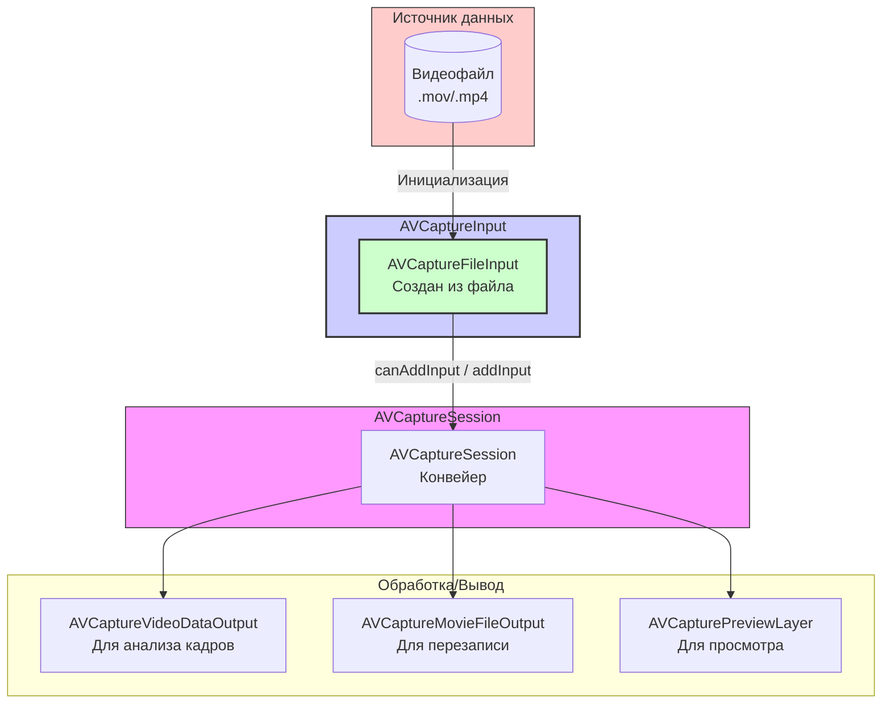

#avfoundation #capture #input #file-input #avcapturefileinput #video #audio #playback

---
## AVCaptureFileInput

### Определение
**AVCaptureFileInput** — это конкретный подкласс абстрактного класса [[AVCaptureInput]] во фреймворке AVFoundation, который предоставляет медиаданные (видео и/или аудио) из существующего файла в сессию захвата ([[AVCaptureSession]]) . В отличие от [[AVCaptureDeviceInput]], который получает данные от живого устройства (камера, микрофон), `AVCaptureFileInput` читает данные из ранее записанного файла, такого как QuickTime movie (`.mov`), и подает их в конвейер обработки, как если бы они поступали от реального устройства.

Этот класс особенно полезен для сценариев, где требуется обрабатывать, анализировать или повторно выводить ранее записанный медиаконтент, используя ту же инфраструктуру, что и для живого захвата.

### Зачем это знать [[iOS]]-разработчику?
1.  **Обработка записанных файлов:** Позволяет применять те же выходы ([[AVCaptureOutput]]), которые используются для live-захвата (например, [[AVCaptureVideoDataOutput]] для анализа кадров, [[AVCaptureMovieFileOutput]] для перекодирования) к уже существующим видеофайлам.
2.  **Тестирование и симуляция:** Дает возможность тестировать конвейеры обработки видео без необходимости использования живого устройства захвата, используя заранее подготовленные файлы-образцы.
3.  **Создание эффектов "повтора" (instant replay):** В приложениях для записи видео можно сохранять короткие клипы в память, а затем немедленно подавать их обратно в сессию для вывода на экран или дополнительной обработки.
4.  **Редактирование и перекодировка:** Возможность читать файл, применять к нему фильтры или изменять формат через выходы и записывать результат в новый файл.

---

### Архитектура и место в AVCaptureSession

`AVCaptureFileInput` встраивается в сессию аналогично `AVCaptureDeviceInput`, предоставляя данные из файла, а не с устройства.



### Ключевые методы и свойства

#### Создание экземпляра
- `init(url: URL, error: NSErrorPointer)` — **инициализатор**, создает вход из файла по указанному [[URL]]. Может вернуть [[nil]] и заполнить параметр `error`, если файл не может быть прочитан (например, неподдерживаемый формат) .

#### Свойства
- `url` — URL файла, из которого был создан вход (только для чтения).
- `ports` — массив портов, предоставляющих медиаданные (обычно содержит порты для видео и аудио, если они присутствуют в файле).

#### Наследование
`AVCaptureFileInput` наследует все свойства и методы от своего суперкласса `AVCaptureInput`, включая доступ к портам через свойство `ports` и возможность получения соединений через выходы.

---

### AVCaptureFileInput vs Другие Входы

| Характеристика          | [[AVCaptureFileInput]]                                | [[AVCaptureDeviceInput]]            | [[AVCaptureScreenInput]]       |
| ----------------------- | ----------------------------------------------------- | ----------------------------------- | ------------------------------ |
| **Источник данных**     | Существующий медиафайл                                | Живое устройство (камера, микрофон) | Экран компьютера (macOS)       |
| **Платформа**           | iOS, macOS                                            | iOS, macOS, watchOS                 | macOS                          |
| **Основное назначение** | Обработка, анализ, перекодировка записанного контента | Захват живого видео/аудио           | Запись происходящего на экране |
| **Требует разрешений**  | Доступ к файловой системе                             | `NSCamera...`, `NSMicrophone...`    | Запись экрана (macOS)          |

---

### Примеры использования

#### Уровень 1: Базовая настройка сессии с файловым входом и просмотром
В этом примере мы создадим сессию, добавим вход из видеофайла в бандле и подключим слой предпросмотра для его отображения.

```swift
import UIKit
import AVFoundation

class FileInputPreviewViewController: UIViewController {

    var captureSession: AVCaptureSession!
    var previewLayer: AVCaptureVideoPreviewLayer!

    override func viewDidLoad() {
        super.viewDidLoad()
        setupFilePlayback()
    }

    private func setupFilePlayback() {
        // 1. Создаем сессию
        captureSession = AVCaptureSession()

        // 2. Находим URL видеофайла в бандле приложения
        guard let videoFileURL = Bundle.main.url(forResource: "sample_video", withExtension: "mov") else {
            print("Видеофайл не найден в бандле")
            return
        }

        // 3. Создаем AVCaptureFileInput из файла
        do {
            let fileInput = try AVCaptureFileInput(url: videoFileURL)
            
            // 4. Добавляем вход в сессию
            if captureSession.canAddInput(fileInput) {
                captureSession.addInput(fileInput)
                print("Файловый вход добавлен. Видео: \(videoFileURL.lastPathComponent)")
            } else {
                print("Не удалось добавить файловый вход в сессию")
                return
            }
        } catch {
            print("Ошибка создания файлового входа: \(error.localizedDescription)")
            return
        }

        // 5. Создаем и настраиваем Preview Layer
        previewLayer = AVCaptureVideoPreviewLayer(session: captureSession)
        previewLayer.frame = view.bounds
        previewLayer.videoGravity = .resizeAspect // Сохраняем пропорции видео
        view.layer.addSublayer(previewLayer)

        // 6. Запускаем сессию (данные из файла начнут поступать)
        DispatchQueue.global(qos: .userInitiated).async { [weak self] in
            self?.captureSession.startRunning()
        }
    }

    override func viewWillDisappear(_ animated: Bool) {
        super.viewWillDisappear(animated)
        // Останавливаем сессию при уходе с экрана
        DispatchQueue.global(qos: .background).async { [weak self] in
            self?.captureSession.stopRunning()
        }
    }
}
```

#### Уровень 2: Обработка кадров из файла с помощью [[AVCaptureVideoDataOutput]]
Более мощный сценарий: читаем файл и направляем его кадры в выход для обработки, например, для анализа с помощью Vision или применения фильтров.

```swift
import UIKit
import AVFoundation

class FileProcessingViewController: UIViewController, AVCaptureVideoDataOutputSampleBufferDelegate {

    var captureSession: AVCaptureSession!
    let processingQueue = DispatchQueue(label: "processingQueue")

    override func viewDidLoad() {
        super.viewDidLoad()
        setupProcessingSession()
    }

    private func setupProcessingSession() {
        captureSession = AVCaptureSession()

        // 1. Файловый вход
        guard let videoFileURL = Bundle.main.url(forResource: "sample_video", withExtension: "mov") else { return }
        
        do {
            let fileInput = try AVCaptureFileInput(url: videoFileURL)
            if captureSession.canAddInput(fileInput) {
                captureSession.addInput(fileInput)
            } else { return }
        } catch {
            print("Ошибка входа: \(error)")
            return
        }

        // 2. Выход для обработки видеокадров
        let videoOutput = AVCaptureVideoDataOutput()
        videoOutput.videoSettings = [kCVPixelBufferPixelFormatTypeKey as String: kCVPixelFormatType_32BGRA]
        videoOutput.setSampleBufferDelegate(self, queue: processingQueue)

        if captureSession.canAddOutput(videoOutput) {
            captureSession.addOutput(videoOutput)
        }

        // Запускаем сессию
        DispatchQueue.global(qos: .userInitiated).async { [weak self] in
            self?.captureSession.startRunning()
        }
    }

    // MARK: - AVCaptureVideoDataOutputSampleBufferDelegate
    func captureOutput(_ output: AVCaptureOutput, didOutput sampleBuffer: CMSampleBuffer, from connection: AVCaptureConnection) {
        // Здесь мы получаем каждый кадр из файла для обработки
        print("Получен кадр для обработки в \(Date())")
        
        // Пример: извлечение изображения из буфера
        guard let imageBuffer = CMSampleBufferGetImageBuffer(sampleBuffer) else { return }
        let ciImage = CIImage(cvPixelBuffer: imageBuffer)
        // Далее можно применить фильтры Core Image или передать в Vision
    }
}
```

#### Уровень 3: Перекодировка файла с использованием [[AVCaptureMovieFileOutput]]
Читаем исходный файл и записываем его в новый файл, возможно, с другим качеством или форматом.

```swift
import UIKit
import AVFoundation

class FileRemuxViewController: UIViewController, AVCaptureFileOutputRecordingDelegate {

    var captureSession: AVCaptureSession!
    var movieOutput: AVCaptureMovieFileOutput!
    let tempOutputURL = FileManager.default.temporaryDirectory.appendingPathComponent("remuxed_output.mov")

    override func viewDidLoad() {
        super.viewDidLoad()
        setupRemuxSession()
    }

    private func setupRemuxSession() {
        captureSession = AVCaptureSession()

        // 1. Файловый вход
        guard let inputFileURL = Bundle.main.url(forResource: "source", withExtension: "mov") else { return }
        do {
            let fileInput = try AVCaptureFileInput(url: inputFileURL)
            if captureSession.canAddInput(fileInput) {
                captureSession.addInput(fileInput)
            } else { return }
        } catch {
            print("Ошибка входа: \(error)")
            return
        }

        // 2. Выход для записи в файл
        movieOutput = AVCaptureMovieFileOutput()
        if captureSession.canAddOutput(movieOutput) {
            captureSession.addOutput(movieOutput)
        }

        // Запускаем сессию и сразу начинаем запись
        DispatchQueue.global(qos: .userInitiated).async { [weak self] in
            self?.captureSession.startRunning()
            
            // Небольшая задержка, чтобы сессия успела запуститься
            DispatchQueue.main.asyncAfter(deadline: .now() + 0.5) {
                self?.startRecording()
            }
        }
    }

    private func startRecording() {
        // Удаляем старый файл, если существует
        try? FileManager.default.removeItem(at: tempOutputURL)
        movieOutput.startRecording(to: tempOutputURL, recordingDelegate: self)
        print("Начало перекодировки...")
    }

    // MARK: - AVCaptureFileOutputRecordingDelegate
    func fileOutput(_ output: AVCaptureFileOutput, didStartRecordingTo fileURL: URL, from connections: [AVCaptureConnection]) {
        print("Запись начата")
    }

    func fileOutput(_ output: AVCaptureFileOutput, didFinishRecordingTo outputFileURL: URL, from connections: [AVCaptureConnection], error: Error?) {
        if let error = error {
            print("Ошибка записи: \(error)")
        } else {
            print("Перекодировка завершена. Файл сохранен: \(outputFileURL)")
            // Здесь можно показать пользователю или загрузить файл
        }
        captureSession.stopRunning()
    }
}
```

---

### Важные нюансы и Best Practices

#### 1. **Поддерживаемые форматы файлов**
`AVCaptureFileInput` поддерживает те же форматы, которые могут быть созданы с помощью `AVCaptureMovieFileOutput`, в первую очередь QuickTime movie (`.mov`). Поддержка других форматов может быть ограничена .

#### 2. **Управление временем**
`AVCaptureFileInput` будет воспроизводить файл с его собственной временной шкалой. Сессия не имеет встроенных элементов управления для паузы, перемотки или остановки по окончании файла. Для контроля над воспроизведением (пауза, стоп, повтор) вам потребуется реализовать дополнительную логику, например, наблюдая за временными метками кадров или используя таймер для остановки сессии после определенной длительности.

#### 3. **Отсутствие обратной связи по окончании файла**
Сессия не генерирует автоматического уведомления о том, что файл закончился. Кадры просто перестанут поступать. Чтобы узнать о завершении файла, можно использовать `AVCaptureVideoDataOutput` и следить за временными метками (`CMSampleBufferGetPresentationTimeStamp`) или использовать [[KVO]] для наблюдения за `isRunning` сессии и таймер для остановки.

#### 4. **Производительность**
Обработка видеофайлов через `AVCaptureSession` может потреблять значительные ресурсы, особенно при использовании `AVCaptureVideoDataOutput`. Убедитесь, что обработка в делегате выполняется быстро, чтобы избежать сброса кадров. Для простого воспроизведения файлов более подходящим инструментом является `AVPlayer`.

#### 5. **Аудиодорожки**
Если файл содержит аудио, `AVCaptureFileInput` автоматически предоставит соответствующие порты, и аудио может быть обработано или записано через соответствующие выходы (например, `AVCaptureAudioDataOutput`).

### Итог
**AVCaptureFileInput** — это специализированный, но мощный инструмент в арсенале AVFoundation. Он позволяет интегрировать ранее записанные медиафайлы в стандартный конвейер захвата, открывая возможности для:
- **Обработки и анализа** записанного видео с использованием тех же инструментов, что и для живого видео.
- **Перекодировки и ремастеринга** файлов.
- **Создания сложных рабочих процессов**, где данные могут циркулировать между живыми и файловыми источниками.

Хотя для простого воспроизведения видео обычно используется `AVPlayer`, `AVCaptureFileInput` незаменим, когда требуется глубокий покадровый доступ к видео в контексте системы захвата `AVCaptureSession`.