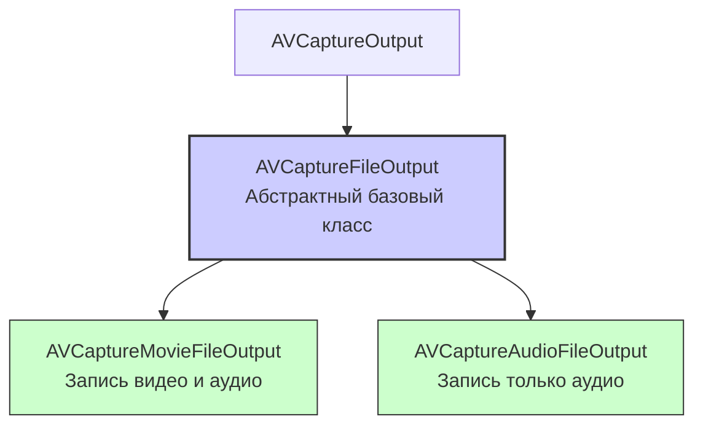

#avfoundation #capture #output #file-output #recording #video #audio #avcapturefileoutput

---
## AVCaptureFileOutput

### Определение
**AVCaptureFileOutput** — это абстрактный базовый класс во фреймворке [[AVFoundation]], который служит родительским классом для выходов захвата, способных записывать медиаданные непосредственно в файл . Сам по себе он не используется напрямую, но предоставляет общий интерфейс и функциональность для своих конкретных подклассов, таких как [[AVCaptureMovieFileOutput]] (для записи видео и аудио в QuickTime movie) и [[AVCaptureAudioFileOutput]] (для записи только аудио) .

Простыми словами, `AVCaptureFileOutput` — это абстрактное определение "писателя в файл", а `AVCaptureMovieFileOutput` — его конкретная реализация для записи видео.

### Зачем это знать [[iOS]]-разработчику?
1.  **Унифицированный API для записи:** Понимание этого класса помогает использовать общие методы и свойства, которые работают одинаково для всех типов файловых выходов (например, `startRecording(to:recordingDelegate:)`, `stopRecording()`, `maxRecordedDuration`).
2.  **Контроль над записью:** Предоставляет возможности для ограничения длительности, размера файла, а также для приостановки и возобновления записи (на iOS 13+) .
3.  **Обратная связь:** Работает в паре с протоколом `AVCaptureFileOutputRecordingDelegate`, который сообщает о начале и завершении записи, а также об ошибках .
4.  **Управление дисковым пространством:** Позволяет задать минимальный объем свободного места на диске для продолжения записи (`minFreeDiskSpaceLimit`) .

---

### Иерархия и конкретные подклассы



#### [[AVCaptureMovieFileOutput]]
Самый часто используемый подкласс. Записывает видео и аудио в файл формата QuickTime (`.mov`) . Поддерживает настройку кодека, фрагментацию файла (`movieFragmentInterval`) и другие параметры.

#### [[AVCaptureAudioFileOutput]]
Специализированный выход для записи только аудиоданных в файл. Используется реже, обычно когда нужно писать звук без видео.

---

### Ключевые свойства и методы AVCaptureFileOutput

Эти свойства и методы доступны для всех подклассов `AVCaptureFileOutput` .

#### Управление записью
- `startRecording(to:recordingDelegate:)` — начинает запись в файл по указанному [[URL]]. Требует делегата для обратной связи .
- `stopRecording()` — останавливает текущую запись .
- `isRecording` — указывает, идет ли запись в данный момент .
- `pauseRecording()` / `resumeRecording()` — приостанавливает и возобновляет запись (доступно с [[iOS]] 13+) .

#### Ограничения и мониторинг
- `maxRecordedDuration` (`CMTime`) — максимальная длительность записи .
- `maxRecordedFileSize` (`Int64`) — максимальный размер файла в байтах .
- `minFreeDiskSpaceLimit` (`Int64`) — минимальный объем свободного места на диске, необходимый для продолжения записи .
- `recordedDuration` (`CMTime`) — текущая длительность записанного материала (наблюдаемое свойство) .
- `recordedFileSize` (`Int64`) — текущий размер записываемого файла в байтах .
- `outputFileURL` (`URL?`) — URL текущего записываемого файла .

#### Делегат
- [[delegate]] — делегат, соответствующий протоколу [[AVCaptureFileOutputRecordingDelegate]] (или [[AVCaptureFileOutputDelegate]] для более низкоуровневого контроля) .

---

### Примеры использования

#### Уровень 1: Простейшая запись видео с [[AVCaptureMovieFileOutput]]
Этот пример демонстрирует минимальную настройку для записи видео с камеры и микрофона в файл .

```swift
import UIKit
import AVFoundation

class SimpleVideoRecorder: NSObject, AVCaptureFileOutputRecordingDelegate {

    let captureSession = AVCaptureSession()
    let movieOutput = AVCaptureMovieFileOutput()
    var isRecording = false

    override init() {
        super.init()
        setupSession()
    }

    private func setupSession() {
        captureSession.sessionPreset = .high

        // Добавляем видео вход
        guard let videoDevice = AVCaptureDevice.default(for: .video),
              let videoInput = try? AVCaptureDeviceInput(device: videoDevice),
              captureSession.canAddInput(videoInput) else { return }
        captureSession.addInput(videoInput)

        // Добавляем аудио вход
        if let audioDevice = AVCaptureDevice.default(for: .audio),
           let audioInput = try? AVCaptureDeviceInput(device: audioDevice),
           captureSession.canAddInput(audioInput) {
            captureSession.addInput(audioInput)
        }

        // Добавляем выход
        if captureSession.canAddOutput(movieOutput) {
            captureSession.addOutput(movieOutput)
        }

        // Запускаем сессию в фоне
        DispatchQueue.global(qos: .userInitiated).async { [weak self] in
            self?.captureSession.startRunning()
        }
    }

    func startRecording() {
        let outputURL = FileManager.default.temporaryDirectory.appendingPathComponent("\(UUID().uuidString).mov")
        movieOutput.startRecording(to: outputURL, recordingDelegate: self)
        isRecording = true
    }

    func stopRecording() {
        movieOutput.stopRecording()
        isRecording = false
    }

    // MARK: - AVCaptureFileOutputRecordingDelegate
    func fileOutput(_ output: AVCaptureFileOutput, didStartRecordingTo fileURL: URL, from connections: [AVCaptureConnection]) {
        print("Запись начата: \(fileURL)")
    }

    func fileOutput(_ output: AVCaptureFileOutput, didFinishRecordingTo outputFileURL: URL, from connections: [AVCaptureConnection], error: Error?) {
        if let error = error {
            print("Ошибка записи: \(error.localizedDescription)")
        } else {
            print("Запись завершена: \(outputFileURL)")
            // Здесь можно сохранить видео в фотоальбом
        }
    }
}
```

#### Уровень 2: Использование ограничений и наблюдение за прогрессом
Добавляем ограничение на длительность записи (например, 30 секунд) и наблюдаем за прогрессом через [[KVO]] .

```swift
import AVFoundation

class LimitedRecorder: NSObject, AVCaptureFileOutputRecordingDelegate {
    let movieOutput = AVCaptureMovieFileOutput()
    var durationObservation: NSKeyValueObservation?

    func configureOutput() {
        // Ограничиваем запись 30 секундами
        movieOutput.maxRecordedDuration = CMTime(seconds: 30, preferredTimescale: 600)

        // Наблюдаем за изменением длительности записи
        durationObservation = movieOutput.observe(\.recordedDuration, options: [.new]) { output, change in
            let seconds = CMTimeGetSeconds(change.newValue ?? .zero)
            print("Текущая длительность: \(seconds) сек.")
            let progress = seconds / 30.0
            // Обновляем UI (например, прогресс-бар)
        }
    }
}
```

#### Уровень 3: Обработка ошибок при завершении записи
Метод делегата `didFinishRecordingTo` всегда вызывается по окончании записи, и параметр `error` может содержать полезную информацию о причине остановки .

```swift
func fileOutput(_ output: AVCaptureFileOutput, didFinishRecordingTo outputFileURL: URL, from connections: [AVCaptureConnection], error: Error?) {
    if let error = error as NSError? {
        switch error.code {
        case AVError.maximumDurationReached.rawValue:
            print("Запись остановлена из-за достижения максимальной длительности")
        case AVError.maximumFileSizeReached.rawValue:
            print("Запись остановлена из-за достижения максимального размера файла")
        case AVError.diskFull.rawValue:
            print("Запись остановлена: недостаточно свободного места на диске")
        default:
            print("Неизвестная ошибка: \(error.localizedDescription)")
        }
    } else {
        print("Запись успешно завершена")
    }
}
```

#### Уровень 4: Асинхронная обработка с использованием [[async]]/[[await]]
Можно обернуть делегат в Continuation для использования современных async/await конструкций .

```swift
extension AVCaptureMovieFileOutput {
    func startRecording(to url: URL) async throws -> URL {
        return try await withCheckedThrowingContinuation { continuation in
            let delegate = RecordingDelegate()
            delegate.didFinishRecording = { error, finalURL in
                if let error = error {
                    continuation.resume(throwing: error)
                } else if let finalURL = finalURL {
                    continuation.resume(returning: finalURL)
                }
            }
            // Важно сохранить делегат, иначе он будет деинициализирован
            objc_setAssociatedObject(self, UUID().uuidString, delegate, .OBJC_ASSOCIATION_RETAIN)
            self.startRecording(to: url, recordingDelegate: delegate)
        }
    }
}

private class RecordingDelegate: NSObject, AVCaptureFileOutputRecordingDelegate {
    var didFinishRecording: ((Error?, URL?) -> Void)?

    func fileOutput(_ output: AVCaptureFileOutput, didStartRecordingTo fileURL: URL, from connections: [AVCaptureConnection]) {}

    func fileOutput(_ output: AVCaptureFileOutput, didFinishRecordingTo outputFileURL: URL, from connections: [AVCaptureConnection], error: Error?) {
        didFinishRecording?(error, outputFileURL)
    }
}
```

### AVCaptureFileOutput vs. [[AVCaptureVideoDataOutput]] + [[AVAssetWriter]]

Выбор между этими подходами зависит от задачи :

| Характеристика | AVCaptureMovieFileOutput | AVCaptureVideoDataOutput + AVAssetWriter |
|---|---|---|
| **Сложность** | Низкая, минимальный код | Высокая, ручное управление |
| **Гибкость обработки** | Низкая (нельзя изменить кадры до записи) | Высокая (доступ к каждому кадру) |
| **Использование** | Простая запись видео "как есть" | Наложение фильтров, сжатие, кастомное кодирование |
| **Производительность** | Высокая (аппаратное кодирование) | Средняя (зависит от реализации) |
| **Контроль** | Меньше контроля | Полный контроль |

### Итог
**AVCaptureFileOutput** (и его основной подкласс `AVCaptureMovieFileOutput`) — это самый простой и эффективный способ добавить запись видео в iOS-приложение. Он предоставляет:
- **Простой API** для начала и остановки записи.
- **Встроенные ограничения** по времени и размеру файла.
- **Делегат** для обратной связи о процессе записи .
- **Возможность мониторинга** через KVO.

Для большинства задач, где не требуется покадровая обработка видео, `AVCaptureMovieFileOutput` является оптимальным выбором .