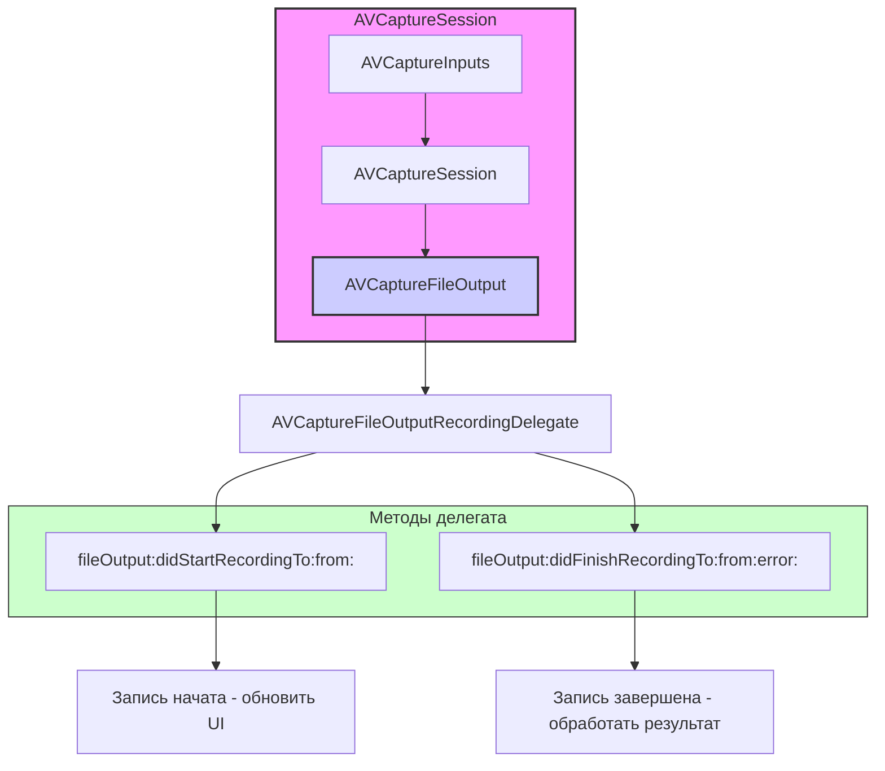

#avfoundation #delegate #recording #video #audio #file-output #capture #avcapturefileoutput`

---
### Определение
**AVCaptureFileOutputRecordingDelegate** — это протокол во фреймворке [[AVFoundation]], который определяет методы для мониторинга и управления процессом записи медиаданных в файл. Он является основным механизмом получения обратной связи от классов, наследующих [[AVCaptureFileOutput]] (таких как [[AVCaptureMovieFileOutput]]), о событиях начала и завершения записи, а также об ошибках, возникших в процессе .

Простыми словами, этот делегат — ваш способ узнать, когда запись видео началась, когда закончилась, и не произошло ли чего-то плохого (например, закончилось место на диске или был превышен лимит длительности).

### Зачем это знать [[iOS]]-разработчику?
1.  **Обратная связь о начале записи:** Узнать точный момент, когда запись действительно началась (после подготовки файловой системы).
2.  **Обработка завершения записи:** Получить [[URL]] сохраненного файла и проверить, успешно ли завершилась запись.
3.  **Обработка ошибок:** Реагировать на ошибки (нехватка места, достижение лимитов, проблемы с кодеками).
4.  **Управление состоянием UI:** Менять состояние кнопок (запись/стоп) в зависимости от статуса записи.
5.  **Пост-обработка:** После завершения записи можно показать превью, сохранить видео в фотоальбом или загрузить на сервер.

---

### Архитектура и место в AVFoundation



### Ключевые методы протокола

Протокол содержит два основных метода (один обязательный, один опциональный):

#### 1. `fileOutput(_:didFinishRecordingTo:from:error:)` **Обязательный**
**Назначение:** Вызывается, когда запись файла завершена (успешно или с ошибкой).

```swift
func fileOutput(_ output: AVCaptureFileOutput, 
                didFinishRecordingTo outputFileURL: URL, 
                from connections: [AVCaptureConnection], 
                error: Error?)
```

**Параметры:**
- `output`: Ссылка на объект [[AVCaptureFileOutput]], который завершил запись.
- `outputFileURL`: [[URL]] файла, в который производилась запись.
- `connections`: Массив соединений, участвовавших в записи (видео, аудио и т.д.).
- `error`: Ошибка, если запись завершилась неудачно. Если [[nil]] — запись успешна.

**Этот метод — самый важный.** Здесь вы получаете результат записи и можете:
- Проверить, была ли ошибка.
- Сохранить видео в фотоальбом.
- Показать пользователю превью.
- Удалить временный файл при необходимости.

#### 2. `fileOutput(_:didStartRecordingTo:from:)` **Опциональный**
**Назначение:** Вызывается, когда запись файла действительно началась (после подготовки файловой системы).

```swift
optional func fileOutput(_ output: AVCaptureFileOutput, 
                         didStartRecordingTo fileURL: URL, 
                         from connections: [AVCaptureConnection])
```

**Параметры:**
- `output`: Ссылка на объект `AVCaptureFileOutput`, который начал запись.
- `fileURL`: URL файла, в который производится запись.
- `connections`: Массив соединений.

**Использование:** Обновление UI (показать индикатор записи, сменить иконку кнопки на "Стоп").

---

### Примеры от простого к сложному

#### Уровень 0: Базовая структура с подключением делегата

```swift
import UIKit
import AVFoundation

class BaseRecorderViewController: UIViewController, AVCaptureFileOutputRecordingDelegate {
    
    var captureSession: AVCaptureSession!
    var movieOutput: AVCaptureMovieFileOutput!
    var previewLayer: AVCaptureVideoPreviewLayer!
    
    override func viewDidLoad() {
        super.viewDidLoad()
        setupCamera()
    }
    
    private func setupCamera() {
        captureSession = AVCaptureSession()
        captureSession.sessionPreset = .hd1920x1080
        
        // Видео вход
        guard let videoDevice = AVCaptureDevice.default(.builtInWideAngleCamera, for: .video, position: .back),
              let videoInput = try? AVCaptureDeviceInput(device: videoDevice),
              captureSession.canAddInput(videoInput) else {
            print("Не удалось добавить видео вход")
            return
        }
        captureSession.addInput(videoInput)
        
        // Аудио вход
        if let audioDevice = AVCaptureDevice.default(for: .audio),
           let audioInput = try? AVCaptureDeviceInput(device: audioDevice),
           captureSession.canAddInput(audioInput) {
            captureSession.addInput(audioInput)
        }
        
        // Movie output
        movieOutput = AVCaptureMovieFileOutput()
        if captureSession.canAddOutput(movieOutput) {
            captureSession.addOutput(movieOutput)
        }
        
        previewLayer = AVCaptureVideoPreviewLayer(session: captureSession)
        previewLayer.frame = view.bounds
        previewLayer.videoGravity = .resizeAspectFill
        view.layer.addSublayer(previewLayer)
        
        DispatchQueue.global(qos: .userInitiated).async { [weak self] in
            self?.captureSession.startRunning()
        }
    }
    
    // MARK: - AVCaptureFileOutputRecordingDelegate
    func fileOutput(_ output: AVCaptureFileOutput, 
                   didFinishRecordingTo outputFileURL: URL, 
                   from connections: [AVCaptureConnection], 
                   error: Error?) {
        // Будет реализовано в примерах
    }
}
```

#### Уровень 1: Простейшая реализация с сохранением в фотоальбом
Самый базовый пример — запись и сохранение видео.

```swift
import UIKit
import AVFoundation

class SimpleRecorderViewController: BaseRecorderViewController {
    
    let recordButton = UIButton()
    let statusLabel = UILabel()
    
    override func viewDidLoad() {
        super.viewDidLoad()
        setupUI()
    }
    
    private func setupUI() {
        recordButton.setTitle("Начать запись", for: .normal)
        recordButton.backgroundColor = .red
        recordButton.layer.cornerRadius = 25
        recordButton.frame = CGRect(x: view.bounds.midX - 50, 
                                    y: view.bounds.height - 150, 
                                    width: 100, 
                                    height: 50)
        recordButton.addTarget(self, action: #selector(toggleRecording), for: .touchUpInside)
        view.addSubview(recordButton)
        
        statusLabel.frame = CGRect(x: 20, y: 100, width: view.bounds.width - 40, height: 30)
        statusLabel.textAlignment = .center
        statusLabel.textColor = .white
        statusLabel.backgroundColor = UIColor.black.withAlphaComponent(0.5)
        statusLabel.text = "Готов к записи"
        view.addSubview(statusLabel)
    }
    
    @objc func toggleRecording() {
        guard let movieOutput = movieOutput else { return }
        
        if movieOutput.isRecording {
            // Остановить запись
            movieOutput.stopRecording()
            recordButton.setTitle("Начать запись", for: .normal)
            recordButton.backgroundColor = .red
            statusLabel.text = "Сохранение..."
        } else {
            // Начать запись
            let paths = FileManager.default.urls(for: .documentDirectory, in: .userDomainMask)
            let fileURL = paths[0].appendingPathComponent("video_\(Date().timeIntervalSince1970).mov")
            
            movieOutput.startRecording(to: fileURL, recordingDelegate: self)
            
            recordButton.setTitle("Стоп", for: .normal)
            recordButton.backgroundColor = .gray
            statusLabel.text = "Запись..."
        }
    }
    
    // MARK: - AVCaptureFileOutputRecordingDelegate
    func fileOutput(_ output: AVCaptureFileOutput, 
                   didStartRecordingTo fileURL: URL, 
                   from connections: [AVCaptureConnection]) {
        print("Запись начата: \(fileURL)")
        DispatchQueue.main.async {
            self.statusLabel.text = "Запись..."
        }
    }
    
    func fileOutput(_ output: AVCaptureFileOutput, 
                   didFinishRecordingTo outputFileURL: URL, 
                   from connections: [AVCaptureConnection], 
                   error: Error?) {
        
        DispatchQueue.main.async {
            if let error = error {
                print("Ошибка записи: \(error.localizedDescription)")
                self.statusLabel.text = "Ошибка: \(error.localizedDescription)"
            } else {
                print("Видео сохранено: \(outputFileURL)")
                self.statusLabel.text = "Видео сохранено"
                
                // Сохраняем в фотоальбом
                UISaveVideoAtPathToSavedPhotosAlbum(outputFileURL.path, self, #selector(self.videoSaved), nil)
            }
        }
    }
    
    @objc func videoSaved(_ video: String, didFinishSavingWithError error: Error?, contextInfo: UnsafeRawPointer) {
        DispatchQueue.main.async {
            if let error = error {
                print("Ошибка сохранения в альбом: \(error)")
                self.statusLabel.text = "Ошибка сохранения"
            } else {
                print("Видео сохранено в фотоальбом")
                self.statusLabel.text = "Готов к записи"
            }
        }
    }
}
```

#### Уровень 2: Детальная обработка ошибок
Анализ различных типов ошибок, которые могут возникнуть при записи.

```swift
import UIKit
import AVFoundation

class ErrorHandlingRecorderViewController: BaseRecorderViewController {
    
    let recordButton = UIButton()
    let errorLabel = UILabel()
    
    override func viewDidLoad() {
        super.viewDidLoad()
        setupUI()
    }
    
    private func setupUI() {
        recordButton.setTitle("● Запись", for: .normal)
        recordButton.backgroundColor = .red
        recordButton.frame = CGRect(x: view.bounds.midX - 50, 
                                    y: view.bounds.height - 150, 
                                    width: 100, 
                                    height: 50)
        recordButton.addTarget(self, action: #selector(toggleRecording), for: .touchUpInside)
        view.addSubview(recordButton)
        
        errorLabel.frame = CGRect(x: 20, y: 120, width: view.bounds.width - 40, height: 60)
        errorLabel.numberOfLines = 3
        errorLabel.textAlignment = .center
        errorLabel.textColor = .white
        errorLabel.backgroundColor = UIColor.black.withAlphaComponent(0.7)
        errorLabel.text = "Готов"
        view.addSubview(errorLabel)
    }
    
    @objc func toggleRecording() {
        guard let movieOutput = movieOutput else { return }
        
        if movieOutput.isRecording {
            movieOutput.stopRecording()
        } else {
            // Проверяем свободное место перед записью
            guard hasEnoughFreeSpace() else {
                errorLabel.text = "Недостаточно свободного места"
                return
            }
            
            let paths = FileManager.default.urls(for: .documentDirectory, in: .userDomainMask)
            let fileURL = paths[0].appendingPathComponent("video_\(Date().timeIntervalSince1970).mov")
            movieOutput.startRecording(to: fileURL, recordingDelegate: self)
        }
    }
    
    private func hasEnoughFreeSpace(minimumMB: Int64 = 100) -> Bool {
        let paths = FileManager.default.urls(for: .documentDirectory, in: .userDomainMask)
        if let attributes = try? FileManager.default.attributesOfFileSystem(forPath: paths[0].path) {
            let freeSize = attributes[.systemFreeSize] as? Int64 ?? 0
            return freeSize / 1024 / 1024 > minimumMB
        }
        return false
    }
    
    // MARK: - AVCaptureFileOutputRecordingDelegate
    func fileOutput(_ output: AVCaptureFileOutput, 
                   didStartRecordingTo fileURL: URL, 
                   from connections: [AVCaptureConnection]) {
        DispatchQueue.main.async {
            self.recordButton.setTitle("■ Стоп", for: .normal)
            self.recordButton.backgroundColor = .gray
            self.errorLabel.text = "Запись..."
        }
    }
    
    func fileOutput(_ output: AVCaptureFileOutput, 
                   didFinishRecordingTo outputFileURL: URL, 
                   from connections: [AVCaptureConnection], 
                   error: Error?) {
        
        DispatchQueue.main.async {
            self.recordButton.setTitle("● Запись", for: .normal)
            self.recordButton.backgroundColor = .red
        }
        
        if let error = error as NSError? {
            // Анализируем код ошибки
            var errorMessage = "Неизвестная ошибка"
            
            switch error.code {
            case -11807: // AVError.maximumDurationReached
                errorMessage = "Достигнута максимальная длительность"
                print("Достигнута максимальная длительность")
                
            case -11812: // AVError.maximumFileSizeReached
                errorMessage = "Достигнут максимальный размер файла"
                print("Достигнут максимальный размер файла")
                
            case -11813: // AVError.diskFull
                errorMessage = "Нет места на диске"
                print("Нет места на диске")
                
            case -11814: // AVError.deviceWasDisconnected
                errorMessage = "Камера была отключена"
                print("Камера отключена")
                
            case -11819: // AVError.operationNotSupported
                errorMessage = "Операция не поддерживается"
                print("Операция не поддерживается")
                
            default:
                errorMessage = "Ошибка: \(error.localizedDescription)"
                print("Другая ошибка: \(error)")
            }
            
            DispatchQueue.main.async {
                self.errorLabel.text = errorMessage
            }
            
        } else {
            // Успешная запись
            DispatchQueue.main.async {
                self.errorLabel.text = "Запись завершена"
            }
            
            // Сохраняем в фотоальбом
            UISaveVideoAtPathToSavedPhotosAlbum(outputFileURL.path, self, #selector(self.videoSaved), nil)
        }
    }
    
    @objc func videoSaved(_ video: String, didFinishSavingWithError error: Error?, contextInfo: UnsafeRawPointer) {
        DispatchQueue.main.async {
            if let error = error {
                self.errorLabel.text = "Ошибка сохранения: \(error.localizedDescription)"
            } else {
                self.errorLabel.text = "Готов к записи"
            }
        }
    }
}
```

#### Уровень 3: Прогресс записи через [[KVO]] и обратную связь в делегате
Комбинация делегата с наблюдением за прогрессом.

```swift
import UIKit
import AVFoundation

class ProgressRecorderViewController: BaseRecorderViewController {
    
    let recordButton = UIButton()
    let progressView = UIProgressView()
    let timeLabel = UILabel()
    
    var recordingStartTime: Date?
    var timer: Timer?
    var progressObserver: NSKeyValueObservation?
    
    override func viewDidLoad() {
        super.viewDidLoad()
        setupUI()
    }
    
    private func setupUI() {
        recordButton.setTitle("● Запись", for: .normal)
        recordButton.backgroundColor = .red
        recordButton.frame = CGRect(x: view.bounds.midX - 50, 
                                    y: view.bounds.height - 150, 
                                    width: 100, 
                                    height: 50)
        recordButton.addTarget(self, action: #selector(toggleRecording), for: .touchUpInside)
        view.addSubview(recordButton)
        
        progressView.frame = CGRect(x: 20, y: 120, width: view.bounds.width - 40, height: 20)
        progressView.progressTintColor = .green
        view.addSubview(progressView)
        
        timeLabel.frame = CGRect(x: 20, y: 150, width: view.bounds.width - 40, height: 30)
        timeLabel.textAlignment = .center
        timeLabel.textColor = .white
        timeLabel.font = UIFont.monospacedDigitSystemFont(ofSize: 18, weight: .bold)
        timeLabel.backgroundColor = UIColor.black.withAlphaComponent(0.5)
        timeLabel.text = "00:00"
        view.addSubview(timeLabel)
    }
    
    @objc func toggleRecording() {
        guard let movieOutput = movieOutput else { return }
        
        if movieOutput.isRecording {
            movieOutput.stopRecording()
        } else {
            let paths = FileManager.default.urls(for: .documentDirectory, in: .userDomainMask)
            let fileURL = paths[0].appendingPathComponent("video_\(Date().timeIntervalSince1970).mov")
            movieOutput.startRecording(to: fileURL, recordingDelegate: self)
        }
    }
    
    private func startMonitoringProgress() {
        // Наблюдение за длительностью через KVO
        progressObserver = movieOutput?.observe(\.recordedDuration, options: [.new]) { [weak self] _, change in
            guard let self = self, let duration = change.newValue else { return }
            
            let seconds = CMTimeGetSeconds(duration)
            let minutes = Int(seconds) / 60
            let secs = Int(seconds) % 60
            
            DispatchQueue.main.async {
                self.timeLabel.text = String(format: "%02d:%02d", minutes, secs)
                
                // Если установлен maxRecordedDuration, можно показать прогресс
                if self.movieOutput.maxRecordedDuration != .invalid {
                    let maxSeconds = CMTimeGetSeconds(self.movieOutput.maxRecordedDuration)
                    if maxSeconds > 0 {
                        self.progressView.progress = Float(seconds / maxSeconds)
                    }
                }
            }
        }
    }
    
    private func stopMonitoringProgress() {
        progressObserver?.invalidate()
        progressObserver = nil
    }
    
    // MARK: - AVCaptureFileOutputRecordingDelegate
    func fileOutput(_ output: AVCaptureFileOutput, 
                   didStartRecordingTo fileURL: URL, 
                   from connections: [AVCaptureConnection]) {
        DispatchQueue.main.async {
            self.recordButton.setTitle("■ Стоп", for: .normal)
            self.recordButton.backgroundColor = .gray
            self.timeLabel.text = "00:00"
            self.progressView.progress = 0
        }
        recordingStartTime = Date()
        startMonitoringProgress()
    }
    
    func fileOutput(_ output: AVCaptureFileOutput, 
                   didFinishRecordingTo outputFileURL: URL, 
                   from connections: [AVCaptureConnection], 
                   error: Error?) {
        
        stopMonitoringProgress()
        
        DispatchQueue.main.async {
            self.recordButton.setTitle("● Запись", for: .normal)
            self.recordButton.backgroundColor = .red
            self.timeLabel.text = "00:00"
            self.progressView.progress = 0
        }
        
        if let error = error {
            print("Ошибка: \(error)")
        } else {
            UISaveVideoAtPathToSavedPhotosAlbum(outputFileURL.path, self, #selector(self.videoSaved), nil)
        }
    }
    
    @objc func videoSaved(_ video: String, didFinishSavingWithError error: Error?, contextInfo: UnsafeRawPointer) {
        // Ничего не делаем
    }
}
```

#### Уровень 4: Обработка прерываний (звонок, сворачивание приложения)
Реагирование на системные события, которые могут прервать запись.

```swift
import UIKit
import AVFoundation

class InterruptionHandlingRecorderViewController: BaseRecorderViewController {
    
    let recordButton = UIButton()
    let statusLabel = UILabel()
    
    override func viewDidLoad() {
        super.viewDidLoad()
        setupUI()
        setupNotifications()
    }
    
    private func setupUI() {
        recordButton.setTitle("● Запись", for: .normal)
        recordButton.backgroundColor = .red
        recordButton.frame = CGRect(x: view.bounds.midX - 50, 
                                    y: view.bounds.height - 150, 
                                    width: 100, 
                                    height: 50)
        recordButton.addTarget(self, action: #selector(toggleRecording), for: .touchUpInside)
        view.addSubview(recordButton)
        
        statusLabel.frame = CGRect(x: 20, y: 120, width: view.bounds.width - 40, height: 60)
        statusLabel.numberOfLines = 2
        statusLabel.textAlignment = .center
        statusLabel.textColor = .white
        statusLabel.backgroundColor = UIColor.black.withAlphaComponent(0.5)
        statusLabel.text = "Готов"
        view.addSubview(statusLabel)
    }
    
    private func setupNotifications() {
        // Приложение уходит в фон
        NotificationCenter.default.addObserver(self, 
                                              selector: #selector(appWillResignActive), 
                                              name: UIApplication.willResignActiveNotification, 
                                              object: nil)
        
        // Приложение возвращается
        NotificationCenter.default.addObserver(self, 
                                              selector: #selector(appDidBecomeActive), 
                                              name: UIApplication.didBecomeActiveNotification, 
                                              object: nil)
        
        // Прерывание аудиосессии (звонок)
        NotificationCenter.default.addObserver(self, 
                                              selector: #selector(audioSessionInterrupted), 
                                              name: AVAudioSession.interruptionNotification, 
                                              object: nil)
    }
    
    @objc func appWillResignActive() {
        guard let movieOutput = movieOutput, movieOutput.isRecording else { return }
        
        // Приложение уходит в фон - останавливаем запись
        statusLabel.text = "Приложение свернуто, запись остановлена"
        movieOutput.stopRecording()
    }
    
    @objc func appDidBecomeActive() {
        statusLabel.text = "Готов"
    }
    
    @objc func audioSessionInterrupted(_ notification: Notification) {
        guard let movieOutput = movieOutput, movieOutput.isRecording else { return }
        
        guard let userInfo = notification.userInfo,
              let typeValue = userInfo[AVAudioSessionInterruptionTypeKey] as? UInt,
              let type = AVAudioSession.InterruptionType(rawValue: typeValue) else { return }
        
        switch type {
        case .began:
            // Прерывание началось (звонок) - останавливаем запись
            statusLabel.text = "Прерывание аудио, запись остановлена"
            movieOutput.stopRecording()
            
        case .ended:
            // Прерывание закончилось
            statusLabel.text = "Готов"
            
            // Можно предложить пользователю начать запись заново
            if let optionsValue = userInfo[AVAudioSessionInterruptionOptionKey] as? UInt {
                let options = AVAudioSession.InterruptionOptions(rawValue: optionsValue)
                if options.contains(.shouldResume) {
                    // Можно возобновить, но с новой сессией
                    print("Аудиосессия может быть возобновлена")
                }
            }
        @unknown default:
            break
        }
    }
    
    @objc func toggleRecording() {
        guard let movieOutput = movieOutput else { return }
        
        if movieOutput.isRecording {
            movieOutput.stopRecording()
        } else {
            let paths = FileManager.default.urls(for: .documentDirectory, in: .userDomainMask)
            let fileURL = paths[0].appendingPathComponent("video_\(Date().timeIntervalSince1970).mov")
            movieOutput.startRecording(to: fileURL, recordingDelegate: self)
        }
    }
    
    // MARK: - AVCaptureFileOutputRecordingDelegate
    func fileOutput(_ output: AVCaptureFileOutput, 
                   didStartRecordingTo fileURL: URL, 
                   from connections: [AVCaptureConnection]) {
        DispatchQueue.main.async {
            self.recordButton.setTitle("■ Стоп", for: .normal)
            self.recordButton.backgroundColor = .gray
            self.statusLabel.text = "Запись..."
        }
    }
    
    func fileOutput(_ output: AVCaptureFileOutput, 
                   didFinishRecordingTo outputFileURL: URL, 
                   from connections: [AVCaptureConnection], 
                   error: Error?) {
        
        DispatchQueue.main.async {
            self.recordButton.setTitle("● Запись", for: .normal)
            self.recordButton.backgroundColor = .red
        }
        
        if let error = error {
            DispatchQueue.main.async {
                self.statusLabel.text = "Ошибка: \(error.localizedDescription)"
            }
        } else {
            DispatchQueue.main.async {
                self.statusLabel.text = "Запись завершена"
            }
            UISaveVideoAtPathToSavedPhotosAlbum(outputFileURL.path, self, #selector(self.videoSaved), nil)
        }
    }
    
    @objc func videoSaved(_ video: String, didFinishSavingWithError error: Error?, contextInfo: UnsafeRawPointer) {
        DispatchQueue.main.async {
            self.statusLabel.text = "Готов"
        }
    }
    
    deinit {
        NotificationCenter.default.removeObserver(self)
    }
}
```

#### Уровень 5: Кастомная пост-обработка после записи
Сжатие видео или добавление водяного знака после завершения записи.

```swift
import UIKit
import AVFoundation
import AVKit

class PostProcessingRecorderViewController: BaseRecorderViewController {
    
    let recordButton = UIButton()
    let activityIndicator = UIActivityIndicatorView(style: .large)
    var recordedVideoURL: URL?
    
    override func viewDidLoad() {
        super.viewDidLoad()
        setupUI()
    }
    
    private func setupUI() {
        recordButton.setTitle("● Запись", for: .normal)
        recordButton.backgroundColor = .red
        recordButton.frame = CGRect(x: view.bounds.midX - 50, 
                                    y: view.bounds.height - 150, 
                                    width: 100, 
                                    height: 50)
        recordButton.addTarget(self, action: #selector(toggleRecording), for: .touchUpInside)
        view.addSubview(recordButton)
        
        activityIndicator.center = view.center
        activityIndicator.hidesWhenStopped = true
        view.addSubview(activityIndicator)
    }
    
    @objc func toggleRecording() {
        guard let movieOutput = movieOutput else { return }
        
        if movieOutput.isRecording {
            movieOutput.stopRecording()
            activityIndicator.startAnimating()
        } else {
            let paths = FileManager.default.urls(for: .documentDirectory, in: .userDomainMask)
            let fileURL = paths[0].appendingPathComponent("raw_video_\(Date().timeIntervalSince1970).mov")
            recordedVideoURL = fileURL
            movieOutput.startRecording(to: fileURL, recordingDelegate: self)
        }
    }
    
    // MARK: - Пост-обработка
    private func compressVideo(inputURL: URL, completion: @escaping (URL?) -> Void) {
        let outputURL = FileManager.default.urls(for: .documentDirectory, in: .userDomainMask).first!
            .appendingPathComponent("compressed_\(Date().timeIntervalSince1970).mp4")
        
        let asset = AVAsset(url: inputURL)
        
        guard let exportSession = AVAssetExportSession(asset: asset, presetName: AVAssetExportPresetMediumQuality) else {
            completion(nil)
            return
        }
        
        exportSession.outputURL = outputURL
        exportSession.outputFileType = .mp4
        exportSession.shouldOptimizeForNetworkUse = true
        
        exportSession.exportAsynchronously {
            switch exportSession.status {
            case .completed:
                completion(outputURL)
            case .failed, .cancelled:
                print("Ошибка сжатия: \(exportSession.error?.localizedDescription ?? "")")
                completion(nil)
            default:
                break
            }
        }
    }
    
    private func addWatermark(to videoURL: URL, completion: @escaping (URL?) -> Void) {
        let outputURL = FileManager.default.urls(for: .documentDirectory, in: .userDomainMask).first!
            .appendingPathComponent("watermarked_\(Date().timeIntervalSince1970).mov")
        
        let asset = AVAsset(url: videoURL)
        let composition = AVMutableComposition()
        
        guard let videoTrack = asset.tracks(withMediaType: .video).first,
              let audioTrack = asset.tracks(withMediaType: .audio).first else {
            completion(nil)
            return
        }
        
        // Добавляем видео трек
        guard let compositionVideoTrack = composition.addMutableTrack(withMediaType: .video, 
                                                                     preferredTrackID: kCMPersistentTrackID_Invalid) else {
            completion(nil)
            return
        }
        
        do {
            try compositionVideoTrack.insertTimeRange(CMTimeRange(start: .zero, duration: asset.duration), 
                                                      of: videoTrack, 
                                                      at: .zero)
        } catch {
            print("Ошибка вставки видео: \(error)")
            completion(nil)
            return
        }
        
        // Добавляем аудио трек
        if let compositionAudioTrack = composition.addMutableTrack(withMediaType: .audio, 
                                                                   preferredTrackID: kCMPersistentTrackID_Invalid) {
            do {
                try compositionAudioTrack.insertTimeRange(CMTimeRange(start: .zero, duration: asset.duration), 
                                                          of: audioTrack, 
                                                          at: .zero)
            } catch {
                print("Ошибка вставки аудио: \(error)")
            }
        }
        
        // Создаем инструкцию для добавления водяного знака
        let videoComposition = AVMutableVideoComposition(propertiesOf: asset)
        videoComposition.renderSize = videoTrack.naturalSize
        videoComposition.frameDuration = CMTime(value: 1, timescale: 30)
        
        let instruction = AVMutableVideoCompositionInstruction()
        instruction.timeRange = CMTimeRange(start: .zero, duration: asset.duration)
        
        let layerInstruction = AVMutableVideoCompositionLayerInstruction(assetTrack: compositionVideoTrack)
        
        // Создаем слой с водяным знаком
        let watermarkLayer = CALayer()
        watermarkLayer.backgroundColor = UIColor.clear.cgColor
        
        let textLayer = CATextLayer()
        textLayer.string = "© Моё приложение"
        textLayer.font = UIFont.boldSystemFont(ofSize: 24)
        textLayer.fontSize = 24
        textLayer.foregroundColor = UIColor.white.cgColor
        textLayer.shadowOpacity = 0.5
        textLayer.alignmentMode = .center
        textLayer.frame = CGRect(x: videoTrack.naturalSize.width - 200, 
                                 y: 50, 
                                 width: 180, 
                                 height: 40)
        
        watermarkLayer.addSublayer(textLayer)
        watermarkLayer.frame = CGRect(origin: .zero, size: videoTrack.naturalSize)
        
        // Видео слой
        let videoLayer = CALayer()
        videoLayer.frame = CGRect(origin: .zero, size: videoTrack.naturalSize)
        
        let parentLayer = CALayer()
        parentLayer.frame = CGRect(origin: .zero, size: videoTrack.naturalSize)
        parentLayer.addSublayer(videoLayer)
        parentLayer.addSublayer(watermarkLayer)
        
        videoComposition.animationTool = AVVideoCompositionCoreAnimationTool(postProcessingAsVideoLayer: videoLayer, 
                                                                            in: parentLayer)
        instruction.layerInstructions = [layerInstruction]
        videoComposition.instructions = [instruction]
        
        // Экспортируем
        guard let exportSession = AVAssetExportSession(asset: composition, presetName: AVAssetExportPresetHighestQuality) else {
            completion(nil)
            return
        }
        
        exportSession.outputURL = outputURL
        exportSession.outputFileType = .mov
        exportSession.videoComposition = videoComposition
        
        exportSession.exportAsynchronously {
            switch exportSession.status {
            case .completed:
                completion(outputURL)
            default:
                print("Ошибка экспорта: \(exportSession.error?.localizedDescription ?? "")")
                completion(nil)
            }
        }
    }
    
    // MARK: - AVCaptureFileOutputRecordingDelegate
    func fileOutput(_ output: AVCaptureFileOutput, 
                   didStartRecordingTo fileURL: URL, 
                   from connections: [AVCaptureConnection]) {
        DispatchQueue.main.async {
            self.recordButton.setTitle("■ Стоп", for: .normal)
            self.recordButton.backgroundColor = .gray
        }
    }
    
    func fileOutput(_ output: AVCaptureFileOutput, 
                   didFinishRecordingTo outputFileURL: URL, 
                   from connections: [AVCaptureConnection], 
                   error: Error?) {
        
        DispatchQueue.main.async {
            self.recordButton.setTitle("● Запись", for: .normal)
            self.recordButton.backgroundColor = .red
        }
        
        if let error = error {
            DispatchQueue.main.async {
                self.activityIndicator.stopAnimating()
            }
            print("Ошибка записи: \(error)")
            return
        }
        
        // Пост-обработка: сжимаем видео
        compressVideo(inputURL: outputFileURL) { [weak self] compressedURL in
            guard let self = self, let compressedURL = compressedURL else {
                DispatchQueue.main.async {
                    self?.activityIndicator.stopAnimating()
                }
                return
            }
            
            // Затем добавляем водяной знак
            self.addWatermark(to: compressedURL) { watermarkedURL in
                DispatchQueue.main.async {
                    self.activityIndicator.stopAnimating()
                    
                    if let finalURL = watermarkedURL {
                        print("Видео обработано: \(finalURL)")
                        // Сохраняем финальное видео
                        UISaveVideoAtPathToSavedPhotosAlbum(finalURL.path, nil, nil, nil)
                        
                        // Удаляем временные файлы
                        try? FileManager.default.removeItem(at: outputFileURL)
                        try? FileManager.default.removeItem(at: compressedURL)
                    }
                }
            }
        }
    }
}
```

#### Уровень 6: Комбинирование с несколькими делегатами
Иногда нужно, чтобы несколько объектов реагировали на события записи.

```swift
import UIKit
import AVFoundation

// Протокол для наблюдателей
protocol RecordingObserver: AnyObject {
    func recordingDidStart(fileURL: URL)
    func recordingDidFinish(fileURL: URL, error: Error?)
}

// Основной делегат, который управляет наблюдателями
class MulticastRecordingDelegate: NSObject, AVCaptureFileOutputRecordingDelegate {
    
    private var observers = NSHashTable<AnyObject>.weakObjects()
    
    func addObserver(_ observer: RecordingObserver) {
        observers.add(observer)
    }
    
    func removeObserver(_ observer: RecordingObserver) {
        observers.remove(observer)
    }
    
    // MARK: - AVCaptureFileOutputRecordingDelegate
    func fileOutput(_ output: AVCaptureFileOutput, 
                   didStartRecordingTo fileURL: URL, 
                   from connections: [AVCaptureConnection]) {
        observers.allObjects.forEach { observer in
            (observer as? RecordingObserver)?.recordingDidStart(fileURL: fileURL)
        }
    }
    
    func fileOutput(_ output: AVCaptureFileOutput, 
                   didFinishRecordingTo outputFileURL: URL, 
                   from connections: [AVCaptureConnection], 
                   error: Error?) {
        observers.allObjects.forEach { observer in
            (observer as? RecordingObserver)?.recordingDidFinish(fileURL: outputFileURL, error: error)
        }
    }
}

// Компонент UI, который наблюдает за записью
class RecordingButton: UIButton, RecordingObserver {
    
    override init(frame: CGRect) {
        super.init(frame: frame)
        setup()
    }
    
    required init?(coder: NSCoder) {
        super.init(coder: coder)
        setup()
    }
    
    private func setup() {
        setTitle("● Запись", for: .normal)
        backgroundColor = .red
    }
    
    func recordingDidStart(fileURL: URL) {
        DispatchQueue.main.async {
            self.setTitle("■ Стоп", for: .normal)
            self.backgroundColor = .gray
        }
    }
    
    func recordingDidFinish(fileURL: URL, error: Error?) {
        DispatchQueue.main.async {
            self.setTitle("● Запись", for: .normal)
            self.backgroundColor = .red
        }
    }
}

// Компонент для отображения статуса
class RecordingStatusLabel: UILabel, RecordingObserver {
    
    override init(frame: CGRect) {
        super.init(frame: frame)
        setup()
    }
    
    required init?(coder: NSCoder) {
        super.init(coder: coder)
        setup()
    }
    
    private func setup() {
        textAlignment = .center
        textColor = .white
        backgroundColor = UIColor.black.withAlphaComponent(0.5)
        text = "Готов"
    }
    
    func recordingDidStart(fileURL: URL) {
        DispatchQueue.main.async {
            self.text = "Запись..."
        }
    }
    
    func recordingDidFinish(fileURL: URL, error: Error?) {
        DispatchQueue.main.async {
            if error != nil {
                self.text = "Ошибка"
            } else {
                self.text = "Готов"
            }
        }
    }
}

// Главный контроллер с мультикаст делегатом
class MulticastDelegateViewController: BaseRecorderViewController {
    
    let multicastDelegate = MulticastRecordingDelegate()
    let customButton = RecordingButton()
    let customStatusLabel = RecordingStatusLabel()
    
    override func viewDidLoad() {
        super.viewDidLoad()
        
        // Добавляем наблюдателей
        multicastDelegate.addObserver(customButton)
        multicastDelegate.addObserver(customStatusLabel)
        
        setupCustomUI()
    }
    
    private func setupCustomUI() {
        customButton.frame = CGRect(x: view.bounds.midX - 50, 
                                    y: view.bounds.height - 150, 
                                    width: 100, 
                                    height: 50)
        customButton.addTarget(self, action: #selector(toggleRecording), for: .touchUpInside)
        view.addSubview(customButton)
        
        customStatusLabel.frame = CGRect(x: 20, y: 120, width: view.bounds.width - 40, height: 30)
        view.addSubview(customStatusLabel)
    }
    
    @objc func toggleRecording() {
        guard let movieOutput = movieOutput else { return }
        
        if movieOutput.isRecording {
            movieOutput.stopRecording()
        } else {
            let paths = FileManager.default.urls(for: .documentDirectory, in: .userDomainMask)
            let fileURL = paths[0].appendingPathComponent("video_\(Date().timeIntervalSince1970).mov")
            movieOutput.startRecording(to: fileURL, recordingDelegate: multicastDelegate)
        }
    }
}
```

---

### Важные нюансы и Best Practices

#### 1. **Обязательная реализация `didFinishRecordingTo`**
Этот метод — единственный обязательный в протоколе. Даже если вам не нужно ничего делать, реализуйте его пустым.

#### 2. **Проверка ошибок**
Всегда проверяйте параметр `error`. Он может быть не `nil` даже при успешной записи в некоторых случаях (например, если запись была остановлена из-за лимита, это тоже ошибка, но файл может быть валидным).

```swift
if let error = error as NSError? {
    if error.code == -11807 { // maximumDurationReached
        // Файл может быть пригоден для использования
        // Сохраняем его, но сообщаем пользователю о лимите
    }
}
```

#### 3. **UI обновления на главном потоке**
Методы делегата могут вызываться на фоновых очередях. Всегда переключайтесь на главный поток для обновления UI.

```swift
func fileOutput(_ output: AVCaptureFileOutput, didFinishRecordingTo outputFileURL: URL, from connections: [AVCaptureConnection], error: Error?) {
    DispatchQueue.main.async {
        // Обновление UI
    }
}
```

#### 4. **Управление файлами**
В методе `didFinishRecordingTo` вы получаете URL файла. Если вы не планируете его использовать, удалите его, чтобы не засорять память устройства.

```swift
// После обработки
try? FileManager.default.removeItem(at: outputFileURL)
```

#### 5. **Несколько соединений**
Параметр `connections` содержит массив всех соединений, которые участвовали в записи (видео, аудио). Это может быть полезно для диагностики.

#### 6. **Время начала записи**
Метод `didStartRecordingTo` вызывается **после** того, как файл был создан и готов к записи. Это может занять некоторое время после вызова `startRecording`.

#### 7. **Обработка прерываний**
Системные события (звонок, сворачивание приложения) могут прервать запись. В `didFinishRecordingTo` вы получите соответствующую ошибку.

#### 8. **Максимальная длительность и размер**
Если вы установили `maxRecordedDuration` или `maxRecordedFileSize`, запись может остановиться автоматически, и вы получите вызов `didFinishRecordingTo` с соответствующей ошибкой.

#### 9. **Совместимость с [[iOS]]**
Протокол доступен с очень ранних версий iOS, но некоторые методы (например, для паузы) появились позже.

### Итог
**AVCaptureFileOutputRecordingDelegate** — это essential-протокол для любого приложения, которое записывает видео. Он предоставляет:

1.  **Обратную связь** о начале и завершении записи.
2.  **Детальную информацию об ошибках** с конкретными кодами.
3.  **URL записанного файла** для последующей обработки.
4.  **Возможность реагировать** на системные события и ограничения.

Ключевые навыки: правильная обработка ошибок, асинхронное обновление UI, управление файлами, комбинирование с KVO для прогресса, пост-обработка видео после записи.