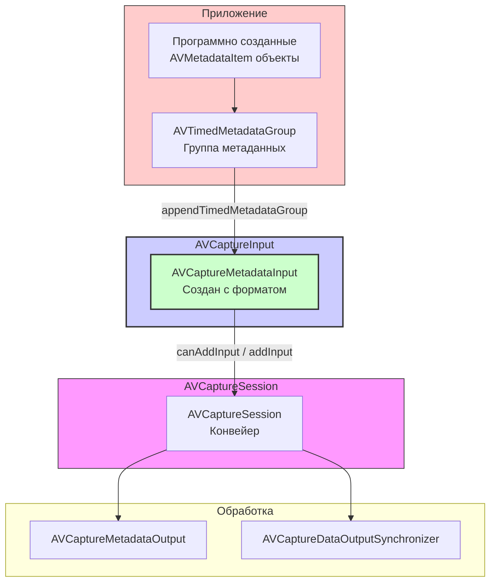

#avfoundation #capture #input #metadata #avcapturemetadatainput #timed-metadata #core-media

---
## AVCaptureMetadataInput

### Определение
**AVCaptureMetadataInput** — это конкретный подкласс абстрактного класса [[AVCaptureInput]] во фреймворке AVFoundation, который позволяет приложению программно предоставлять синхронизированные по времени метаданные непосредственно в сессию захвата ([[AVCaptureSession]]), как если бы они поступали от реального устройства захвата . Этот класс был представлен в iOS 9.0 как часть инфраструктуры для работы с дополнительными данными в [[AVFoundation]] .

Простыми словами, если AVCaptureMetadataOutput получает метаданные из видеопотока, то `AVCaptureMetadataInput` делает обратное — позволяет разработчику **внедрять собственные метаданные** в конвейер обработки AVFoundation.

### Зачем это знать iOS-разработчику?
1.  **Создание тестовых данных:** Позволяет симулировать метаданные для тестирования приложений без необходимости использования живого видео .
2.  **Синтез метаданных:** Генерация собственных временных метаданных (например, данные с датчиков, пользовательские аннотации) и их синхронизация с видео/аудио потоками .
3.  **Интеграция с синхронизированным захватом:** Работает в паре с [[AVCaptureDataOutputSynchronizer]] для согласованной доставки данных из нескольких выходов .
4.  **Обработка пользовательских форматов:** Возможность подавать метаданные в форматах, определенных через `CMFormatDescription`, в систему захвата .

---

### Архитектура и место в AVCaptureSession

`AVCaptureMetadataInput` подключается к сессии аналогично другим входам, но вместо аппаратного устройства он получает данные от приложения через метод `appendTimedMetadataGroup`.



### Ключевые методы и свойства

#### Создание экземпляра
- `init(formatDescription:clock:)` — создает вход с указанным форматом метаданных и тактовым генератором для синхронизации времени .
- `metadataInputWithFormatDescription:clock:` — классовый метод для создания экземпляра .

#### Предоставление данных
- `appendTimedMetadataGroup(_:error:)` — добавляет группу метаданных с временными метками в сессию . Может вернуть ошибку, если данные не могут быть обработаны.

#### Свойства (унаследованные)
- `ports` — массив портов входа (у `AVCaptureMetadataInput` обычно один порт для метаданных) .

---

### AVCaptureMetadataInput vs Другие Входы

| Характеристика      | [[AVCaptureMetadataInput]]               | [[AVCaptureDeviceInput]]                 | [[AVCaptureFileInput]]         |
| ------------------- | ---------------------------------------- | ---------------------------------------- | ------------------------------ |
| **Источник данных** | Программно созданные метаданные          | Физическое устройство (камера, микрофон) | Медиафайл                      |
| **Тип данных**      | Временные метаданные                     | Видео, аудио                             | Видео, аудио                   |
| **Назначение**      | Внедрение собственных метаданных в поток | Захват живых данных                      | Чтение из файла                |
| **Ключевой метод**  | `appendTimedMetadataGroup`               | Нет (данные поступают автоматически)     | Нет (данные читаются из файла) |

---

### Примеры использования

#### Уровень 1: Создание простого входа для метаданных
Этот пример демонстрирует минимальную настройку `AVCaptureMetadataInput` .

```swift
import AVFoundation
import CoreMedia

class MetadataInputViewController: UIViewController {
    var captureSession: AVCaptureSession!
    var metadataInput: AVCaptureMetadataInput?
    let processingQueue = DispatchQueue(label: "metadataQueue")

    override func viewDidLoad() {
        super.viewDidLoad()
        setupMetadataInput()
    }

    private func setupMetadataInput() {
        captureSession = AVCaptureSession()

        // 1. Определяем формат метаданных
        // Для простоты используем пустой формат, но в реальности нужно создать CMFormatDescription
        var formatDescription: CMFormatDescription?
        // Здесь должен быть код для создания CMFormatDescription для вашего типа метаданных

        // 2. Создаем тактовый генератор (используем основной хост-тайм)
        let clock = CMClockGetHostTimeClock()

        // 3. Создаем вход для метаданных
        do {
            metadataInput = try AVCaptureMetadataInput(formatDescription: formatDescription!, clock: clock)
            if captureSession.canAddInput(metadataInput!) {
                captureSession.addInput(metadataInput!)
                print("Metadata input добавлен")
            }
        } catch {
            print("Ошибка создания metadata input: \(error.localizedDescription)")
        }
    }
}
```

#### Уровень 2: Добавление метаданных в сессию
Пример добавления временной группы метаданных .

```swift
import AVFoundation
import CoreMedia

class MetadataInjectionViewController: UIViewController {
    var metadataInput: AVCaptureMetadataInput?

    func injectMetadata() {
        // 1. Создаем элементы метаданных
        let metadataItem = AVMutableMetadataItem()
        metadataItem.key = "com.example.mykey" as NSString
        metadataItem.keySpace = .quickTimeMetadata
        metadataItem.value = "Пример значения" as NSString
        metadataItem.dataType = kCMMetadataBaseDataType_UTF8 as String

        // 2. Создаем временную группу с текущим временем
        let currentTime = CMClockGetTime(CMClockGetHostTimeClock())
        let duration = CMTime(seconds: 1, preferredTimescale: 600)
        let timeRange = CMTimeRange(start: currentTime, duration: duration)
        let metadataGroup = AVTimedMetadataGroup(items: [metadataItem], timeRange: timeRange)

        // 3. Добавляем группу в сессию через вход
        guard let input = metadataInput else { return }

        do {
            try input.appendTimedMetadataGroup(metadataGroup)
            print("Метаданные успешно добавлены")
        } catch {
            print("Ошибка добавления метаданных: \(error.localizedDescription)")
        }
    }

    // Регулярная инъекция метаданных
    func startPeriodicInjection() {
        Timer.scheduledTimer(withTimeInterval: 1.0, repeats: true) { _ in
            self.injectMetadata()
        }
    }
}
```

#### Уровень 3: Интеграция с [[AVCaptureDataOutputSynchronizer]]
Использование метаданных в синхронизированном захвате данных .

```swift
import AVFoundation

class SynchronizedCaptureViewController: UIViewController,
                                          AVCaptureVideoDataOutputSampleBufferDelegate {
    var captureSession: AVCaptureSession!
    var metadataInput: AVCaptureMetadataInput!
    var videoOutput: AVCaptureVideoDataOutput!
    var dataOutputSynchronizer: AVCaptureDataOutputSynchronizer!

    override func viewDidLoad() {
        super.viewDidLoad()
        setupSynchronizedCapture()
    }

    private func setupSynchronizedCapture() {
        captureSession = AVCaptureSession()

        // 1. Добавляем видео вход (например, с камеры)
        guard let videoDevice = AVCaptureDevice.default(for: .video),
              let videoInput = try? AVCaptureDeviceInput(device: videoDevice) else { return }
        captureSession.addInput(videoInput)

        // 2. Создаем и добавляем metadata input
        // ... (как в примере Level 1)

        // 3. Создаем выходы
        videoOutput = AVCaptureVideoDataOutput()
        videoOutput.setSampleBufferDelegate(self, queue: DispatchQueue(label: "videoQueue"))
        captureSession.addOutput(videoOutput)

        let metadataOutput = AVCaptureMetadataOutput()
        captureSession.addOutput(metadataOutput)

        // 4. Создаем синхронизатор для согласованной доставки данных
        dataOutputSynchronizer = AVCaptureDataOutputSynchronizer(outputs: [videoOutput, metadataOutput])

        // 5. Запускаем сессию
        captureSession.startRunning()
    }

    // Метод делегата для получения синхронизированных данных
    // (требуется реализация AVCaptureDataOutputSynchronizerDelegate)
}
```

#### Уровень 4: Создание CMFormatDescription для метаданных
Более сложный пример с правильным созданием формата метаданных .

```swift
import CoreMedia

func createMetadataFormatDescription() -> CMFormatDescription? {
    var formatDescription: CMFormatDescription?

    // Параметры для формата метаданных
    let spec: [String: Any] = [
        kCMMetadataFormatDescriptionKey_Namespace as String: "com.example.metadata",
        kCMMetadataFormatDescriptionKey_DataType as String: kCMMetadataBaseDataType_UTF8
    ]

    // Создаем формат метаданных
    CMMetadataFormatDescriptionCreateWithMetadataSpecifications(
        allocator: kCFAllocatorDefault,
        metadataType: kCMMetadataFormatType_Boxed,
        metadataSpecifications: [spec] as CFArray,
        formatDescriptionOut: &formatDescription
    )

    return formatDescription
}
```

---

### Важные нюансы и Best Practices

#### 1. **Поддерживаемые платформы**
`AVCaptureMetadataInput` доступен на [[iOS]] 9.0+, iPadOS 9.0+, Mac Catalyst 14.0+ и tvOS 17.0+ . Недоступен на watchOS .

#### 2. **Форматы метаданных**
Для создания `AVCaptureMetadataInput` необходимо корректно настроить `CMFormatDescription`, соответствующий вашим данным. Apple поддерживает различные типы метаданных, включая QuickTime Metadata и пользовательские форматы .

#### 3. **Синхронизация времени**
Использование правильного тактового генератора (clock) критично для синхронизации метаданных с другими потоками в сессии. Обычно используется `CMClockGetHostTimeClock()` .

#### 4. **Обработка ошибок**
Метод `appendTimedMetadataGroup` может вернуть ошибку, если:
- Формат данных не соответствует ожидаемому
- Сессия не запущена
- Вход отключен или удален из сессии

#### 5. **Производительность**
При регулярной инъекции метаданных следите за частотой добавления групп. Слишком частая инъекция может перегрузить систему.

#### 6. **Интеграция с другими выходами**
`AVCaptureMetadataInput` особенно полезен при использовании с `AVCaptureDataOutputSynchronizer`, который обеспечивает временную синхронизацию метаданных с видео/аудио данными .

### Итог
**AVCaptureMetadataInput** — это специализированный, но мощный инструмент для программного внедрения метаданных в конвейер AVFoundation. Он открывает возможности для:
- **Тестирования и симуляции** метаданных без реального оборудования .
- **Создания синтезированных потоков** метаданных для AR, аналитики и специальных эффектов .
- **Интеграции с синхронизированным захватом** данных .

Хотя это нишевый класс, его понимание необходимо для продвинутой работы с метаданными в AVFoundation и создания комплексных решений для обработки мультимедиа.