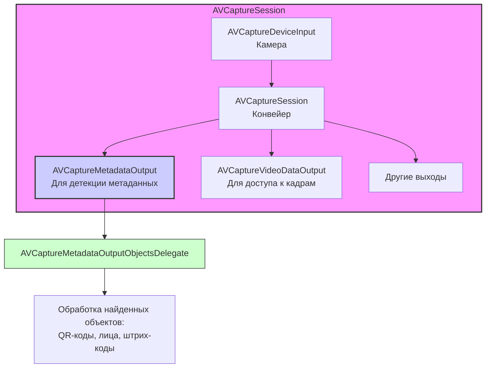

#avfoundation #metadata #qr #barcode #face-detection #vision #capture #real-time

---
### Определение
**AVCaptureMetadataOutput** — это класс фреймворка [[AVFoundation]], который обеспечивает захват и обработку метаданных, связанных с видеопотоком, в реальном времени. Он позволяет обнаруживать и извлекать различные типы метаданных непосредственно из кадров видео, поступающих с камеры устройства, без необходимости останавливать видеопоток или выполнять сложную обработку изображений вручную .

В отличие от более общего фреймворка Vision, `AVCaptureMetadataOutput` является частью конвейера захвата ([[AVCaptureSession]]) и предоставляет оптимизированный, аппаратно-ускоренный способ детекции определенных типов данных.

### Зачем это знать [[iOS]]-разработчику?
1.  **Сканирование QR-кодов и штрих-кодов:** Самое популярное применение. Позволяет создавать приложения-сканеры для магазинов, билетов, пропусков.
2.  **Детекция лиц:** Обнаружение лиц в кадре для автофокуса, создания масок, подсчета людей.
3.  **Распознавание текста (на базовом уровне):** В связке с Vision можно делать распознавание текста.
4.  **Обнаружение объектов:** Например, поиск прямоугольников (документов) в кадре.
5.  **Создание интерактивных приложений:** Приложения, реагирующие на появление определенных объектов в поле зрения камеры.

---

### Архитектура и место в AVCaptureSession

`AVCaptureMetadataOutput` добавляется в сессию как отдельный выход (output). Когда видео захватывается, AVFoundation анализирует кадры и, если находит объекты метаданных, передает их делегату.



### Ключевые компоненты

1.  **AVCaptureMetadataOutput:** Сам объект, который нужно добавить в сессию.
2.  **[[AVCaptureMetadataOutputObjectsDelegate]]:** Протокол делегата, который получает обнаруженные метаданные. Содержит один основной метод:
    - `metadataOutput(_:didOutput:from:)` — вызывается, когда обнаружены новые объекты метаданных.
3.  **AVMetadataObject:** Абстрактный базовый класс для всех типов метаданных. Конкретные типы:
    - `AVMetadataMachineReadableCodeObject` — для QR-кодов и штрих-кодов (содержит строку с данными и границы).
    - `AVMetadataFaceObject` — для обнаруженных лиц (содержит координаты, угол поворота).
    - Другие: `AVMetadataHumanBodyObject`, `AVMetadataCatBodyObject`, `AVMetadataDogBodyObject` (с iOS 13), `AVMetadataSalientObject` и т.д.
4.  **metadataObjectTypes:** Массив типов метаданных, которые мы хотим обнаруживать (например, `[.qr, .ean13, .face]`).

### Поддерживаемые типы метаданных

AVFoundation поддерживает множество типов:

**Штрих-коды:**
- `.qr` — QR-коды
- `.ean13`, `.ean8` — товарные штрих-коды EAN-13, EAN-8
- `.pdf417` — PDF417 (используется в билетах, документах)
- `.aztec` — Aztec-коды
- `.code128`, `.code39`, `.code93` — Code 128, 39, 93
- `.interleaved2of5` — Interleaved 2 of 5
- `.itf14` — ITF-14
- `.upce` — UPC-E

**Объекты:**
- `.face` — лица
- `.humanBody` — тело человека ([[iOS]] 13+)
- `.catBody`, `.dogBody` — тела животных (iOS 13+)
- `.salientObject` — заметные объекты

**Текст:**
- `.text` — базовое обнаружение текста (ограничено, лучше Vision)

---

### Примеры от простого к сложному

#### Уровень 0: Настройка Info.plist (разрешения)
Для доступа к камере обязательно нужно добавить описание в `Info.plist`.

- **NSCameraUsageDescription** — "Для сканирования QR-кодов и детекции объектов"

#### Уровень 1: Простой сканер QR-кодов
Классический пример — приложение, которое сканирует QR-код и показывает его содержимое.

```swift
import UIKit
import AVFoundation

class QRScannerViewController: UIViewController, AVCaptureMetadataOutputObjectsDelegate {

    var captureSession: AVCaptureSession!
    var previewLayer: AVCaptureVideoPreviewLayer!
    var qrCodeFrameView: UIView?

    override func viewDidLoad() {
        super.viewDidLoad()
        view.backgroundColor = .black
        setupScanner()
    }

    private func setupScanner() {
        // 1. Создаем сессию
        captureSession = AVCaptureSession()

        // 2. Получаем устройство камеры (заднюю)
        guard let videoCaptureDevice = AVCaptureDevice.default(for: .video) else {
            print("Камера не найдена")
            return
        }

        // 3. Создаем инпут
        guard let videoInput = try? AVCaptureDeviceInput(device: videoCaptureDevice),
              captureSession.canAddInput(videoInput) else {
            print("Не удалось добавить видео вход")
            return
        }
        captureSession.addInput(videoInput)

        // 4. Создаем и настраиваем MetadataOutput
        let metadataOutput = AVCaptureMetadataOutput()
        
        if captureSession.canAddOutput(metadataOutput) {
            captureSession.addOutput(metadataOutput)
            
            // Устанавливаем делегат и очередь (главная, так как будем обновлять UI)
            metadataOutput.setMetadataObjectsDelegate(self, queue: DispatchQueue.main)
            
            // Указываем типы метаданных (только QR)
            metadataOutput.metadataObjectTypes = [.qr]
        } else {
            print("Не удалось добавить metadata output")
            return
        }

        // 5. Создаем PreviewLayer
        previewLayer = AVCaptureVideoPreviewLayer(session: captureSession)
        previewLayer.frame = view.bounds
        previewLayer.videoGravity = .resizeAspectFill
        view.layer.addSublayer(previewLayer)

        // 6. Добавляем рамку для выделения QR-кода
        qrCodeFrameView = UIView()
        qrCodeFrameView?.layer.borderColor = UIColor.green.cgColor
        qrCodeFrameView?.layer.borderWidth = 2
        qrCodeFrameView?.frame = CGRect.zero
        view.addSubview(qrCodeFrameView!)
        view.bringSubviewToFront(qrCodeFrameView!)

        // 7. Запускаем сессию (в фоне)
        DispatchQueue.global(qos: .userInitiated).async { [weak self] in
            self?.captureSession.startRunning()
        }
    }

    // MARK: - AVCaptureMetadataOutputObjectsDelegate
    func metadataOutput(_ output: AVCaptureMetadataOutput, didOutput metadataObjects: [AVMetadataObject], from connection: AVCaptureConnection) {
        
        // Скрываем рамку, если ничего не найдено
        qrCodeFrameView?.frame = CGRect.zero

        // Проверяем, есть ли объекты
        guard let metadataObject = metadataObjects.first else { return }

        // Преобразуем координаты из координат камеры в координаты previewLayer
        guard let readableObject = previewLayer.transformedMetadataObject(for: metadataObject) as? AVMetadataMachineReadableCodeObject else { return }

        // Показываем рамку вокруг QR-кода
        qrCodeFrameView?.frame = readableObject.bounds

        // Получаем строковое значение
        if let stringValue = readableObject.stringValue {
            // Нашли QR-код!
            print("QR Code: \(stringValue)")
            
            // Останавливаем сессию (опционально)
            captureSession.stopRunning()
            
            // Показываем алерт с результатом
            showAlert(with: stringValue)
        }
    }

    private func showAlert(with message: String) {
        let alert = UIAlertController(title: "QR-код", message: message, preferredStyle: .alert)
        alert.addAction(UIAlertAction(title: "OK", style: .default) { [weak self] _ in
            // Возобновляем сканирование
            DispatchQueue.global(qos: .userInitiated).async {
                self?.captureSession.startRunning()
            }
        })
        present(alert, animated: true)
    }

    override func viewWillDisappear(_ animated: Bool) {
        super.viewWillDisappear(animated)
        // Останавливаем сессию при уходе с экрана
        DispatchQueue.global(qos: .background).async { [weak self] in
            self?.captureSession.stopRunning()
        }
    }
}
```

#### Уровень 2: Сканер нескольких типов штрих-кодов
Расширим пример для поддержки товарных штрих-кодов EAN-13 и Code 128.

```swift
import UIKit
import AVFoundation

class MultiBarcodeScannerViewController: UIViewController, AVCaptureMetadataOutputObjectsDelegate {

    var captureSession: AVCaptureSession!
    var previewLayer: AVCaptureVideoPreviewLayer!
    
    let supportedCodeTypes = [AVMetadataObject.ObjectType.ean13,
                              AVMetadataObject.ObjectType.ean8,
                              AVMetadataObject.ObjectType.code128,
                              AVMetadataObject.ObjectType.code39,
                              AVMetadataObject.ObjectType.qr,
                              AVMetadataObject.ObjectType.pdf417]

    override func viewDidLoad() {
        super.viewDidLoad()
        setupScanner()
    }

    private func setupScanner() {
        captureSession = AVCaptureSession()

        guard let videoCaptureDevice = AVCaptureDevice.default(for: .video),
              let videoInput = try? AVCaptureDeviceInput(device: videoCaptureDevice),
              captureSession.canAddInput(videoInput) else { return }
        captureSession.addInput(videoInput)

        let metadataOutput = AVCaptureMetadataOutput()
        
        if captureSession.canAddOutput(metadataOutput) {
            captureSession.addOutput(metadataOutput)
            metadataOutput.setMetadataObjectsDelegate(self, queue: DispatchQueue.main)
            metadataOutput.metadataObjectTypes = supportedCodeTypes
        }

        previewLayer = AVCaptureVideoPreviewLayer(session: captureSession)
        previewLayer.frame = view.bounds
        previewLayer.videoGravity = .resizeAspectFill
        view.layer.addSublayer(previewLayer)

        DispatchQueue.global(qos: .userInitiated).async { [weak self] in
            self?.captureSession.startRunning()
        }
    }

    func metadataOutput(_ output: AVCaptureMetadataOutput, didOutput metadataObjects: [AVMetadataObject], from connection: AVCaptureConnection) {
        
        guard let metadataObject = metadataObjects.first,
              let readableObject = previewLayer.transformedMetadataObject(for: metadataObject) as? AVMetadataMachineReadableCodeObject,
              let stringValue = readableObject.stringValue else { return }

        // Вибрация при обнаружении
        AudioServicesPlaySystemSound(SystemSoundID(kSystemSoundID_Vibrate))
        
        // Определяем тип кода
        let codeType = readableObject.type
        print("Найден код типа \(codeType.rawValue): \(stringValue)")
        
        // Можно добавить звуковой сигнал
        // AudioServicesPlaySystemSound(1109) // Звук фотоаппарата
    }
}
```

#### Уровень 3: Детекция лиц (Face Detection)
Обнаружение лиц в кадре и отрисовка квадратов вокруг них.

```swift
import UIKit
import AVFoundation

class FaceDetectionViewController: UIViewController, AVCaptureMetadataOutputObjectsDelegate {

    var captureSession: AVCaptureSession!
    var previewLayer: AVCaptureVideoPreviewLayer!
    
    // Словарь для хранения слоев лиц (чтобы обновлять позиции)
    var faceLayers: [Int: CAShapeLayer] = [:]

    override func viewDidLoad() {
        super.viewDidLoad()
        setupFaceDetection()
    }

    private func setupFaceDetection() {
        captureSession = AVCaptureSession()
        captureSession.sessionPreset = .hd1280x720

        // Обычно для лиц лучше использовать фронтальную камеру
        guard let videoCaptureDevice = AVCaptureDevice.default(.builtInWideAngleCamera, for: .video, position: .front),
              let videoInput = try? AVCaptureDeviceInput(device: videoCaptureDevice),
              captureSession.canAddInput(videoInput) else { return }
        captureSession.addInput(videoInput)

        let metadataOutput = AVCaptureMetadataOutput()
        
        if captureSession.canAddOutput(metadataOutput) {
            captureSession.addOutput(metadataOutput)
            metadataOutput.setMetadataObjectsDelegate(self, queue: DispatchQueue.main)
            
            // Включаем детекцию лиц
            if metadataOutput.availableMetadataObjectTypes.contains(.face) {
                metadataOutput.metadataObjectTypes = [.face]
            }
        }

        previewLayer = AVCaptureVideoPreviewLayer(session: captureSession)
        previewLayer.frame = view.bounds
        previewLayer.videoGravity = .resizeAspectFill
        view.layer.addSublayer(previewLayer)

        DispatchQueue.global(qos: .userInitiated).async { [weak self] in
            self?.captureSession.startRunning()
        }
    }

    // MARK: - AVCaptureMetadataOutputObjectsDelegate
    func metadataOutput(_ output: AVCaptureMetadataOutput, didOutput metadataObjects: [AVMetadataObject], from connection: AVCaptureConnection) {
        
        // Создаем множество текущих ID лиц
        var currentFaceIDs = Set<Int>()

        for metadataObject in metadataObjects {
            if let faceObject = metadataObject as? AVMetadataFaceObject,
               let transformedFace = previewLayer.transformedMetadataObject(for: faceObject) as? AVMetadataFaceObject {
                
                let faceID = transformedFace.faceID
                currentFaceIDs.insert(faceID)
                
                // Рисуем или обновляем рамку для лица
                let faceRect = transformedFace.bounds
                drawFaceRect(at: faceRect, faceID: faceID)
                
                // Можно получить дополнительную информацию
                if transformedFace.hasRollAngle {
                    print("Face \(faceID) roll angle: \(transformedFace.rollAngle)")
                }
                if transformedFace.hasYawAngle {
                    print("Face \(faceID) yaw angle: \(transformedFace.yawAngle)")
                }
            }
        }

        // Удаляем рамки для лиц, которые больше не видны
        for faceID in faceLayers.keys {
            if !currentFaceIDs.contains(faceID) {
                faceLayers[faceID]?.removeFromSuperlayer()
                faceLayers.removeValue(forKey: faceID)
            }
        }
    }

    private func drawFaceRect(at rect: CGRect, faceID: Int) {
        let layer: CAShapeLayer
        
        if let existingLayer = faceLayers[faceID] {
            layer = existingLayer
        } else {
            layer = CAShapeLayer()
            layer.strokeColor = UIColor.green.cgColor
            layer.lineWidth = 3
            layer.fillColor = UIColor.clear.cgColor
            previewLayer?.addSublayer(layer)
            faceLayers[faceID] = layer
        }
        
        // Обновляем путь
        layer.path = UIBezierPath(rect: rect).cgPath
    }
}
```

#### Уровень 4: Комбинирование с [[AVCaptureVideoDataOutput]] для обработки через Vision
Vision — более мощный фреймворк для анализа изображений. Но его можно комбинировать с [[AVFoundation]].

```swift
import UIKit
import AVFoundation
import Vision

class VisionQRScannerViewController: UIViewController, AVCaptureVideoDataOutputSampleBufferDelegate {

    var captureSession: AVCaptureSession!
    var previewLayer: AVCaptureVideoPreviewLayer!
    let videoQueue = DispatchQueue(label: "videoQueue")
    
    // Запрос Vision для обнаружения QR-кодов
    private lazy var qrDetectionRequest: VNDetectBarcodesRequest = {
        let request = VNDetectBarcodesRequest { [weak self] request, error in
            self?.handleDetectedBarcodes(request: request, error: error)
        }
        request.symbologies = [.QR] // Только QR
        return request
    }()

    override func viewDidLoad() {
        super.viewDidLoad()
        setupCamera()
    }

    private func setupCamera() {
        captureSession = AVCaptureSession()
        captureSession.sessionPreset = .hd1280x720

        guard let camera = AVCaptureDevice.default(for: .video),
              let input = try? AVCaptureDeviceInput(device: camera),
              captureSession.canAddInput(input) else { return }
        captureSession.addInput(input)

        // VideoDataOutput для доступа к кадрам
        let videoOutput = AVCaptureVideoDataOutput()
        videoOutput.videoSettings = [kCVPixelBufferPixelFormatTypeKey as String: kCVPixelFormatType_32BGRA]
        videoOutput.setSampleBufferDelegate(self, queue: videoQueue)
        
        if captureSession.canAddOutput(videoOutput) {
            captureSession.addOutput(videoOutput)
        }

        previewLayer = AVCaptureVideoPreviewLayer(session: captureSession)
        previewLayer.frame = view.bounds
        previewLayer.videoGravity = .resizeAspectFill
        view.layer.addSublayer(previewLayer)

        DispatchQueue.global(qos: .userInitiated).async { [weak self] in
            self?.captureSession.startRunning()
        }
    }

    // MARK: - AVCaptureVideoDataOutputSampleBufferDelegate
    func captureOutput(_ output: AVCaptureOutput, didOutput sampleBuffer: CMSampleBuffer, from connection: AVCaptureConnection) {
        // Получаем пиксельный буфер
        guard let pixelBuffer = CMSampleBufferGetImageBuffer(sampleBuffer) else { return }
        
        // Создаем запрос Vision
        let requestHandler = VNImageRequestHandler(cvPixelBuffer: pixelBuffer, orientation: .up, options: [:])
        
        do {
            try requestHandler.perform([qrDetectionRequest])
        } catch {
            print("Ошибка Vision: \(error)")
        }
    }

    private func handleDetectedBarcodes(request: VNRequest, error: Error?) {
        guard let observations = request.results as? [VNBarcodeObservation] else { return }
        
        for observation in observations {
            if let payload = observation.payloadStringValue {
                print("Vision нашел QR: \(payload)")
                
                // Здесь можно получить boundingBox в координатах изображения
                // и преобразовать их в координаты previewLayer при необходимости
            }
        }
    }
}
```

#### Уровень 5: Детекция прямоугольников (документов) с Vision
Обнаружение документов в кадре.

```swift
import UIKit
import AVFoundation
import Vision

class RectangleDetectionViewController: UIViewController, AVCaptureVideoDataOutputSampleBufferDelegate {

    var captureSession: AVCaptureSession!
    var previewLayer: AVCaptureVideoPreviewLayer!
    let videoQueue = DispatchQueue(label: "videoQueue")
    
    var rectangleLayer = CAShapeLayer()

    override func viewDidLoad() {
        super.viewDidLoad()
        setupRectangleLayer()
        setupCamera()
    }

    private func setupRectangleLayer() {
        rectangleLayer.strokeColor = UIColor.green.cgColor
        rectangleLayer.lineWidth = 5
        rectangleLayer.fillColor = UIColor.clear.cgColor
        rectangleLayer.shadowColor = UIColor.green.cgColor
        rectangleLayer.shadowOpacity = 0.3
        rectangleLayer.shadowRadius = 10
    }

    private func setupCamera() {
        captureSession = AVCaptureSession()
        captureSession.sessionPreset = .hd1920x1080

        guard let camera = AVCaptureDevice.default(for: .video),
              let input = try? AVCaptureDeviceInput(device: camera),
              captureSession.canAddInput(input) else { return }
        captureSession.addInput(input)

        let videoOutput = AVCaptureVideoDataOutput()
        videoOutput.videoSettings = [kCVPixelBufferPixelFormatTypeKey as String: kCVPixelFormatType_32BGRA]
        videoOutput.setSampleBufferDelegate(self, queue: videoQueue)
        
        if captureSession.canAddOutput(videoOutput) {
            captureSession.addOutput(videoOutput)
        }

        previewLayer = AVCaptureVideoPreviewLayer(session: captureSession)
        previewLayer.frame = view.bounds
        previewLayer.videoGravity = .resizeAspectFill
        view.layer.addSublayer(previewLayer)
        view.layer.addSublayer(rectangleLayer)

        DispatchQueue.global(qos: .userInitiated).async { [weak self] in
            self?.captureSession.startRunning()
        }
    }

    func captureOutput(_ output: AVCaptureOutput, didOutput sampleBuffer: CMSampleBuffer, from connection: AVCaptureConnection) {
        guard let pixelBuffer = CMSampleBufferGetImageBuffer(sampleBuffer) else { return }
        
        // Запрос на обнаружение прямоугольников
        let request = VNDetectRectanglesRequest { [weak self] request, error in
            self?.handleDetectedRectangles(request: request, error: error)
        }
        
        // Настройки запроса
        request.minimumAspectRatio = 0.3
        request.maximumAspectRatio = 1.0
        request.minimumSize = 0.2
        request.maximumObservations = 1
        
        let handler = VNImageRequestHandler(cvPixelBuffer: pixelBuffer, options: [:])
        
        do {
            try handler.perform([request])
        } catch {
            print("Ошибка: \(error)")
        }
    }

    private func handleDetectedRectangles(request: VNRequest, error: Error?) {
        guard let observations = request.results as? [VNRectangleObservation] else { return }
        
        DispatchQueue.main.async { [weak self] in
            guard let self = self else { return }
            
            // Убираем старый прямоугольник
            self.rectangleLayer.path = nil
            
            if let observation = observations.first {
                // Преобразуем координаты из Vision (нормализованные) в координаты previewLayer
                let topLeft = CGPoint(x: observation.topLeft.x, y: 1 - observation.topLeft.y)
                let topRight = CGPoint(x: observation.topRight.x, y: 1 - observation.topRight.y)
                let bottomRight = CGPoint(x: observation.bottomRight.x, y: 1 - observation.bottomRight.y)
                let bottomLeft = CGPoint(x: observation.bottomLeft.x, y: 1 - observation.bottomLeft.y)
                
                let path = UIBezierPath()
                path.move(to: self.previewLayer.layerPointConverted(fromCaptureDevicePoint: topLeft))
                path.addLine(to: self.previewLayer.layerPointConverted(fromCaptureDevicePoint: topRight))
                path.addLine(to: self.previewLayer.layerPointConverted(fromCaptureDevicePoint: bottomRight))
                path.addLine(to: self.previewLayer.layerPointConverted(fromCaptureDevicePoint: bottomLeft))
                path.close()
                
                self.rectangleLayer.path = path.cgPath
            }
        }
    }
}
```

---

### Важные нюансы и Best Practices

#### 1. **Координаты и преобразование**
Объекты метаданных возвращаются в координатах, соответствующих ориентации камеры (landscape). Для правильного отображения на экране всегда используйте `previewLayer.transformedMetadataObject(for:)` .

```swift
if let transformedObject = previewLayer.transformedMetadataObject(for: metadataObject) as? AVMetadataMachineReadableCodeObject {
    // Используем transformedObject.bounds для отрисовки
}
```

#### 2. **Производительность**
- Задавайте только те типы метаданных, которые вам нужны. Не запрашивайте все сразу.
- Детекция лиц и тел может потреблять много ресурсов. Используйте минимально необходимый `sessionPreset`.
- Для сложного анализа (текст, лица с эмоциями) используйте Vision, так как он предоставляет более точные результаты, хотя и может быть медленнее.

#### 3. **Область интереса (Region of Interest)**
Можно ограничить область сканирования для повышения производительности и точности:

```swift
let metadataOutput = AVCaptureMetadataOutput()
metadataOutput.rectOfInterest = CGRect(x: 0.2, y: 0.3, width: 0.6, height: 0.4) // Нормализованные координаты
```
**Важно:** rectOfInterest задается в координатах, соответствующих ориентации камеры (как правило, landscape). При использовании с previewLayer нужно это учитывать.

#### 4. **Совместимость типов**
Не все устройства поддерживают все типы метаданных. Всегда проверяйте через `metadataOutput.availableMetadataObjectTypes`.

```swift
let availableTypes = metadataOutput.availableMetadataObjectTypes
print("Доступные типы: \(availableTypes)")
```

#### 5. **Несколько выходов**
`AVCaptureMetadataOutput` можно использовать вместе с другими выходами (например, `AVCaptureVideoDataOutput` для записи видео). Данные будут синхронизированы.

#### 6. **Точность детекции лиц**
Для более точной детекции лиц (с эмоциями, контуром) используйте Vision:

```swift
let faceDetectionRequest = VNDetectFaceLandmarksRequest { ... }
```

#### 7. **Звук и вибрация**
Для улучшения UX добавляйте обратную связь при обнаружении:

```swift
// Вибрация
AudioServicesPlaySystemSound(SystemSoundID(kSystemSoundID_Vibrate))

// Звук фотоаппарата
AudioServicesPlaySystemSound(1108) 
```

#### 8. **Остановка сессии**
Всегда останавливайте сессию, когда она не нужна, чтобы экономить батарею.

### Итог
**AVCaptureMetadataOutput** — это мощный и простой способ добавления функций детекции в реальном времени в ваше приложение. Основные возможности:
- **Штрих-коды и QR-коды:** сканирование покупок, билетов, пропусков.
- **Детекция лиц:** для автофокуса, масок, подсчета людей.
- **Обнаружение объектов:** документов, животных.

Ключевые навыки: правильная настройка `AVCaptureSession`, обработка координат через `transformedMetadataObject`, выбор релевантных типов метаданных и комбинация с Vision для более сложных задач.