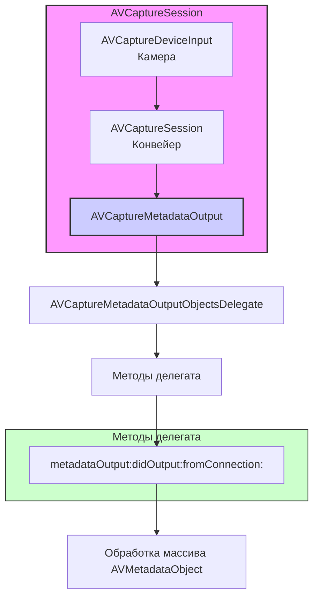

#avfoundation #metadata #delegate #qr #barcode #face-detection #real-time #capture`

---
### Определение
**AVCaptureMetadataOutputObjectsDelegate** — это протокол во фреймворке [[AVFoundation]], который определяет методы для обработки метаданных, обнаруженных в видеопотоке в реальном времени. Он является основным механизмом получения результатов детекции от [[AVCaptureMetadataOutput]] .

Когда вы добавляете `AVCaptureMetadataOutput` в сессию захвата ([[AVCaptureSession]]) и устанавливаете делегат, этот протокол позволяет вашему приложению получать уведомления о каждом обнаруженном объекте метаданных (QR-коды, штрих-коды, лица и т.д.) по мере их появления в кадре.

### Зачем это знать [[iOS]]-разработчику?
1.  **Обработка результатов сканирования:** Получение данных из QR-кодов и штрих-кодов.
2.  **Реакция на появление объектов:** Обновление UI при обнаружении лиц или других объектов.
3.  **Синхронизация с видеопотоком:** Координаты объектов в реальном времени для отрисовки рамок или масок.
4.  **Управление процессом сканирования:** Возможность остановить сканирование после первого успешного результата.
5.  **Множественная детекция:** Обработка нескольких объектов одновременно (например, несколько QR-кодов в кадре).

---

### Архитектура и место в AVCaptureSession



### Ключевой метод протокола

Протокол содержит один обязательный метод:

#### `metadataOutput(_:didOutput:from:)`
**Назначение:** Вызывается каждый раз, когда в видеопотоке обнаружены новые объекты метаданных.

```swift
func metadataOutput(_ output: AVCaptureMetadataOutput, 
                    didOutput metadataObjects: [AVMetadataObject], 
                    from connection: AVCaptureConnection)
```

**Параметры:**
- `output`: Ссылка на объект `AVCaptureMetadataOutput`, который сгенерировал метаданные.
- `metadataObjects`: Массив обнаруженных объектов метаданных. Может быть пустым, если объекты исчезли из кадра.
- `connection`: Объект [[AVCaptureConnection]], представляющий соединение между выходом и устройством.

**Важно:** Этот метод может вызываться очень часто (до 30-60 раз в секунду), поэтому обработка должна быть быстрой.

---

### Типы объектов метаданных

Объекты в массиве `metadataObjects` являются экземплярами подклассов `AVMetadataObject`:

1.  **[[AVMetadataMachineReadableCodeObject]]** — для кодов (QR, штрих-коды и т.д.)
    - `stringValue`: Декодированная строка
    - `bounds`: Прямоугольник объекта в координатах камеры
    - `corners`: Угловые точки для точной отрисовки

2.  **[[AVMetadataFaceObject]]** — для лиц
    - `faceID`: Уникальный идентификатор лица
    - `rollAngle`, `yawAngle`: Углы поворота
    - `bounds`: Прямоугольник лица

3.  **[[AVMetadataHumanBodyObject]]**, **[[AVMetadataCatBodyObject]]**, **[[AVMetadataDogBodyObject]]** — для тел (iOS 13+)
    - Координаты и идентификаторы

4.  **AVMetadataSalientObject** — для заметных объектов

---

### Преобразование координат

Объекты метаданных возвращаются в координатах, соответствующих ориентации камеры (обычно landscape). Для правильного отображения на экране необходимо преобразовать координаты с помощью `previewLayer`:

```swift
if let transformedObject = previewLayer.transformedMetadataObject(for: metadataObject) as? AVMetadataMachineReadableCodeObject {
    // Используем transformedObject.bounds для отрисовки на экране
}
```

---

### Примеры от простого к сложному

#### Уровень 0: Настройка Info.plist и базовой структуры
Для доступа к камере обязательно нужно добавить описание в `Info.plist`.

- **NSCameraUsageDescription** — "Для сканирования QR-кодов и детекции объектов"

Базовая структура контроллера:

```swift
import UIKit
import AVFoundation

class MetadataDelegateViewController: UIViewController {
    
    var captureSession: AVCaptureSession!
    var previewLayer: AVCaptureVideoPreviewLayer!
    
    override func viewDidLoad() {
        super.viewDidLoad()
        checkPermissionsAndSetup()
    }
    
    private func checkPermissionsAndSetup() {
        switch AVCaptureDevice.authorizationStatus(for: .video) {
        case .authorized:
            setupCamera()
        case .notDetermined:
            AVCaptureDevice.requestAccess(for: .video) { granted in
                if granted {
                    DispatchQueue.main.async {
                        self.setupCamera()
                    }
                }
            }
        default:
            print("Нет доступа к камере")
        }
    }
    
    private func setupCamera() {
        // Будет реализовано в примерах
    }
    
    override func viewWillDisappear(_ animated: Bool) {
        super.viewWillDisappear(animated)
        DispatchQueue.global(qos: .background).async { [weak self] in
            self?.captureSession.stopRunning()
        }
    }
}
```

#### Уровень 1: Простая реализация делегата для QR-кодов
Базовый сканер QR-кодов с обработкой результатов.

```swift
import UIKit
import AVFoundation

class SimpleQRScannerViewController: MetadataDelegateViewController, AVCaptureMetadataOutputObjectsDelegate {
    
    let resultLabel = UILabel()
    
    override func viewDidLoad() {
        super.viewDidLoad()
        setupUI()
    }
    
    private func setupUI() {
        resultLabel.frame = CGRect(x: 20, y: 100, width: view.bounds.width - 40, height: 50)
        resultLabel.backgroundColor = UIColor.black.withAlphaComponent(0.7)
        resultLabel.textColor = .white
        resultLabel.textAlignment = .center
        resultLabel.layer.cornerRadius = 10
        resultLabel.clipsToBounds = true
        resultLabel.text = "Наведите на QR-код"
        view.addSubview(resultLabel)
    }
    
    override func setupCamera() {
        captureSession = AVCaptureSession()
        
        guard let videoCaptureDevice = AVCaptureDevice.default(for: .video),
              let videoInput = try? AVCaptureDeviceInput(device: videoCaptureDevice),
              captureSession.canAddInput(videoInput) else {
            print("Не удалось настроить камеру")
            return
        }
        captureSession.addInput(videoInput)
        
        let metadataOutput = AVCaptureMetadataOutput()
        
        if captureSession.canAddOutput(metadataOutput) {
            captureSession.addOutput(metadataOutput)
            
            // Устанавливаем делегат на главную очередь (для обновления UI)
            metadataOutput.setMetadataObjectsDelegate(self, queue: DispatchQueue.main)
            
            // Указываем типы метаданных (только QR)
            if metadataOutput.availableMetadataObjectTypes.contains(.qr) {
                metadataOutput.metadataObjectTypes = [.qr]
            } else {
                print("QR не поддерживается")
            }
        }
        
        previewLayer = AVCaptureVideoPreviewLayer(session: captureSession)
        previewLayer.frame = view.bounds
        previewLayer.videoGravity = .resizeAspectFill
        view.layer.insertSublayer(previewLayer, at: 0)
        
        // Запускаем сессию
        DispatchQueue.global(qos: .userInitiated).async { [weak self] in
            self?.captureSession.startRunning()
        }
    }
    
    // MARK: - AVCaptureMetadataOutputObjectsDelegate
    func metadataOutput(_ output: AVCaptureMetadataOutput, 
                       didOutput metadataObjects: [AVMetadataObject], 
                       from connection: AVCaptureConnection) {
        
        // Проверяем, есть ли объекты
        guard let metadataObject = metadataObjects.first else {
            resultLabel.text = "Наведите на QR-код"
            return
        }
        
        // Преобразуем в читаемый объект
        guard let readableObject = metadataObject as? AVMetadataMachineReadableCodeObject,
              let stringValue = readableObject.stringValue else {
            return
        }
        
        // Обновляем UI
        resultLabel.text = "Найден QR: \(stringValue)"
        
        // Вибрируем
        AudioServicesPlaySystemSound(SystemSoundID(kSystemSoundID_Vibrate))
        
        // Опционально: останавливаем сканирование после первого успеха
        captureSession.stopRunning()
        
        // Показываем алерт
        let alert = UIAlertController(title: "QR-код", 
                                      message: stringValue, 
                                      preferredStyle: .alert)
        alert.addAction(UIAlertAction(title: "OK", style: .default) { [weak self] _ in
            // Возобновляем сканирование
            DispatchQueue.global(qos: .userInitiated).async {
                self?.captureSession.startRunning()
            }
        })
        present(alert, animated: true)
    }
}
```

#### Уровень 2: Отрисовка рамки вокруг QR-кода
Добавляем визуальную обратную связь — рамку вокруг обнаруженного кода.

```swift
import UIKit
import AVFoundation

class QRScannerWithFrameViewController: MetadataDelegateViewController, AVCaptureMetadataOutputObjectsDelegate {
    
    var qrCodeFrameView: UIView?
    var lastFrame = CGRect.zero
    
    override func viewDidLoad() {
        super.viewDidLoad()
        setupFrameView()
    }
    
    private func setupFrameView() {
        qrCodeFrameView = UIView()
        qrCodeFrameView?.layer.borderColor = UIColor.green.cgColor
        qrCodeFrameView?.layer.borderWidth = 3
        qrCodeFrameView?.layer.cornerRadius = 8
        qrCodeFrameView?.frame = CGRect.zero
        view.addSubview(qrCodeFrameView!)
        view.bringSubviewToFront(qrCodeFrameView!)
    }
    
    override func setupCamera() {
        captureSession = AVCaptureSession()
        
        guard let videoCaptureDevice = AVCaptureDevice.default(for: .video),
              let videoInput = try? AVCaptureDeviceInput(device: videoCaptureDevice),
              captureSession.canAddInput(videoInput) else { return }
        captureSession.addInput(videoInput)
        
        let metadataOutput = AVCaptureMetadataOutput()
        
        if captureSession.canAddOutput(metadataOutput) {
            captureSession.addOutput(metadataOutput)
            metadataOutput.setMetadataObjectsDelegate(self, queue: DispatchQueue.main)
            metadataOutput.metadataObjectTypes = [.qr]
        }
        
        previewLayer = AVCaptureVideoPreviewLayer(session: captureSession)
        previewLayer.frame = view.bounds
        previewLayer.videoGravity = .resizeAspectFill
        view.layer.insertSublayer(previewLayer, at: 0)
        
        DispatchQueue.global(qos: .userInitiated).async { [weak self] in
            self?.captureSession.startRunning()
        }
    }
    
    // MARK: - Делегат с отрисовкой рамки
    func metadataOutput(_ output: AVCaptureMetadataOutput, 
                       didOutput metadataObjects: [AVMetadataObject], 
                       from connection: AVCaptureConnection) {
        
        // Скрываем рамку по умолчанию
        qrCodeFrameView?.frame = CGRect.zero
        
        guard let metadataObject = metadataObjects.first else { return }
        
        // Преобразуем координаты из системы камеры в координаты previewLayer
        guard let readableObject = previewLayer.transformedMetadataObject(for: metadataObject) as? AVMetadataMachineReadableCodeObject else { return }
        
        // Показываем рамку
        qrCodeFrameView?.frame = readableObject.bounds
        
        // Анимируем появление рамки (опционально)
        if lastFrame != readableObject.bounds {
            lastFrame = readableObject.bounds
            qrCodeFrameView?.transform = CGAffineTransform(scaleX: 0.8, y: 0.8)
            UIView.animate(withDuration: 0.2) {
                self.qrCodeFrameView?.transform = .identity
            }
        }
        
        // Если есть строка, обрабатываем
        if let stringValue = readableObject.stringValue {
            print("QR: \(stringValue)")
            
            // Добавляем метку с текстом над рамкой
            showLabelWithText(stringValue, at: readableObject.bounds)
        }
    }
    
    private func showLabelWithText(_ text: String, at rect: CGRect) {
        // Удаляем старую метку
        view.subviews.filter { $0.tag == 999 }.forEach { $0.removeFromSuperview() }
        
        let label = UILabel()
        label.tag = 999
        label.text = text
        label.textColor = .white
        label.backgroundColor = UIColor.black.withAlphaComponent(0.7)
        label.font = UIFont.boldSystemFont(ofSize: 12)
        label.textAlignment = .center
        label.sizeToFit()
        label.frame = CGRect(x: rect.midX - label.bounds.width/2,
                             y: rect.minY - 30,
                             width: label.bounds.width + 20,
                             height: 25)
        label.layer.cornerRadius = 8
        label.clipsToBounds = true
        view.addSubview(label)
    }
}
```

#### Уровень 3: Обработка нескольких типов штрих-кодов
Сканер, который обрабатывает разные типы кодов и показывает их тип.

```swift
import UIKit
import AVFoundation

class MultiBarcodeScannerViewController: MetadataDelegateViewController, AVCaptureMetadataOutputObjectsDelegate {
    
    let supportedCodes: [AVMetadataObject.ObjectType] = [
        .qr, .ean13, .ean8, .code128, .code39, .pdf417, .aztec, .upce
    ]
    
    let codeTypeLabel = UILabel()
    let codeValueLabel = UILabel()
    
    override func viewDidLoad() {
        super.viewDidLoad()
        setupUI()
    }
    
    private func setupUI() {
        codeTypeLabel.frame = CGRect(x: 20, y: 100, width: 100, height: 40)
        codeTypeLabel.backgroundColor = .blue
        codeTypeLabel.textColor = .white
        codeTypeLabel.textAlignment = .center
        codeTypeLabel.layer.cornerRadius = 8
        codeTypeLabel.clipsToBounds = true
        codeTypeLabel.font = UIFont.boldSystemFont(ofSize: 14)
        view.addSubview(codeTypeLabel)
        
        codeValueLabel.frame = CGRect(x: 130, y: 100, width: view.bounds.width - 150, height: 40)
        codeValueLabel.backgroundColor = .darkGray
        codeValueLabel.textColor = .white
        codeValueLabel.textAlignment = .center
        codeValueLabel.layer.cornerRadius = 8
        codeValueLabel.clipsToBounds = true
        codeValueLabel.font = UIFont.systemFont(ofSize: 14)
        view.addSubview(codeValueLabel)
    }
    
    override func setupCamera() {
        captureSession = AVCaptureSession()
        
        guard let videoCaptureDevice = AVCaptureDevice.default(for: .video),
              let videoInput = try? AVCaptureDeviceInput(device: videoCaptureDevice),
              captureSession.canAddInput(videoInput) else { return }
        captureSession.addInput(videoInput)
        
        let metadataOutput = AVCaptureMetadataOutput()
        
        if captureSession.canAddOutput(metadataOutput) {
            captureSession.addOutput(metadataOutput)
            metadataOutput.setMetadataObjectsDelegate(self, queue: DispatchQueue.main)
            
            // Фильтруем только поддерживаемые типы
            let availableTypes = metadataOutput.availableMetadataObjectTypes
            let filteredTypes = supportedCodes.filter { availableTypes.contains($0) }
            metadataOutput.metadataObjectTypes = filteredTypes
            
            print("Доступные типы: \(filteredTypes.map { $0.rawValue })")
        }
        
        previewLayer = AVCaptureVideoPreviewLayer(session: captureSession)
        previewLayer.frame = view.bounds
        previewLayer.videoGravity = .resizeAspectFill
        view.layer.insertSublayer(previewLayer, at: 0)
        
        DispatchQueue.global(qos: .userInitiated).async { [weak self] in
            self?.captureSession.startRunning()
        }
    }
    
    // MARK: - Делегат для множественных типов
    func metadataOutput(_ output: AVCaptureMetadataOutput, 
                       didOutput metadataObjects: [AVMetadataObject], 
                       from connection: AVCaptureConnection) {
        
        guard let metadataObject = metadataObjects.first else {
            codeTypeLabel.text = ""
            codeValueLabel.text = "Ничего не найдено"
            return
        }
        
        guard let readableObject = previewLayer.transformedMetadataObject(for: metadataObject) as? AVMetadataMachineReadableCodeObject,
              let stringValue = readableObject.stringValue else { return }
        
        // Определяем тип кода
        let typeString: String
        switch readableObject.type {
        case .qr:
            typeString = "QR"
        case .ean13:
            typeString = "EAN-13"
        case .ean8:
            typeString = "EAN-8"
        case .code128:
            typeString = "Code 128"
        case .code39:
            typeString = "Code 39"
        case .pdf417:
            typeString = "PDF417"
        case .aztec:
            typeString = "Aztec"
        case .upce:
            typeString = "UPC-E"
        default:
            typeString = readableObject.type.rawValue
        }
        
        // Обновляем UI
        codeTypeLabel.text = typeString
        codeValueLabel.text = stringValue
        
        // Вибрируем
        AudioServicesPlaySystemSound(SystemSoundID(kSystemSoundID_Vibrate))
        
        // Логируем
        print("Найден \(typeString): \(stringValue)")
    }
}
```

#### Уровень 4: Детекция лиц с обработкой углов и идентификаторов
Более сложный пример с отслеживанием нескольких лиц и их атрибутов.

```swift
import UIKit
import AVFoundation

class FaceDetectionViewController: MetadataDelegateViewController, AVCaptureMetadataOutputObjectsDelegate {
    
    // Словарь для хранения слоев лиц
    var faceLayers: [Int: (layer: CAShapeLayer, label: UILabel)] = [:]
    
    override func viewDidLoad() {
        super.viewDidLoad()
    }
    
    override func setupCamera() {
        captureSession = AVCaptureSession()
        captureSession.sessionPreset = .hd1280x720
        
        // Для лиц лучше использовать фронтальную камеру
        guard let videoCaptureDevice = AVCaptureDevice.default(.builtInWideAngleCamera, for: .video, position: .front),
              let videoInput = try? AVCaptureDeviceInput(device: videoCaptureDevice),
              captureSession.canAddInput(videoInput) else { return }
        captureSession.addInput(videoInput)
        
        let metadataOutput = AVCaptureMetadataOutput()
        
        if captureSession.canAddOutput(metadataOutput) {
            captureSession.addOutput(metadataOutput)
            metadataOutput.setMetadataObjectsDelegate(self, queue: DispatchQueue.main)
            
            if metadataOutput.availableMetadataObjectTypes.contains(.face) {
                metadataOutput.metadataObjectTypes = [.face]
            }
        }
        
        previewLayer = AVCaptureVideoPreviewLayer(session: captureSession)
        previewLayer.frame = view.bounds
        previewLayer.videoGravity = .resizeAspectFill
        view.layer.insertSublayer(previewLayer, at: 0)
        
        DispatchQueue.global(qos: .userInitiated).async { [weak self] in
            self?.captureSession.startRunning()
        }
    }
    
    // MARK: - Делегат для лиц
    func metadataOutput(_ output: AVCaptureMetadataOutput, 
                       didOutput metadataObjects: [AVMetadataObject], 
                       from connection: AVCaptureConnection) {
        
        // Множество текущих ID лиц
        var currentFaceIDs = Set<Int>()
        
        for metadataObject in metadataObjects {
            if let faceObject = metadataObject as? AVMetadataFaceObject,
               let transformedFace = previewLayer.transformedMetadataObject(for: faceObject) as? AVMetadataFaceObject {
                
                let faceID = transformedFace.faceID
                currentFaceIDs.insert(faceID)
                
                // Обновляем или создаем слой для лица
                updateFaceLayer(for: transformedFace)
            }
        }
        
        // Удаляем слои для лиц, которые исчезли
        for faceID in faceLayers.keys {
            if !currentFaceIDs.contains(faceID) {
                removeFaceLayer(for: faceID)
            }
        }
    }
    
    private func updateFaceLayer(for faceObject: AVMetadataFaceObject) {
        let faceID = faceObject.faceID
        let bounds = faceObject.bounds
        
        if let existing = faceLayers[faceID] {
            // Обновляем существующий слой
            existing.layer.path = UIBezierPath(rect: bounds).cgPath
            
            // Обновляем информацию об углах
            var infoText = "Лицо \(faceID)"
            if faceObject.hasRollAngle {
                infoText += String(format: "\nRoll: %.0f°", faceObject.rollAngle)
            }
            if faceObject.hasYawAngle {
                infoText += String(format: "\nYaw: %.0f°", faceObject.yawAngle)
            }
            existing.label.text = infoText
            existing.label.frame = CGRect(x: bounds.midX - 50, y: bounds.minY - 50, width: 100, height: 50)
            
        } else {
            // Создаем новый слой
            let shapeLayer = CAShapeLayer()
            shapeLayer.strokeColor = UIColor.green.cgColor
            shapeLayer.lineWidth = 3
            shapeLayer.fillColor = UIColor.clear.cgColor
            shapeLayer.path = UIBezierPath(rect: bounds).cgPath
            previewLayer?.addSublayer(shapeLayer)
            
            // Создаем метку
            let label = UILabel()
            label.backgroundColor = UIColor.black.withAlphaComponent(0.7)
            label.textColor = .white
            label.font = UIFont.boldSystemFont(ofSize: 10)
            label.textAlignment = .center
            label.numberOfLines = 0
            label.frame = CGRect(x: bounds.midX - 50, y: bounds.minY - 50, width: 100, height: 40)
            label.layer.cornerRadius = 5
            label.clipsToBounds = true
            view.addSubview(label)
            
            faceLayers[faceID] = (layer: shapeLayer, label: label)
        }
    }
    
    private func removeFaceLayer(for faceID: Int) {
        if let faceData = faceLayers[faceID] {
            faceData.layer.removeFromSuperlayer()
            faceData.label.removeFromSuperview()
            faceLayers.removeValue(forKey: faceID)
        }
    }
}
```

#### Уровень 5: Обработка нескольких объектов одновременно
Пример, который обрабатывает и лица, и QR-коды одновременно, с разной визуализацией.

```swift
import UIKit
import AVFoundation

class MultiObjectViewController: MetadataDelegateViewController, AVCaptureMetadataOutputObjectsDelegate {
    
    // Хранилище для разных типов объектов
    var qrLayers: [String: CAShapeLayer] = [:]
    var faceLayers: [Int: CAShapeLayer] = [:]
    
    override func setupCamera() {
        captureSession = AVCaptureSession()
        captureSession.sessionPreset = .hd1920x1080
        
        guard let videoCaptureDevice = AVCaptureDevice.default(for: .video),
              let videoInput = try? AVCaptureDeviceInput(device: videoCaptureDevice),
              captureSession.canAddInput(videoInput) else { return }
        captureSession.addInput(videoInput)
        
        let metadataOutput = AVCaptureMetadataOutput()
        
        if captureSession.canAddOutput(metadataOutput) {
            captureSession.addOutput(metadataOutput)
            metadataOutput.setMetadataObjectsDelegate(self, queue: DispatchQueue.main)
            
            // Включаем несколько типов
            var types: [AVMetadataObject.ObjectType] = []
            if metadataOutput.availableMetadataObjectTypes.contains(.qr) {
                types.append(.qr)
            }
            if metadataOutput.availableMetadataObjectTypes.contains(.face) {
                types.append(.face)
            }
            metadataOutput.metadataObjectTypes = types
        }
        
        previewLayer = AVCaptureVideoPreviewLayer(session: captureSession)
        previewLayer.frame = view.bounds
        previewLayer.videoGravity = .resizeAspectFill
        view.layer.insertSublayer(previewLayer, at: 0)
        
        DispatchQueue.global(qos: .userInitiated).async { [weak self] in
            self?.captureSession.startRunning()
        }
    }
    
    // MARK: - Делегат для множественных объектов
    func metadataOutput(_ output: AVCaptureMetadataOutput, 
                       didOutput metadataObjects: [AVMetadataObject], 
                       from connection: AVCaptureConnection) {
        
        var currentQRStrings = Set<String>()
        var currentFaceIDs = Set<Int>()
        
        for metadataObject in metadataObjects {
            if let transformedObject = previewLayer.transformedMetadataObject(for: metadataObject) {
                
                // Обработка QR-кодов
                if let qrObject = transformedObject as? AVMetadataMachineReadableCodeObject,
                   let stringValue = qrObject.stringValue {
                    currentQRStrings.insert(stringValue)
                    drawQRCode(qrObject, withValue: stringValue)
                }
                
                // Обработка лиц
                if let faceObject = transformedObject as? AVMetadataFaceObject {
                    currentFaceIDs.insert(faceObject.faceID)
                    drawFace(faceObject)
                }
            }
        }
        
        // Очистка старых объектов
        cleanupLayers(currentQRStrings: currentQRStrings, currentFaceIDs: currentFaceIDs)
    }
    
    private func drawQRCode(_ qrObject: AVMetadataMachineReadableCodeObject, withValue value: String) {
        let layer: CAShapeLayer
        
        if let existingLayer = qrLayers[value] {
            layer = existingLayer
        } else {
            layer = CAShapeLayer()
            layer.strokeColor = UIColor.green.cgColor
            layer.lineWidth = 3
            layer.fillColor = UIColor.clear.cgColor
            previewLayer?.addSublayer(layer)
            qrLayers[value] = layer
            
            // Добавляем метку с укороченным значением
            let shortValue = String(value.prefix(20))
            let label = CATextLayer()
            label.string = shortValue
            label.foregroundColor = UIColor.green.cgColor
            label.fontSize = 12
            label.backgroundColor = UIColor.black.withAlphaComponent(0.5).cgColor
            label.frame = CGRect(x: qrObject.bounds.midX - 60, y: qrObject.bounds.minY - 25, width: 120, height: 20)
            label.alignmentMode = .center
            label.cornerRadius = 5
            previewLayer?.addSublayer(label)
            
            // Сохраняем и метку (упрощенно, в реальности нужна отдельная структура)
        }
        
        // Рисуем прямоугольник (можно использовать углы для точности)
        let path = UIBezierPath()
        if qrObject.corners.count >= 4 {
            path.move(to: qrObject.corners[0])
            for i in 1..<4 {
                path.addLine(to: qrObject.corners[i])
            }
            path.close()
        } else {
            path.append(UIBezierPath(rect: qrObject.bounds))
        }
        
        layer.path = path.cgPath
    }
    
    private func drawFace(_ faceObject: AVMetadataFaceObject) {
        let layer: CAShapeLayer
        
        if let existingLayer = faceLayers[faceObject.faceID] {
            layer = existingLayer
        } else {
            layer = CAShapeLayer()
            layer.strokeColor = UIColor.yellow.cgColor
            layer.lineWidth = 2
            layer.fillColor = UIColor.clear.cgColor
            previewLayer?.addSublayer(layer)
            faceLayers[faceObject.faceID] = layer
        }
        
        // Рисуем овал для лица (более естественно, чем прямоугольник)
        let path = UIBezierPath(ovalIn: faceObject.bounds)
        layer.path = path.cgPath
    }
    
    private func cleanupLayers(currentQRStrings: Set<String>, currentFaceIDs: Set<Int>) {
        // Удаляем старые QR-слои
        for qrValue in qrLayers.keys {
            if !currentQRStrings.contains(qrValue) {
                qrLayers[qrValue]?.removeFromSuperlayer()
                qrLayers.removeValue(forKey: qrValue)
            }
        }
        
        // Удаляем старые лицевые слои
        for faceID in faceLayers.keys {
            if !currentFaceIDs.contains(faceID) {
                faceLayers[faceID]?.removeFromSuperlayer()
                faceLayers.removeValue(forKey: faceID)
            }
        }
    }
}
```

#### Уровень 6: Ограничение области сканирования (Region of Interest)
Улучшаем производительность и точность, ограничивая область, в которой ищем метаданные.

```swift
import UIKit
import AVFoundation

class RegionOfInterestScannerViewController: MetadataDelegateViewController, AVCaptureMetadataOutputObjectsDelegate {
    
    let scanAreaView = UIView()
    let instructionLabel = UILabel()
    
    override func viewDidLoad() {
        super.viewDidLoad()
        setupScanAreaUI()
    }
    
    private func setupScanAreaUI() {
        // Создаем полупрозрачную маску для затемнения неактивной области
        let overlayView = UIView(frame: view.bounds)
        overlayView.backgroundColor = UIColor.black.withAlphaComponent(0.6)
        view.addSubview(overlayView)
        
        // Область сканирования (прямоугольник в центре)
        let scanAreaWidth: CGFloat = 250
        let scanAreaHeight: CGFloat = 250
        let scanAreaRect = CGRect(x: view.bounds.midX - scanAreaWidth/2,
                                   y: view.bounds.midY - scanAreaHeight/2,
                                   width: scanAreaWidth,
                                   height: scanAreaHeight)
        
        // Вырезаем отверстие в overlay
        let maskLayer = CAShapeLayer()
        let path = UIBezierPath(rect: view.bounds)
        let cutoutPath = UIBezierPath(rect: scanAreaRect)
        path.append(cutoutPath)
        path.usesEvenOddFillRule = true
        maskLayer.path = path.cgPath
        maskLayer.fillRule = .evenOdd
        overlayView.layer.mask = maskLayer
        
        // Рамка для области сканирования
        scanAreaView.frame = scanAreaRect
        scanAreaView.layer.borderColor = UIColor.green.cgColor
        scanAreaView.layer.borderWidth = 2
        scanAreaView.layer.cornerRadius = 12
        view.addSubview(scanAreaView)
        
        // Инструкция
        instructionLabel.frame = CGRect(x: 0, y: scanAreaRect.maxY + 20, width: view.bounds.width, height: 30)
        instructionLabel.textColor = .white
        instructionLabel.textAlignment = .center
        instructionLabel.text = "Поместите код в зеленую область"
        view.addSubview(instructionLabel)
    }
    
    override func setupCamera() {
        captureSession = AVCaptureSession()
        
        guard let videoCaptureDevice = AVCaptureDevice.default(for: .video),
              let videoInput = try? AVCaptureDeviceInput(device: videoCaptureDevice),
              captureSession.canAddInput(videoInput) else { return }
        captureSession.addInput(videoInput)
        
        let metadataOutput = AVCaptureMetadataOutput()
        
        if captureSession.canAddOutput(metadataOutput) {
            captureSession.addOutput(metadataOutput)
            metadataOutput.setMetadataObjectsDelegate(self, queue: DispatchQueue.main)
            metadataOutput.metadataObjectTypes = [.qr, .ean13, .code128]
            
            // Устанавливаем область интереса (ROI)
            // Координаты rectOfInterest должны быть в системе координат камеры (0-1, landscape)
            // Преобразуем из координат экрана в координаты камеры
            
            // ВАЖНО: rectOfInterest ожидает координаты, соответствующие ориентации камеры (landscape)
            // и нормализованные (0-1). Проще всего использовать previewLayer для преобразования.
            
            // Получаем метаданные о подключении
            if let connection = metadataOutput.connection(with: .video) {
                // Преобразуем координаты нашей области сканирования в координаты камеры
                let scanRect = scanAreaView.frame
                let normalizedRect = previewLayer?.metadataOutputRectConverted(fromLayerRect: scanRect) ?? CGRect(x: 0, y: 0, width: 1, height: 1)
                metadataOutput.rectOfInterest = normalizedRect
                
                print("ROI установлен: \(normalizedRect)")
            }
        }
        
        previewLayer = AVCaptureVideoPreviewLayer(session: captureSession)
        previewLayer.frame = view.bounds
        previewLayer.videoGravity = .resizeAspectFill
        view.layer.insertSublayer(previewLayer, at: 0)
        
        DispatchQueue.global(qos: .userInitiated).async { [weak self] in
            self?.captureSession.startRunning()
        }
    }
    
    // MARK: - Делегат с учетом ROI
    func metadataOutput(_ output: AVCaptureMetadataOutput, 
                       didOutput metadataObjects: [AVMetadataObject], 
                       from connection: AVCaptureConnection) {
        
        guard let metadataObject = metadataObjects.first else {
            instructionLabel.text = "Поместите код в зеленую область"
            scanAreaView.layer.borderColor = UIColor.green.cgColor
            return
        }
        
        // Объекты, возвращаемые делегатом, уже отфильтрованы по rectOfInterest,
        // поэтому мы знаем, что они внутри области сканирования
        
        guard let readableObject = previewLayer.transformedMetadataObject(for: metadataObject) as? AVMetadataMachineReadableCodeObject,
              let stringValue = readableObject.stringValue else { return }
        
        // Меняем цвет рамки при успехе
        scanAreaView.layer.borderColor = UIColor.yellow.cgColor
        instructionLabel.text = "Найдено: \(stringValue)"
        
        // Вибрируем
        AudioServicesPlaySystemSound(SystemSoundID(kSystemSoundID_Vibrate))
        
        print("Обнаружен код в области сканирования: \(stringValue)")
    }
}
```

---

### Важные нюансы и Best Practices

#### 1. **Очередь делегата**
Метод делегата может вызываться очень часто. Устанавливайте очередь в зависимости от задач:
- **Для обновления UI:** Используйте `.main`
- **Для тяжелой обработки:** Используйте фоновую очередь и синхронизируйте UI через `DispatchQueue.main.async`

```swift
metadataOutput.setMetadataObjectsDelegate(self, queue: DispatchQueue.main) // Для UI
// или
metadataOutput.setMetadataObjectsDelegate(self, queue: DispatchQueue(label: "metadataQueue")) // Для фона
```

#### 2. **Всегда преобразовывайте координаты**
Никогда не используйте `bounds` напрямую из `metadataObject`. Всегда применяйте `previewLayer.transformedMetadataObject(for:)` для получения координат в системе экрана.

#### 3. **Ограничивайте типы метаданных**
Запрашивайте только те типы, которые вам нужны. Это экономит ресурсы и улучшает производительность.

```swift
metadataOutput.metadataObjectTypes = [.qr, .face] // Только то, что нужно
```

#### 4. **Используйте rectOfInterest**
Для повышения производительности и точности ограничьте область поиска метаданных:

```swift
let scanRect = CGRect(x: 0.2, y: 0.3, width: 0.6, height: 0.4) // Нормализованные координаты (0-1)
metadataOutput.rectOfInterest = scanRect
```

**Важно:** `rectOfInterest` принимает координаты в системе камеры (обычно landscape) и нормализованные (0-1). Используйте `previewLayer.metadataOutputRectConverted(fromLayerRect:)` для преобразования из координат экрана.

#### 5. **Обрабатывайте пустой массив**
Метод делегата может вызываться с пустым массивом, когда объекты исчезают из кадра. Это хороший момент, чтобы очистить визуальные элементы (рамки, метки).

#### 6. **Уникальные идентификаторы**
Для лиц и тел используйте `faceID` для отслеживания одного и того же объекта между кадрами.

#### 7. **Производительность**
- Не делайте тяжелых операций в методе делегата.
- Если нужна сложная обработка, отправляйте данные на фоновую очередь.
- Кэшируйте слои для переиспользования (как в примерах с `faceLayers`).

#### 8. **Проверка доступности**
Всегда проверяйте, доступны ли нужные типы метаданных на устройстве:

```swift
if metadataOutput.availableMetadataObjectTypes.contains(.qr) {
    metadataOutput.metadataObjectTypes.append(.qr)
}
```

#### 9. **Остановка сессии**
После успешного сканирования можно остановить сессию для экономии ресурсов и возобновить по запросу пользователя.

### Итог
**AVCaptureMetadataOutputObjectsDelegate** — это ключевой протокол для получения результатов детекции метаданных в реальном времени. Он обеспечивает:

1.  **Простой доступ** к QR-кодам, штрих-кодам, лицам и другим объектам.
2.  **Гибкость** в обработке различных типов объектов.
3.  **Интеграцию с UI** через преобразование координат.
4.  **Возможность оптимизации** через ограничение области и типов.

Основные навыки: правильное преобразование координат, управление производительностью, работа с множественными объектами и их визуализация, настройка области интереса.