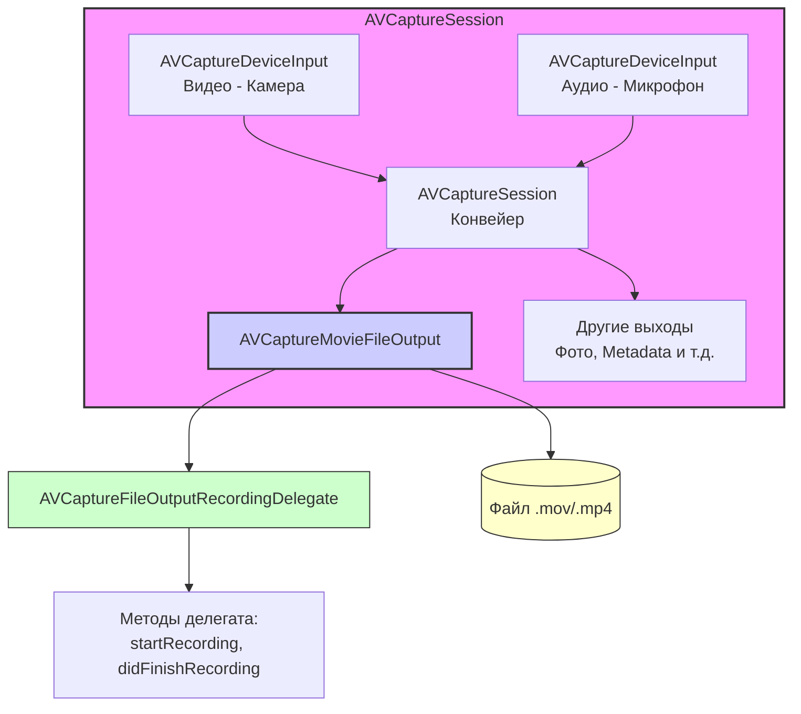

#avfoundation #video #recording #capture #movie #file-output #camera #microphone

---
### Определение
**AVCaptureMovieFileOutput** — это класс фреймворка [[AVFoundation]], который обеспечивает запись захваченного видео и аудио непосредственно в файл. Он является выходным (output) объектом для сессии захвата ([[AVCaptureSession]]) и предоставляет простой, но мощный API для создания видеофайлов с микрофона и камеры устройства .

В отличие от [[AVCaptureVideoDataOutput]] (который дает доступ к отдельным кадрам) или [[AVCaptureAudioDataOutput]] (для аудиоданных), `AVCaptureMovieFileOutput` автоматически кодирует и мультиплексирует видео- и аудиопотоки в контейнер (обычно .mov или .mp4), освобождая разработчика от необходимости ручного кодирования и синхронизации.

### Зачем это знать iOS-разработчику?
1.  **Запись видео:** Создание приложений для съемки видео (камера, TikTok-like приложения, видеоблоги).
2.  **Сохранение в фотоальбом:** Простая интеграция с `PHPhotoLibrary` для сохранения записанных видео.
3.  **Стриминг с записью:** Одновременная запись и передача видео на сервер.
4.  **Профессиональные приложения:** Настройка параметров записи (битрейт, качество, кодек) для профессионального использования.
5.  **Образовательные приложения:** Запись экрана с камерой (pip) или лекций.

---

### Архитектура и место в AVCaptureSession



### Ключевые компоненты

1.  **AVCaptureMovieFileOutput:** Сам объект, который нужно добавить в сессию.
2.  **[[AVCaptureFileOutputRecordingDelegate]]:** Протокол делегата для получения уведомлений о процессе записи.
    - `fileOutput(_:didStartRecordingTo:from:)` — опционально, вызывается когда запись началась.
    - `fileOutput(_:didFinishRecordingTo:from:error:)` — вызывается когда запись завершена (успешно или с ошибкой).
3.  **AVCaptureConnection:** Представляет связь между входом и выходом. Позволяет настраивать параметры (например, стабилизацию).

### Основные методы и свойства

#### Настройка
- `movieFragmentInterval` — интервал, с которым данные записываются в файл (для восстановления при сбоях).
- `outputSettings` — настройки сжатия для видео (можно настроить через `AVCaptureConnection`).

#### Управление записью
- `startRecording(to:recordingDelegate:)` — начать запись в указанный URL.
- `stopRecording()` — остановить запись.
- `isRecording` — булево свойство, показывающее, идет ли запись.
- `recordedDuration` — длительность записанного видео.
- `recordedFileSize` — размер записанного файла в байтах.

#### Пауза и возобновление (iOS 13+)
- `pauseRecording()` — приостановить запись.
- `resumeRecording()` — возобновить запись.

---

### Примеры от простого к сложному

#### Уровень 0: Настройка Info.plist и разрешений
Для записи видео с микрофоном нужно добавить описания в `Info.plist`.

- **NSCameraUsageDescription** — "Для съемки видео"
- **NSMicrophoneUsageDescription** — "Для записи звука в видео"

Базовая структура контроллера с проверкой разрешений:

```swift
import UIKit
import AVFoundation

class VideoRecorderViewController: UIViewController {
    
    var captureSession: AVCaptureSession!
    var previewLayer: AVCaptureVideoPreviewLayer!
    var movieOutput: AVCaptureMovieFileOutput!
    
    override func viewDidLoad() {
        super.viewDidLoad()
        checkPermissionsAndSetup()
    }
    
    private func checkPermissionsAndSetup() {
        // Проверяем разрешения для камеры и микрофона
        let cameraStatus = AVCaptureDevice.authorizationStatus(for: .video)
        let audioStatus = AVCaptureDevice.authorizationStatus(for: .audio)
        
        if cameraStatus == .authorized && audioStatus == .authorized {
            setupCamera()
        } else if cameraStatus == .notDetermined {
            AVCaptureDevice.requestAccess(for: .video) { _ in
                self.checkPermissionsAndSetup()
            }
        } else if audioStatus == .notDetermined {
            AVCaptureDevice.requestAccess(for: .audio) { _ in
                self.checkPermissionsAndSetup()
            }
        } else {
            showPermissionsAlert()
        }
    }
    
    private func showPermissionsAlert() {
        let alert = UIAlertController(
            title: "Нет доступа",
            message: "Пожалуйста, разрешите доступ к камере и микрофону в настройках",
            preferredStyle: .alert
        )
        alert.addAction(UIAlertAction(title: "OK", style: .default))
        present(alert, animated: true)
    }
    
    private func setupCamera() {
        // Будет реализовано в примерах
    }
    
    override func viewWillDisappear(_ animated: Bool) {
        super.viewWillDisappear(animated)
        if captureSession?.isRunning == true {
            DispatchQueue.global(qos: .background).async { [weak self] in
                self?.captureSession.stopRunning()
            }
        }
    }
}
```

#### Уровень 1: Простая запись видео с предпросмотром
Базовый пример — кнопка "Запись/Стоп" и предпросмотр камеры.

```swift
import UIKit
import AVFoundation

class SimpleVideoRecorderViewController: VideoRecorderViewController, AVCaptureFileOutputRecordingDelegate {
    
    let recordButton = UIButton()
    let statusLabel = UILabel()
    
    override func viewDidLoad() {
        super.viewDidLoad()
        setupUI()
    }
    
    private func setupUI() {
        recordButton.setTitle("Начать запись", for: .normal)
        recordButton.backgroundColor = .red
        recordButton.layer.cornerRadius = 25
        recordButton.frame = CGRect(x: view.bounds.midX - 50, 
                                    y: view.bounds.height - 150, 
                                    width: 100, 
                                    height: 50)
        recordButton.addTarget(self, action: #selector(toggleRecording), for: .touchUpInside)
        view.addSubview(recordButton)
        
        statusLabel.frame = CGRect(x: 20, y: 100, width: view.bounds.width - 40, height: 30)
        statusLabel.textAlignment = .center
        statusLabel.textColor = .white
        statusLabel.backgroundColor = UIColor.black.withAlphaComponent(0.5)
        statusLabel.text = "Готов к записи"
        view.addSubview(statusLabel)
    }
    
    override func setupCamera() {
        captureSession = AVCaptureSession()
        captureSession.sessionPreset = .hd1920x1080
        
        // === ВИДЕО ===
        guard let videoDevice = AVCaptureDevice.default(.builtInWideAngleCamera, for: .video, position: .back),
              let videoInput = try? AVCaptureDeviceInput(device: videoDevice),
              captureSession.canAddInput(videoInput) else {
            print("Не удалось добавить видео вход")
            return
        }
        captureSession.addInput(videoInput)
        
        // === АУДИО ===
        if let audioDevice = AVCaptureDevice.default(for: .audio),
           let audioInput = try? AVCaptureDeviceInput(device: audioDevice),
           captureSession.canAddInput(audioInput) {
            captureSession.addInput(audioInput)
        }
        
        // === MOVIE OUTPUT ===
        movieOutput = AVCaptureMovieFileOutput()
        if captureSession.canAddOutput(movieOutput) {
            captureSession.addOutput(movieOutput)
        }
        
        // Preview Layer
        previewLayer = AVCaptureVideoPreviewLayer(session: captureSession)
        previewLayer.frame = view.bounds
        previewLayer.videoGravity = .resizeAspectFill
        view.layer.insertSublayer(previewLayer, at: 0)
        
        // Запускаем сессию
        DispatchQueue.global(qos: .userInitiated).async { [weak self] in
            self?.captureSession.startRunning()
        }
    }
    
    @objc func toggleRecording() {
        guard let movieOutput = movieOutput else { return }
        
        if movieOutput.isRecording {
            // Остановить запись
            movieOutput.stopRecording()
            recordButton.setTitle("Начать запись", for: .normal)
            recordButton.backgroundColor = .red
            statusLabel.text = "Сохранение..."
        } else {
            // Начать запись
            let paths = FileManager.default.urls(for: .documentDirectory, in: .userDomainMask)
            let fileURL = paths[0].appendingPathComponent("video_\(Date().timeIntervalSince1970).mov")
            movieOutput.startRecording(to: fileURL, recordingDelegate: self)
            
            recordButton.setTitle("Стоп", for: .normal)
            recordButton.backgroundColor = .gray
            statusLabel.text = "Запись..."
        }
    }
    
    // MARK: - AVCaptureFileOutputRecordingDelegate
    func fileOutput(_ output: AVCaptureFileOutput, 
                   didStartRecordingTo fileURL: URL, 
                   from connections: [AVCaptureConnection]) {
        print("Запись начата: \(fileURL)")
    }
    
    func fileOutput(_ output: AVCaptureFileOutput, 
                   didFinishRecordingTo outputFileURL: URL, 
                   from connections: [AVCaptureConnection], 
                   error: Error?) {
        
        if let error = error {
            print("Ошибка записи: \(error.localizedDescription)")
            statusLabel.text = "Ошибка: \(error.localizedDescription)"
        } else {
            print("Видео сохранено: \(outputFileURL)")
            statusLabel.text = "Видео сохранено"
            
            // Сохраняем в фотоальбом
            UISaveVideoAtPathToSavedPhotosAlbum(outputFileURL.path, self, #selector(videoSaved), nil)
        }
    }
    
    @objc func videoSaved(_ video: String, didFinishSavingWithError error: Error?, contextInfo: UnsafeRawPointer) {
        if let error = error {
            print("Ошибка сохранения в альбом: \(error)")
            statusLabel.text = "Ошибка сохранения"
        } else {
            print("Видео сохранено в фотоальбом")
            statusLabel.text = "Готов к записи"
        }
    }
}
```

#### Уровень 2: Запись с переключением камер и настройкой качества
Добавляем возможность переключать камеры во время записи и настраивать качество.

```swift
import UIKit
import AVFoundation

class AdvancedVideoRecorderViewController: VideoRecorderViewController, AVCaptureFileOutputRecordingDelegate {
    
    let recordButton = UIButton()
    let switchCameraButton = UIButton()
    let qualitySegmentedControl = UISegmentedControl(items: ["HD", "Full HD", "4K"])
    
    var isUsingFrontCamera = false
    
    override func viewDidLoad() {
        super.viewDidLoad()
        setupUI()
    }
    
    private func setupUI() {
        // Кнопка записи
        recordButton.setTitle("● Запись", for: .normal)
        recordButton.backgroundColor = .red
        recordButton.layer.cornerRadius = 25
        recordButton.frame = CGRect(x: view.bounds.midX - 50, 
                                    y: view.bounds.height - 150, 
                                    width: 100, 
                                    height: 50)
        recordButton.addTarget(self, action: #selector(toggleRecording), for: .touchUpInside)
        view.addSubview(recordButton)
        
        // Кнопка переключения камеры
        switchCameraButton.setTitle("🔄", for: .normal)
        switchCameraButton.backgroundColor = .blue
        switchCameraButton.layer.cornerRadius = 25
        switchCameraButton.frame = CGRect(x: view.bounds.width - 80, 
                                         y: view.bounds.height - 150, 
                                         width: 50, 
                                         height: 50)
        switchCameraButton.addTarget(self, action: #selector(switchCamera), for: .touchUpInside)
        view.addSubview(switchCameraButton)
        
        // Сегментированный контроль качества
        qualitySegmentedControl.frame = CGRect(x: 20, y: 60, width: view.bounds.width - 40, height: 30)
        qualitySegmentedControl.selectedSegmentIndex = 1
        qualitySegmentedControl.addTarget(self, action: #selector(qualityChanged), for: .valueChanged)
        view.addSubview(qualitySegmentedControl)
    }
    
    override func setupCamera() {
        captureSession = AVCaptureSession()
        setSessionPreset(for: qualitySegmentedControl.selectedSegmentIndex)
        
        addVideoInput(position: .back)
        addAudioInput()
        
        movieOutput = AVCaptureMovieFileOutput()
        if captureSession.canAddOutput(movieOutput) {
            captureSession.addOutput(movieOutput)
            
            // Настройка стабилизации
            if let connection = movieOutput.connection(with: .video) {
                if connection.isVideoStabilizationSupported {
                    connection.preferredVideoStabilizationMode = .auto
                }
            }
        }
        
        previewLayer = AVCaptureVideoPreviewLayer(session: captureSession)
        previewLayer.frame = view.bounds
        previewLayer.videoGravity = .resizeAspectFill
        view.layer.insertSublayer(previewLayer, at: 0)
        
        DispatchQueue.global(qos: .userInitiated).async { [weak self] in
            self?.captureSession.startRunning()
        }
    }
    
    private func setSessionPreset(for index: Int) {
        switch index {
        case 0:
            captureSession.sessionPreset = .hd1280x720
        case 1:
            captureSession.sessionPreset = .hd1920x1080
        case 2:
            captureSession.sessionPreset = .hd4K3840x2160
        default:
            captureSession.sessionPreset = .hd1920x1080
        }
    }
    
    private func addVideoInput(position: AVCaptureDevice.Position) {
        // Удаляем старый видео вход, если есть
        captureSession.inputs.filter { input in
            (input as? AVCaptureDeviceInput)?.device.hasMediaType(.video) ?? false
        }.forEach { captureSession.removeInput($0) }
        
        guard let videoDevice = AVCaptureDevice.default(.builtInWideAngleCamera, for: .video, position: position),
              let videoInput = try? AVCaptureDeviceInput(device: videoDevice),
              captureSession.canAddInput(videoInput) else { return }
        
        captureSession.addInput(videoInput)
    }
    
    private func addAudioInput() {
        guard let audioDevice = AVCaptureDevice.default(for: .audio),
              let audioInput = try? AVCaptureDeviceInput(device: audioDevice),
              captureSession.canAddInput(audioInput) else { return }
        
        captureSession.addInput(audioInput)
    }
    
    @objc func qualityChanged() {
        guard !(movieOutput?.isRecording ?? false) else {
            // Нельзя менять качество во время записи
            qualitySegmentedControl.selectedSegmentIndex = 1
            let alert = UIAlertController(title: "Ошибка", message: "Нельзя менять качество во время записи", preferredStyle: .alert)
            alert.addAction(UIAlertAction(title: "OK", style: .default))
            present(alert, animated: true)
            return
        }
        
        // Перезапускаем сессию с новым качеством
        DispatchQueue.global(qos: .userInitiated).async { [weak self] in
            self?.captureSession.stopRunning()
            DispatchQueue.main.async {
                self?.setSessionPreset(for: self?.qualitySegmentedControl.selectedSegmentIndex ?? 1)
                DispatchQueue.global(qos: .userInitiated).async {
                    self?.captureSession.startRunning()
                }
            }
        }
    }
    
    @objc func switchCamera() {
        guard !(movieOutput?.isRecording ?? false) else {
            // Нельзя переключать камеру во время записи
            let alert = UIAlertController(title: "Ошибка", message: "Нельзя переключать камеру во время записи", preferredStyle: .alert)
            alert.addAction(UIAlertAction(title: "OK", style: .default))
            present(alert, animated: true)
            return
        }
        
        isUsingFrontCamera.toggle()
        let newPosition: AVCaptureDevice.Position = isUsingFrontCamera ? .front : .back
        
        DispatchQueue.global(qos: .userInitiated).async { [weak self] in
            self?.captureSession.beginConfiguration()
            self?.addVideoInput(position: newPosition)
            self?.captureSession.commitConfiguration()
        }
    }
    
    @objc func toggleRecording() {
        guard let movieOutput = movieOutput else { return }
        
        if movieOutput.isRecording {
            movieOutput.stopRecording()
        } else {
            let paths = FileManager.default.urls(for: .documentDirectory, in: .userDomainMask)
            let fileURL = paths[0].appendingPathComponent("video_\(Date().timeIntervalSince1970).mov")
            movieOutput.startRecording(to: fileURL, recordingDelegate: self)
        }
    }
    
    // MARK: - AVCaptureFileOutputRecordingDelegate
    func fileOutput(_ output: AVCaptureFileOutput, 
                   didStartRecordingTo fileURL: URL, 
                   from connections: [AVCaptureConnection]) {
        DispatchQueue.main.async {
            self.recordButton.setTitle("■ Стоп", for: .normal)
            self.recordButton.backgroundColor = .gray
        }
    }
    
    func fileOutput(_ output: AVCaptureFileOutput, 
                   didFinishRecordingTo outputFileURL: URL, 
                   from connections: [AVCaptureConnection], 
                   error: Error?) {
        
        DispatchQueue.main.async {
            self.recordButton.setTitle("● Запись", for: .normal)
            self.recordButton.backgroundColor = .red
        }
        
        if let error = error {
            print("Ошибка: \(error)")
        } else {
            UISaveVideoAtPathToSavedPhotosAlbum(outputFileURL.path, self, #selector(videoSaved), nil)
        }
    }
    
    @objc func videoSaved(_ video: String, didFinishSavingWithError error: Error?, contextInfo: UnsafeRawPointer) {
        if let error = error {
            print("Ошибка сохранения: \(error)")
        } else {
            print("Видео сохранено в фотоальбом")
        }
    }
}
```

#### Уровень 3: Запись с паузой и возобновлением (iOS 13+)
Демонстрация функций паузы, доступных с iOS 13.

```swift
import UIKit
import AVFoundation

class PausableVideoRecorderViewController: VideoRecorderViewController, AVCaptureFileOutputRecordingDelegate {
    
    let recordButton = UIButton()
    let pauseButton = UIButton()
    let timerLabel = UILabel()
    
    var recordingStartTime: Date?
    var timer: Timer?
    
    override func viewDidLoad() {
        super.viewDidLoad()
        setupUI()
    }
    
    private func setupUI() {
        recordButton.setTitle("● Запись", for: .normal)
        recordButton.backgroundColor = .red
        recordButton.layer.cornerRadius = 25
        recordButton.frame = CGRect(x: view.bounds.midX - 50, 
                                    y: view.bounds.height - 150, 
                                    width: 100, 
                                    height: 50)
        recordButton.addTarget(self, action: #selector(toggleRecording), for: .touchUpInside)
        view.addSubview(recordButton)
        
        pauseButton.setTitle("⏸ Пауза", for: .normal)
        pauseButton.backgroundColor = .orange
        pauseButton.layer.cornerRadius = 10
        pauseButton.frame = CGRect(x: view.bounds.midX - 50, 
                                  y: view.bounds.height - 90, 
                                  width: 100, 
                                  height: 40)
        pauseButton.addTarget(self, action: #selector(togglePause), for: .touchUpInside)
        pauseButton.isEnabled = false
        view.addSubview(pauseButton)
        
        timerLabel.frame = CGRect(x: 20, y: 100, width: view.bounds.width - 40, height: 40)
        timerLabel.textAlignment = .center
        timerLabel.textColor = .white
        timerLabel.font = UIFont.monospacedDigitSystemFont(ofSize: 18, weight: .bold)
        timerLabel.backgroundColor = UIColor.black.withAlphaComponent(0.5)
        timerLabel.text = "00:00.0"
        view.addSubview(timerLabel)
    }
    
    override func setupCamera() {
        captureSession = AVCaptureSession()
        captureSession.sessionPreset = .hd1920x1080
        
        guard let videoDevice = AVCaptureDevice.default(.builtInWideAngleCamera, for: .video, position: .back),
              let videoInput = try? AVCaptureDeviceInput(device: videoDevice) else { return }
        captureSession.addInput(videoInput)
        
        if let audioDevice = AVCaptureDevice.default(for: .audio),
           let audioInput = try? AVCaptureDeviceInput(device: audioDevice) {
            captureSession.addInput(audioInput)
        }
        
        movieOutput = AVCaptureMovieFileOutput()
        if captureSession.canAddOutput(movieOutput) {
            captureSession.addOutput(movieOutput)
        }
        
        previewLayer = AVCaptureVideoPreviewLayer(session: captureSession)
        previewLayer.frame = view.bounds
        previewLayer.videoGravity = .resizeAspectFill
        view.layer.insertSublayer(previewLayer, at: 0)
        
        DispatchQueue.global(qos: .userInitiated).async { [weak self] in
            self?.captureSession.startRunning()
        }
    }
    
    @objc func toggleRecording() {
        guard let movieOutput = movieOutput else { return }
        
        if movieOutput.isRecording {
            movieOutput.stopRecording()
            stopTimer()
        } else {
            let paths = FileManager.default.urls(for: .documentDirectory, in: .userDomainMask)
            let fileURL = paths[0].appendingPathComponent("video_\(Date().timeIntervalSince1970).mov")
            movieOutput.startRecording(to: fileURL, recordingDelegate: self)
            recordingStartTime = Date()
            startTimer()
        }
    }
    
    @objc func togglePause() {
        guard let movieOutput = movieOutput, movieOutput.isRecording else { return }
        
        if #available(iOS 13.0, *) {
            if movieOutput.isRecordingPaused {
                movieOutput.resumeRecording()
                pauseButton.setTitle("⏸ Пауза", for: .normal)
                pauseButton.backgroundColor = .orange
                startTimer()
            } else {
                movieOutput.pauseRecording()
                pauseButton.setTitle("▶ Продолжить", for: .normal)
                pauseButton.backgroundColor = .green
                stopTimer()
            }
        } else {
            // Пауза не поддерживается до iOS 13
            let alert = UIAlertController(title: "Не поддерживается", 
                                         message: "Пауза доступна только на iOS 13 и новее", 
                                         preferredStyle: .alert)
            alert.addAction(UIAlertAction(title: "OK", style: .default))
            present(alert, animated: true)
        }
    }
    
    private func startTimer() {
        timer?.invalidate()
        timer = Timer.scheduledTimer(withTimeInterval: 0.1, repeats: true) { [weak self] _ in
            self?.updateTimerLabel()
        }
    }
    
    private func stopTimer() {
        timer?.invalidate()
        timer = nil
    }
    
    private func updateTimerLabel() {
        guard let startTime = recordingStartTime else { return }
        
        let elapsed = Date().timeIntervalSince(startTime)
        let minutes = Int(elapsed) / 60
        let seconds = Int(elapsed) % 60
        let tenths = Int((elapsed - Double(Int(elapsed))) * 10)
        
        timerLabel.text = String(format: "%02d:%02d.%d", minutes, seconds, tenths)
    }
    
    // MARK: - AVCaptureFileOutputRecordingDelegate
    func fileOutput(_ output: AVCaptureFileOutput, 
                   didStartRecordingTo fileURL: URL, 
                   from connections: [AVCaptureConnection]) {
        DispatchQueue.main.async {
            self.recordButton.setTitle("■ Стоп", for: .normal)
            self.recordButton.backgroundColor = .gray
            self.pauseButton.isEnabled = true
        }
    }
    
    func fileOutput(_ output: AVCaptureFileOutput, 
                   didFinishRecordingTo outputFileURL: URL, 
                   from connections: [AVCaptureConnection], 
                   error: Error?) {
        
        DispatchQueue.main.async {
            self.recordButton.setTitle("● Запись", for: .normal)
            self.recordButton.backgroundColor = .red
            self.pauseButton.isEnabled = false
            self.pauseButton.setTitle("⏸ Пауза", for: .normal)
            self.pauseButton.backgroundColor = .orange
            self.timerLabel.text = "00:00.0"
            self.recordingStartTime = nil
            self.stopTimer()
        }
        
        if let error = error {
            print("Ошибка: \(error)")
        } else {
            UISaveVideoAtPathToSavedPhotosAlbum(outputFileURL.path, nil, nil, nil)
        }
    }
}
```

#### Уровень 4: Максимальная длительность и размер файла
Ограничение записи по времени и размеру с обратной связью.

```swift
import UIKit
import AVFoundation

class LimitedVideoRecorderViewController: VideoRecorderViewController, AVCaptureFileOutputRecordingDelegate {
    
    let recordButton = UIButton()
    let progressView = UIProgressView()
    let infoLabel = UILabel()
    
    let maxDuration: Double = 30.0 // 30 секунд
    let maxFileSize: Int64 = 50 * 1024 * 1024 // 50 МБ
    
    var observation: NSKeyValueObservation?
    
    override func viewDidLoad() {
        super.viewDidLoad()
        setupUI()
    }
    
    private func setupUI() {
        recordButton.setTitle("Начать запись (30с)", for: .normal)
        recordButton.backgroundColor = .red
        recordButton.layer.cornerRadius = 25
        recordButton.frame = CGRect(x: view.bounds.midX - 100, 
                                    y: view.bounds.height - 150, 
                                    width: 200, 
                                    height: 50)
        recordButton.addTarget(self, action: #selector(toggleRecording), for: .touchUpInside)
        view.addSubview(recordButton)
        
        progressView.frame = CGRect(x: 20, y: 120, width: view.bounds.width - 40, height: 20)
        progressView.progressTintColor = .green
        view.addSubview(progressView)
        
        infoLabel.frame = CGRect(x: 20, y: 150, width: view.bounds.width - 40, height: 30)
        infoLabel.textAlignment = .center
        infoLabel.textColor = .white
        infoLabel.font = UIFont.systemFont(ofSize: 14)
        infoLabel.backgroundColor = UIColor.black.withAlphaComponent(0.5)
        infoLabel.text = "Готов к записи"
        view.addSubview(infoLabel)
    }
    
    override func setupCamera() {
        captureSession = AVCaptureSession()
        captureSession.sessionPreset = .hd1920x1080
        
        guard let videoDevice = AVCaptureDevice.default(.builtInWideAngleCamera, for: .video, position: .back),
              let videoInput = try? AVCaptureDeviceInput(device: videoDevice) else { return }
        captureSession.addInput(videoInput)
        
        if let audioDevice = AVCaptureDevice.default(for: .audio),
           let audioInput = try? AVCaptureDeviceInput(device: audioDevice) {
            captureSession.addInput(audioInput)
        }
        
        movieOutput = AVCaptureMovieFileOutput()
        
        // Устанавливаем ограничения
        movieOutput.maxRecordedDuration = CMTime(seconds: maxDuration, preferredTimescale: 600)
        movieOutput.maxRecordedFileSize = maxFileSize
        
        if captureSession.canAddOutput(movieOutput) {
            captureSession.addOutput(movieOutput)
        }
        
        // Наблюдение за прогрессом
        observation = movieOutput.observe(\.recordedDuration, options: [.new]) { [weak self] _, change in
            guard let self = self, let duration = change.newValue else { return }
            let seconds = CMTimeGetSeconds(duration)
            let progress = Float(seconds / self.maxDuration)
            DispatchQueue.main.async {
                self.progressView.progress = progress
                self.infoLabel.text = String(format: "Запись: %.1f / %.1f с", seconds, self.maxDuration)
                
                if seconds >= self.maxDuration {
                    self.movieOutput.stopRecording()
                }
            }
        }
        
        previewLayer = AVCaptureVideoPreviewLayer(session: captureSession)
        previewLayer.frame = view.bounds
        previewLayer.videoGravity = .resizeAspectFill
        view.layer.insertSublayer(previewLayer, at: 0)
        
        DispatchQueue.global(qos: .userInitiated).async { [weak self] in
            self?.captureSession.startRunning()
        }
    }
    
    @objc func toggleRecording() {
        guard let movieOutput = movieOutput else { return }
        
        if movieOutput.isRecording {
            movieOutput.stopRecording()
        } else {
            let paths = FileManager.default.urls(for: .documentDirectory, in: .userDomainMask)
            let fileURL = paths[0].appendingPathComponent("video_\(Date().timeIntervalSince1970).mov")
            movieOutput.startRecording(to: fileURL, recordingDelegate: self)
        }
    }
    
    // MARK: - AVCaptureFileOutputRecordingDelegate
    func fileOutput(_ output: AVCaptureFileOutput, 
                   didStartRecordingTo fileURL: URL, 
                   from connections: [AVCaptureConnection]) {
        DispatchQueue.main.async {
            self.recordButton.setTitle("Стоп", for: .normal)
            self.recordButton.backgroundColor = .gray
        }
    }
    
    func fileOutput(_ output: AVCaptureFileOutput, 
                   didFinishRecordingTo outputFileURL: URL, 
                   from connections: [AVCaptureConnection], 
                   error: Error?) {
        
        DispatchQueue.main.async {
            self.recordButton.setTitle("Начать запись (30с)", for: .normal)
            self.recordButton.backgroundColor = .red
            self.progressView.progress = 0
            self.infoLabel.text = "Готов к записи"
        }
        
        if let error = error as? NSError {
            // Проверяем, не из-за лимита ли остановка
            if error.domain == AVFoundationErrorDomain && error.code == -11807 {
                print("Запись остановлена из-за превышения лимита")
                DispatchQueue.main.async {
                    self.infoLabel.text = "Достигнут лимит длительности"
                }
            } else {
                print("Ошибка: \(error)")
            }
        }
        
        if FileManager.default.fileExists(atPath: outputFileURL.path) {
            UISaveVideoAtPathToSavedPhotosAlbum(outputFileURL.path, nil, nil, nil)
        }
    }
    
    deinit {
        observation?.invalidate()
    }
}
```

#### Уровень 5: Настройка параметров сжатия (битрейт, кодек)
Профессиональная настройка качества видео.

```swift
import UIKit
import AVFoundation

class ProfessionalVideoRecorderViewController: VideoRecorderViewController, AVCaptureFileOutputRecordingDelegate {
    
    let recordButton = UIButton()
    let settingsButton = UIButton()
    
    // Настройки качества
    var videoBitrate: Int = 10_000_000 // 10 Mbps
    var audioBitrate: Int = 128_000 // 128 Kbps
    var keyFrameInterval: Int = 30 // Каждый 30-й кадр - ключевой
    
    override func viewDidLoad() {
        super.viewDidLoad()
        setupUI()
    }
    
    private func setupUI() {
        recordButton.setTitle("● Запись", for: .normal)
        recordButton.backgroundColor = .red
        recordButton.layer.cornerRadius = 25
        recordButton.frame = CGRect(x: view.bounds.midX - 50, 
                                    y: view.bounds.height - 150, 
                                    width: 100, 
                                    height: 50)
        recordButton.addTarget(self, action: #selector(toggleRecording), for: .touchUpInside)
        view.addSubview(recordButton)
        
        settingsButton.setTitle("⚙️ Настройки", for: .normal)
        settingsButton.backgroundColor = .blue
        settingsButton.layer.cornerRadius = 10
        settingsButton.frame = CGRect(x: view.bounds.width - 100, 
                                     y: 50, 
                                     width: 80, 
                                     height: 40)
        settingsButton.addTarget(self, action: #selector(showSettings), for: .touchUpInside)
        view.addSubview(settingsButton)
    }
    
    override func setupCamera() {
        captureSession = AVCaptureSession()
        captureSession.sessionPreset = .hd1920x1080
        
        guard let videoDevice = AVCaptureDevice.default(.builtInWideAngleCamera, for: .video, position: .back),
              let videoInput = try? AVCaptureDeviceInput(device: videoDevice) else { return }
        captureSession.addInput(videoInput)
        
        if let audioDevice = AVCaptureDevice.default(for: .audio),
           let audioInput = try? AVCaptureDeviceInput(device: audioDevice) {
            captureSession.addInput(audioInput)
        }
        
        movieOutput = AVCaptureMovieFileOutput()
        
        // Настройка параметров сжатия для видео
        if let connection = movieOutput.connection(with: .video) {
            connection.videoOrientation = .portrait
            connection.isVideoMirrored = false
        }
        
        // Кастомные настройки для видео
        let videoSettings: [String: Any] = [
            AVVideoCodecKey: AVVideoCodecType.h264,
            AVVideoWidthKey: 1920,
            AVVideoHeightKey: 1080,
            AVVideoCompressionPropertiesKey: [
                AVVideoAverageBitRateKey: videoBitrate,
                AVVideoMaxKeyFrameIntervalKey: keyFrameInterval,
                AVVideoProfileLevelKey: AVVideoProfileLevelH264HighAutoLevel
            ]
        ]
        
        // Для применения кастомных настроек нужно использовать AVAssetWriter,
        // но для AVCaptureMovieFileOutput мы можем использовать outputSettings
        // в AVCaptureConnection? На самом деле movieOutput использует настройки из сессии.
        
        // Вместо этого можно использовать addOutputWithSettings, но проще
        // использовать AVAssetWriter для полного контроля.
        
        if captureSession.canAddOutput(movieOutput) {
            captureSession.addOutput(movieOutput)
        }
        
        previewLayer = AVCaptureVideoPreviewLayer(session: captureSession)
        previewLayer.frame = view.bounds
        previewLayer.videoGravity = .resizeAspectFill
        view.layer.insertSublayer(previewLayer, at: 0)
        
        DispatchQueue.global(qos: .userInitiated).async { [weak self] in
            self?.captureSession.startRunning()
        }
    }
    
    @objc func showSettings() {
        let alert = UIAlertController(title: "Настройки качества", message: nil, preferredStyle: .actionSheet)
        
        alert.addAction(UIAlertAction(title: "Низкое (5 Mbps)", style: .default) { [weak self] _ in
            self?.videoBitrate = 5_000_000
        })
        
        alert.addAction(UIAlertAction(title: "Среднее (10 Mbps)", style: .default) { [weak self] _ in
            self?.videoBitrate = 10_000_000
        })
        
        alert.addAction(UIAlertAction(title: "Высокое (20 Mbps)", style: .default) { [weak self] _ in
            self?.videoBitrate = 20_000_000
        })
        
        alert.addAction(UIAlertAction(title: "Отмена", style: .cancel))
        
        present(alert, animated: true)
    }
    
    @objc func toggleRecording() {
        guard let movieOutput = movieOutput else { return }
        
        if movieOutput.isRecording {
            movieOutput.stopRecording()
        } else {
            let paths = FileManager.default.urls(for: .documentDirectory, in: .userDomainMask)
            let fileURL = paths[0].appendingPathComponent("video_\(Date().timeIntervalSince1970).mov")
            movieOutput.startRecording(to: fileURL, recordingDelegate: self)
        }
    }
    
    // MARK: - AVCaptureFileOutputRecordingDelegate
    func fileOutput(_ output: AVCaptureFileOutput, 
                   didStartRecordingTo fileURL: URL, 
                   from connections: [AVCaptureConnection]) {
        DispatchQueue.main.async {
            self.recordButton.setTitle("■ Стоп", for: .normal)
            self.recordButton.backgroundColor = .gray
        }
    }
    
    func fileOutput(_ output: AVCaptureFileOutput, 
                   didFinishRecordingTo outputFileURL: URL, 
                   from connections: [AVCaptureConnection], 
                   error: Error?) {
        
        DispatchQueue.main.async {
            self.recordButton.setTitle("● Запись", for: .normal)
            self.recordButton.backgroundColor = .red
        }
        
        if let error = error {
            print("Ошибка: \(error)")
        } else {
            // Получаем размер файла
            do {
                let attributes = try FileManager.default.attributesOfItem(atPath: outputFileURL.path)
                if let fileSize = attributes[.size] as? Int64 {
                    print("Размер файла: \(fileSize / 1024 / 1024) MB")
                }
            } catch {
                print("Не удалось получить размер файла")
            }
            
            UISaveVideoAtPathToSavedPhotosAlbum(outputFileURL.path, nil, nil, nil)
        }
    }
}
```

---

### Важные нюансы и Best Practices

#### 1. **Очередь для запуска сессии**
Всегда запускайте `startRunning()` на фоновой очереди, чтобы не блокировать главный поток.

```swift
DispatchQueue.global(qos: .userInitiated).async { [weak self] in
    self?.captureSession.startRunning()
}
```

#### 2. **Остановка сессии**
Не забывайте останавливать сессию, когда она не нужна:

```swift
override func viewWillDisappear(_ animated: Bool) {
    super.viewWillDisappear(animated)
    if movieOutput?.isRecording == true {
        movieOutput?.stopRecording()
    }
    DispatchQueue.global(qos: .background).async { [weak self] in
        self?.captureSession.stopRunning()
    }
}
```

#### 3. **Обработка ошибок в делегате**
Всегда проверяйте `error` в `didFinishRecordingTo`. Коды ошибок могут указывать на проблемы с дисковым пространством, ограничениями и т.д.

```swift
func fileOutput(_ output: AVCaptureFileOutput, 
               didFinishRecordingTo outputFileURL: URL, 
               from connections: [AVCaptureConnection], 
               error: Error?) {
    
    if let error = error as? NSError {
        switch error.code {
        case -11807: // AVError.maximumDurationReached
            print("Достигнута максимальная длительность")
        case -11812: // AVError.maximumFileSizeReached
            print("Достигнут максимальный размер файла")
        case -11813: // AVError.diskFull
            print("Нет места на диске")
        default:
            print("Другая ошибка: \(error)")
        }
    }
}
```

#### 4. **Стабилизация видео**
Включите стабилизацию для более плавного видео:

```swift
if let connection = movieOutput.connection(with: .video) {
    if connection.isVideoStabilizationSupported {
        connection.preferredVideoStabilizationMode = .auto
    }
}
```

#### 5. **Ориентация видео**
Устанавливайте правильную ориентацию в зависимости от ориентации устройства:

```swift
func updateVideoOrientation() {
    if let connection = movieOutput.connection(with: .video) {
        switch UIDevice.current.orientation {
        case .portrait:
            connection.videoOrientation = .portrait
        case .landscapeLeft:
            connection.videoOrientation = .landscapeRight
        case .landscapeRight:
            connection.videoOrientation = .landscapeLeft
        default:
            break
        }
    }
}
```

#### 6. **Микрофон и музыка одновременно**
Если нужно записывать микрофон и проигрывать музыку, настройте аудиосессию:

```swift
do {
    try AVAudioSession.sharedInstance().setCategory(.playAndRecord, mode: .videoRecording)
    try AVAudioSession.sharedInstance().setActive(true)
} catch {
    print("Ошибка настройки аудиосессии: \(error)")
}
```

#### 7. **Проверка доступного места**
Перед началом записи проверьте свободное место на диске:

```swift
func hasEnoughFreeSpace(minimumMB: Int64 = 100) -> Bool {
    let paths = FileManager.default.urls(for: .documentDirectory, in: .userDomainMask)
    if let attributes = try? FileManager.default.attributesOfFileSystem(forPath: paths[0].path) {
        let freeSize = attributes[.systemFreeSize] as? Int64 ?? 0
        return freeSize / 1024 / 1024 > minimumMB
    }
    return false
}
```

#### 8. **Использование [[KVO]] для мониторинга**
Можно наблюдать за свойствами `recordedDuration` и `recordedFileSize` для отображения прогресса:

```swift
observation = movieOutput.observe(\.recordedDuration, options: [.new]) { output, change in
    let duration = CMTimeGetSeconds(change.newValue ?? CMTime.zero)
    // Обновление UI
}
```

### Итог
**AVCaptureMovieFileOutput** — это мощный и простой способ добавления записи видео в ваше приложение. Он предоставляет:

1.  **Простой API** для начала и остановки записи.
2.  **Автоматическое кодирование** и мультиплексирование.
3.  **Встроенную поддержку** паузы (iOS 13+).
4.  **Ограничения** по длительности и размеру файла.
5.  **Делегат** для обратной связи о процессе записи.

Ключевые навыки: правильная настройка сессии с видео и аудио входами, обработка событий делегата, управление ориентацией и стабилизацией, обработка ошибок и ограничений, сохранение в фотоальбом.