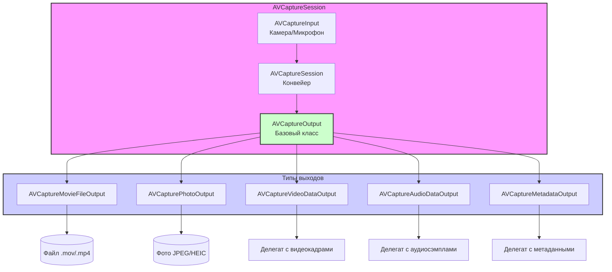

#avfoundation #capture #output #video #audio #photo #metadata #avcaptureoutput

---
### Определение
**AVCaptureOutput** — это абстрактный базовый класс во фреймворке [[AVFoundation]], который представляет собой конечную точку назначения данных в сессии захвата ([[AVCaptureSession]]). Он является получателем медиаданных (видео, аудио, фото, метаданных) от входов ([[AVCaptureInput]]) и определяет, что происходит с этими данными: сохраняются ли они в файл, передаются ли для обработки в реальном времени, или извлекаются как фото .

Простыми словами, `AVCaptureOutput` — это "куда" и "как" попадают данные после того, как камера или микрофон их захватили. Без выходов сессия захвата бессмысленна — данные просто никуда не идут.

### Иерархия классов

`AVCaptureOutput` имеет несколько конкретных подклассов для разных целей:

1.  **[[AVCaptureMovieFileOutput]]** — запись видео и аудио в файл.
2.  **[[AVCapturePhotoOutput]]** — захват фотографий высокого разрешения (с поддержкой Live Photos, Depth Data, RAW).
3.  **[[AVCaptureVideoDataOutput]]** — доступ к видеокадрам в реальном времени (для обработки, анализа).
4.  **[[AVCaptureAudioDataOutput]]** — доступ к аудиосэмплам в реальном времени.
5.  **[[AVCaptureMetadataOutput]]** — обнаружение метаданных (QR-коды, лица, штрих-коды).
6.  **[[AVCaptureFileOutput]]** — абстрактный родитель для выходов, записывающих в файл.
7.  **[[AVCaptureStillImageOutput]]** — устаревший класс для фото (заменен на `AVCapturePhotoOutput`).

### Зачем это знать iOS-разработчику?
1.  **Выбор правильного выхода:** Для записи видео — `AVCaptureMovieFileOutput`, для фото — `AVCapturePhotoOutput`, для обработки кадров — `AVCaptureVideoDataOutput`.
2.  **Комбинирование выходов:** Можно использовать несколько выходов одновременно (например, записывать видео и параллельно анализировать кадры).
3.  **Настройка параметров:** Каждый выход имеет свои настройки (качество, формат, делегаты).
4.  **Получение данных:** Через делегаты выходов вы получаете доступ к захваченным данным.
5.  **Управление соединениями:** Каждый выход имеет соединения (`connections`), через которые можно настраивать ориентацию, стабилизацию и т.д.

---

### Архитектура и место в AVCaptureSession



### Общие свойства и методы для всех выходов

- `connections` — массив объектов `AVCaptureConnection`, представляющих соединения с входами.
- `connection(with:)` — получить соединение для конкретного типа медиа.
- `transformedMetadataObject(for:)` — преобразовать объект метаданных из координат камеры в координаты предпросмотра (обычно используется с `AVCaptureMetadataOutput`).

---

### Детальное описание каждого типа выхода

#### 1. [[AVCaptureMovieFileOutput]]
**Назначение:** Запись видео и аудио в файл.

**Ключевые особенности:**
- Простой [[API]]: `startRecording(to:recordingDelegate:)` и `stopRecording()`.
- Поддержка паузы/возобновления (iOS 13+).
- Ограничения по длительности и размеру файла.
- Делегат `AVCaptureFileOutputRecordingDelegate`.

**Когда использовать:** Когда нужно просто записать видео и сохранить его.

#### 2. [[AVCapturePhotoOutput]]
**Назначение:** Захват фотографий высокого качества.

**Ключевые особенности:**
- Поддержка [[HEIC]], RAW, Live Photos.
- Настройка вспышки, стабилизации, красных глаз.
- Получение Depth Data (портретный режим).
- Делегат [[AVCapturePhotoCaptureDelegate]].

**Когда использовать:** Для создания приложения-камеры с фотосъемкой.

#### 3. [[AVCaptureVideoDataOutput]]
**Назначение:** Доступ к видеокадрам в реальном времени.

**Ключевые особенности:**
- Получение каждого кадра через делегат [[AVCaptureVideoDataOutputSampleBufferDelegate]].
- Настройка формата пикселей (например, 32BGRA).
- Работа с Core Image, Vision, [[Metal]].

**Когда использовать:** Для анализа видео, наложения фильтров, компьютерного зрения.

#### 4. [[AVCaptureAudioDataOutput]]
**Назначение:** Доступ к аудиосэмплам в реальном времени.

**Ключевые особенности:**
- Получение аудиобуферов через делегат [[AVCaptureAudioDataOutputSampleBufferDelegate]].
- Анализ звука (громкость, частоты), применение эффектов.

**Когда использовать:** Для визуализации звука, распознавания речи, аудио-анализа.

#### 5. [[AVCaptureMetadataOutput]]
**Назначение:** Обнаружение метаданных в видеопотоке.

**Ключевые особенности:**
- Детекция QR-кодов, штрих-кодов, лиц, тел, животных.
- Делегат [[AVCaptureMetadataOutputObjectsDelegate]].
- Поддержка множественных типов одновременно.

**Когда использовать:** Для сканеров QR-кодов, детекции лиц, подсчета объектов.

---

### Примеры от простого к сложному

#### Уровень 0: Базовая структура с добавлением выхода

```swift
import UIKit
import AVFoundation

class OutputDemoViewController: UIViewController {
    
    var captureSession: AVCaptureSession!
    var previewLayer: AVCaptureVideoPreviewLayer!
    
    override func viewDidLoad() {
        super.viewDidLoad()
        setupCamera()
    }
    
    private func setupCamera() {
        captureSession = AVCaptureSession()
        captureSession.sessionPreset = .hd1920x1080
        
        // Добавляем вход (камера)
        guard let camera = AVCaptureDevice.default(.builtInWideAngleCamera, for: .video, position: .back),
              let videoInput = try? AVCaptureDeviceInput(device: camera),
              captureSession.canAddInput(videoInput) else {
            print("Не удалось добавить видео вход")
            return
        }
        captureSession.addInput(videoInput)
        
        // Здесь будем добавлять выходы
        setupOutputs()
        
        previewLayer = AVCaptureVideoPreviewLayer(session: captureSession)
        previewLayer.frame = view.bounds
        previewLayer.videoGravity = .resizeAspectFill
        view.layer.addSublayer(previewLayer)
        
        DispatchQueue.global(qos: .userInitiated).async { [weak self] in
            self?.captureSession.startRunning()
        }
    }
    
    func setupOutputs() {
        // Переопределяется в подклассах
    }
    
    override func viewWillDisappear(_ animated: Bool) {
        super.viewWillDisappear(animated)
        DispatchQueue.global(qos: .background).async { [weak self] in
            self?.captureSession.stopRunning()
        }
    }
}
```

#### Уровень 1: Все выходы в одном месте (демонстрация)
Пример, показывающий, как добавить и настроить все типы выходов одновременно.

```swift
import UIKit
import AVFoundation

class AllOutputsViewController: OutputDemoViewController {
    
    override func setupOutputs() {
        // 1. Movie File Output (запись видео)
        let movieOutput = AVCaptureMovieFileOutput()
        if captureSession.canAddOutput(movieOutput) {
            captureSession.addOutput(movieOutput)
            print("Movie output добавлен")
        }
        
        // 2. Photo Output (фото)
        let photoOutput = AVCapturePhotoOutput()
        if captureSession.canAddOutput(photoOutput) {
            captureSession.addOutput(photoOutput)
            print("Photo output добавлен")
        }
        
        // 3. Video Data Output (обработка кадров)
        let videoOutput = AVCaptureVideoDataOutput()
        videoOutput.videoSettings = [kCVPixelBufferPixelFormatTypeKey as String: kCVPixelFormatType_32BGRA]
        videoOutput.setSampleBufferDelegate(self, queue: DispatchQueue(label: "videoQueue"))
        if captureSession.canAddOutput(videoOutput) {
            captureSession.addOutput(videoOutput)
            print("Video data output добавлен")
        }
        
        // 4. Audio Data Output (обработка звука)
        let audioOutput = AVCaptureAudioDataOutput()
        audioOutput.setSampleBufferDelegate(self, queue: DispatchQueue(label: "audioQueue"))
        if captureSession.canAddOutput(audioOutput) {
            captureSession.addOutput(audioOutput)
            print("Audio data output добавлен")
        }
        
        // 5. Metadata Output (QR, лица)
        let metadataOutput = AVCaptureMetadataOutput()
        metadataOutput.setMetadataObjectsDelegate(self, queue: DispatchQueue.main)
        if captureSession.canAddOutput(metadataOutput) {
            captureSession.addOutput(metadataOutput)
            
            // Включаем доступные типы
            if metadataOutput.availableMetadataObjectTypes.contains(.qr) {
                metadataOutput.metadataObjectTypes = [.qr, .face]
            }
            print("Metadata output добавлен")
        }
        
        // Информация о добавленных выходах
        print("\n=== ВЫХОДЫ В СЕССИИ ===")
        for output in captureSession.outputs {
            print("- \(type(of: output))")
        }
    }
}

// MARK: - Делегаты (заглушки)
extension AllOutputsViewController: AVCaptureVideoDataOutputSampleBufferDelegate,
                                    AVCaptureAudioDataOutputSampleBufferDelegate,
                                    AVCaptureMetadataOutputObjectsDelegate {
    
    func captureOutput(_ output: AVCaptureOutput, 
                      didOutput sampleBuffer: CMSampleBuffer, 
                      from connection: AVCaptureConnection) {
        // Обработка видео/аудио кадров
    }
    
    func metadataOutput(_ output: AVCaptureMetadataOutput, 
                       didOutput metadataObjects: [AVMetadataObject], 
                       from connection: AVCaptureConnection) {
        // Обработка метаданных
    }
}
```

#### Уровень 2: Работа с несколькими выходами одновременно
Реальный пример: запись видео и параллельный анализ кадров.

```swift
import UIKit
import AVFoundation
import Vision

class RecordingWithAnalysisViewController: OutputDemoViewController, 
                                           AVCaptureFileOutputRecordingDelegate,
                                           AVCaptureVideoDataOutputSampleBufferDelegate {
    
    let recordButton = UIButton()
    let statusLabel = UILabel()
    
    var movieOutput: AVCaptureMovieFileOutput!
    var videoDataOutput: AVCaptureVideoDataOutput!
    var isRecording = false
    
    // Vision request
    private lazy var faceDetectionRequest = VNDetectFaceRectanglesRequest { [weak self] request, error in
        self?.handleFaceDetection(request: request, error: error)
    }
    
    override func viewDidLoad() {
        super.viewDidLoad()
        setupUI()
    }
    
    private func setupUI() {
        recordButton.setTitle("● Запись", for: .normal)
        recordButton.backgroundColor = .red
        recordButton.frame = CGRect(x: view.bounds.midX - 50, 
                                    y: view.bounds.height - 150, 
                                    width: 100, 
                                    height: 50)
        recordButton.addTarget(self, action: #selector(toggleRecording), for: .touchUpInside)
        view.addSubview(recordButton)
        
        statusLabel.frame = CGRect(x: 20, y: 120, width: view.bounds.width - 40, height: 30)
        statusLabel.textAlignment = .center
        statusLabel.textColor = .white
        statusLabel.backgroundColor = UIColor.black.withAlphaComponent(0.5)
        statusLabel.text = "Готов"
        view.addSubview(statusLabel)
    }
    
    override func setupOutputs() {
        // 1. Movie File Output для записи
        movieOutput = AVCaptureMovieFileOutput()
        if captureSession.canAddOutput(movieOutput) {
            captureSession.addOutput(movieOutput)
            print("Movie output добавлен")
        }
        
        // 2. Video Data Output для анализа
        videoDataOutput = AVCaptureVideoDataOutput()
        videoDataOutput.videoSettings = [kCVPixelBufferPixelFormatTypeKey as String: kCVPixelFormatType_32BGRA]
        videoDataOutput.setSampleBufferDelegate(self, queue: DispatchQueue(label: "videoQueue"))
        
        if captureSession.canAddOutput(videoDataOutput) {
            captureSession.addOutput(videoDataOutput)
            print("Video data output добавлен")
        }
    }
    
    @objc func toggleRecording() {
        guard let movieOutput = movieOutput else { return }
        
        if movieOutput.isRecording {
            movieOutput.stopRecording()
        } else {
            let paths = FileManager.default.urls(for: .documentDirectory, in: .userDomainMask)
            let fileURL = paths[0].appendingPathComponent("video_\(Date().timeIntervalSince1970).mov")
            movieOutput.startRecording(to: fileURL, recordingDelegate: self)
        }
    }
    
    // MARK: - AVCaptureVideoDataOutputSampleBufferDelegate
    func captureOutput(_ output: AVCaptureOutput, 
                      didOutput sampleBuffer: CMSampleBuffer, 
                      from connection: AVCaptureConnection) {
        
        // Анализ кадров с помощью Vision
        guard let pixelBuffer = CMSampleBufferGetImageBuffer(sampleBuffer) else { return }
        
        let requestHandler = VNImageRequestHandler(cvPixelBuffer: pixelBuffer, options: [:])
        
        do {
            try requestHandler.perform([faceDetectionRequest])
        } catch {
            print("Vision error: \(error)")
        }
    }
    
    private func handleFaceDetection(request: VNRequest, error: Error?) {
        guard let observations = request.results as? [VNFaceObservation] else { return }
        
        DispatchQueue.main.async {
            self.statusLabel.text = "Лиц в кадре: \(observations.count)"
        }
    }
    
    // MARK: - AVCaptureFileOutputRecordingDelegate
    func fileOutput(_ output: AVCaptureFileOutput, 
                   didStartRecordingTo fileURL: URL, 
                   from connections: [AVCaptureConnection]) {
        DispatchQueue.main.async {
            self.recordButton.setTitle("■ Стоп", for: .normal)
            self.recordButton.backgroundColor = .gray
        }
    }
    
    func fileOutput(_ output: AVCaptureFileOutput, 
                   didFinishRecordingTo outputFileURL: URL, 
                   from connections: [AVCaptureConnection], 
                   error: Error?) {
        
        DispatchQueue.main.async {
            self.recordButton.setTitle("● Запись", for: .normal)
            self.recordButton.backgroundColor = .red
        }
        
        if let error = error {
            print("Ошибка записи: \(error)")
        } else {
            UISaveVideoAtPathToSavedPhotosAlbum(outputFileURL.path, nil, nil, nil)
        }
    }
}
```

#### Уровень 3: Управление соединениями выходов
Каждый выход имеет соединения, через которые можно настраивать параметры.

```swift
import UIKit
import AVFoundation

class ConnectionsViewController: OutputDemoViewController {
    
    override func setupOutputs() {
        // Добавляем несколько выходов
        let movieOutput = AVCaptureMovieFileOutput()
        if captureSession.canAddOutput(movieOutput) {
            captureSession.addOutput(movieOutput)
        }
        
        let photoOutput = AVCapturePhotoOutput()
        if captureSession.canAddOutput(photoOutput) {
            captureSession.addOutput(photoOutput)
        }
        
        // После добавления выходов исследуем их соединения
        DispatchQueue.main.asyncAfter(deadline: .now() + 1) { [weak self] in
            self?.inspectConnections()
        }
    }
    
    func inspectConnections() {
        print("\n=== ИНФОРМАЦИЯ О СОЕДИНЕНИЯХ ===")
        
        for output in captureSession.outputs {
            print("Выход: \(type(of: output))")
            print("  Количество соединений: \(output.connections.count)")
            
            for (index, connection) in output.connections.enumerated() {
                print("  Соединение #\(index + 1):")
                print("    - Медиа тип: \(connection.mediaType?.rawValue ?? "unknown")")
                print("    - Включено: \(connection.isEnabled)")
                
                if connection.isVideoOrientationSupported {
                    print("    - Поддерживает ориентацию")
                }
                
                if connection.isVideoMirroringSupported {
                    print("    - Поддерживает зеркалирование")
                }
                
                if connection.isVideoStabilizationSupported {
                    print("    - Поддерживает стабилизацию")
                }
            }
        }
    }
    
    // Настройка конкретного соединения
    func configureVideoConnection(for output: AVCaptureOutput) {
        if let connection = output.connection(with: .video) {
            if connection.isVideoOrientationSupported {
                connection.videoOrientation = .portrait
            }
            
            if connection.isVideoMirroringSupported {
                connection.isVideoMirrored = false
            }
            
            if connection.isVideoStabilizationSupported {
                connection.preferredVideoStabilizationMode = .auto
            }
        }
    }
}
```

#### Уровень 4: Динамическое добавление и удаление выходов
Можно менять выходы во время работы сессии.

```swift
import UIKit
import AVFoundation

class DynamicOutputsViewController: OutputDemoViewController {
    
    let addButton = UIButton()
    let removeButton = UIButton()
    var currentPhotoOutput: AVCapturePhotoOutput?
    
    override func viewDidLoad() {
        super.viewDidLoad()
        setupControlButtons()
    }
    
    private func setupControlButtons() {
        addButton.setTitle("+ Photo Output", for: .normal)
        addButton.backgroundColor = .green
        addButton.frame = CGRect(x: 20, y: 200, width: 150, height: 40)
        addButton.addTarget(self, action: #selector(addPhotoOutput), for: .touchUpInside)
        view.addSubview(addButton)
        
        removeButton.setTitle("- Photo Output", for: .normal)
        removeButton.backgroundColor = .red
        removeButton.frame = CGRect(x: view.bounds.width - 170, y: 200, width: 150, height: 40)
        removeButton.addTarget(self, action: #selector(removePhotoOutput), for: .touchUpInside)
        view.addSubview(removeButton)
    }
    
    @objc func addPhotoOutput() {
        guard currentPhotoOutput == nil else {
            print("Photo output уже существует")
            return
        }
        
        let photoOutput = AVCapturePhotoOutput()
        
        captureSession.beginConfiguration()
        
        if captureSession.canAddOutput(photoOutput) {
            captureSession.addOutput(photoOutput)
            currentPhotoOutput = photoOutput
            print("Photo output добавлен")
        }
        
        captureSession.commitConfiguration()
    }
    
    @objc func removePhotoOutput() {
        guard let photoOutput = currentPhotoOutput else {
            print("Photo output не существует")
            return
        }
        
        captureSession.beginConfiguration()
        captureSession.removeOutput(photoOutput)
        currentPhotoOutput = nil
        print("Photo output удален")
        captureSession.commitConfiguration()
    }
    
    override func setupOutputs() {
        // Добавляем только movie output по умолчанию
        let movieOutput = AVCaptureMovieFileOutput()
        if captureSession.canAddOutput(movieOutput) {
            captureSession.addOutput(movieOutput)
        }
    }
}
```

#### Уровень 5: Сравнение производительности разных выходов
Тестирование влияния выходов на производительность.

```swift
import UIKit
import AVFoundation

class PerformanceTestViewController: OutputDemoViewController,
                                     AVCaptureVideoDataOutputSampleBufferDelegate {
    
    let testButton = UIButton()
    let resultsTextView = UITextView()
    
    var frameCount = 0
    var lastTimestamp = CMTime()
    var testTimer: Timer?
    
    override func viewDidLoad() {
        super.viewDidLoad()
        setupTestUI()
    }
    
    private func setupTestUI() {
        testButton.setTitle("Начать тест", for: .normal)
        testButton.backgroundColor = .blue
        testButton.frame = CGRect(x: view.bounds.midX - 75, 
                                  y: view.bounds.height - 200, 
                                  width: 150, 
                                  height: 50)
        testButton.addTarget(self, action: #selector(runTest), for: .touchUpInside)
        view.addSubview(testButton)
        
        resultsTextView.frame = CGRect(x: 20, y: 150, width: view.bounds.width - 40, height: 300)
        resultsTextView.backgroundColor = UIColor.black.withAlphaComponent(0.7)
        resultsTextView.textColor = .white
        resultsTextView.font = UIFont.monospacedSystemFont(ofSize: 12, weight: .regular)
        resultsTextView.isEditable = false
        view.addSubview(resultsTextView)
    }
    
    @objc func runTest() {
        // Очищаем все выходы
        captureSession.beginConfiguration()
        for output in captureSession.outputs {
            captureSession.removeOutput(output)
        }
        captureSession.commitConfiguration()
        
        // Тестируем разные комбинации
        var results = "РЕЗУЛЬТАТЫ ТЕСТИРОВАНИЯ\n\n"
        
        // Тест 1: Только предпросмотр
        results += "1. Только предпросмотр: \(testFrameRate())\n"
        
        // Тест 2: Добавляем MovieOutput
        let movieOutput = AVCaptureMovieFileOutput()
        captureSession.addOutput(movieOutput)
        results += "2. + MovieOutput: \(testFrameRate())\n"
        
        // Тест 3: Добавляем VideoDataOutput
        let videoOutput = AVCaptureVideoDataOutput()
        videoOutput.setSampleBufferDelegate(self, queue: DispatchQueue(label: "test"))
        captureSession.addOutput(videoOutput)
        results += "3. + VideoDataOutput: \(testFrameRate())\n"
        
        // Тест 4: Добавляем MetadataOutput
        let metadataOutput = AVCaptureMetadataOutput()
        captureSession.addOutput(metadataOutput)
        results += "4. + MetadataOutput: \(testFrameRate())\n"
        
        resultsTextView.text = results
    }
    
    private func testFrameRate() -> String {
        frameCount = 0
        lastTimestamp = CMTime()
        
        let semaphore = DispatchSemaphore(value: 0)
        
        DispatchQueue.main.asyncAfter(deadline: .now() + 2.0) {
            semaphore.signal()
        }
        
        _ = semaphore.wait(timeout: .now() + 3.0)
        
        let fps = Double(frameCount) / 2.0
        return String(format: "%.1f fps", fps)
    }
    
    // MARK: - AVCaptureVideoDataOutputSampleBufferDelegate
    func captureOutput(_ output: AVCaptureOutput, 
                      didOutput sampleBuffer: CMSampleBuffer, 
                      from connection: AVCaptureConnection) {
        
        frameCount += 1
        
        if frameCount == 1 {
            lastTimestamp = CMSampleBufferGetPresentationTimeStamp(sampleBuffer)
        }
    }
}
```

---

### Сравнительная таблица выходов

| Выход                            | Назначение            | Делегат                                          | Формат данных      | Сложность |
| -------------------------------- | --------------------- | ------------------------------------------------ | ------------------ | --------- |
| **[[AVCaptureMovieFileOutput]]** | Запись видео в файл   | [[AVCaptureFileOutputRecordingDelegate]]         | Файл .mov/.mp4     | Низкая    |
| **[[AVCapturePhotoOutput]]**     | Съемка фото           | [[AVCapturePhotoCaptureDelegate]]                | AVCapturePhoto     | Средняя   |
| **[[AVCaptureVideoDataOutput]]** | Обработка видеокадров | [[AVCaptureVideoDataOutputSampleBufferDelegate]] | CMSampleBuffer     | Высокая   |
| **[[AVCaptureAudioDataOutput]]** | Обработка аудио       | [[AVCaptureAudioDataOutputSampleBufferDelegate]] | CMSampleBuffer     | Высокая   |
| **[[AVCaptureMetadataOutput]]**  | Детекция объектов     | [[AVCaptureMetadataOutputObjectsDelegate]]       | [AVMetadataObject] | Средняя   |

---

### Важные нюансы и Best Practices

#### 1. **Множественные выходы**
- Можно использовать несколько выходов одновременно.
- Каждый выход добавляет нагрузку на процессор и батарею.
- Не все комбинации возможны на всех устройствах.

#### 2. **Порядок добавления**
Выходы можно добавлять в любом порядке, но некоторые настройки (например, `sessionPreset`) должны быть установлены до добавления выходов.

#### 3. **Проверка canAddOutput**
Всегда проверяйте, можно ли добавить выход:

```swift
if captureSession.canAddOutput(output) {
    captureSession.addOutput(output)
}
```

#### 4. **Настройка через соединения**
Многие параметры (ориентация, стабилизация) настраиваются через `AVCaptureConnection`, а не напрямую через выход.

```swift
if let connection = output.connection(with: .video) {
    connection.videoOrientation = .portrait
}
```

#### 5. **Производительность и энергопотребление**
- `AVCaptureVideoDataOutput` с высоким FPS сильно нагружает процессор.
- `AVCaptureMovieFileOutput` использует аппаратное кодирование, поэтому экономичнее.
- `AVCaptureMetadataOutput` оптимизирован для детекции, но тоже потребляет ресурсы.

#### 6. **Очереди делегатов**
Всегда устанавливайте явные очереди для делегатов, особенно для `VideoDataOutput` и `AudioDataOutput`, чтобы не блокировать главный поток.

```swift
videoOutput.setSampleBufferDelegate(self, queue: DispatchQueue(label: "video.processing"))
```

#### 7. **Совместимость с различными устройствами**
Не все выходы поддерживаются на всех устройствах. Например, `AVCapturePhotoOutput` с RAW доступен не на всех iPhone.

#### 8. **Удаление выходов**
Выходы можно удалять динамически, но это требует реконфигурации сессии:

```swift
captureSession.beginConfiguration()
captureSession.removeOutput(output)
captureSession.commitConfiguration()
```

### Итог
**AVCaptureOutput** — это семейство классов, определяющих, что происходит с захваченными данными. Понимание каждого типа выхода и умение комбинировать их необходимо для создания любого приложения, работающего с камерой или микрофоном:

1.  **Для записи видео:** `AVCaptureMovieFileOutput`
2.  **Для фото:** `AVCapturePhotoOutput`
3.  **Для обработки в реальном времени:** `AVCaptureVideoDataOutput` / `AVCaptureAudioDataOutput`
4.  **Для детекции объектов:** `AVCaptureMetadataOutput`

Правильный выбор и настройка выходов — ключ к производительному и функциональному приложению.