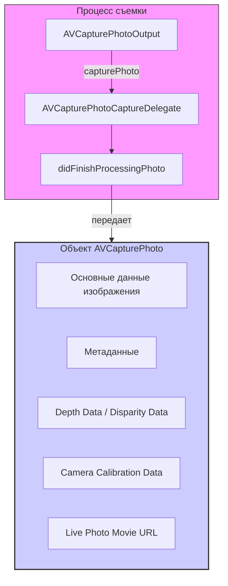

#avfoundation #photo #capture #avcapturephoto #raw #depth-data #camera #image-processing

---
## AVCapturePhoto

### Определение
**AVCapturePhoto** — это класс во фреймворке [[AVFoundation]], который представляет собой полный набор данных, полученных в результате одного снимка, сделанного с помощью [[AVCapturePhotoOutput]]. Он инкапсулирует не только само изображение, но и все связанные с ним метаданные, вспомогательные данные (карты глубины, карты диспаритета), информацию о камере и настройках съемки .

Этот класс является центральным звеном в современной системе захвата фотографий в [[iOS]], заменив устаревший подход с [[AVCaptureStillImageOutput]]. Объект `AVCapturePhoto` передается в метод делегата [[AVCapturePhotoCaptureDelegate]] после завершения обработки снимка и предоставляет унифицированный доступ ко всем результатам съемки .

### Зачем это знать iOS-разработчику?
1.  **Доступ к данным изображения:** Получение сжатых ([[JPEG]], [[HEIC]]) и несжатых (RAW) данных фотографии для сохранения, отображения или дальнейшей обработки .
2.  **Работа с метаданными:** Извлечение EXIF-данных, информации о настройках камеры, ориентации и других параметров съемки .
3.  **Использование вспомогательных данных:** Доступ к картам глубины (`depthData`) и диспаритета для создания эффектов портретного режима, размытия фона или 3D-реконструкции .
4.  **Поддержка RAW:** Работа с RAW-форматом (DNG) для профессиональной цветокоррекции и обработки .
5.  **Обработка Live Photos:** Доступ к связанному видеофрагменту для создания живых фотографий .
6.  **Гибкость форматов:** Возможность получать данные в различных представлениях (сжатые, несжатые, с предварительным просмотром) .

---

### Архитектура и место в системе захвата



### Ключевые свойства и методы

#### Получение данных изображения
- `fileDataRepresentation()` — возвращает данные изображения в наиболее подходящем формате (обычно JPEG или HEIC) с учетом всех настроек съемки .
- `fileDataRepresentation(with:)` — возвращает данные в указанном представлении (например, `.processed`, `.raw`, `.preview`) .
- `cgImageRepresentation()` — возвращает `CGImage` из обработанных данных (если доступно) .
- `previewCGImageRepresentation()` — возвращает `CGImage` для предварительного просмотра низкого разрешения .

#### Метаданные и информация о съемке
- `metadata` — словарь с полными метаданными изображения (EXIF, TIFF, [[GPS]] и т.д.) .
- `resolvedSettings` — объект `AVCaptureResolvedPhotoSettings`, содержащий фактические настройки, использованные при съемке .
- `sourceDeviceType` — тип устройства, которым был сделан снимок (например, `.builtInDualCamera`) .
- `sourceDevicePosition` — позиция устройства (`.front`, `.back`, `.unspecified`) .

#### Вспомогательные данные
- `depthData` — объект `AVDepthData`, содержащий карту глубины (для портретного режима) .
- `portraitEffectsMatte` — объект `AVPortraitEffectsMatte`, содержащий маску для портретных эффектов .
- `cameraCalibrationData` — данные калибровки камеры (фокусное расстояние, главная точка и т.д.) .
- `semanticSegmentationMatte` — маски семантической сегментации (небо, кожа, волосы и т.д.) .

#### Live Photos
- `livePhotoMovieURL` — URL временного файла с видеофрагментом для Live Photo .

---

### Примеры использования

#### Уровень 1: Базовое получение и сохранение фото
Самый простой пример — получение данных из `AVCapturePhoto` и сохранение их в фотоальбом.

```swift
import UIKit
import AVFoundation
import Photos

class SimplePhotoCaptureViewController: UIViewController, AVCapturePhotoCaptureDelegate {

    var photoOutput: AVCapturePhotoOutput!

    // MARK: - AVCapturePhotoCaptureDelegate
    func photoOutput(_ output: AVCapturePhotoOutput, 
                     didFinishProcessingPhoto photo: AVCapturePhoto, 
                     error: Error?) {
        
        if let error = error {
            print("Ошибка обработки фото: \(error.localizedDescription)")
            return
        }
        
        // 1. Получаем данные изображения в стандартном формате
        guard let imageData = photo.fileDataRepresentation() else {
            print("Не удалось получить данные изображения")
            return
        }
        
        // 2. Сохраняем в фотоальбом
        PHPhotoLibrary.shared().performChanges({
            let creationRequest = PHAssetCreationRequest.forAsset()
            creationRequest.addResource(with: .photo, data: imageData, options: nil)
        }) { success, error in
            if success {
                print("Фото успешно сохранено")
            } else if let error = error {
                print("Ошибка сохранения: \(error)")
            }
        }
        
        // 3. (Опционально) Создаем UIImage для отображения
        if let image = UIImage(data: imageData) {
            DispatchQueue.main.async {
                // Отображаем изображение в UIImageView
                self.imageView.image = image
            }
        }
    }
}
```

#### Уровень 2: Извлечение и отображение метаданных
Пример получения детальной информации о снимке.

```swift
import AVFoundation

func inspectPhotoMetadata(_ photo: AVCapturePhoto) {
    // 1. Основные метаданные
    print("=== МЕТАДАННЫЕ ФОТО ===")
    print("Метаданные: \(photo.metadata)")
    
    // 2. Настройки съемки
    let settings = photo.resolvedSettings
    print("Ожидаемое время выдержки: \(settings.expectedPhotoProcessingTime.seconds) сек")
    print("Стабилизация: \(settings.isAutoStillImageStabilizationEnabled)")
    print("Формат: \(settings.photoProcessingFlags)")
    
    // 3. Информация об устройстве
    if let deviceType = photo.sourceDeviceType {
        print("Тип устройства: \(deviceType.rawValue)")
    }
    print("Позиция устройства: \(photo.sourceDevicePosition.rawValue)")
    
    // 4. EXIF данные (через метаданные)
    if let exif = photo.metadata[kCGImagePropertyExifDictionary as String] as? [String: Any] {
        print("EXIF:")
        if let exposureTime = exif[kCGImagePropertyExifExposureTime as String] {
            print("  Выдержка: \(exposureTime)")
        }
        if let fNumber = exif[kCGImagePropertyExifFNumber as String] {
            print("  Диафрагма: \(fNumber)")
        }
        if let iso = exif[kCGImagePropertyExifISOSpeedRatings as String] {
            print("  ISO: \(iso)")
        }
    }
}
```

#### Уровень 3: Работа с RAW и обработанными данными
Пример получения как RAW, так и обработанной версии изображения.

```swift
import AVFoundation

func handleRAWAndProcessedPhoto(_ photo: AVCapturePhoto) {
    // 1. Получаем RAW данные (если снимали в RAW)
    if let rawData = photo.fileDataRepresentation(with: .raw) {
        print("Получены RAW данные, размер: \(rawData.count) байт")
        // Сохраняем RAW файл (DNG)
        let rawURL = FileManager.default.temporaryDirectory.appendingPathComponent("image.dng")
        try? rawData.write(to: rawURL)
    }
    
    // 2. Получаем обработанные данные (JPEG/HEIC)
    if let processedData = photo.fileDataRepresentation(with: .processed) {
        print("Получены обработанные данные, размер: \(processedData.count) байт")
    }
    
    // 3. Получаем данные предпросмотра (если доступны)
    if let previewData = photo.fileDataRepresentation(with: .preview) {
        print("Получены данные предпросмотра, размер: \(previewData.count) байт")
    }
}
```

#### Уровень 4: Извлечение и использование карты глубины
Пример получения карты глубины из фото, снятого в портретном режиме.

```swift
import AVFoundation
import CoreImage
import UIKit

func processDepthData(from photo: AVCapturePhoto) {
    // 1. Проверяем наличие данных глубины
    guard let depthData = photo.depthData else {
        print("Данные глубины отсутствуют")
        return
    }
    
    print("Данные глубины доступны")
    print("Формат: \(depthData.depthDataType)")
    print("Размер: \(depthData.depthDataMap.width) x \(depthData.depthDataMap.height)")
    
    // 2. Конвертируем карту глубины в изображение для визуализации
    let depthMap = depthData.depthDataMap
    let ciImage = CIImage(cvPixelBuffer: depthMap)
    let context = CIContext()
    
    if let cgImage = context.createCGImage(ciImage, from: ciImage.extent) {
        let depthUIImage = UIImage(cgImage: cgImage)
        DispatchQueue.main.async {
            // Отображаем карту глубины
            // self.depthImageView.image = depthUIImage
        }
    }
    
    // 3. Применяем фильтр на основе глубины (размытие фона)
    // Для этого потребуется дополнительная обработка с использованием Core Image
}
```

#### Уровень 5: Работа с портретным эффектом (Portrait Effects Matte)
Извлечение маски для портретных эффектов.

```swift
import AVFoundation
import CoreImage

func processPortraitEffectsMatte(from photo: AVCapturePhoto) {
    // 1. Получаем маску портретного эффекта
    guard let portraitMatte = photo.portraitEffectsMatte else {
        print("Portrait effects matte отсутствует")
        return
    }
    
    print("Portrait effects matte доступен")
    print("Размер: \(portraitMatte.matteWidth) x \(portraitMatte.matteHeight)")
    
    // 2. Конвертируем в изображение для визуализации
    let matteImage = CIImage(portaitEffectsMatte: portraitMatte)
    // или для старых версий:
    // let matteImage = CIImage(cvPixelBuffer: portraitMatte.matteData)
    
    // 3. Используем маску для наложения эффектов
    // Например, для замены фона или применения размытия только к фону
}
```

#### Уровень 6: Получение данных калибровки камеры
Информация о камере для профессиональной обработки.

```swift
import AVFoundation
import simd

func processCameraCalibration(from photo: AVCapturePhoto) {
    guard let calibrationData = photo.cameraCalibrationData else {
        print("Данные калибровки отсутствуют")
        return
    }
    
    print("=== КАЛИБРОВКА КАМЕРЫ ===")
    print("Фокусное расстояние: \(calibrationData.focalLength.x), \(calibrationData.focalLength.y)")
    print("Главная точка: \(calibrationData.principalPoint.x), \(calibrationData.principalPoint.y)")
    print("Искажение объектива: \(calibrationData.lensDistortionLookupTable?.count ?? 0) точек")
    print("Инверсия искажения: \(calibrationData.inverseLensDistortionLookupTable?.count ?? 0) точек")
    
    // Матрица камеры для 3D-реконструкции
    let intrinsicMatrix = calibrationData.intrinsicMatrix
    print("Внутренняя матрица:\n\(intrinsicMatrix)")
    
    // Размер ссылочного изображения
    if let referenceDimensions = calibrationData.pixelSize {
        print("Размер пикселя: \(referenceDimensions.width) x \(referenceDimensions.height)")
    }
}
```

#### Уровень 7: Обработка Live Photo
Пример работы с Live Photo после съемки.

```swift
import AVFoundation
import Photos

func handleLivePhoto(from photo: AVCapturePhoto) {
    // 1. Проверяем наличие видео для Live Photo
    guard let livePhotoMovieURL = photo.livePhotoMovieURL else {
        print("Live Photo не поддерживается или не включена")
        return
    }
    
    print("Live Photo movie доступен по URL: \(livePhotoMovieURL)")
    
    // 2. Получаем основное изображение
    guard let imageData = photo.fileDataRepresentation(),
          let image = UIImage(data: imageData) else { return }
    
    // 3. Сохраняем Live Photo в фотоальбом
    PHPhotoLibrary.shared().performChanges({
        let creationRequest = PHAssetCreationRequest.forAsset()
        
        // Добавляем фото
        creationRequest.addResource(with: .photo, data: imageData, options: nil)
        
        // Добавляем видео для Live Photo
        let options = PHAssetResourceCreationOptions()
        options.shouldMoveFile = true // Перемещаем, а не копируем
        creationRequest.addResource(with: .pairedVideo, fileURL: livePhotoMovieURL, options: options)
        
    }) { success, error in
        if success {
            print("Live Photo успешно сохранена")
            // Удаляем временный файл после сохранения
            try? FileManager.default.removeItem(at: livePhotoMovieURL)
        } else if let error = error {
            print("Ошибка сохранения Live Photo: \(error)")
        }
    }
}
```

#### Уровень 8: Семантическая сегментация (iOS 13+)
Извлечение масок для различных элементов сцены.

```swift
import AVFoundation
import CoreImage

@available(iOS 13.0, *)
func processSemanticSegmentation(from photo: AVCapturePhoto) {
    // Проверяем наличие различных масок семантической сегментации
    let matteTypes: [(AVSemanticSegmentationMatteType, String)] = [
        (.skin, "Кожа"),
        (.hair, "Волосы"),
        (.teeth, "Зубы"),
        (.glasses, "Очки"),
        (.sky, "Небо")
    ]
    
    for (matteType, description) in matteTypes {
        if let matte = photo.semanticSegmentationMatte(for: matteType) {
            print("Маска для '\(description)' доступна")
            print("  Размер: \(matte.matteWidth) x \(matte.matteHeight)")
            
            // Конвертируем в CIImage для обработки
            let matteImage = CIImage(semanticSegmentationMatte: matte)
            // Здесь можно применить маску для цветокоррекции или эффектов
        }
    }
}
```

---

### Важные нюансы и Best Practices

#### 1. **Форматы данных**
- `fileDataRepresentation()` автоматически выбирает наиболее подходящий формат (HEIC или JPEG) на основе настроек съемки .
- Для RAW данных всегда используйте `fileDataRepresentation(with: .raw)` .
- Данные предпросмотра (`with: .preview`) доступны не всегда, проверяйте на `nil` .

#### 2. **Управление памятью**
- Объекты `AVCapturePhoto` могут содержать большие объемы данных. Освобождайте их как можно скорее после использования .
- При сохранении в фотоальбом используйте асинхронные методы `PHPhotoLibrary` .

#### 3. **Обработка ошибок**
Все методы получения данных могут вернуть `nil`. Всегда проверяйте опциональные значения.

#### 4. **Доступность функций**
Некоторые возможности (Depth Data, Portrait Effects Matte, Semantic Segmentation) доступны только на определенных устройствах и при соответствующих настройках съемки. Всегда проверяйте наличие данных через опциональные свойства.

#### 5. **Сохранение RAW**
RAW файлы имеют формат DNG и могут занимать много места. Учитывайте это при работе с дисковым пространством.

#### 6. **Live Photo Movie URL**
Файл с видео для Live Photo является временным и будет удален системой после завершения обработки. Если вам нужно сохранить его, скопируйте или переместите файл в другое место .

### Итог
**AVCapturePhoto** — это универсальный контейнер для всех результатов фотосъемки в современном AVFoundation. Он предоставляет:
- **Гибкий доступ к данным** в различных форматах и представлениях .
- **Богатую мета-информацию** о снимке и условиях съемки .
- **Вспомогательные данные** для продвинутой обработки (глубина, портретные маски, семантическая сегментация) .
- **Интеграцию с Live Photos** и профессиональными форматами (RAW) .

Понимание возможностей этого класса необходимо для создания приложений с камерой любого уровня сложности — от простых фотоаппаратов до профессиональных инструментов для обработки изображений.