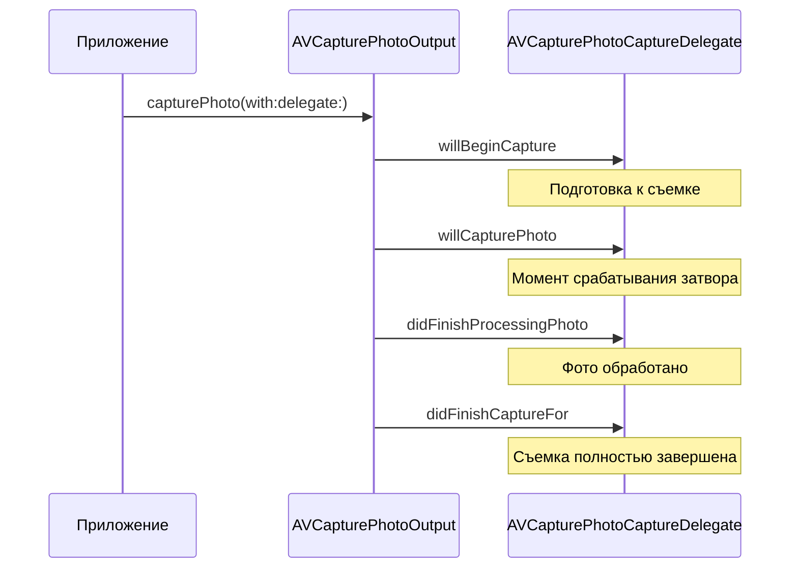
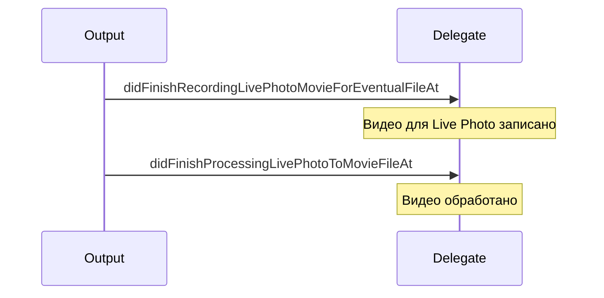

#avfoundation #delegate #photo #capture #avcapturephotocapturedelegate #camera #image-capture

---
## AVCapturePhotoCaptureDelegate

### Определение
**AVCapturePhotoCaptureDelegate** — это протокол во фреймворке [[AVFoundation]], который определяет набор методов для мониторинга и управления процессом захвата фотографий через [[AVCapturePhotoOutput]]. Он предоставляет разработчику детальную обратную связь о каждом этапе фотосъемки: от подготовки затвора до полной обработки полученного изображения и связанных с ним данных .

Этот протокол является основным механизмом получения результатов фотосъемки в современном AVFoundation (начиная с iOS 10), заменив устаревший подход с [[AVCaptureStillImageOutput]]. Методы делегата вызываются в строго определенном порядке, что позволяет отслеживать прогресс и обрабатывать ошибки на любом этапе .

### Зачем это знать iOS-разработчику?
1.  **Получение готового фото:** Самый важный метод — `didFinishProcessingPhoto`, который предоставляет объект `AVCapturePhoto` с изображением и метаданными .
2.  **Отслеживание прогресса:** Методы `willBeginCapture` и `willCapturePhoto` позволяют синхронизировать анимацию затвора и пользовательский интерфейс .
3.  **Обработка ошибок:** Специализированные методы для различных типов ошибок (например, `didFinishCaptureFor` с параметром `error`) .
4.  **Работа с Live Photos:** Методы для обработки видеофрагментов Live Photos (`didFinishRecordingLivePhotoMovieForEventualFileAt`, `didFinishProcessingLivePhotoToMovieFileAt`) .
5.  **Поддержка RAW и вспомогательных данных:** Получение уведомлений о доступности RAW данных и карт глубины .
6.  **Тонкий контроль:** Возможность реагировать на каждый этап съемки для реализации кастомной логики .

---

### Иерархия и порядок вызовов методов

Методы делегата вызываются в определенном порядке в течение жизненного цикла захвата фотографии:



Для Live Photos добавляются дополнительные методы:



---

### Полный список методов протокола

#### Основные методы жизненного цикла

| Метод | Описание | Обязательность |
|-------|----------|----------------|
| `photoOutput(_:willBeginCaptureFor:)` | Вызывается перед началом захвата | Опциональный |
| `photoOutput(_:willCapturePhotoFor:)` | Вызывается в момент срабатывания затвора | Опциональный |
| `photoOutput(_:didFinishProcessingPhoto:error:)` | Вызывается после обработки фото (основной метод получения снимка) | Опциональный |
| `photoOutput(_:didFinishCaptureFor:error:)` | Вызывается после полного завершения съемки | Опциональный |

#### Методы для вспомогательных данных

| Метод | Описание |
|-------|----------|
| `photoOutput(_:didFinishProcessingRawPhoto:error:)` | Обработка RAW-фото (если снимали в RAW) |
| `photoOutput(_:didFinishProcessingPreviewPhoto:error:)` | Обработка фото предпросмотра (низкое разрешение) |

#### Методы для Live Photos

| Метод | Описание |
|-------|----------|
| `photoOutput(_:didFinishRecordingLivePhotoMovieForEventualFileAt:resolvedSettings:)` | Видео для Live Photo записано во временный файл |
| `photoOutput(_:didFinishProcessingLivePhotoToMovieFileAt:duration:photoDisplayTime:resolvedSettings:error:)` | Видео для Live Photo полностью обработано и готово к использованию |

#### Методы для работы с глубиной и портретными эффектами

| Метод | Описание |
|-------|----------|
| `photoOutput(_:didFinishProcessingDepthData:error:)` | Обработка данных глубины |
| `photoOutput(_:didFinishProcessingPortraitEffectsMatte:error:)` | Обработка портретной маски |

---

### Примеры использования

#### Уровень 1: Минимальная реализация для получения фото
Самый простой пример — реализация только основного метода для получения изображения.

```swift
import UIKit
import AVFoundation

class MinimalPhotoDelegate: NSObject, AVCapturePhotoCaptureDelegate {
    
    func photoOutput(_ output: AVCapturePhotoOutput, 
                     didFinishProcessingPhoto photo: AVCapturePhoto, 
                     error: Error?) {
        
        if let error = error {
            print("Ошибка: \(error.localizedDescription)")
            return
        }
        
        guard let imageData = photo.fileDataRepresentation(),
              let image = UIImage(data: imageData) else {
            print("Не удалось создать изображение")
            return
        }
        
        // Сохраняем фото в альбом
        UIImageWriteToSavedPhotosAlbum(image, nil, nil, nil)
        print("Фото сохранено")
    }
}
```

#### Уровень 2: Полная реализация с анимацией затвора и обработкой ошибок
Демонстрация использования нескольких методов для лучшего UX.

```swift
import UIKit
import AVFoundation

class CompletePhotoDelegate: NSObject, AVCapturePhotoCaptureDelegate {
    
    weak var viewController: UIViewController?
    var shutterAnimationView: UIView?
    
    init(viewController: UIViewController) {
        self.viewController = viewController
        super.init()
    }
    
    // MARK: - Жизненный цикл съемки
    func photoOutput(_ output: AVCapturePhotoOutput, 
                     willBeginCaptureFor resolvedSettings: AVCaptureResolvedPhotoSettings) {
        print("Начало захвата с настройками: \(resolvedSettings)")
        
        DispatchQueue.main.async {
            // Показываем индикатор подготовки
            self.showBusyIndicator()
        }
    }
    
    func photoOutput(_ output: AVCapturePhotoOutput, 
                     willCapturePhotoFor resolvedSettings: AVCaptureResolvedPhotoSettings) {
        print("Сработал затвор!")
        
        DispatchQueue.main.async {
            // Анимация вспышки/затвора
            self.animateShutter()
        }
    }
    
    func photoOutput(_ output: AVCapturePhotoOutput, 
                     didFinishProcessingPhoto photo: AVCapturePhoto, 
                     error: Error?) {
        
        if let error = error {
            print("Ошибка обработки фото: \(error)")
            self.handleError(error)
            return
        }
        
        print("Фото успешно обработано")
        
        // Получаем метаданные для информации
        print("Метаданные: \(photo.metadata)")
        
        guard let imageData = photo.fileDataRepresentation() else {
            print("Не удалось получить данные")
            return
        }
        
        // Сохраняем фото
        self.savePhoto(imageData)
    }
    
    func photoOutput(_ output: AVCapturePhotoOutput, 
                     didFinishCaptureFor resolvedSettings: AVCaptureResolvedPhotoSettings, 
                     error: Error?) {
        
        DispatchQueue.main.async {
            self.hideBusyIndicator()
        }
        
        if let error = error {
            print("Ошибка завершения съемки: \(error)")
            self.handleError(error)
        } else {
            print("Съемка успешно завершена")
        }
    }
    
    // MARK: - Вспомогательные методы
    private func showBusyIndicator() {
        guard let view = viewController?.view else { return }
        let indicator = UIActivityIndicatorView(style: .large)
        indicator.center = view.center
        indicator.startAnimating()
        indicator.tag = 999
        view.addSubview(indicator)
    }
    
    private func hideBusyIndicator() {
        guard let view = viewController?.view else { return }
        view.viewWithTag(999)?.removeFromSuperview()
    }
    
    private func animateShutter() {
        guard let view = viewController?.view else { return }
        
        let shutterView = UIView(frame: view.bounds)
        shutterView.backgroundColor = .white
        shutterView.alpha = 0
        view.addSubview(shutterView)
        
        UIView.animate(withDuration: 0.1, animations: {
            shutterView.alpha = 0.8
        }) { _ in
            UIView.animate(withDuration: 0.1, animations: {
                shutterView.alpha = 0
            }) { _ in
                shutterView.removeFromSuperview()
            }
        }
    }
    
    private func savePhoto(_ data: Data) {
        UIImageWriteToSavedPhotosAlbum(UIImage(data: data)!, nil, nil, nil)
    }
    
    private func handleError(_ error: Error) {
        DispatchQueue.main.async {
            let alert = UIAlertController(title: "Ошибка", 
                                          message: error.localizedDescription, 
                                          preferredStyle: .alert)
            alert.addAction(UIAlertAction(title: "OK", style: .default))
            self.viewController?.present(alert, animated: true)
        }
    }
}
```

#### Уровень 3: Обработка RAW и [[JPEG]] одновременно
Пример съемки с двумя форматами и обработкой обоих результатов.

```swift
import AVFoundation

class RawAndProcessedDelegate: NSObject, AVCapturePhotoCaptureDelegate {
    
    func photoOutput(_ output: AVCapturePhotoOutput, 
                     didFinishProcessingPhoto photo: AVCapturePhoto, 
                     error: Error?) {
        
        if let error = error {
            print("Ошибка обработки: \(error)")
            return
        }
        
        // Получаем обработанное изображение (JPEG/HEIC)
        if let processedData = photo.fileDataRepresentation(with: .processed) {
            print("Обработанное фото: \(processedData.count) байт")
            // Сохраняем или отображаем
        }
        
        // Получаем RAW данные (если есть)
        if let rawData = photo.fileDataRepresentation(with: .raw) {
            print("RAW данные: \(rawData.count) байт")
            // Сохраняем DNG файл
            let rawURL = FileManager.default.temporaryDirectory
                .appendingPathComponent("\(UUID().uuidString).dng")
            try? rawData.write(to: rawURL)
        }
    }
    
    // Для раздельной обработки RAW и JPEG (если снимали с отдельными настройками)
    func photoOutput(_ output: AVCapturePhotoOutput, 
                     didFinishProcessingRawPhoto rawPhoto: AVCapturePhoto,
                     error: Error?) {
        // Обработка RAW отдельно
    }
}
```

#### Уровень 4: Обработка Live Photos
Полный цикл работы с Live Photos через делегат.

```swift
import AVFoundation
import Photos

class LivePhotoDelegate: NSObject, AVCapturePhotoCaptureDelegate {
    
    var livePhotoMovieURL: URL?
    
    func photoOutput(_ output: AVCapturePhotoOutput, 
                     didFinishRecordingLivePhotoMovieForEventualFileAt outputFileURL: URL, 
                     resolvedSettings: AVCaptureResolvedPhotoSettings) {
        
        print("Live Photo movie записан во временный файл: \(outputFileURL)")
        self.livePhotoMovieURL = outputFileURL
    }
    
    func photoOutput(_ output: AVCapturePhotoOutput, 
                     didFinishProcessingPhoto photo: AVCapturePhoto, 
                     error: Error?) {
        
        if let error = error {
            print("Ошибка: \(error)")
            return
        }
        
        guard let imageData = photo.fileDataRepresentation() else { return }
        
        // Сохраняем Live Photo после получения и фото, и видео
        PHPhotoLibrary.shared().performChanges({
            let creationRequest = PHAssetCreationRequest.forAsset()
            
            // Добавляем фото
            creationRequest.addResource(with: .photo, data: imageData, options: nil)
            
            // Добавляем видео, если есть
            if let movieURL = self.livePhotoMovieURL {
                let options = PHAssetResourceCreationOptions()
                options.shouldMoveFile = true
                creationRequest.addResource(with: .pairedVideo, 
                                           fileURL: movieURL, 
                                           options: options)
            }
            
        }) { success, error in
            if success {
                print("Live Photo сохранена")
            } else if let error = error {
                print("Ошибка сохранения: \(error)")
            }
        }
    }
    
    // Опционально: отслеживание окончательной обработки видео
    func photoOutput(_ output: AVCapturePhotoOutput, 
                     didFinishProcessingLivePhotoToMovieFileAt outputFileURL: URL, 
                     duration: CMTime, 
                     photoDisplayTime: CMTime, 
                     resolvedSettings: AVCaptureResolvedPhotoSettings, 
                     error: Error?) {
        
        if let error = error {
            print("Ошибка обработки Live Photo video: \(error)")
        } else {
            print("Live Photo video обработан, длительность: \(duration.seconds) сек")
        }
    }
}
```

#### Уровень 5: Обработка данных глубины и портретных масок
Извлечение дополнительных данных из фото.

```swift
import AVFoundation
import CoreImage

class DepthDataDelegate: NSObject, AVCapturePhotoCaptureDelegate {
    
    func photoOutput(_ output: AVCapturePhotoOutput, 
                     didFinishProcessingPhoto photo: AVCapturePhoto, 
                     error: Error?) {
        
        if let error = error {
            print("Ошибка: \(error)")
            return
        }
        
        // 1. Основное изображение
        guard let imageData = photo.fileDataRepresentation() else { return }
        
        // 2. Данные глубины
        if let depthData = photo.depthData {
            print("Depth data доступна")
            
            // Конвертируем в изображение для предпросмотра
            let depthMap = depthData.depthDataMap
            let ciImage = CIImage(cvPixelBuffer: depthMap)
            let context = CIContext()
            
            if let cgImage = context.createCGImage(ciImage, from: ciImage.extent) {
                let depthUIImage = UIImage(cgImage: cgImage)
                // Используем depthUIImage для отображения
            }
        }
        
        // 3. Портретная маска (если есть)
        if let portraitMatte = photo.portraitEffectsMatte {
            print("Portrait effects matte доступна")
            // Используем для наложения эффектов
        }
        
        // 4. Данные калибровки камеры
        if let calibrationData = photo.cameraCalibrationData {
            print("Калибровка камеры: \(calibrationData)")
        }
    }
}
```

#### Уровень 6: Асинхронная обработка с [[async]]/[[await]]
Обертка делегата в Continuation для использования современных конструкций.

```swift
import AVFoundation

class AsyncPhotoDelegate: NSObject, AVCapturePhotoCaptureDelegate {
    
    var continuation: CheckedContinuation<AVCapturePhoto, Error>?
    
    func photoOutput(_ output: AVCapturePhotoOutput, 
                     didFinishProcessingPhoto photo: AVCapturePhoto, 
                     error: Error?) {
        
        if let error = error {
            continuation?.resume(throwing: error)
        } else {
            continuation?.resume(returning: photo)
        }
        continuation = nil
    }
}

extension AVCapturePhotoOutput {
    func capturePhotoAsync(settings: AVCapturePhotoSettings) async throws -> AVCapturePhoto {
        return try await withCheckedThrowingContinuation { continuation in
            let delegate = AsyncPhotoDelegate()
            delegate.continuation = continuation
            self.capturePhoto(with: settings, delegate: delegate)
            // Важно сохранить делегат
            objc_setAssociatedObject(self, UUID().uuidString, delegate, .OBJC_ASSOCIATION_RETAIN)
        }
    }
}
```

#### Уровень 7: Комплексный делегат с поддержкой прогресса
Отслеживание прогресса обработки фото.

```swift
import AVFoundation

class ProgressTrackingDelegate: NSObject, AVCapturePhotoCaptureDelegate {
    
    var progressHandler: ((Float) -> Void)?
    
    func photoOutput(_ output: AVCapturePhotoOutput, 
                     willBeginCaptureFor resolvedSettings: AVCaptureResolvedPhotoSettings) {
        progressHandler?(0.0)
    }
    
    func photoOutput(_ output: AVCapturePhotoOutput, 
                     willCapturePhotoFor resolvedSettings: AVCaptureResolvedPhotoSettings) {
        progressHandler?(0.3)
    }
    
    func photoOutput(_ output: AVCapturePhotoOutput, 
                     didFinishProcessingPhoto photo: AVCapturePhoto, 
                     error: Error?) {
        progressHandler?(0.8)
    }
    
    func photoOutput(_ output: AVCapturePhotoOutput, 
                     didFinishCaptureFor resolvedSettings: AVCaptureResolvedPhotoSettings, 
                     error: Error?) {
        progressHandler?(1.0)
    }
}
```

---

### Порядок вызова методов при различных сценариях

#### Обычная фотосъемка
1. `willBeginCapture`
2. `willCapturePhoto`
3. `didFinishProcessingPhoto`
4. `didFinishCapture`

#### Съемка с RAW
1. `willBeginCapture`
2. `willCapturePhoto`
3. `didFinishProcessingPhoto` (для обработанного)
4. `didFinishProcessingRawPhoto` (для RAW)
5. `didFinishCapture`

#### Съемка Live Photos
1. `willBeginCapture`
2. `willCapturePhoto`
3. `didFinishRecordingLivePhotoMovieForEventualFileAt`
4. `didFinishProcessingPhoto`
5. `didFinishProcessingLivePhotoToMovieFileAt`
6. `didFinishCapture`

#### Съемка с ошибкой
1. `willBeginCapture`
2. `willCapturePhoto`
3. `didFinishProcessingPhoto` (с ошибкой)
4. `didFinishCapture` (с ошибкой)

---

### Важные нюансы и Best Practices

#### 1. **Обязательность методов**
Все методы протокола являются опциональными, но для получения фото необходимо реализовать хотя бы `didFinishProcessingPhoto` .

#### 2. **Поток выполнения**
Методы делегата могут вызываться на произвольной очереди. Для обновления UI всегда переключайтесь на главный поток .

#### 3. **Сохранение делегата**
Делегат должен храниться сильной ссылкой до завершения всех асинхронных операций, иначе он может быть деинициализирован раньше времени .

#### 4. **Обработка ошибок**
Параметр `error` может появляться в разных методах. Всегда проверяйте его и реагируйте соответствующим образом .

#### 5. **Live Photo Movie URL**
Файл, указанный в `didFinishRecordingLivePhotoMovieForEventualFileAt`, является временным. Система удалит его после завершения обработки, поэтому сохраните или скопируйте его, если он нужен .

#### 6. **Производительность**
Избегайте тяжелых операций в методах делегата, особенно синхронных. Если требуется сложная обработка, выполняйте ее асинхронно.

#### 7. **Проверка доступности данных**
Перед использованием свойств `depthData`, `portraitEffectsMatte` и т.д. проверяйте их на `nil`, так как они доступны не для всех снимков и устройств.

### Итог
**AVCapturePhotoCaptureDelegate** — это основной инструмент для получения результатов фотосъемки в современном AVFoundation. Он предоставляет:

- **Детальную обратную связь** о каждом этапе съемки
- **Гибкость в обработке** различных типов данных (RAW, Depth, Live Photos)
- **Возможность тонкой настройки** пользовательского опыта
- **Механизмы обработки ошибок** на всех этапах

Понимание полного жизненного цикла, реализуемого этим протоколом, необходимо для создания профессиональных приложений с камерой, обеспечивающих отличный пользовательский опыт.